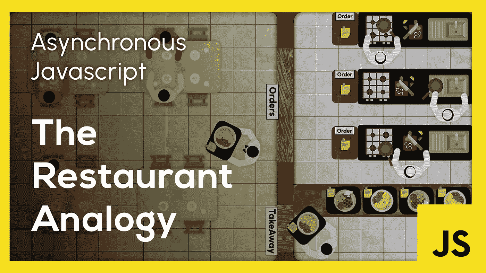
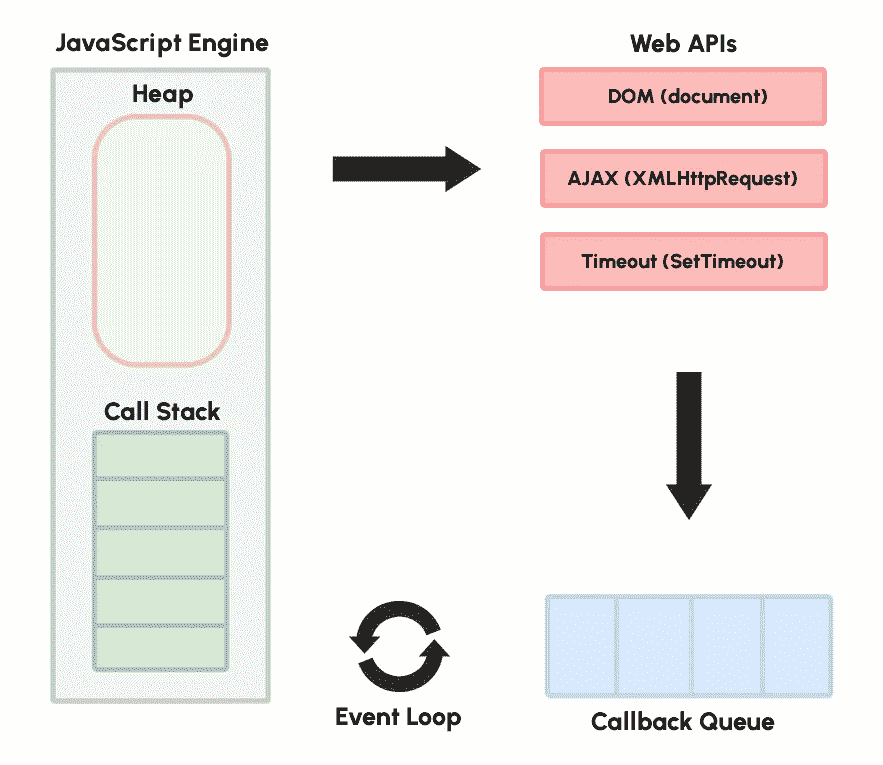
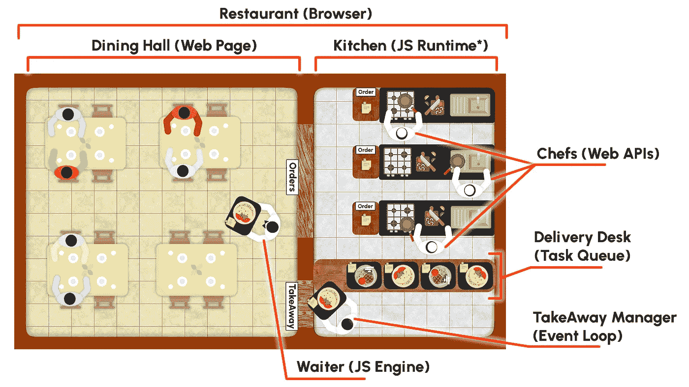
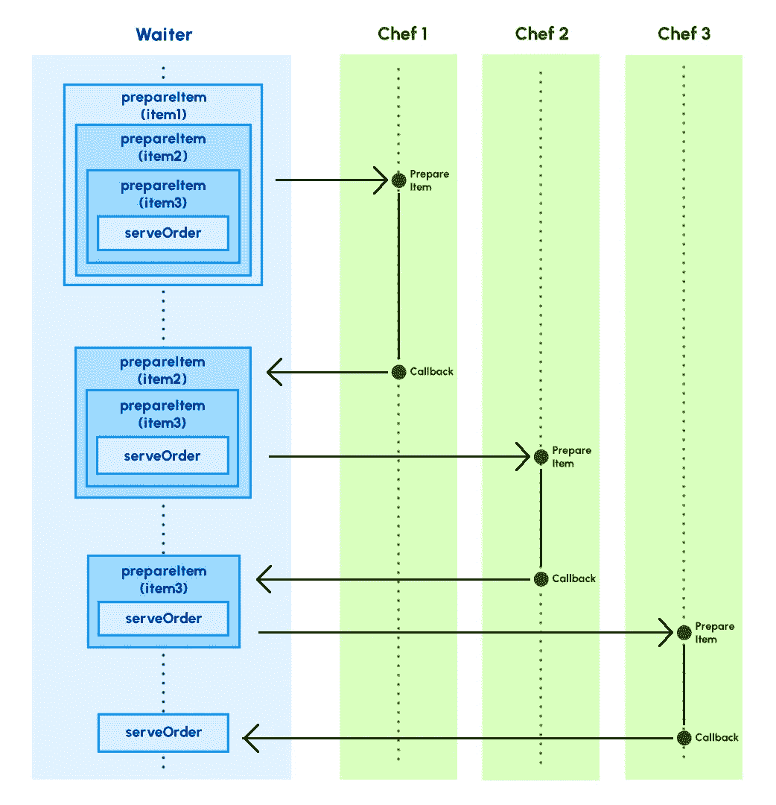
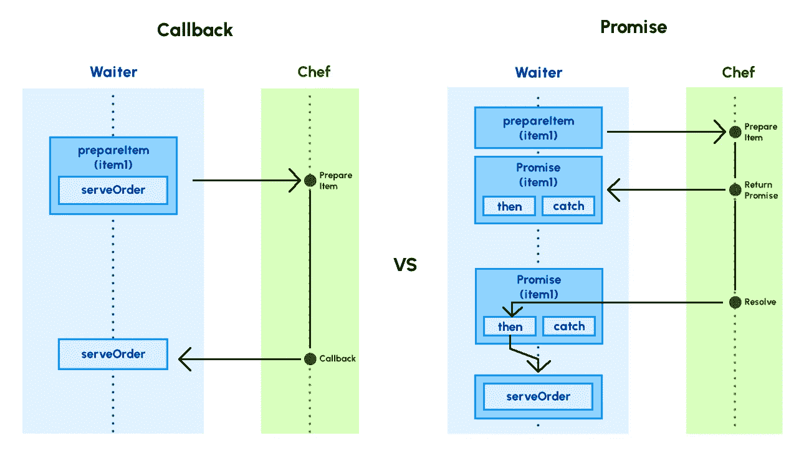
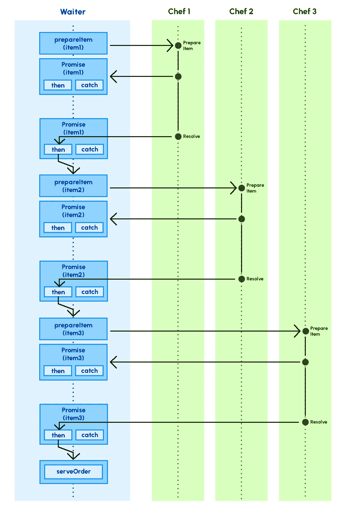

# 异步 JavaScript:餐馆类比

> 原文：<https://javascript.plainenglish.io/asynchronous-javascript-the-restaurant-analogy-55c38d0517e0?source=collection_archive---------4----------------------->



本文面向刚开始学习 JavaScript 并试图理解 JavaScript 运行时工作原理的初学者。这对有经验的专业人士来说也是一个很好的复习。

这是我使用**餐厅类比**来过度简化 JavaScript 的异步本质的一次尝试。如果我有任何错误，请随时在评论中纠正我。

# **需要异步执行**

JavaScript 是一种同步的单线程编程语言。它的代码是在单线程中使用单个调用堆栈顺序执行的。但是不可能按顺序完成所有操作。

假设我们希望在顺序运行期间等待生成一些数据或输入。由于 JavaScript 是单线程的，让代码等待某个操作可能会导致整个应用程序冻结。通过从主线程卸载这些耗时的操作，可以避免这种情况。 **JavaScript 运行时环境** (Browsers/NodeJS)提供了一组处理此类操作的外部 API。



上图展示了 JavaScript 运行时环境的基本架构。它包括以下几个部分:

*   [JavaScript 引擎](https://en.wikipedia.org/wiki/JavaScript_engine) ⚙️
*   [Web API](https://developer.mozilla.org/en-US/docs/Web/API)🔴🔴🔴
*   任务队列`🟦🔣🔠🔢🔡🔤`
*   [事件循环](https://developer.mozilla.org/en-US/docs/Web/JavaScript/EventLoop)🔄

所有这些元素构成了异步 JavaScript 的基本构件。

# **如果网络浏览器是一家餐馆**



* the waiter is part of the JS Runtime even though shown outside

把网络浏览器想象成一家**餐馆**。它包括一个餐厅和一个厨房。

**餐厅**是顾客进来点餐的地方。这类似于用户加载一个**网页**并执行一些操作，比如从服务器获取数据。

T21 厨房是所有魔法发生的地方。这类似于由不同组件组成的 **JavaScript 运行时环境**，每个组件执行一个单独的任务。

下面列出了这些组件。

> *🤵* ***服务员(JavaScript 引擎)*** :服务员执行的任务是跑来跑去接单提交到厨房，上菜，摆桌子。服务员也是厨房的一部分，尽管在图中他被显示在外面。这类似于运行代码的 **JavaScript 引擎**。
> 
> *👨‍🍳* ***厨师(Web API)***:厨师从服务员手中接过订单，准备好物品，放在送餐台上。这类似于**Web API**执行用户请求的任务，并将结果推送到任务队列。
> 
> *👨‍💼* ***外卖经理(事件循环)*** :他的工作是管理外卖柜台。他重复执行两项主要任务。
> 
> 1.检查送货台上是否有物品。
> 
> 2.查看服务员是否有空，有空就打电话给他。
> 
> 这类似于**事件循环**，其工作是:
> 
> 1.检查任务队列中是否有项目
> 
> 2.检查 JavaScript 引擎中调用堆栈的状态，如果队列为空，则从队列中推送项目。
> 
> *🍽️* ***送餐台(任务队列)*** :这是厨师们放置准备好的菜肴的桌子，以便外卖经理在有空的时候把它传给服务员。这类似于 JavaScript 运行时中的**任务队列**。

## **下订单**

客户的每一个订单都可以等同于一个 API 调用。当顾客点菜时，服务员🤵记下并将其传递给各自的**厨师**👨‍🍳在厨房。

如果餐厅正在同步工作**，**服务员**🤵会在厨房里等着，直到订单完成，这样就可以送到顾客手中。**

**这是一个问题😑。在准备食物的过程中，餐厅将暂停营业🚫。不会接受新的订单，不会提供食物，也不会安排餐桌。**

**如果餐厅以异步方式运行，这是可以避免的。**

****服务员**🤵现在把订单交给厨房，继续他的工作，而**厨师**👨‍🍳准备菜。一旦菜做好了，**厨师**👨‍🍳将其放在**交付台**上🍽️.现在**外卖经理**👨‍💼接手并让**服务员**🤵知道特定的 ***订单准备好了*** 。**服务员**🤵然后可以接受订单并将其提供给客户。**

**结果，**服务员**🤵因此，在准备食物时，餐厅操作**不会被阻止**。**

## **复试**

**JavaScript 使用**回调**来处理这样的操作📞。当订单被传递到厨房时，我们也传递一个**回调**📞随遇而安。这个回调持有一个**音符**📝话说`**'Serve order to table X'**`。当订单准备好了，厨师👨‍🍳将准备好的菜肴连同**回拨** **票据**一起放置📝在**交付台上**🍽️.**外卖经理**👨‍💼然后打了一个**电话**📞对着**服务员**🤵对于那个特别的订单。**服务员**🤵接收物品，阅读**备注**📝并供应**工作台 X** 上的物品。**

## ****通过代码**表示餐厅功能**

**以下功能负责完成每个订单。**

> *****prepareItem(itemName，callback)*** :该函数取一个***itemName****🍔*和**回调**和*📞*作为参数。使用**设置超时**和*模拟准备物品⏰*在指定的**超时** *后触发的 API⏳*(准备时间)。使用 ***项目名称*** 选择准备时间，并根据准备时间设置超时。一旦**超时**⏰触发，它调用传入的回调函数。**

```
function prepareItem(itemName, callback){
    Let preparationTime = 0;
    switch(itemName){
        case "coffee☕": preparationTime = 4000; break;
        case "soda🥤": preparationTime = 2000; break;
        case "frenchFries🍟": preparationTime = 5000; break;
        case "hamburger🍔": preparationTime = 3000; break;
        case "sandwich🥪": preparationTime = 6000; break;
        default: preparationTime = 1000;
    }
    setTimeout(()=>{
        console.log(itemName + 'Prepared');
        callback();
    },preparationTime);
}function serveOrder(){
    console.log('Order Served');
}
```

> *****serveOrder()*:**该功能在**控制台** *上打印`**'Order Served'**`💻*。一旦订单中的项目准备完毕，就应该调用它。**

```
function serveOrder(){
    console.log('Order Served');
}
```

****prepareItem()** 函数现在可以通过传递`**"coffee**☕"`作为 **itemName** 和 **serveOrder()** 方法作为**回调来调用(注意**📝 **)****

```
prepareItem("coffee☕", serveOrder);
```

**这个函数调用可以包装在一个 **submitOrder()** 函数中，以实现更好的模块化。**

```
function submitOrder(){
    prepareItem("coffee☕", serveOrder);
}
submitOrder();
```

**这很好，但还不够🤨。如果客户的订单包含**三个相关项目，该怎么办？****

```
**["hamburger**🍔**", "frenchFries**🍟**", "soda**🥤**"]**
```

**这三项中的任何一项，如果分开上，都是没有用的。需要一起上。这导致了一个新的问题🙄。**

**如果**服务员**🤵将所有三个项目的订单放在一起， **submitOrder()** 函数如下所示:**

```
function submitOrder(){
    prepareItem(**"**hamburger🍔**"**, serveOrder);
    prepareItem("frenchFries🍟", serveOrder);
    prepareItem("soda🥤", serveOrder);
}
submitOrder();
```

**这不会产生预期的结果😕因为这些项目可能会无序到达。**

## **嵌套回调**

**如果使用**嵌套回调** `📞📞📞`可以解决这个问题。**

****服务员**🤵将`**"hamburger**🍔**"**`的订单提交给相应的**厨师**👨‍🍳并且传递一个**回调**连同它具有下面的**音符**📝**

```
*** Submit Order for "****frenchFries**🍟**"**
*** Submit Order for** **"soda**🥤**"**
*** Serve items to table X**
```

**一旦订单完成，厨师就会👨‍🍳将其放置在**传送台上**🍽️和外卖经理👨‍💼发出一个**呼叫**📞对了**服务员**🤵像往常一样。**

****服务员**🤵移除**注释**📝在顶部，阅读它并按照提示提交`"**frenchFries**🍟"`的订单。`**"hamburger**🍔**"**`不会立即交付。`"**frenchFries**🍟"`的订单与剩余的**回拨** **票据**一起下单📝。**

```
*** Submit Order for** **"soda**🥤**"**
*** Serve items to table X**
```

**一旦第二个订单完成，商品到达**交付台**🍽️ 和服务员**🤵**是叫**吗📞又来了。现在，这位**侍者**🤵删除**注释**📝在顶部，阅读并提交订单`**"soda**🥤**"**`。`**"hamburger**🍔**"**` 和`"**frenchFries**🍟"`尚未交付。该订单与最后一次**回拨** **通知**一起发出📝。****

```
***** Serve items to table X****
```

****订单完成后，商品到达**交付台**🍽️和那个**服务员**🤵**是叫**吗📞再一次。现在，**回调** **注意**📝说要上菜。因此，他将**桌子 X** 上的所有项目一起端上桌。****

****使用**嵌套回调**的 **submitOrder()** 函数如下。****

```
**function submitOrder(){
    prepareItem(**"**hamburger🍔**"**, ()=>{
        prepareItem("frenchFries🍟", ()=>{
            prepareItem("soda🥤", serveOrder);
        });
    });
}
submitOrder();**
```

********

****上面的序列图显示了三个不同项目的订单之间的时间安排。****

****这三个项目的订单本身是相当压倒性的，对不对？😅如果我们有更多的东西。本例中的 **submitOrder()** 函数可能看起来有点像这样😵。****

```
**function submitOrder(){
    prepareItem("coffee☕", ()=> {
        prepareItem("soda🥤", ()=> {
            prepareItem("frenchFries🍟", ()=> {
                prepareItem("hamburger🍔", ()=> {
                    prepareItem("sandwitch🥪", serveOrder);
                });
            });
        });
    });
}
submitOrder();**
```

****这种代码的可读性在每次嵌套后都会降低，并且变得难以维护。这种代码通常被称为**‘回调地狱’**👹。****

# ******承诺******

****ES6 版 JavaScript 推出 [**承诺**](https://developer.mozilla.org/en-US/docs/Web/JavaScript/Reference/Global_Objects/Promise) 🤝来处理这样的问题。一个**承诺**是一个**对象**，代表一个异步操作的**最终完成或失败**。****

****一边用**许诺**，一边用**招待**🤵得到一个**承诺**🤝下单时回退。在这种情况下，没有回叫通知被传递到厨房。**服务员**🤵然后附上一张**的字条**📝也就是说， ***承诺解决后需要做什么*** ，到**承诺**🤝一直藏在心里。在我们的示例中，附加的注释将是:****

```
***** Serve item to table X****
```

****当订单准备好了，厨师**👨‍🍳将其放置在**交付台**🍽️连同`**'Promise Resolved** ✅'`消息。******

****外卖经理**👨‍💼然后把订单交给**服务员**🤵。然后他找到匹配的**承诺**🤝从他那套**的承诺**中，读出了附在后面的**注释**📝并供应**工作台 X** 上的物品。**

## ****承诺代码实现****

**我们可以重写 **prepareItem()** 函数来返回一个**承诺**🤝如下。**

```
function prepareItem(item){
    let preparationTime = 0;
    switch(item){
        case "coffee☕": preparationTime = 4000; break;
        case "soda🥤": preparationTime = 2000; break;
        case "frenchFries🍟": preparationTime = 5000; break;
        case "hamburger🍔": preparationTime = 3000; break;
        case "sandwich🥪": preparationTime = 6000; break;
        default: preparationTime = 1000;
    }
    return new **Promise**((resolve, reject) => {
        setTimeout(()=>{
            console.log(item + 'Prepared');
            resolve();
        },preparationTime);
    });
}
```

**该函数不再将一个**回调**函数作为参数，而是返回一个新的**承诺对象**。该承诺采用一个匿名函数，让**解决** ✅和**拒绝** ❌作为参数。如果操作 ***成功*** 或者有 ***错误*** 我们可以调用 **resolve()** 而不是调用回调函数。**

**使用上面的 **prepareItem()** 实现，单个项目的 **submitOrder()** 函数可以编写如下。**

```
function submitOrder(){
    let res = prepareItem("coffee☕");
    res.then(serveOrder);
}
submitOrder();
```

****

**Callbacks vs Promises**

## ****承诺链接:****

****承诺链接** `🤝🔗🤝🔗🤝` 是解决嵌套回调导致的回调地狱情况。**

**promise 响应上的' **then()** '调用将函数作为参数。这个回调函数可能返回另一个**承诺**🤝。这个新**承诺的回应**🤝可以通过[链接](https://www.tutorialspoint.com/what-is-function-chaining-in-javascript) ⛓' **然后()**调用来访问。**

**使用承诺序列的 **submitOrder()** 函数可以是这样的:**

```
function submitOrder() {
    let res1 = prepareItem("hamburger🍔");
    let res2 = res1.then(() => {
        return prepareItem("frenchFries🍟");
    });
    let res3 = res2.then(() => {
        return prepareItem("soda🥤"); 
    });
    res3.then(serveOrder);
}
submitOrder();
```

**这可以通过删除**回车**关键字进一步简化，如下所示:**

```
function submitOrder() {
    let res1 = prepareItem("hamburger🍔");
    let res2 = res1.then(() => prepareItem("frenchFries🍟"));
    let res3 = res2.then(() => prepareItem("soda🥤"));
    res3.then(serveOrder);
}
submitOrder();
```

**对单独响应变量的赋值可以通过**链接**⛓'**then()【t48]'调用来移除，如下所示:****

```
function submitOrder() {
    prepareItem("hamburger🍔")
        .then(() => prepareItem("frenchFries🍟"))
        .then(() => prepareItem("soda🥤"))
        .then(serveOrder);
}
submitOrder();
```

**这看起来比使用嵌套回调更加清晰易读。**

****

**Sequence diagram for Promise chaining**

**当订单中有更多项目时， **submitOrder()** 函数可能如下所示:**

```
function submitOrder(){
    prepareItem("coffee☕")
        .then(() => prepareItem("soda🥤"))
        .then(() => prepareItem("frenchFries🍟"))
        .then(() => prepareItem("hamburger🍔"))
        .then(() => prepareItem("sandwich🥪"))
        .then(serveOrder);
}
submitOrder();
```

# ****异步/等待****

**JavaScript 在 2017 年加入了 [**async/await**](https://developer.mozilla.org/en-US/docs/Web/JavaScript/Reference/Statements/async_function) 语法。这基本上就是**句法糖**🍚对于**的承诺**🤝这使得异步代码看起来更有顺序**和使得代码更容易阅读。****

******submitOrder()** 函数可以使用下面的 **async/await** 语法编写:****

```
**async function submitOrder(){
    await prepareItem("coffee☕");
    await prepareItem("soda🥤");
    await prepareItem("frenchFries🍟");
    await prepareItem("hamburger🍔");
    await prepareItem("sandwich🥪");
    completeOrder();
}
submitOrder();**
```

****需要将**等待**调用包装在一个**异步**函数中。所以， **submitOrder()** 函数现在被标记为 **async** 。这可以像任何其他函数一样调用。****

****代码现在看起来更加清晰易读。它看起来是连续的，但实际上是对承诺的抽象。****

# ******结论******

****总结一下，我们看了如何在一家**餐馆**的工作中建模 JavaScript 的**异步**行为🤵👨‍🍳👨‍💼🍽️.然后，我们以餐馆代码为例，研究了 JavaScript 用来建模这种异步行为的不同方法。****

****我们用餐馆的例子来说明基于**回访**的方法和基于**承诺**的方法之间的区别。我们还提到了如何将基于承诺的代码转换成 **async/await** 语法。****

*****更多内容请看* [***说白了就是***](http://plainenglish.io/) *。报名参加我们的* [***免费周报在这里***](http://newsletter.plainenglish.io/) ***。*******