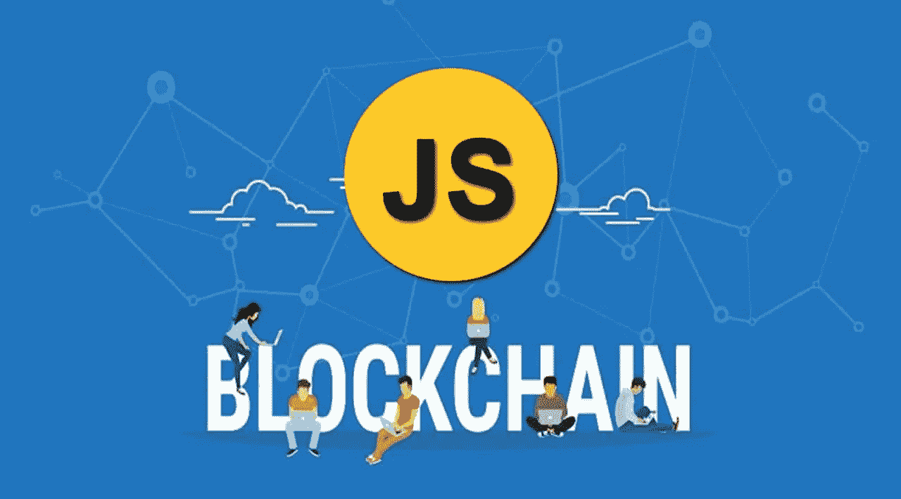

# 网络资产的原子化交易:JavaScript 在 Web3 网络经济中的角色

> 原文：<https://javascript.plainenglish.io/atomized-transactions-of-web-assets-1354a4483bd6?source=collection_archive---------21----------------------->

## 在区块链推动的下一个互联网经济中，JavaScript 将扮演什么角色？

Blockchain javascript

不可变的、可转移的和可追踪的链接将在即将到来的由 web3 驱动的互联网中扮演重要角色。因为如果你知道一点互联网是如何工作的，你会发现两个网页之间的链接是一种关系，就像两个链块之间的联系，就像双方之间的合同——这里是两个页面。

然后，链接可以成为区块链驱动的互联网基础设施的基础资源，这将使那些玩搜索引擎优化艺术的人更容易在他们之间转移链接和页面等资产，就像区块链科技公司试图通过放松 NFT 的数字艺术作品的可转让性和所有权来使艺术变得更好。

在实际的网络中，购买和出售网站是许多互联网企业家在在线内容和电子商务业务中的常见做法，但在这个由 web3 驱动的互联网中，网站的这些交易将被分解到页面和链接级别。在我们努力建设的下一代互联网中，交易页面和链接将是一种常见且有利可图的做法，我也在努力为这个新的区块链互联网做出贡献。

由于区块链技术，页面和链接等数字资产的可转让性将不再是问题，从托管所有到无服务器基础设施的转变是一种创新，将简化这种创新的 web3 驱动的互联网的实施，在其中交换链接和页面将像在亚马逊购买和销售产品一样容易。

这种新的网络经济将扩大可能的商品交易。在我看来，这将使经济好转，因为交易量增加了。当钱从一只手到另一只手快速而频繁地流动时，它更有可能落在你的手上，因为你与世界经济的联系达到了最低要求的水平，而不像我与世界经济的联系那么紧密，尽管我在驱动着 99.9%的金融市场的技术构件方面拥有专业知识和经验。

就像你如何通过像 [Flippa](https://flippa.com/) 和 [Empire flippers](https://empireflippers.com/) 这样的平台来买卖网站一样，你将能够通过我在上面段落中描述的这个由区块链驱动的技术平台来买卖甚至交换链接和页面，这个平台将建立在 web3 基础设施的基础上，这个基础设施将为下一个互联网的发展定下基调，谷歌、亚马逊、脸书和其他类似的公司是否会拥有与他们实际拥有的相同的地位和权力还不确定。**要问的问题是，在下一个区块链驱动的互联网中，JavaScript 的角色和力量会是什么？**

JavaScript 可能会在下一代互联网基础设施和经济中发挥重要作用，因为它是为了让互联网变得更好，让网站变得更有活力而特意构建的。但是我担心在这个新的互联网时代，像 Rust 这样的 web 汇编语言会扰乱 JavaScript。作为一个试图建立这个新互联网的企业家，我实际上更喜欢 JavaScript，但我真的想更多地了解这些 web 汇编语言，我从这种前瞻性学习中获得的信号真的很好。

这给那些像我一样关心 JavaScript 的人带来了挑战，让他们努力让这种语言变得更好。一年前，我写了这篇名为“我需要一个更好的 JavaScript 引擎”的文章[,因为像 V8、Chakra 和所有其他的 JavaScript 引擎都没有抓住这个机会。](https://mkrdiop.medium.com/i-just-need-a-better-javascript-engine-141075817164)

*更多内容请看*[***plain English . io***](http://plainenglish.io/)