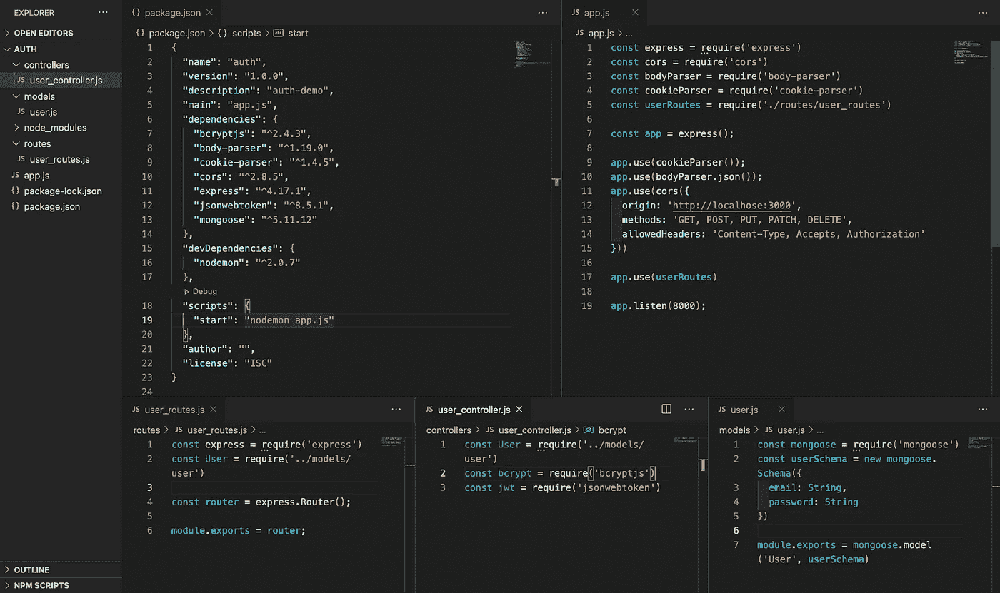

# Node.js 中的身份验证，使用 HTTP Cookies、JWT 和 BCrypt

> 原文：<https://javascript.plainenglish.io/auth-in-node-js-http-cookies-jwt-bcrypt-part-1-64b3c0159035?source=collection_archive---------2----------------------->

## 第一部分

> 因此，您已经决定最终在您的节点应用程序中提出身份验证的话题。我发现在 Node 中实现 Auth 的方法有很多，那么从哪里开始呢？第一个选择是决定你是想让第三方服务为你处理它，还是你有足够的勇气自己完成并实现它！如果第二个选择适合你，那么你来对地方了。我将向您介绍许多方法中的一种，您可以使用 JsonWebTokens、BCrypt 和 HTTP Cookies 在节点项目中实现 Auth。


首先，为什么要使用 JsonWebTokens、BCrypt 和 Cookies？

很好的问题，从什么是 JWT 综合症以及为什么使用它开始。引用他们的[文档](https://jwt.io/introduction/):*“JSON Web Token(JWT)是一个开放的标准(* [*RFC 7519*](https://tools.ietf.org/html/rfc7519) *)，它定义了一种紧凑且独立的方式，以 JSON 对象的形式在各方之间安全地传输信息。”如果你正在创建一个节点应用程序，你很可能非常熟悉 JSON。所以本质上是一个 JWT，顾名思义，一个用于在各方之间传输数据的紧凑令牌，用 JSON 编写。在节点应用程序中使用 jwt 的实现也很容易。简单的:*

```
npm install --save jsonwebtoken
```

将包含它作为一个依赖项，因此我们可以在需要时通过应用程序调用该模块。

接下来我们有 BCrypt，这是最容易解释的，它只是一个用于散列密码的中间件。当然还有很多其他的，但是 BCrypt 被广泛使用，易于安装，并且有很棒的[文档](https://www.npmjs.com/package/bcrypt)，这是你开始工作所需要的一切，所以让我们把它也包括到这个项目中:

```
npm install --save bcryptjs
```

最后，我们有我们的 Cookies，如果你在过去的 5 到 10 年里一直在使用网络，你肯定听说过它。这是我们将在客户端存储 JWT 的地方，因此能够根据每个请求发送回服务器。当然，对于在哪里存储这些信息的问题，还有其他选择。本地存储？会话存储？饼干？如果您有兴趣了解更多关于所有不同客户端存储选项的利与弊，我将只[链接这篇文章](https://bitsofco.de/an-overview-of-client-side-storage/)，而不是讨论它们之间的所有细节。可以说，cookies 是一种易于使用/实现的解决方案，可以存储我们用户的 JWT，并且对于简单的身份验证来说足够安全。因此，在我们开始在代码中实现它们之前，最后安装一个包:

```
npm install --save cookie-parser
```

在这次演练中，我们将使用 Express 为后端 RESTful API 创建 auth。首先，我已经写出了遵循 MVC 架构所需的*用户*文件(除去视图，它是一个 API，我们的响应将是 JSON 数据而不是 HTML 页面),并安装了我们所需的其他中间件。



Initial User files

完成所有这些初始设置后，我们可以开始在我们的应用程序中实现一些身份验证。首先，我们将从 routes 文件开始，因此指定一些端点，从创建用户开始。


Setting up endpoint for User Signup route

首先，我们将引入并要求我们的 *user_controller.js* 。然后，我们将用一个简单的“/signup”来定义我们的第一个端点，它最终将是`http://localhost:8000/signup`


User Controller w/signup method using Bcrypt

完成这些后，我们将进入用户控制器文件，这是我们大部分授权代码所在的地方。从导出我们在路由文件中调用的注册方法开始。在这个演示中，我使用 ES6 async/await 关键字编写了这个方法，但是这也可以使用 Promise 链来完成。JWT & Bcrypt 的文件都解释了如果你使用承诺链代替。

我们首先使用 hashSync(异步和阻塞的)散列来自 req.body 的传入密码，然后按照我们的 mongoose 模式中的定义创建/保存我们的新用户。

这里需要注意的是，我省略了任何验证或严重的错误处理，这是你肯定会有的。在本文中，我将只介绍“注册”的实现，但在第 2 和第 3 部分中，我将结束对传入的`req`的验证，以检查电子邮件和密码的“唯一性”、“格式”等。


User Controller creating JWT

接下来，我们使用 jwt 中间件创建令牌。的。`sign()`方法需要三个参数。第一个是您希望实际的令牌是什么，在这种情况下，我只是将他们的电子邮件和 mongoose 创建的 userId 发送回客户端。

第二个参数是 secretOrPrivateKey，它可以是一个字符串，也可以是一个对象，但最终将在它们的算法中用来编码和解码令牌。我们稍后解码令牌时会用到它。你当然可以指定你想使用的算法，对于我来说，这方面的信息只需查看他们的[文档](https://www.npmjs.com/package/jsonwebtoken#usage)。

最后，您可以向它传递选项或回调。我们选择的选项，虽然 JWT 给你许多定制，我只选择了一个过期，以帮助安全。他们所有的其他优化都列在他们的文档中，见上面的链接。


User Controller creating and sending cookie

最后，我们创建我们的 cookie。第一个争论是我们的 cookie 应该叫什么，我选择了一个经典的“令牌”。

第二个参数是 payload，在本例中是我们新创建的令牌。

第三个论点是我们的选择。就像 JWT 一样，你可以对你的 cookie 进行许多不同的优化，但是我只简单地将它设置为 httpOnly: true。由于在客户端被设置为仅 HTTP cookie，cookie 本身不能在客户端被修改，这使它稍微更安全。

最后，我们将 cookie 和一个 JSON 对象一起发送回去，这个 JSON 对象只包含一条消息，但是您可以包含任何您想要的内容，通常是关于所创建的用户的更多细节。

现在你知道了！您的后端节点 API 被设置为创建一个新用户并发回一个包含该用户信息的 cookie，该 cookie 将随客户端的每个请求一起发送。

前端应用需要注意的一点是。在开发过程中，您很可能会在两个独立的端口上同时运行后端服务器和前端服务器。通过使您的 cookies 安全和 httpOnly，它们必须从同一个域发送和接收。这意味着您最有可能需要使用一个代理，至少在开发期间，在您的前端设置为`http://localhost:8000`，这是我们的节点应用程序当前正在监听的。如果您的前端应用程序是 React 应用程序，就像我的应用程序一样，只需将`“proxy”: “http://localhost:8000"`添加到 package.json 文件中，然后通过删除整个 url 只留下相对端点来调整 fetch()调用。例如`fetch(‘/signup’).then(resp=>resp.json()).then()`等。该代理将用于您的前端发送的所有 HTTP 请求。

在我的下一篇博文中，我将介绍如何接收带有 cookie 的请求，解码它的令牌，从而验证用户是否允许使用后端中的其他端点和功能。我还将继续向我们后端 API 添加两个端点，允许我们的用户“登录”和“注销”。

如果你想了解更多关于 BCrypt、JSON Web Token 或 Cookies 的信息，我在下面链接了更多的文档。

*【1】:HTTP cookie Docs(*T5【https://developer.mozilla.org/en-US/docs/Web/HTTP/Cookies】T6)

*【2】:https://www.npmjs.com/package/jsonwebtoken*[JWT 文件](https://www.npmjs.com/package/jsonwebtoken)

*【3】:Bcrypt Docs(*[)https://www.npmjs.com/package/bcrypt](https://www.npmjs.com/package/bcrypt)*)*