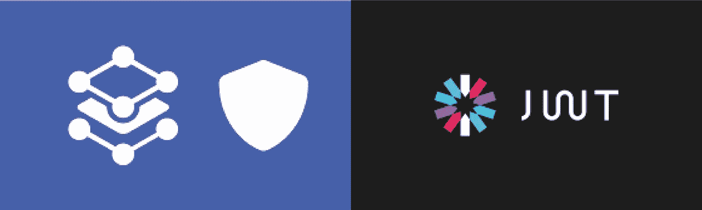
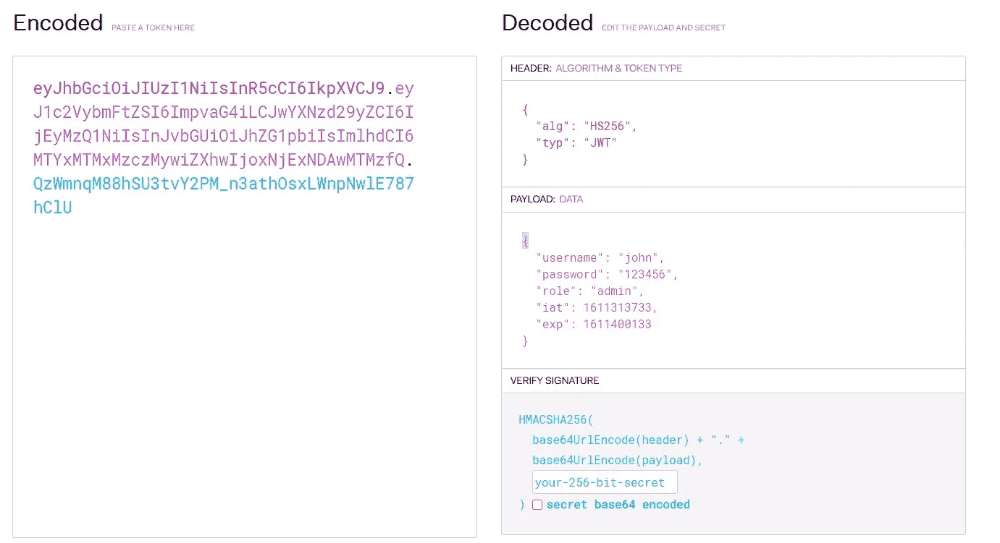
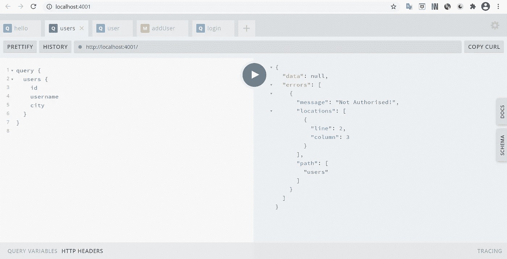
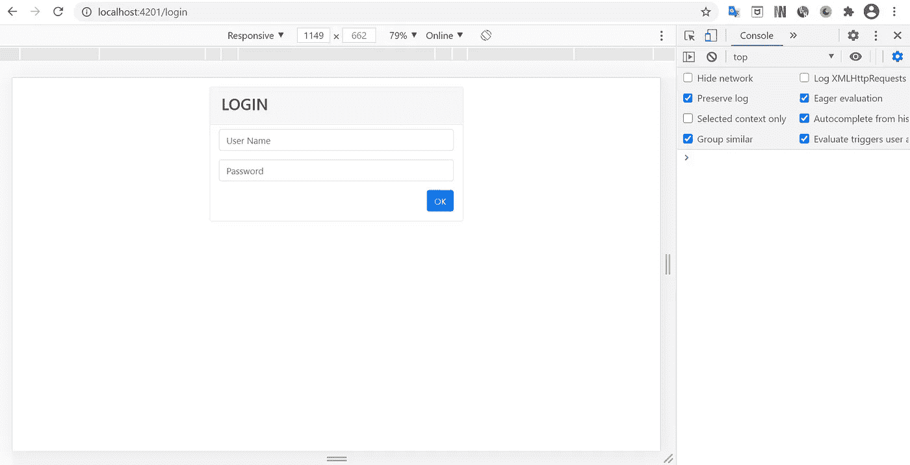
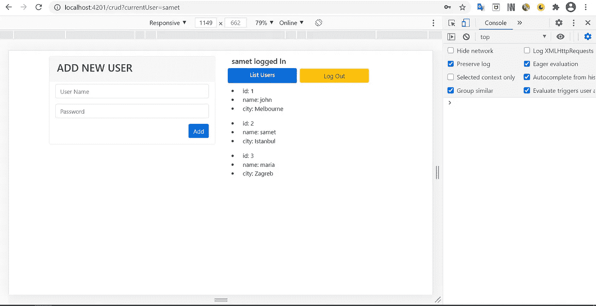
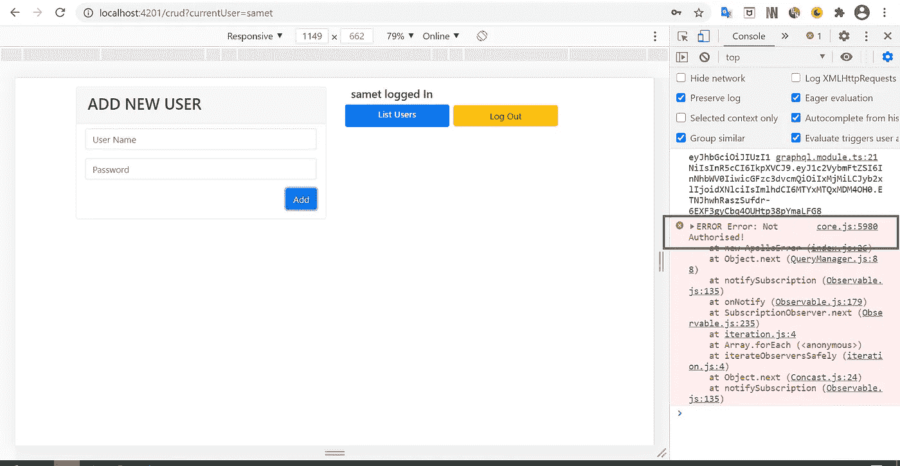

# 在 GraphQL 服务器中使用 JWT 进行认证和授权

> 原文：<https://javascript.plainenglish.io/authentication-and-authorization-with-jwt-in-a-graphql-server-d9cf6085f961?source=collection_archive---------3----------------------->



一个项目的安全和建设它一样重要。有时候，我们希望我们的数据只被之前注册的人访问，而不是所有人。我们为此提供了**认证**。

有时我们不希望每个人都访问每个数据和 API。我们为此提供了**授权**的概念。

在本文中，我将讨论如何通过使用 **jsonwebtoken (jwt)** 和 **graphql-shield** 库在服务器端提供*授权*和*认证*。我将使用 **GraphQL** 在 **Node.js** 中构建服务器。然后，我将使用我们通过 *jwt* 生成的**访问令牌**进行登录。之后，我将使用 *graphql-shield* 函数来决定允许哪个登录用户访问哪个 API。

构建完服务器后，我将举例说明如何从客户端向这些 GraphQL API 发送请求。

我将使用 **Visual Studio 代码**作为 IDE，使用 **Angular** 11 作为客户端，我假设您熟悉 *GraphQL* 、 *Angular* 和 *Node.j* s。如果您不熟悉这些概念，您可以在[这篇文章](https://medium.com/javascript-in-plain-english/building-graphql-server-with-node-js-c31ee3f54761)中找到一些关于如何在*node . js*中构建 *GraphQL* 服务器的信息

# JSON Web 令牌(jwt)

**jwt** 的结构我就不说了。但是短暂的； *jwt* 是一种标准，它允许信息以加密的形式作为 *JSON 对象*在各方之间传输。如果你用 jwt 加密数据，你用一个特殊的字符串签名。同样，需要此签名来解密数据的传输位置。



The structure of a jsonwebtoken

# graphql-shield

**graphql-shield** 是一个库，帮助你创建一个*权限层*来访问你用 *GraphQL* 创建的 API。有了这个库，你可以随心所欲地定义*认证*和*授权*的规则，并将它们应用于你想要的 API。

让我们现在创建我们的项目。我首先从*服务器端*开始:

我在将要创建项目的文件中创建文件 **package.json** :

```
npm-init -y
```

然后我安装了两个提供语法便利的包:

```
npm install babel-cli babel-preset-es2015
```

因为我将安装带有 **graphql-yoga** 的 *GraphQL-Server* ，所以我正在安装相关的包:

```
npm install graphql-yoga
```

现在我安装了*认证*和*授权*的必要包:

```
npm install jsonwebtoken graphql-shield
```

我们安装了必要的软件包。现在让我们添加我们将使用的数据。因为我不会使用数据库，所以我将包含一些用户信息的名为**用户**的数组添加到名为 **data.js** 的文件中，并导出它:

```
const Users = [
 {
   id: 1,
   username: “john”,
   city: “Melbourne”,
   password: “123456”, 
   role: “admin”,
 },
 {
   id: 2,
   username: “samet”,
   city: “Istanbul”,
   password: “123”,
   role: “user”,
 },
 {
   id: 3,
   username: “maria”,
   city: “Zagreb”,
   password: “456”,
   role: “user”,
 },
];module.exports = Users;
```

为了 eas 代码的可读性，我为 *GraphQL* 的两个主要概念创建了两个单独的文件；**类型定义**和**解析器**:

我创建了一个 **TypeDefs.js** 文件，并添加了以下代码:

```
const typeDefs = `
  type Query {
    users: [User!]!
    login(username:String!, password:String!): String
  }    type Mutation{
    addUser(id:ID!, username:String!, city:String! ): [User]
  }  

  type User{
    id: ID!
    username: String!
    password: ID!
    role: String!
    city: String!
  }
`;module.exports = typeDefs;
```

这里的**“users”**函数是获取所有用户的函数。**“登录”**功能将执行*认证*。**“addUser”**是向数组中添加新用户的函数。

我创建了 **resolvers.js** 文件，并添加了以下代码:

```
import Users from “./data”;
import jwt from “jsonwebtoken”;const resolvers = {
  Query: {
    users: async (parent, args) => {
      return Users;
    },
    login: async (_, { username, password }) => {
      let user = Users.find((u) => u.username === username && u.password === password
    );
    if(user){
     const token = jwt.sign(
      {username: user.username, password: user.password, role:   user.role }, “MY_TOKEN_SECRET”);
      return token;    } else return "unknown user"
  },
},    Mutation: {
    addUser: async (_, { id, username, city }) => {
      const newUser = {
        id: id,
        username: username,
        city: city,
      };
      Users.push(newUser);
     return Users;
    },
  },
};module.exports = resolvers;
```

# 证明

这里我们看到 *jsonwebtoken (jwt)* 被用在**“登录”**函数中。这将通过用户名和密码信息检查客户端发送的用户信息是否在服务器上的数组中(通常在数据库中)。这就是**认证**。如果数据库中存在该用户，则使用 *jwt 的* **生成一个**令牌**。sign()** 方法并发送给客户端。这个*令牌*保存在客户端的 **localStorage** 中，当请求访问 API 时，这个令牌信息也会随请求一起发送。

在生成*令牌*时，我们可以在**声明**时提供我们想要的信息。这里*用户名*，*密码*，以及*角色*信息我给了。还必须给出一个密钥字符串值，我们用它来签署令牌。在示例中，我使用了“*MY _ TOKEN _ SECRET”*字符串。这个密钥也将用于解码令牌。

现在，让我们创建 **index.js** 文件，并添加以下代码。

```
import { GraphQLServer } from “graphql-yoga”;
import jwt from “jsonwebtoken”;
import { rule, shield, and, or, not } from “graphql-shield”;
import typeDefs from "./TypeDefs";
import resolvers from "./resolvers";function getClaims(req) {
  let token;
  try {
    token = jwt.verify(req.request.headers.authorization, “MY_TOKEN_SECRET”);
  } catch (e) {
    return null;
  }
  console.log(token);
  return token;
}// Rules
const isAuthenticated = rule()(async (parent, args, ctx, info) => {
  return ctx.claims !== null;
});const canAddUser = rule()(async (parent, args, ctx, info) => {
  return ctx.claims.role === “admin”;
});// Permissions
const permissions = shield({
  Query: {
    users: and(isAuthenticated),
  },
  Mutation: {
    addUser: and(isAuthenticated, canAddUser),
  },
});const server = new GraphQLServer({
  typeDefs,
  resolvers,
  middlewares: [permissions],
  context: (req) => ({
    claims: getClaims(req),
  }),
});server.start({ port: 4000 }, () =>
  console.log(“Server is running on http://localhost:4000")
);
```

在 **GraphQLServer** 构造函数中，我们看到除了传递*typedef*和*解析器*之外，还传递了**中间件**和**上下文**参数。首先我要讲一下*语境*的概念。

# GraphQL 中的上下文参数

*解析器*中的**上下文**是一个特定执行的所有*解析器*共享的对象。它对于保存数据很有用，比如*认证*信息、当前用户、数据库连接、数据源以及运行业务逻辑所需的其他东西。

这里的上下文对象被传递给每一层的每一个解析器，所以我们可以在模式代码中的任何地方访问它。它接收的 **req** 对象保存请求信息。这个*请求*还包括客户端发送的*令牌*信息。由**决定。我们在上下文中定义的 getClaims()** 函数使用**对*令牌*进行解码。验证 *jwt 对象*的()** 方法，从*令牌*中获取*声明*。

```
function getClaims(req) {
  let token;
  try {
    token = jwt.verify(req.request.headers.authorization, “MY_TOKEN_SECRET”);
  } catch (e) {
    return null;
  }
  console.log(token);
  return token;
}
```

每当我们从客户端向服务器发送请求时， **getClaims()** 方法运行并返回解码后的*令牌*。如上所示，您可以在控制台中看到解码后的令牌。

# 批准

根据我们的场景，请求附带的*声明*信息中有一个**“role”**字段。根据这个角色信息，我们在 *graphql-shield* 库的帮助下定义规则。比如说；我们希望用户登录后访问**“用户”**功能。归档的*【角色】*是*【用户】*还是*【管理员】*并不重要。为此，我编写了以下代码。

```
const isAuthenticated = rule()(async (parent, args, ctx, info) => {
  return ctx.claims !== null;
});
```

根据我们用。 **rule()** 函数在 *graphql-shield* 库中，如果*声明*不为 **null** ，即如果 user-credentials 正确，则用户有权访问**【users】**函数。换句话说，使用用户凭证登录程序就足以访问**“用户”**功能。

但是，根据场景，您需要成为**【admin】**才能向程序添加新用户。我们用以下代码为此指定了规则:

```
const canAddUser = rule()(async (parent, args, ctx, info) => {
  return ctx.claims.role === “admin”;
});
```

接下来，我们定义了一个**屏蔽**来指示这些规则将应用于哪些功能。

```
// Permissions
const permissions = shield({
  Query: {
    users: and(isAuthenticated),
  },
  Mutation: {
    addUser: and(isAuthenticated, canAddUser),
  },
});
```

如你所见，函数的类型是**查询**还是**变异**很重要，正如 *typeDefs* 中定义的那样。

我们通过**中间件**参数将这些规则(权限)传递给服务器；

```
const server = new GraphQLServer({
  typeDefs,
  resolvers,
  middlewares: [permissions],
  context: (req) => ({
    claims: getClaims(req),
  }),
});
```

我们的服务器现在已经准备好测试它的*认证*和*授权*设置。最后，我将下面的代码添加到 *package.json* 文件中的**脚本**节点下:

```
“start”: “nodemon index.js — exec babel-node — presets es2015”,
```

我在项目文件所在的终端上编写了以下命令。

```
npm start
```

现在你可以在**游乐场 UI** 中测试代码了。(如果您的电脑上没有安装**“nodemon”**，您可以通过**“NPM I nodemon”**命令安装)

但是，你只能在*游乐场* UI 显示屏上测试**“登录”**功能。因为我们还没有为它设定一个*授权*规则。为了测试另外两个功能，你可以从 Angular 下载 [**向这个服务器发送请求的项目**](https://github.com/azizkale/Angular-Project-for-Authentication-and-Authorization-in-GraphQL-Server) 。或者，在控制台中，您可以获得您用**“log in”**函数生成的令牌，并将它们分配给。 *getClaims()* 函数同**复制/粘贴**。

在未授权交易的情况下，将出现以下屏幕:



当您下载并运行相关的客户端项目时，它将在端口 **4200** 上运行。您的服务器端项目也应该在 **4000** 端口上运行(默认情况下已经在 4000 上运行了。)

登录屏幕将向您问候:



让我们用以下用户信息来创建我们的示例请求:

```
{
   id: 2,
   username: “samet”,
   city: “Istanbul”,
   password: “123”,
   role: “user”,
}
```

当您输入*用户名*和*密码*时，**用户列表按钮**会起作用。因为该按钮触发服务器上的**【用户】**功能，您只需登录即可使用该功能。



但是，该用户将无法添加新用户，因为角色值不是**“admin”**。如果您尝试使用左侧的**添加新用户**部分添加新用户，您将得到以下警告:



控制台上的错误信息里写着: ***“未授权！”*。这意味着未经授权的操作。**

您可以使用用户 John 的信息发出另一个请求，他的角色是**“admin”**。

# 包扎

在 **Node.js** 中，我们已经看到了如何在使用 **GraphQL** 构建的服务器上创建**认证**和**授权**结构。然后，我们通过从预先准备好的客户端项目向该服务器发送请求来观察结果。

你可以通过 [**这个链接**](https://github.com/azizkale/Authentication-and-Autorization-in-GraphQL-Server-with-Node.js) 到达服务器端项目。

## 进一步阅读

[](/i-built-a-serverless-live-chat-app-with-next-js-fauna-and-wundergraph-for-graphql-live-queries-b671d9646f6) [## 我用 Next.js、Fauna 和 WunderGraph 为 GraphQL 实时查询构建了一个无服务器的实时聊天应用程序

### 使用无服务器技术创建可扩展的实时聊天应用程序的分步指南，来自…

javascript.plainenglish.io](/i-built-a-serverless-live-chat-app-with-next-js-fauna-and-wundergraph-for-graphql-live-queries-b671d9646f6) [](https://plainenglish.io/blog/how-to-build-a-graphql-ecommerce-app-from-scratch) [## 如何从头开始构建一个 GraphQL 电子商务应用程序

### 这就是你要建造的东西！埃森哲的一项调查(19 个国家的 20，000 多名消费者)发现，47%的人…

简明英语. io](https://plainenglish.io/blog/how-to-build-a-graphql-ecommerce-app-from-scratch) [](https://plainenglish.io/blog/how-to-compose-and-integrate-apis-together-as-if-you-were-using-npm-for-apis) [## 如何将 API 组合和集成在一起，就像您正在使用 API 的 NPM 一样

### 将两个 API 整合到一个应用程序中，该应用程序显示了历史上最大的音乐会，按国家首都排列。与……

简明英语. io](https://plainenglish.io/blog/how-to-compose-and-integrate-apis-together-as-if-you-were-using-npm-for-apis) 

*更多内容看* [***说白了就是***](https://plainenglish.io/) *。报名参加我们的* [***免费周报***](http://newsletter.plainenglish.io/) *。关注我们关于* [***推特***](https://twitter.com/inPlainEngHQ) ， [***领英***](https://www.linkedin.com/company/inplainenglish/) *，*[***YouTube***](https://www.youtube.com/channel/UCtipWUghju290NWcn8jhyAw)*，以及* [***不和***](https://discord.gg/GtDtUAvyhW) *。对增长黑客感兴趣？检查* [***电路***](https://circuit.ooo/) *。*