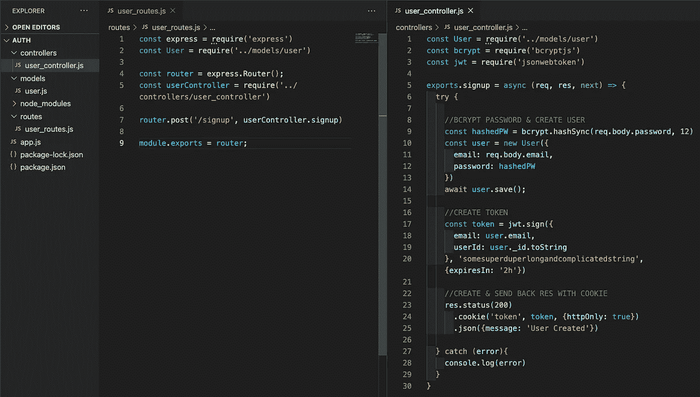
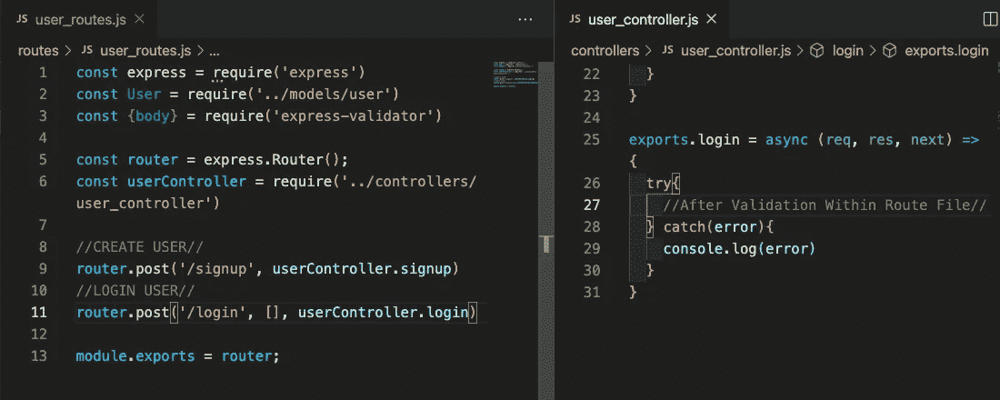
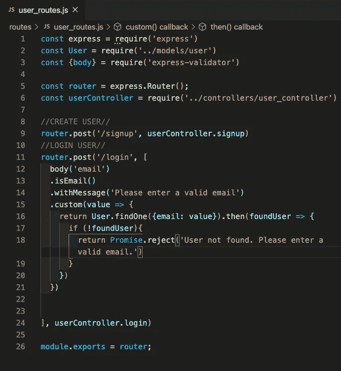
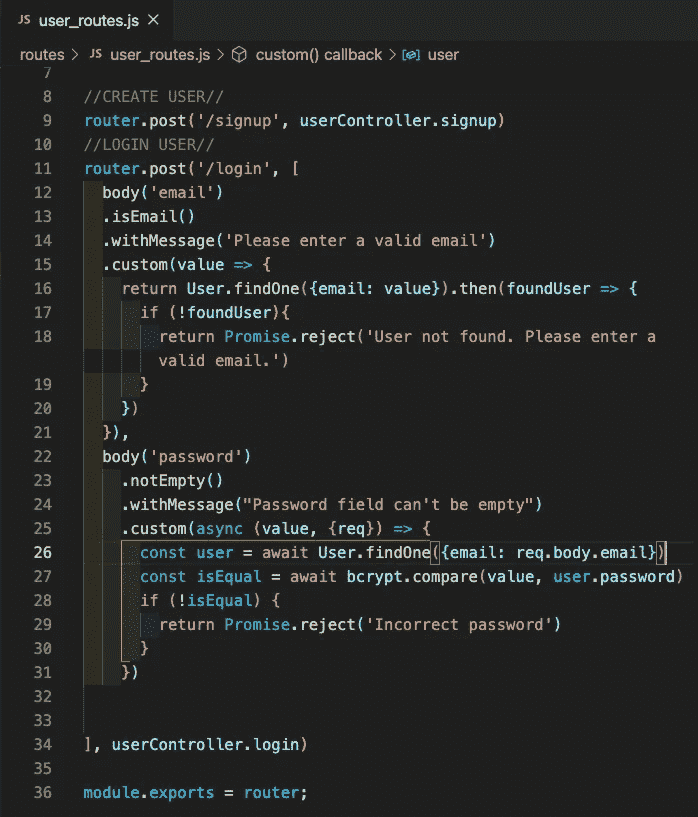
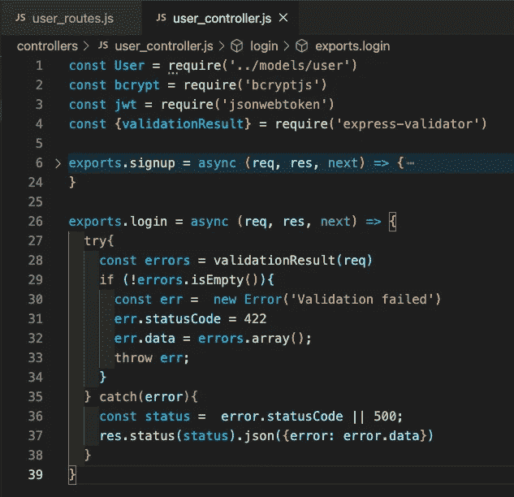
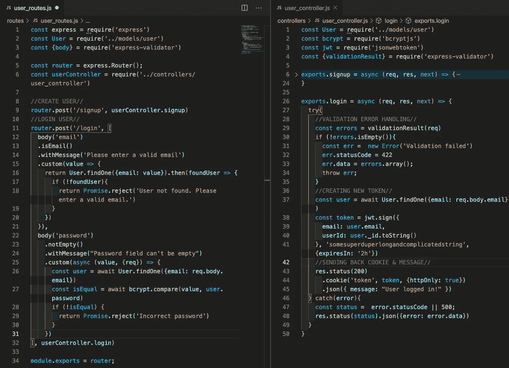

# Node.js 中的身份验证

> 原文：<https://javascript.plainenglish.io/authentication-in-node-js-adding-validation-part-2-bb3fbbaa7494?source=collection_archive---------13----------------------->

## 添加验证(第 2 部分)


这是我写的关于使用 HTTP cookies、BCrypt 和 JWT 令牌将身份验证添加到节点项目中的文章的继续。之前，我已经设置了我的应用程序来接受一个用户注册的请求。然后，我获取这些信息，散列密码，将输入数据保存在我的数据库中，然后返回一个签名令牌，它将作为 HTTP cookie 存储在客户端。如果您想重温这些步骤，可以在这里找到，否则，让我们从“登录”路径开始，并向我们的后端应用程序添加一些验证。



目前这是路线和用户控制器文件的样子。接下来，让我们添加登录功能。我将从添加一些验证开始，由于另一个中间件的帮助，我们将在路由和控制器文件中使用这些验证。

```
npm install --save express-validator
```



我们首先需要`express-validator`包，特别是我们将使用的`{body}`方法(我将在底部链接到`express-validator`的文档以获得更多关于其功能的信息)。我们还需要访问数据库中的用户模型，所以我也要求这样做。接下来，我定义了来自我们前端&的“/login”路由，作为第二个参数传递给它一个空数组。这是我们验证的地方。最后，我将从控制器中导出的函数的第三个参数传递给它，这是它在通过验证后的方向。



首先，在我们的验证数组中，我们调用`body`并指定我们想要验证来自请求体的内容，在我们的例子中是“email”。您可以使用和指定大量的验证，我再次邀请您深入研究这些验证，但是我在这里通过将它们链接在一起，只调用几个简单的验证。`.isEmail()`将检查它是否是有效的电子邮件格式(blah@blah.com)。如果失败，我使用`.withMessage()`给它一个定制的失败错误消息。接下来，我定义了一个自定义验证，其中我调用数据库并试图根据正文中的电子邮件找到`User`。如果`foundUser`为假，那么我返回一个被拒绝的承诺，并给出一条解释消息。如果找到了一个用户，我就继续前进，验证密码。



我再次调用`body`并检查“密码”。我使用一个标准的`.notEmpty()`来确保有一个密码，然后调用一个`.custom()`异步验证来检查密码是否正确。

我再次从数据库中获取我的用户。然后，使用 bcrypt `.compare()`方法，我检查为该用户保存的密码和 req.body 中给定的密码。`Compare()`返回一个布尔值，并基于此进行最终验证。如果失败了，我再次拒绝承诺。

失败的验证及其消息将被传递给 userController.login 函数，我们可以使用它们来创建响应并发送回前端。



我们首先从 express-validator 的另一个方法`{validationResult}`开始。

这允许我们对传入的请求调用 validationResult，并返回一个包含验证错误的结果对象。如果有任何错误，我们创建一个新的错误，将 statusCode 设置为 422，将其转换为一个数组&然后将其扔给我们的 catch 块，该块将它发送回前端。


现在，我们的验证和错误处理已经完成，我们可以继续努力发送回一个新的签名令牌，该令牌将验证用户是否已经登录。

我们以与之前完全相同的方式创建令牌。使用`jwt.sign()`创建令牌，并在其中发回登录用户的电子邮件& userId。我们还包括我们的“私人密钥”和一些定制，以确保令牌只能持续 2 小时。正如我在上一篇文章中所说的，还有更多的定制可以包括在内，我鼓励你去研究一下。

现在终于有了令牌，所有的立场是将它作为 HTTP cookie 发送回客户端，您的用户在通过一些验证后正式“登录”。如果验证失败，客户端将收到一组错误，您可以用它来通知用户验证失败的原因和方式。最终，您的最终用户路由和控制器应该如下所示:



完成后，我们现在可以成功“登录”了。正如我之前提到的，这个实现纯粹是为了启动一个应用程序。这些都可以抽象成单独的 Auth 文件，使您的应用程序更具可重用性和可伸缩性。这是我将在第三篇也是最后一篇关于节点认证的文章中开始做的事情。我将创建一个单独的文件，作为身份验证“检查”。用于后端中要求用户已经“登录”才能访问的每条路线。

*[1]:快递验证单(*[https://express-validator.github.io/docs/](https://express-validator.github.io/docs/))

*[2]: JWT 医生(*[https://www.npmjs.com/package/jsonwebtoken](https://www.npmjs.com/package/jsonwebtoken))

*[3]:加密文件(*[https://www.npmjs.com/package/bcrypt](https://www.npmjs.com/package/bcrypt)*)*

*[4]:HTTP cookie Docs(*[https://developer.mozilla.org/en-US/docs/Web/HTTP/Cookies](https://developer.mozilla.org/en-US/docs/Web/HTTP/Cookies))