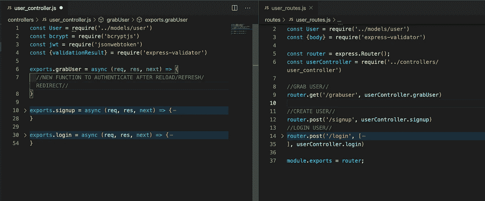
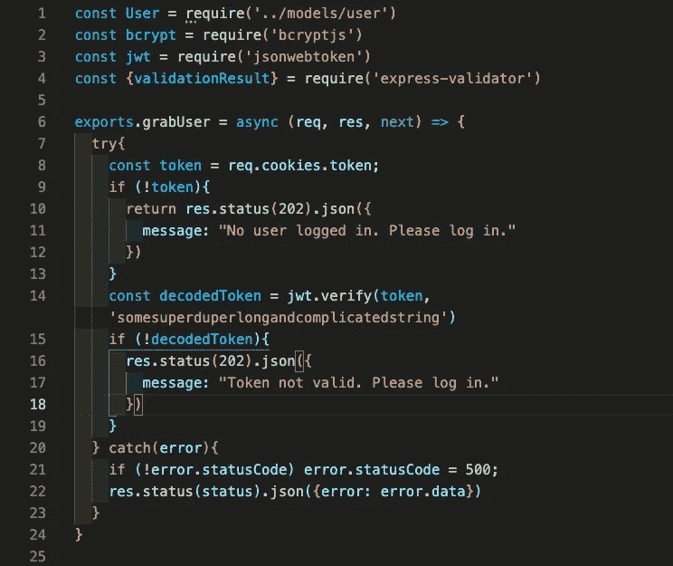
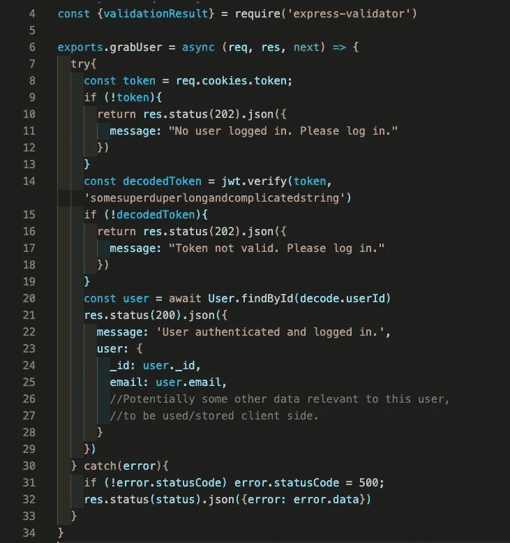
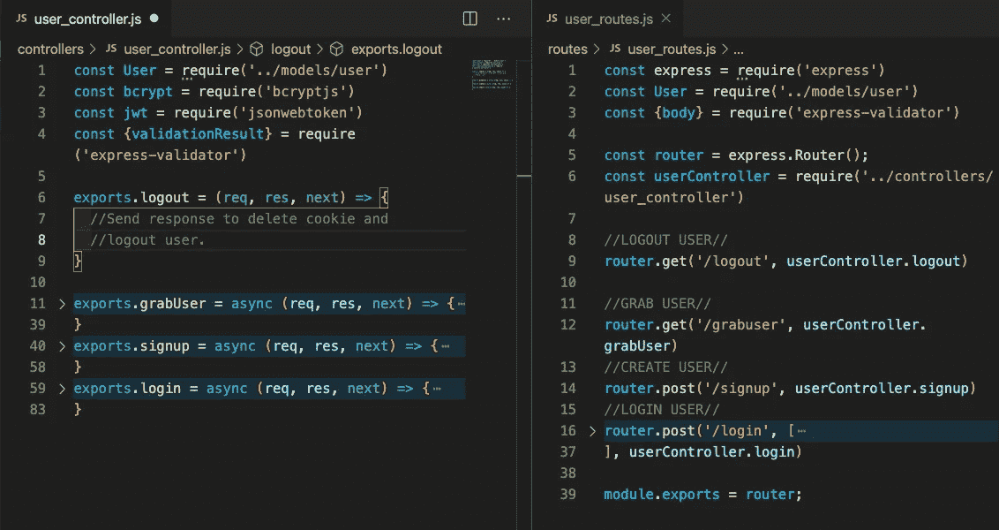
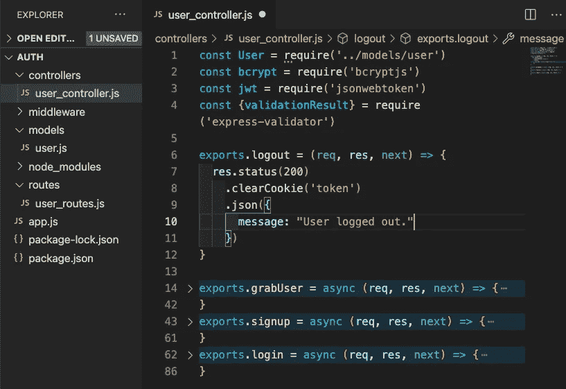

# Node.js 中的身份验证

> 原文：<https://javascript.plainenglish.io/authentication-in-node-js-part-3-8604a09b2ca4?source=collection_archive---------8----------------------->

## 第三部分


在 Node series 身份验证的最后一部分，我将为后端节点服务器添加最后三项功能。

首先是我所说的“抓取用户”功能，每次前端重新加载、刷新或重定向以获取存储的令牌 cookie 并确保其仍然有效时，该功能都会运行。

第二个将是主要的“is-auth”功能，它将在每个其他路由/请求上验证用户，这需要用户登录以访问数据库、请求数据等。最后是一个简单的“注销”功能，用于删除存储在客户端浏览器上的 cookie。

我会直接跳回去，所以如果你需要重温之前写的代码，你可以在第一部分&[第二部分](https://medium.com/javascript-in-plain-english/authentication-in-node-js-adding-validation-part-2-bb3fbbaa7494)中找到。



上面我们有用户控制器和用户路由文件，其他主要功能已经编写好并折叠起来，但这是我们开始 grabUser 功能的地方，首先将路由定义为`‘/grabuser’`，它可以在我们的前端使用，然后将它发送到适当的控制器方法。出于本演示的目的，该方法将在每次“加载”应用程序时运行“顶层”,以获取用户数据并发回任何需要在客户端保存或存储的数据。



我们在 grabUser 函数中做的第一件事是检查令牌是否存在。如果我们在检查令牌时得到一个错误，我们知道没有人登录，因此发送回该消息。

接下来，如果有令牌，我们尝试解码它，如果由于任何原因失败(即令牌过期等)。)我们也发送回一条消息来传达这一点。



最后，如果我们顺利地通过了这两项检查，我们就可以获得解码后的令牌，并从数据库中获取用户。然后，我们发回与该用户相关联的任何相关用户数据，这些数据可能需要存储在应用程序的状态中，而这些数据在重载/重定向时会丢失。这提供了相当友好的用户体验，使登录用户不必在每次重定向或刷新页面时重新登录。

接下来，我将添加一个包含单个文件的中间件文件夹，以检查需要用户登录的每个潜在路由上的身份验证。为了利用这一点，我们将在所有其他路由文件中需要它，并在将其发送到相关控制器之前将其作为参数传递。

例如，如果这是一个商店应用程序，并且有一条路线来查看用户的购物车，则路线函数可能如下所示:

```
const express = require('express')
const Shop = require('..models/shop')
const router = express.Router();
const shopController = require('../controllers/shop_controller')**const auth = require('../middleware/auth')****router.get('/shoppingcart', auth, shopController.getShoppingCart)**module.exports = router
```

这里的两个导入部分是`auth`函数所需要的，以及我们如何将它作为第二个参数传递给“/shoppingcart”路由的 get 函数。所以让我们继续编写这个`auth`函数，它将在请求被传递给`shop_controller.getShoppingCart function`之前运行。


我们从本质上做我们刚刚写的 grabUser 函数中做的事情开始。我们得到令牌，如果没有令牌，我们抛出一个错误，然后我们解码它。如果没有通过，我们也会抛出一个错误。如果它确实通过了，我们将来自解码令牌的 userId 设置到我们的请求对象上，并调用`next()`函数。这允许我们在任何控制器函数中访问`req.userId`,然后将它传递给控制器函数。因此，如果我们需要这个用户，我们只需调用`User.findById(req.userId)` 来访问我们当前的用户。

有了它，我们现在能够在我们的应用程序中验证任何路由，确保用户登录，然后访问用户数据。

对于我们的最后一个功能，我们将返回到我们的用户控制器和用户路线，以添加一个“注销”功能。



首先，再次在 routes 文件中定义适当的函数，然后将其连接到控制器中相应的函数。



这一个是三个中最简单的执行。将状态设置为 200，使用 ClearCookie 根据作为参数传递的名称删除 Cookie，然后发送回一条消息，通知前端用户已经注销，cookie 已经删除。完成了，完成了。

现在你知道了。对于一个使用 HTTP cookies、BCrypt、JasonWebTokens 和 Validation 的基本个人项目，我们已经能够实现一个相当简单的认证过程。我们已经能够登录用户、创建用户、检查当前用户、注销用户，以及验证对特定用户的每个后续请求。一如既往，我将链接任何相关的文件供进一步阅读，或者您在个人认证过程中可能遇到的问题。

*【1】:HTTP cookie Docs(*[https://developer.mozilla.org/en-US/docs/Web/HTTP/Cookies](https://developer.mozilla.org/en-US/docs/Web/HTTP/Cookies))

*【2】:https://www.npmjs.com/package/jsonwebtoken 文件(*)

*【3】:Bcrypt Docs(*[https://www.npmjs.com/package/bcrypt](https://www.npmjs.com/package/bcrypt)*)*

*【4】:快递验证单据(*【https://express-validator.github.io/docs/】T2)