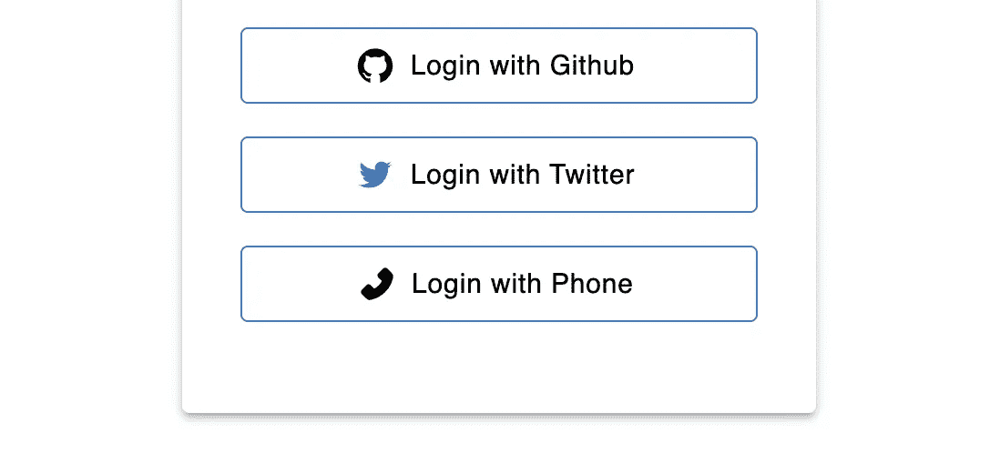
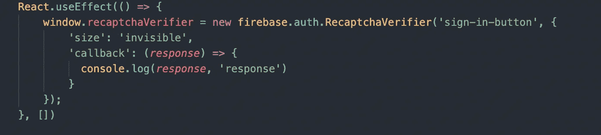
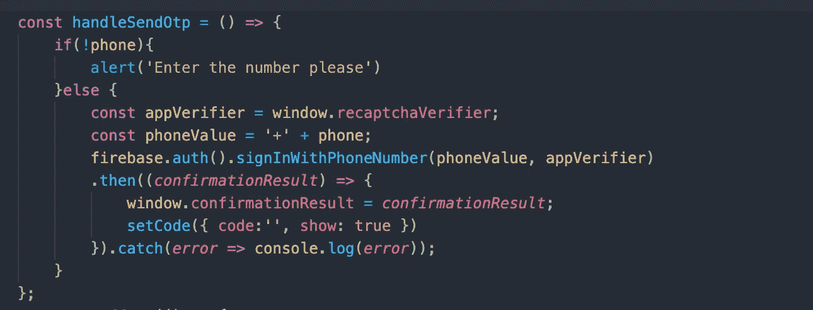
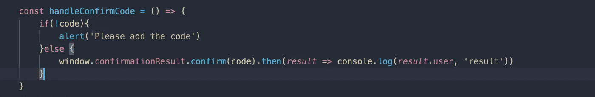
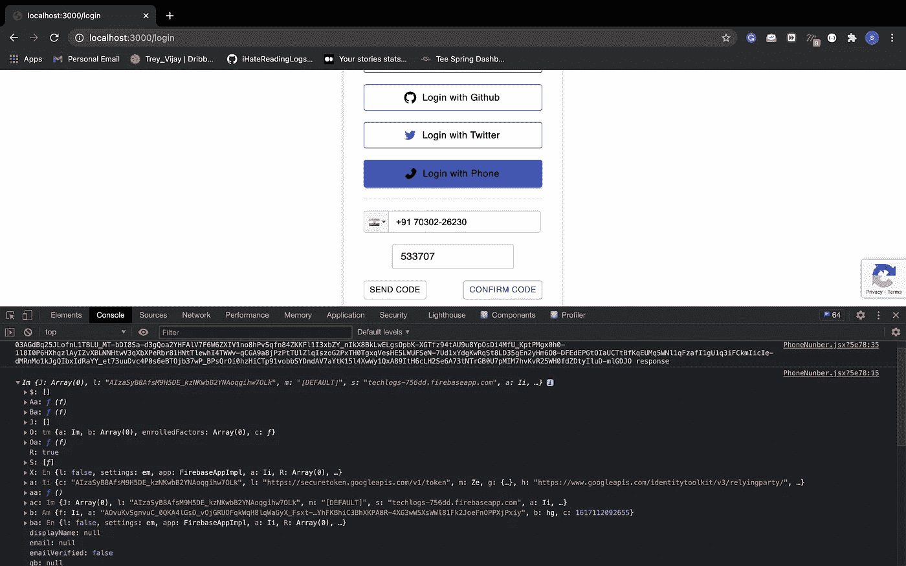
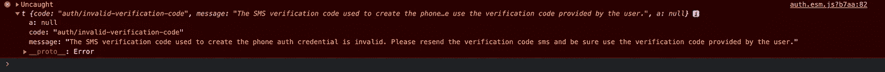

# 使用电话号码的认证

> 原文：<https://javascript.plainenglish.io/authentication-using-phone-number-fd5b10727fed?source=collection_archive---------7----------------------->

使用电话号码登录您的用户



[Read the articles](http://i-hate-reading-logs.vercel.app/)

今天，我们将使用电话号码来验证用户。通过 Google 登录后，我发现通过 OTP 进行身份验证是最简单、最容易实现的过程。

我们将使用我们使用 Firebase 添加 Twitter 身份验证的存储库，并将继续在同一个存储库中使用 Firebase 添加电话号码身份验证。

```
Twitter authentication repository => [Repo](https://github.com/shreyvijayvargiya/iHateReadingLogs/tree/main/TechLogs/TwitterAuthenticationUsingFirebase)
```

# 概观

1.  在 Firebase 身份验证控制台中启用登录方法
2.  在“歌唱方法”部分添加您的电话号码
3.  启用 Firebase Recaptcha 验证程序以防止滥用身份验证过程。
4.  使用 firebase 提供商向用户电话号码发送验证码。
5.  验证发送给用户和一个用户输入的验证码。

# **启用 Recaptcha 验证器**

Firebase 提供了一种启用重新验证码验证器的方法。我们将使用 Firebase 的隐形 Recaptcha 验证方法。您可以在此阅读更多内容= >

```
[https://firebase.google.com/docs/auth/web/phone-auth?authuser=0](https://firebase.google.com/docs/auth/web/phone-auth?authuser=0)
```

启用 reCaptcha 验证器非常简单，当组件被挂载或者可能正在使用 react 提供的钩子时，可以调用 firebase enabling Recaptcha 函数。您可以从上面的链接复制粘贴代码。



PhoneNumber.jsx in module

这个过程应该是这样的，用户应该输入他/她的电话号码，然后通过 Firebase API 将验证码发送到用户输入的电话号码，然后要求用户提交他/她的验证码，在验证用户之前的最后一步是使用 Firebase 方法检查他/她输入的验证码。为了让用户输入他/她的电话号码，我使用了一个 react 电话输入包。

```
NPM package => [https://www.npmjs.com/package/react-phone-input-2](https://www.npmjs.com/package/react-phone-input-2)
```

这个包简单地提供了电话号码输入和选择用户所在国家的附加功能。它很容易集成和处理。

*如果你使用这个包，有一点很重要:在你的 pages 文件夹中添加 react-phone-input-2 CSS inside _ app . js 文件。*

# **发送代码**

Firebase 提供了 **signInWithPhone** 方法，该方法接受用户电话号码和 reCaptcha 验证器。这种方法有助于确认 reCaptcha 和用户电话号码，然后将代码发送到相应的电话号码。

```
firebase.auth().signInWithPhoneNumber(phoneValue, appVerifier)  .then((*confirmationResult*) => {
    window.confirmationResult = *confirmationResult*;
}).catch(*error* => console.log(*error*));
```



Sending code to the user-entered phone number

# 验证代码

最后一步是将用户输入的代码和发送给用户的代码进行交叉。



Checking the Code Send to user

我们设置为窗口对象的 **confirmationResult** 用于确认代码，当输入的代码正确时，firebase 会向您发送用户对象作为响应。



User object in the console after entering correct code

Firebase 还提供了错误对象，以防用户输入无效代码或错误代码。



Error in console when the user entered the wrong code

# 结论

Firebase 为用户提供了最简单的方法。您可以在“身份验证”->“登录方法”选项卡下检查用户的登录方法。我已经介绍了 5 种验证用户身份的方法。请继续关注，因为我将涵盖所有的方法来唱-在你的用户。

下次见。祝你今天开心！玩的开心！

```
Code Repository => [https://github.com/shreyvijayvargiya/iHateReadingLogs/tree/main/TechLogs/PhoneNumberAuthentication](https://github.com/shreyvijayvargiya/iHateReadingLogs/tree/main/TechLogs/PhoneNumberAuthentication)
```