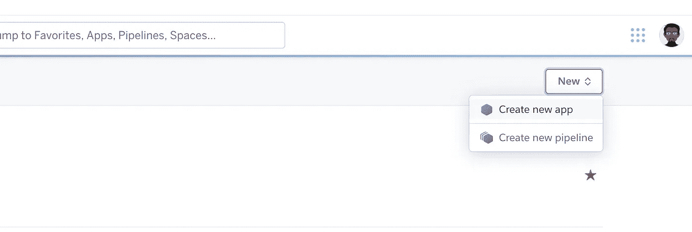
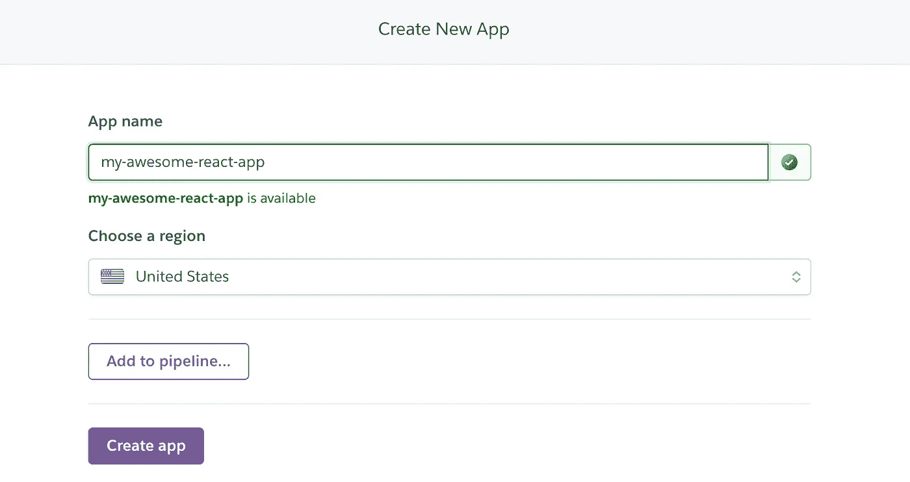
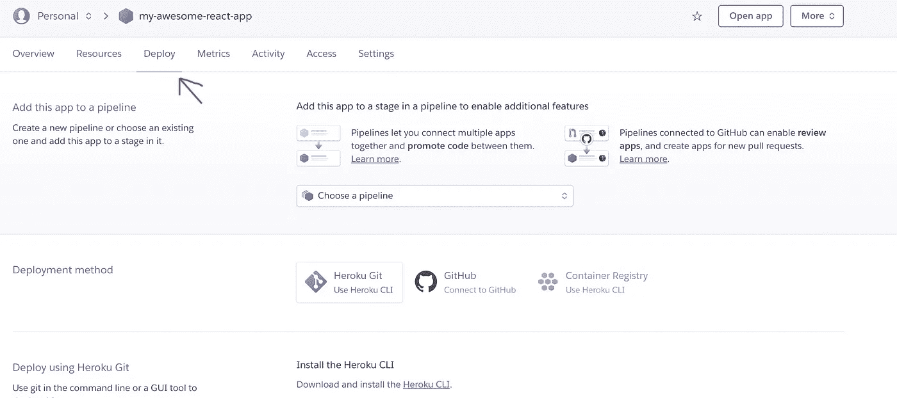
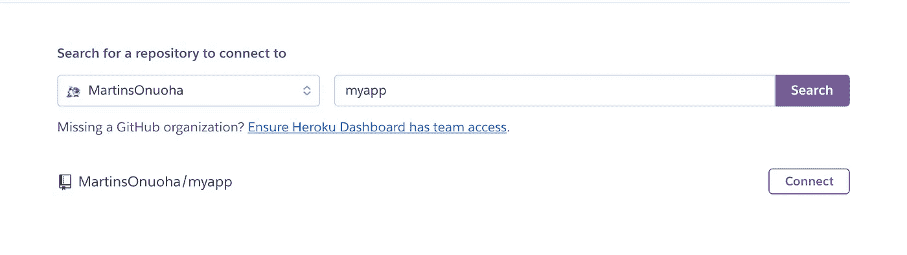
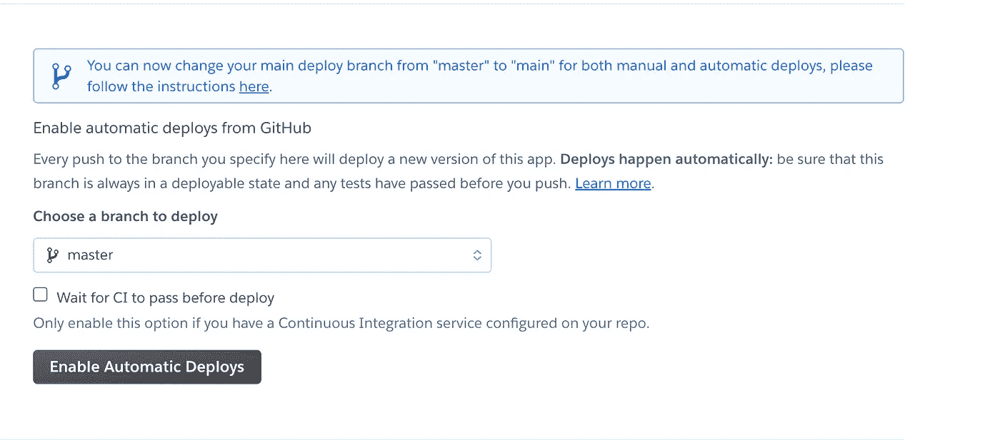
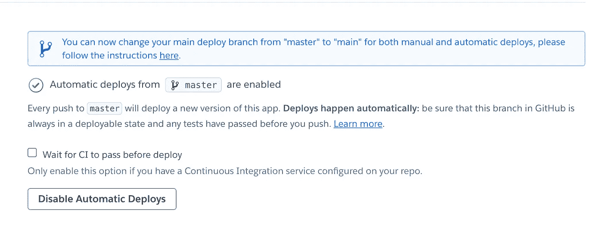
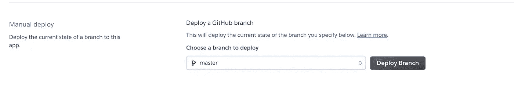
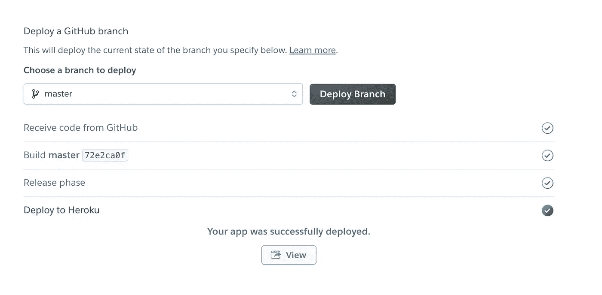
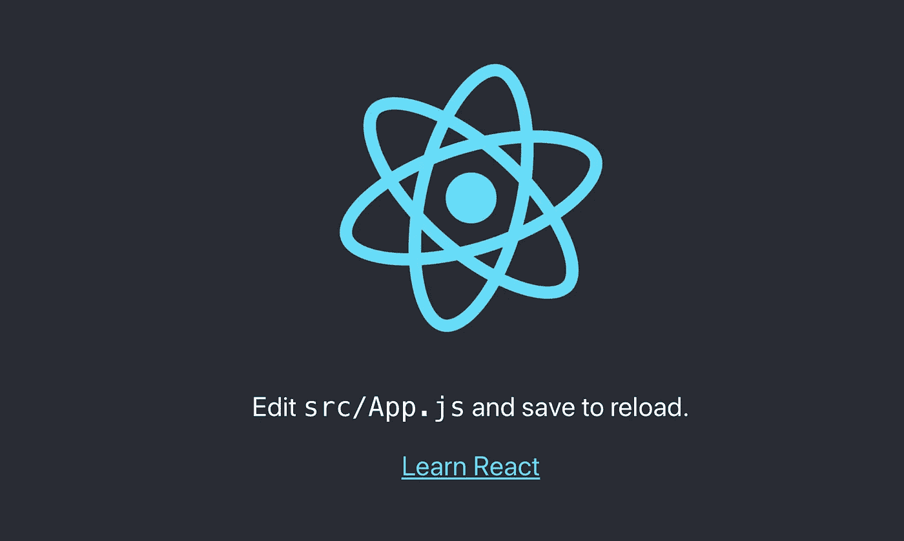
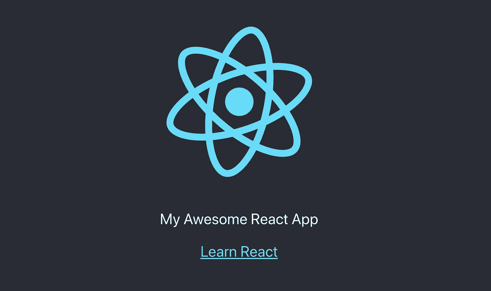

# 使用 Heroku 自动部署 React 和 Vue 应用程序

> 原文：<https://javascript.plainenglish.io/auto-deploy-react-vue-apps-with-heroku-7cac127bcd5a?source=collection_archive---------17----------------------->

## 了解如何将 JavaScript 前端应用程序部署到 Heroku


*本文假设您对 React 或 Vue.js 有基本的了解。本文中的所有步骤适用于 React 和 Vue.js 应用程序。*

至少可以说，用 Heroku 部署前端 JavaScript 应用程序轻而易举。这主要是因为 Heroku 消除了设置中的所有麻烦，只让您进行部署。当然，当您需要部署后端应用程序时，这是不同的，因为您需要在适用的地方提供数据库，并在环境变量中包含凭证。谢天谢地，在部署前端应用程序时，我们不必担心这些…哦，除非你在前端应用程序中使用环境变量，否则你也需要在 Heroku 上设置它们。

# 入门指南

要求:

*   Node.js 设置
*   [Heroku](https://heroku.com) 记述
*   Github 帐户

我假设您已经有了一个想要部署的 React 或 Vue 项目。对于这个例子，我将使用一个 React 项目，一个我以前创建的项目。
首先，确保你有一个 Github 账户。您需要提交代码并将其推送到 Github:

```
git add . && git commit "initial commit" && git push origin master
```

接下来，在 Heroku 上创建一个帐户(如果您还没有)，并添加一个新的应用程序:



你需要输入一个名字并选择一个地区。你可以给这个应用取任何你想要的名字，随意离开这个地区或者选择一个靠近你的主要用户的地区。



设置好所有要求后，单击“创建应用程序”。这将创建您的应用程序，并向您显示 deploy 选项卡，在这里您可以选择您希望如何部署您的应用程序。



在这一点上，Heroku 不知道您打算部署的应用程序的类型，但是一旦我们选择了一个存储库，它会很聪明地解决这个问题。在“Deployment Method”部分，您默认选择了“Heroku Git ”,将其更改为“Github”。您需要搜索您将代码推送到的存储库:



一旦 Heroku 找到它，点击“连接”。Heroku 会将这个库链接到 Heroku 应用程序。在下一节中，将提示您从 Github 设置自动部署。



如上所述，您对指定分支的每一次推送都将触发新的构建和部署。我们将选择的分支保留为“主分支”(如果您想要其他分支，请更改它)。然后单击“启用自动部署”按钮。



最后，您将在下一部分中触发手动部署:



点击“部署分支”，Heroku 应该从那里处理剩下的。部署完成后，您应该会在底部看到一个“查看”按钮，单击此按钮查看您的应用程序。



您应该在一个唯一的 URL 上看到您的应用程序。



现在，每当您向主分支推送新的更改时，Heroku 都会监听该分支上的更新，并自动重新构建您的应用程序以服务于最新的构建。

您可以通过更新 App.js 文件并将更新推送到 Github 上的主分支来测试这一点。在您的 Heroku 仪表板中，您现在应该看到一个新的构建正在进行中。


完成后，您应该会看到您在网站上所做的更新。



希望这能帮助到一些人。

干杯☕️

> [**在黑暗模式下阅读本文**](https://devjavu.space/post/auto-deploy-react-vue-apps-with-heroku?isDark=true) 🌙，轻松复制并粘贴代码示例，并在 [**Devjavu**](https://devjavu.space/) 上发现更多类似的内容。