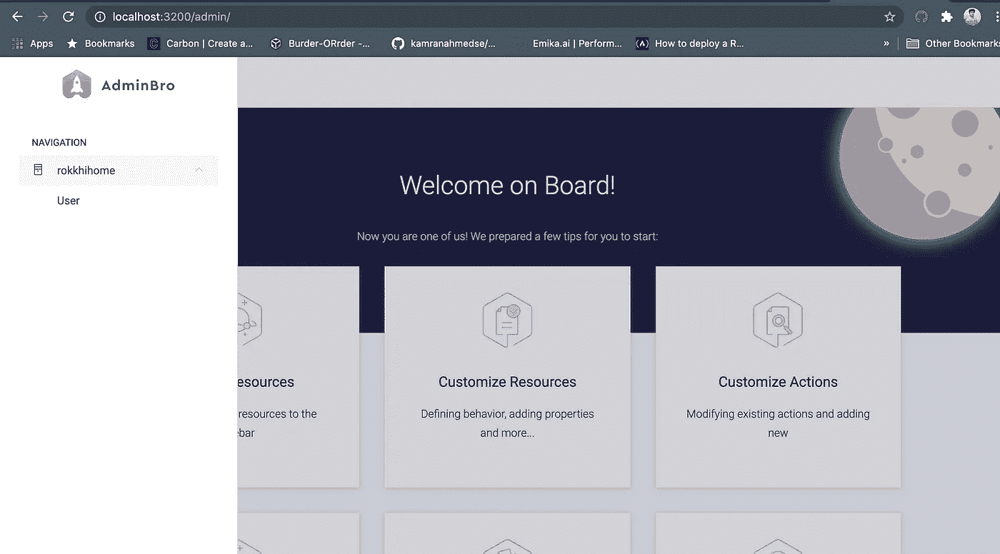

# 使用 AdminBro 为 Node.js 自动生成管理面板

> 原文：<https://javascript.plainenglish.io/auto-generated-admin-panels-for-node-js-with-adminbro-3609675550ca?source=collection_archive---------7----------------------->

## AdminBro 简介


Photo by [Stanley Dai](https://unsplash.com/@stanleydai?utm_source=unsplash&utm_medium=referral&utm_content=creditCopyText) on [Unsplash](https://unsplash.com/s/photos/admin?utm_source=unsplash&utm_medium=referral&utm_content=creditCopyText)

当在后端工作时，我们经常需要检查我们正在处理的数据是否被正确保存在后端。在这些场景中，我们必须打开**数据库查询工具**或者通过**邮差**或者**霸气**来模拟 API。这不是最方便的做法。

或者您正在构建一些需要简单的 crud 操作的应用程序(电子商务就是一个很好的例子)。你必须为基本的 CRUD 操作建立一个独立的管理面板，这是不值得的。

今天，我们将看到如何在几分钟内拥有我们的**管理面板**，而无需编写任何前端代码。

# 解决方案是什么？

像**姜戈**这样的框架提供了这种现成的解决方案。然而，对于 NodeJS，我们没有任何官方的说法，但是当我在寻找替代方案的时候，我偶然发现了 [**AdminBro**](https://adminbro.com/index.html) 。

您可以创建一个没有任何样板的完整的管理面板。其中一些功能是

*   **CRUD** 行动(太明显了！)
*   证明
*   航行
*   确认
*   角色设置

还有更多！

今天，我们将使用 **NestJS** 构建一个简单的演示应用程序，对于 ORM，我们将使用 **TypeORM** 以及您选择的任何关系数据库。

# 先决条件

接下来，我假设你有以下的基本工作知识

*   使用 NodeJS 设置模板后端项目
*   连接到数据库进行查询

# 第一步。用 NestJS 引导一个项目

要引导一个 NestJS 项目，您必须全局安装`nestjs/cli`

```
npm i -g @nestjs/cli
```

然后运行以下命令来引导您的项目

```
nest new project-name
```

这类似于我们在 ExpressJS 中使用`express-generator`这样的工具所做的事情

# 第二步。安装所需依赖项

首先，安装 **admin-bro** 所需的依赖项。

```
yarn add admin-bro 
```

然后安装官方的 **NestJS** 插件与 admin-bro 结合使用

```
yarn add @admin-bro/nestjs
```

如果您在 NestJS 的保护下使用 **express** ，那么您需要安装一些额外的依赖项。

```
yarn add express express-formidable @admin-bro/express
```

为管理员安装**型**模块

```
yarn add @admin-bro/typeorm
```

# **第 3 步。正确建模您的实体**

为了与 admin-bro 合作，您的实体应该从`TypeORM`导入的`BaseEntity`扩展。

Database Entity Example

# 第四步。启动时初始化

创建一个名为`setup-admin.ts`的新文件，并添加以下代码。

configuration for admin-bro

将您的实体添加到资源数组中。

并在您的`main.ts`文件中调用该函数

```
await setupAdminPanel(app);
```

你就完事了。现在转到您的浏览器并打开`http://localhost:3000/admin`



admin-bro

所以现在你可以开始从侧边栏添加或查看你的文档。

我希望你喜欢这个介绍。祝您愉快！

[](https://betterprogramming.pub/the-7-traits-of-a-rock-star-react-developer-747fbb001c05) [## 摇滚明星 React 开发者的 7 个特质

### 造成差异的习惯

better 编程. pub](https://betterprogramming.pub/the-7-traits-of-a-rock-star-react-developer-747fbb001c05) [](/20-essential-parts-of-any-large-scale-react-app-ee4bd35436a0) [## 任何大型 React 应用程序的 20 个基本部分

### 如果您正在编写企业级代码，您需要了解这一点

javascript.plainenglish.io](/20-essential-parts-of-any-large-scale-react-app-ee4bd35436a0)