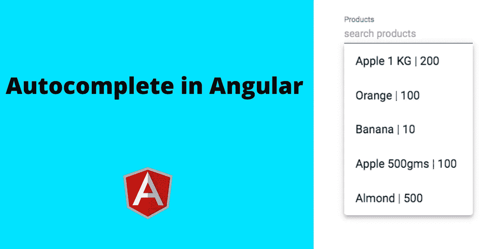
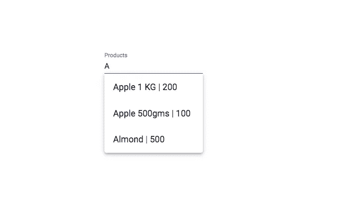

# 使用角度构建自动完成功能

> 原文：<https://javascript.plainenglish.io/autocomplete-in-angular-material-5e4b0125cb44?source=collection_archive---------11----------------------->

## 了解如何使用角度和角度材料创建自动完成功能



**Autocomplete** 让用户在使用应用程序时有更好的用户体验。我们可以很容易地搜索和找到值，而不是键入完整的值。如果我们要开发一个 web 应用程序或移动应用程序，我们在很多地方都需要自动完成功能。例如，在一个计费应用程序中，自动完成功能通过使用产品名称和价格以及少量文本来简化工作。不需要键入完整的产品名称来查找价格和其他值。

在本教程中，我们将看到，如何在 Angular 和 **Angular Material UI 框架**中做**自动完成**。创建 autocomplete 是一个简单的步骤，但是将它集成到 UI 框架中总是一件困难的工作。特别是当您是 Angular 的新手时，那么这篇文章肯定会帮助您在项目中实现自动完成特性。

在本教程中，我们将涵盖以下主题。

1.  创建 REST API
2.  创建表单控件
3.  值更改事件

# **创建 REST API**

假设我们将在用户在自动完成框中键入时显示产品名称和价格。为了显示这些值，我们需要表中的数据，并且必须为表数据创建一个 REST API。

使用下面的产品列表代码在 MySQL 中创建一个表。

在 MySQL 中使用下面的代码在表格中插入一些数据。

现在创建一个 REST API，使用 **Node.js** 在表数据中搜索和过滤产品名称。

如果您使用的是 **PHP** ，那么使用下面的代码来创建 REST API。

现在 REST API 已经准备好了。您可以使用下面的 URL 测试 API。

```
//NodeJS
[http://localhost:3000/search?query=A](http://localhost:3000/search?query=A)//PHP
[http://localhost/demo/search.php?query=A](http://localhost:3000/search?query=A)
```

输出:

# **创建表单控件**

如果您尚未使用以下命令在 Angular 项目中安装 **Angular Material** UI 框架，请安装该框架。

```
ng add @angular/material
```

现在将 **MatAutocompleteModule** 导入到 **app.module.ts** 文件中，并将其包含在 imports 部分。

在 **home.component.ts** 文件中创建表单控件和产品列表变量

1.  表单控件用于检测输入字段中值的变化。
2.  产品列表用于存储搜索结果。

创建一个函数来调用我们的 URL，以获取基于用户输入的值。

# **数值变化事件**

现在从表单控件元素中调用 **valueChanges** ()函数，它将在输入字段值改变时被触发。

我们可以使用上面代码中的**去抖时间**。

去抖时间的目的是，它将在 **500ms** 后向服务器发送请求。如果你没有使用反跳时间，那么它将为每一个输入的改变击中服务器。因此，建议使用去抖时间来减少对服务器的调用次数。

将下面的角度材料自动完成代码放入你的 home.component.html**文件中。**

1.  这里我们使用**【表单控件】**属性集成了表单控件元素。
2.  使用 **mat-option** 标签迭代并显示值。

**输出**:



**完整代码:**

# **结论**

如果我们看看任何主要的应用程序，它们都将使用自动完成功能。自动完成是任何 web 应用程序不可或缺的一部分。在本教程中，我们学习了如何使用 **Angular Material** UI 框架在 **Angular** 项目中集成自动完成功能。创建自动完成是简单的工作，但是集成到一个特定的用户界面中总是困难的工作。

希望这篇文章对你很有帮助。

感谢您阅读这篇文章。

**延伸阅读:**

[](/create-rest-api-using-nodejs-and-mysql-from-scratch-d1844601e21) [## 从头开始使用 NodeJS 和 MySQL 创建 REST API

### 从头开始使用 MySQL 的 CRUD 示例

javascript.plainenglish.io](/create-rest-api-using-nodejs-and-mysql-from-scratch-d1844601e21) [](/implement-jwt-based-authorization-using-nodejs-and-angular-9f75ab5904ac) [## 使用 NodeJS 和 Angular 实现基于 JWT 的授权

### 如何使用 NodeJS，MySQL 创建 JWT 授权的完整示例，并使用 Angular

javascript.plainenglish.io](/implement-jwt-based-authorization-using-nodejs-and-angular-9f75ab5904ac)