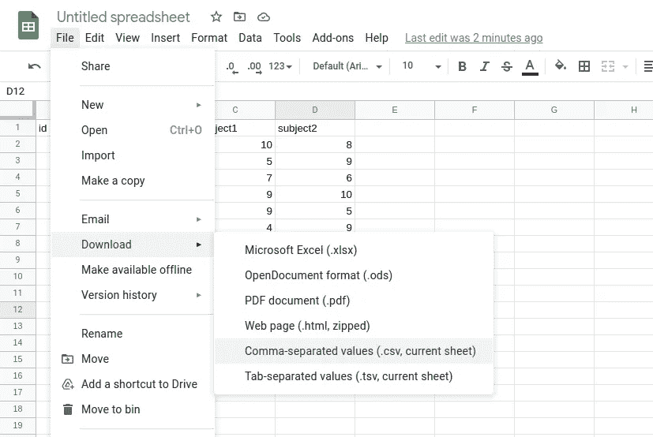
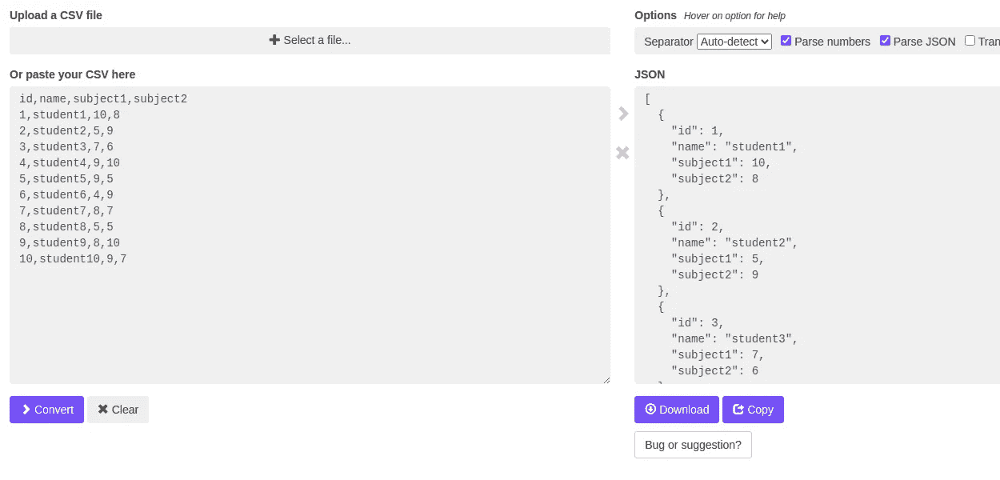
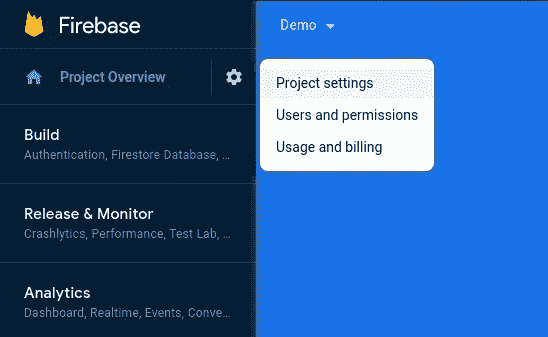
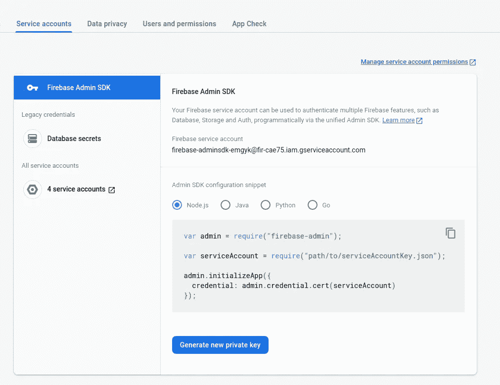
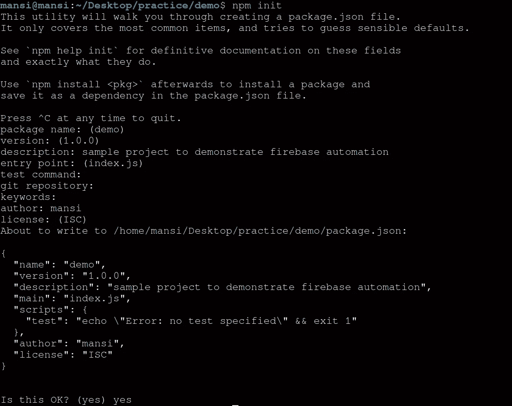
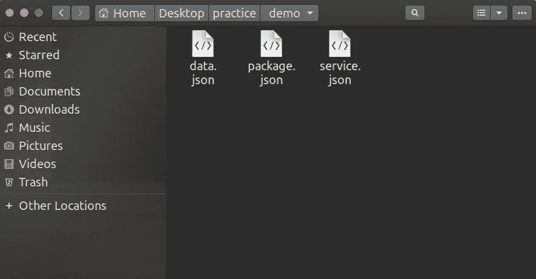
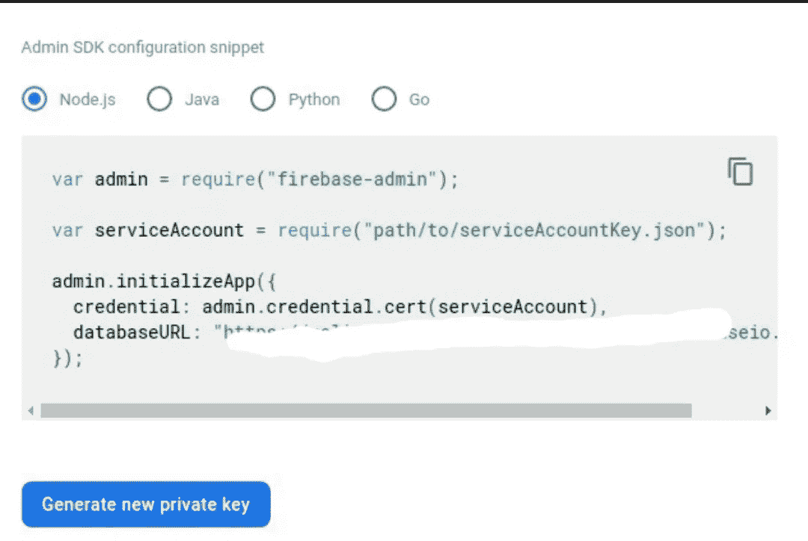
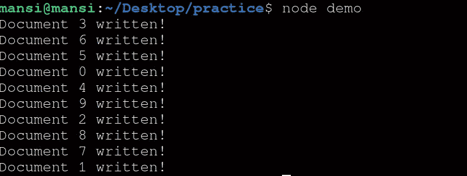
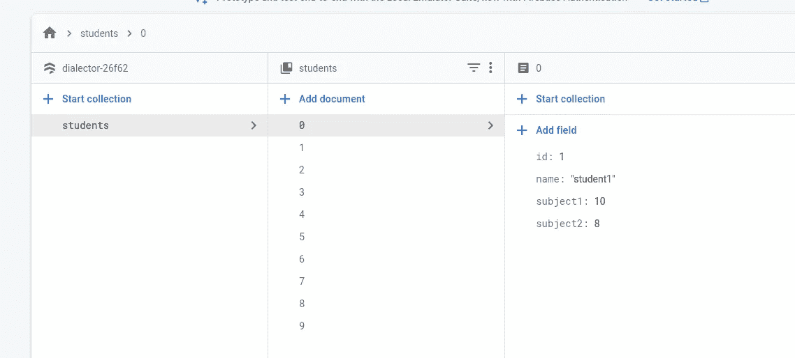

# 自动将数据导入 Firestore

> 原文：<https://javascript.plainenglish.io/automate-importing-data-to-firestore-836b0a2cdcfd?source=collection_archive---------4----------------------->

将你的谷歌表单回复导入 Firebase 数据库有困难吗？或者发现手动上传数据有困难？

让我们用一些代码来自动化这个乏味的任务。

在本文中，我们将使用 Node.js 将 JSON 数据直接导入 Firestore。如果您有其他格式的数据，请不要担心，我们可以很容易地将其转换为 JSON。您将需要 Excel 表格或 CSV 格式的数据。可以下载 CSV 格式的 Excel 表格，如下所示。

要将 CSV 转换成 JSON，我们将使用[这个](https://csvjson.com/csv2json)在线工具。并下载 JSON 文件。

现在让我们在 Firebase 中创建一个新项目，并下载所需的文件。转到 Firebase 控制台，填写所需的项目名称，并创建一个新项目。项目加载后，进入**项目设置**

**项目设置>服务账户>创建服务账户**并生成新的私钥，下载 JSON 文件。

我们已经完成了 Firebase 项目的设置。接下来，确保您系统中安装了节点。

要设置一个新的节点项目，创建新的文件夹并运行`npm init`来初始化你的新 Node.js 项目并填写所需的详细信息，默认情况下保持按“Enter”键。

当这个过程完成时，它将在目录中创建一个 package.json 文件。我们将把 data.json(我们从 CSV 转换成 json 的文件)和 service.json(我们从 Firebase 下载的文件)文件移动到我们的项目目录中。

现在，我们将在项目目录中创建我们的 **index.js** 文件。并在其中编写我们的代码。根据你的项目填写变量。

您可以在服务帐户下的 firebase 项目中找到 databaseURL:

将 index.js 保存在项目目录中，现在我们需要安装 firebase-admin 库。

运行> > **npm 安装**firebase-admin

现在让我们运行我们的代码；)要运行，请移出您的项目目录并

运行> >**节点<目录 _ 名称>**

您的所有数据将在几秒钟内被写入 Firestore 数据库。

## 结论

就是这样！我们枯燥的工作已经自动化，几秒钟就能完成。我希望你已经发现这是有用的。如果是这样，一定要在评论中让我们知道。请继续关注更多有趣的编程内容。

*更多内容看* [***说白了. io***](http://plainenglish.io)