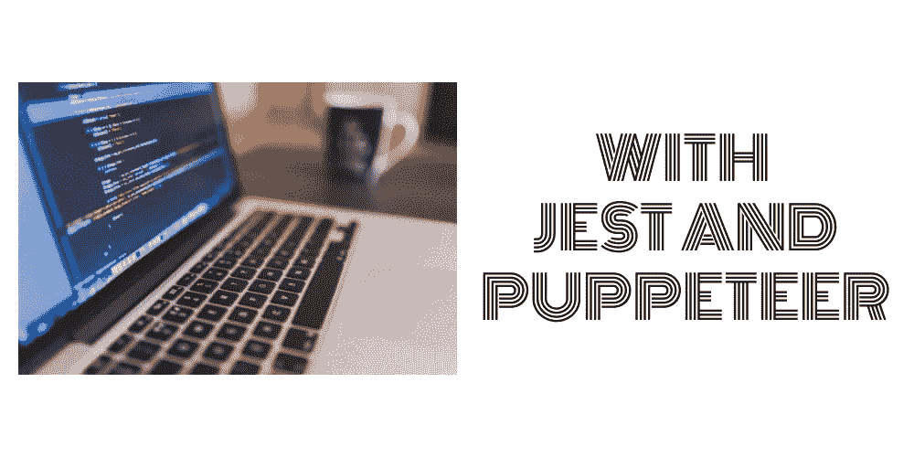
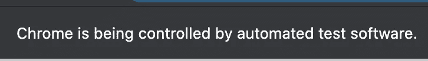
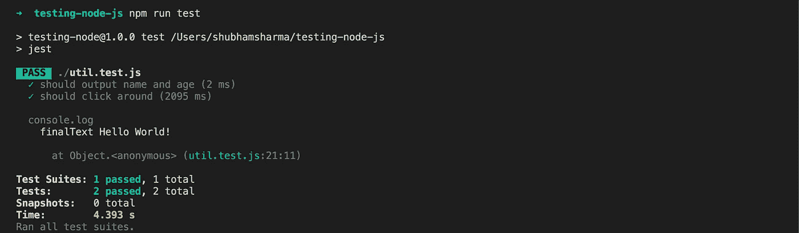

# Node.js 中的自动化测试

> 原文：<https://javascript.plainenglish.io/automated-testing-in-node-js-2aa306d091?source=collection_archive---------16----------------------->

Node.js libraries Jest and Puppeteer

软件开发生命周期的一个非常重要的方面是保证软件的质量。一个人可能会用最优化的算法，全神贯注地写出最好的代码，但他仍然不能对任何软件中的错误免疫。

有两种广泛的测试方法。

第一种方法可以是为所有测试用例手动测试产品中的特性。

另一种方法是编写自动化测试用例。

后一种方法的好处是，当一个人改变代码中的某些东西时，他可以立即运行测试用例，如果新代码破坏了某些东西，就会得到错误，并且他不需要再次手动检查所有的测试用例。它节省时间。

编写自动化测试案例也有助于我们思考可能的问题和边缘案例。因此，用代码编写测试用例被认为是一个好的实践。

Node.js 中的自动化测试可以分为三种类型:

*   **单元测试**:测试一个隔离的功能。
*   **集成测试**:测试一个调用另一个函数的函数。
*   **端到端测试**:以自动化的方式测试可以从浏览器或应用程序的用户界面手动完成的工作。

单元测试是最容易编写的，而且编写得相当广泛。端到端测试很复杂，因此很少编写。综合测试在复杂性和写作频率方面居中。

测试设置可分为三个级别:

*   测试运行程序:执行您的测试并总结您的结果。例如摩卡
*   **断言库:**定义测试逻辑，条件。如柴
*   **无头浏览器:**模拟浏览器交互。例如木偶师

然而，有一个 npm 包执行**测试运行器**以及**断言库**的角色。那个 npm 包是 **jest** 。

使用 package.json 中的上述代码片段将 jest 包含为测试库，并使用**NPM I jest-save-dev**将 jest 添加到开发依赖项列表中

现在，我们可以创建一个以* **.test.js** 结尾的文件，在这个文件中，我们可以定义要对每个想要测试的函数的输出执行的所有测试。让我们分析一下*.test.js 文件中的代码片段。

假设 **getIntroduction** 是一个函数，它返回一个描述特定人年龄的字符串。它有两个参数，第一个是定义人名的字符串，第二个是定义年龄的数字。

**测试**由相同的名称定义。第一个参数是字符串形式的测试用例的名称。第二个参数是一个匿名函数，包含对 getIntroduction 函数结果的断言。 **expect** 是定义断言的关键字。

如果该功能的输出符合预期， **npm 运行测试**将显示通过，如果该功能的输出不符合预期， **npm 运行测试**将显示失败。

**端到端测试:**为了执行端到端 UI 测试，我们将使用名为**木偶师**的 npm 包。安装它非常简单，只需执行
NPM I-保存木偶师

木偶师将帮助我们模拟浏览器，允许我们指定浏览器屏幕的尺寸，允许我们调整在浏览器上执行的动作的速度，允许我们指定是以无头方式还是以完全成熟的方式启动浏览器。

首先，我们用 puppeteer.launch 方法初始化浏览器。它会启动 chromium 浏览器。你可以在 chrome 浏览器的地址栏下方看到这条消息。

在 launch 方法中，我们有一个名为 **headless** 的键，它指定我们是否希望在不打开浏览器窗口的情况下以 headless ie 的形式启动浏览器。 **slowMo** 指定测试的执行速度。较高的数字意味着操作速度，如点击，打字等将会变慢。在**参数中，**用户可以指定将要进行测试的浏览器的窗口大小。

一旦浏览器启动，使用 **browser.newPage()** 打开一个新页面或标签。然后，要指定应该在这个选项卡或页面上打开的 url，可以调用页面的 **goto(url)** 方法。每个函数调用都以 **await** 关键字开始，表示每个浏览器操作本身就是一个异步操作。

接下来是我们指定在 E2E 测试中将被自动化的动作的部分。可以模拟一个点击动作**page . click(' valid html element selector ')**或者模拟通过**page . type(' valid html element selector '，text)** 其中 text 包含我们要填充到文本框中的字符串、input 元素或者任何与我们的 **html 选择器**匹配的可写 html 元素。

因此，wait page . type(' input . input-text '，' Hello World！')会用类**‘input-text’**找到 html **< input >** 元素，并在那里模拟输入字符串‘Hello World’。类似地，await page.click('#search-btn ')将模拟点击 id 为 search-btn 的 html 元素。

现在到了验证我们的自动化操作的输出的部分。要验证它们，可以使用第页的 **$eval** 方法。举个例子，

const finalText = await page。$eval('。输入-文本'，el => el.textContent)

finalText 变量将使用类“input-text”在 html 元素中存储文本值。从 div 中取出文本内容。有时，_value 键用于从 html 元素中提取文本内容。

下一个任务很简单，将这个值传递给 jest 断言，即
expect(finalText)。“你好，世界！”).因此，我们的行动得到了验证

一次成功的测试运行应该是这样的

Command line output for a successful run of test cases

不能低估自动化测试在软件开发生命周期中的作用。人们不应该认为编写测试用例是一项琐碎而平凡的工作，它会延迟产品开发。然而，大多数有经验的开发人员认为，编写包括单元测试和 E2E 测试在内的测试用例不仅可以减少代码中可能出现的错误，还可以减少修复的迭代次数，并随着时间的推移节省开发人员的时间和精力。

总而言之，有三样东西可以让软件没有错误:测试，更多的测试，甚至更多的测试！

*更多内容尽在*[***plain English . io***](http://plainenglish.io)