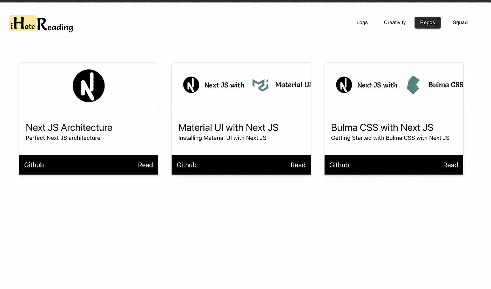

# 如何自动化重复性前端安装过程

> 原文：<https://javascript.plainenglish.io/automating-the-repeated-installation-processes-in-frontend-2a3f694ce76d?source=collection_archive---------14----------------------->

创建一个单一平台来克隆 React 应用程序的所有第三方预安装库及其存储库。



[Screenshot of our website](http://ihatereading.in/repos)

# 在后台

在几篇文章中，我介绍了与 React 相关的样式库。我正在进行为期 100 天的代码挑战。最近，我查看了我的 [**100 天代码库**](https://github.com/shreyvijayvargiya/iHateReadingLogs) 的流量，大部分访客都分叉克隆了我的库[**next . js architecture**](https://github.com/shreyvijayvargiya/iHateReadingLogs/tree/main/TechLogs/NextJSArchitecture)和 [**MaterialUI**](https://github.com/shreyvijayvargiya/iHateReadingLogs/tree/main/TechLogs/MaterialUIInstallationWithNextJS) 很多。

# 入门指南

作为一名作家，对我来说最重要的是用我的知识去帮助他人，从而产生影响。现在我知道，大多数读者在阅读 6-7 分钟的整篇文章时确实会遇到问题，有时他们会急于直接进入代码库。

因此，我决定为我的观众创建一个简单的平台，让他们可以直接下载所需的存储库，而不会浪费任何时间。

# 概观

我们的想法是开发一个简单的平台，让用户在初始设置就绪的情况下访问并下载所有的存储库。

我将在我们的网站( [**iHateReading**](http://ihatereading.in) )上以 **/repos** 的路线发布平台。每个用户都可以访问和下载他们需要的知识库。

这样，我打算用各种可能的方式帮助开发者。

# 入门指南

创建这样一个门户的方法如下:

*   为用户提供一个包含所有必需的存储库列表的页面。
*   每个存储库都应该有一个标题和描述，以及相应存储库的 Github 链接以供下载。
*   用户可以直接访问 Github 存储库，并从门户网站下载。
*   最后，在我们的网站中部署这个页面( [**iHateReading**](http://ihatereading.in) )。

目前，我正在为所有需要的存储库使用硬代码数据。每个数据对象如下图所示。

```
const repos = [
  {
   name: '',
   link: '',
   id: '',
   topic: '',
  }
];
```

最后，我们只需要映射数组的每个对象并显示它。

# 设计

我还为每个存储库设计了一个横幅，让它更吸引人，更容易理解每个存储库的用途。

其中一个创意看起来像下面这个


The banner for Next JS with Material UI

# 最终产品

最终产品会喜欢下面添加的图像，并准备使用。目前，我只添加了 3 个库，我会在未来添加更多的下载和阅读。


Final product look on our Website

您可以在下面的链接中找到最终产品:

```
[https://www.ihatereading.in/repos](https://www.ihatereading.in/repos)
```

# 结论

如果您有任何其他关于更改的要求，或者您想对该产品提出更多改进建议，请告诉我。你可以在评论区回复，也可以直接在 Twitter 或这里给我发 DM。我很想听听你对此的看法和想法。

此外，如果你想作出贡献，然后让我知道。我会将您的存储库添加到您的名下。

```
[https://www.ihatereading.in/repos](https://www.ihatereadin.in/repos)
```

下次见。祝大家愉快！

*更多内容尽在*[*plain English . io*](http://plainenglish.io/)