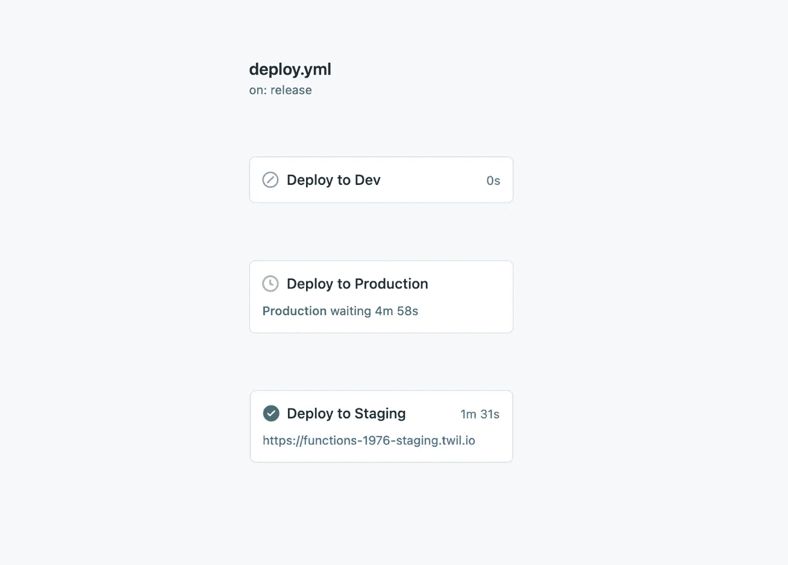

# 使用 Twilio CLI 和 Github 操作自动部署 Twilio 功能

> 原文：<https://javascript.plainenglish.io/automating-twilio-function-deployments-using-the-twilio-cli-and-github-actions-cfbfa9bd2898?source=collection_archive---------12----------------------->

## 如何跳过没完没了的谷歌搜索，直接进入有趣的部分


Photo by [Martin Adams](https://unsplash.com/@martinadams?utm_source=medium&utm_medium=referral) on [Unsplash](https://unsplash.com?utm_source=medium&utm_medium=referral)

很容易被一个伟大的黑客新闻或媒体报道所吸引，并相信前端开发是在公园里散步。事实上，这更像是一场雷雨中的马拉松:迎着风，不停地跑，让人精疲力尽——但最终还是令人满意的。使用 CLI 和 Github 简化 Twilio 函数是这种体验的一个很好的例子，我已经记录了我的学习，以帮助其他人完成这一旅程。

但首先，做个小小的介绍。

## 部署 Twilio 函数

我最近[写了一篇文章](/still-using-twilio-functions-classic-here-are-8-reasons-why-you-should-migrate-to-the-cli-8dcbec8b46a)讲述从 Twilio Functions Classic 迁移到 CLI 的旅程，但是即使你使用最新版本的命令行界面，部署仍然可能不是最佳的。

配置完成后，部署到环境中就像`npm run deploy`一样简单。真的很简单。出现的问题——尤其是在团队中工作时——是知道谁最后部署了什么以及部署到哪里。

```
twilio serverless:deploy --env=./build/.constants.staging --environment=staging --profile=ta-env-staging --override-existing-project
```

当使用非常标准的 Git 工作流时，通常很容易看到发生了什么变化，利用版本控制使我们在 TripActions 的开发过程显著地更加透明。能够发出拉取请求并拥有分支是非常有用的。

但是就其本身而言，Git 不会告诉您每个环境部署了什么。

## 输入 GitHub 操作

[GitHub Actions](https://github.com/features/actions) 在 CI/CD 领域有些新，于 2019 年底推出。现在，你可以利用丰富的应用环境，提供各种各样的功能，从林挺和[测试代码](/making-sonarcloud-play-nicely-with-jest-fa271f559024)、[松弛通知](https://github.com/marketplace/actions/slack-notify)到[去重复本地键值对](https://medium.davidendersby.me/micro-projects-a-fun-alternative-to-soul-sapping-side-projects-4112732caa8)。

默认情况下，GitHub 操作对所有人都是开放的，易于理解，并且有固有的版本控制(在 repo 中，与它们处理的代码在一起)。它们可以根据您的需要而简单或复杂，自动处理需要在评审时发生的平凡任务(尽管我建议保持事情简单，将功能模块化到多个动作中)。利用 [Githubs 事件触发器](https://docs.github.com/en/actions/reference/events-that-trigger-workflows)，动作可以配置为在许多不同的时间运行。最常见的实例是在推送、合并或发布创建时。但如果需要，也可以按计划运行。

## 让 Twilio CLI 与 GitHub 操作一起工作

将所有这些整合在一起并使部署有效是一个棘手的问题。

我们遇到的最大错误与 Twilio 授权和配置文件有关。

```
» Secure credential storage failed to load. Alternatively, twilio-cli can use credentials stored in environment variables:# OPTION 1 (recommended)
export TWILIO_ACCOUNT_SID=your Account SID from twil.io/console
export TWILIO_API_KEY=an API Key created at twil.io/get-api-key
export TWILIO_API_SECRET=the secret for the API Key# OPTION 2
export TWILIO_ACCOUNT_SID=your Account SID from twil.io/console
export TWILIO_AUTH_TOKEN=your Auth Token from twil.io/consoleOnce these environment variables are set, a twilio-cli profile is not required and you may skip the "login" step. » The profile "ta-env-staging" does not exist. Run "twilio profiles:list" to see the list of configured profiles.
```

这是因为我们试图模拟本地部署，这需要使用`twilio login`和`twilio profiles`命令(`create`、`list`、`use`)登录。等等)。我们花了太长时间才意识到我们不需要这样做——你可以使用环境变量来处理凭证(见下文)。

上面的代码片段显示了我们的 3 步发布过程。首先，当一个分支与主/主合并时，我们将它部署到开发环境中。当我们准备好部署到生产时，我们在 Github 中创建一个发布，它触发部署到 staging。现在我们有机会运行集成和 API 测试——我们将 [Github 环境](https://docs.github.com/en/actions/reference/environments)配置为在部署到生产之前暂停等待批准。一旦获得批准，发布就被部署到生产中。



The deploy pipeline in action. It deploys to staging then waits for permission to deploy to Production. Here we also added a 5 minute cooldown timer.

现在，释放过程非常简单，可以由任何访问回购的开发人员触发。我们保留了对发布到产品中的内容的控制，我们现在在 Github 中有日志，向我们显示谁触发了部署、何时触发的以及部署了什么。

我希望你觉得这很有用

感谢阅读

大卫

高级前端开发者@ [TripActions](https://tripactions.com/) (通常是[招聘](https://grnh.se/cbeb241d1)！)

*更多内容请看*[***plain English . io***](http://plainenglish.io/)