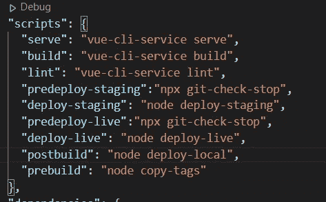
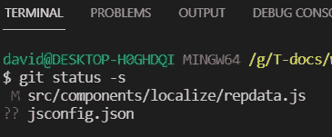
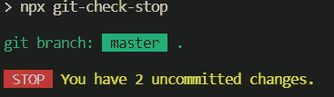
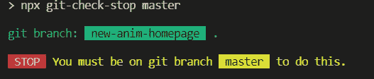

# 使用 Git 和 Node 部署网站时避免可怕的错误

> 原文：<https://javascript.plainenglish.io/avoid-terrible-mistakes-when-deploying-websites-with-git-and-node-e80a6e0a3e28?source=collection_archive---------16----------------------->

我们都会犯错。一些简单的安全措施可以带来很大的不同。

TLDR:在你的项目中安装 [git-check-stop](https://www.npmjs.com/package/git-check-stop) 作为开发资源，这样你就不会再犯令人尴尬的构建或部署错误了。



What if I type npm run deploy-live by mistake?

我敢肯定，你和我一样，从来没有打过字

```
npm run deploy-live
```

当你的意思是

```
npm run deploy-staging
```

我知道。谁会犯这样的错误？不是我们。

嗯，以防万一有人过来在我们的电脑上打字，让我们采取一些安全措施。

如果您使用 git，有大量的节点包可以帮助我们与它集成。当我在寻找一种方法来阻止自己犯下让自己后悔的错误时，我找到了两个方法:

# git-状态

这个[包](https://www.npmjs.com/package/git-status)非常有用，因为它给你的信息与你输入:

```
git status -s
```

在你的终端里。输出如下所示:



One file modified. One not added.

[**git-status**](https://www.npmjs.com/package/git-status) 使用[**parse-git-status**](https://www.npmjs.com/package/parse-git-status)将结果作为一个 JavaScript 对象传递给我们，如下所示:

```
{
  x: 'A', // status code character
  y: 'A', // status code character
  to: 'bar.js', // the destination path
  from: 'foo.js', // the source path if a rename (null otherwise)
}
```

出于我们的目的，我们并不真正关心返回状态的内容是什么:我们只知道如果有不止一个修改的对象，那么我们有未提交的更改。所以我们可以这样写代码:

```
const gitStatus = require('git-status')gitStatus((err, data) => {
  if(err) {
    console.log('git error', err)
    process.exit(1)
  }
  if(data.length > 0) {
    console.log('STOP You have ' + data.length + ' uncommitted     changes.'))
    process.exit(1)
  }
  console.log('OK git all up to date.')
})
```

还有一件事让我担心:如果所有的事情都提交了，但是我在一个实验性的分支上工作，然后我将我的代码部署到实时服务器而不是一个临时站点，那该怎么办？这也可能是一场灾难。这就是为什么我们还需要:

# git-branch

你可以在 npm 上的这里找到 [git-branch。这个实现了承诺，所以比 git-status 更容易处理。为了搞清楚自己在哪个分支上，就装然后；](https://www.npmjs.com/package/git-branch)

```
const branch = require('git-branch')branch().then((name) => {
  console.log('You are on branch', name)
})
```

有了这两个包，我很快就能构建一个命令行应用程序，可以使用 npm 的 **pre** 脚本运行。你可以在这里看到我在 [GitHub 上整理的代码，在一个名为](https://github.com/davidmold/git-check-stop)[**git-check-stop**](https://www.npmjs.com/package/git-check-stop)的项目中。

# git-检查-停止

你可以很容易地安装它，只需运行

```
npm install -D git-check-stop
```

D 是因为您可能只是希望它作为开发依赖项，而不是生产构建的一部分。安装后，您可以在自己的项目中使用它，为您的所有敏感操作添加 **pre** 脚本，这样它们会在允许您构建或部署之前测试您的 git 状态。例如，下面是来自 Vue 项目的 package.json:

```
...
"scripts": {
  "serve": "vue-cli-service serve",
  "build": "vue-cli-service build",
  "lint": "vue-cli-service lint",
  "predeploy-staging":"npx git-check-stop",
  "deploy-staging": "node deploy-staging",
  "predeploy-live":"npx git-check-stop master",
  "deploy-live": "node deploy-live"
}
...
```

Npm 将在运行任何具有相同名称但前缀为“pre”的脚本之前运行该脚本。这保证了如果您运行 **deploy-staging** ，first git-check-stop 将确保您已经提交了对 git 存储库的所有更改。

用这一行:

```
"predeploy-live":"npx git-check-stop master",
```

我们确保我们所有的文件都被检入，并且我们在主分支上——只是为了确保我们不会意外地从不同的分支上传任何实验代码(当然，我们不会做这样的事情)。您可以在这里使用任何名称，以确保如果您在指定的分支上，部署将*仅*运行。

如果您尝试运行 deploy，并且有未提交的更改，您将在控制台中看到如下消息:



Oops

如果您在一个实验分支上尝试将部署到 live，您将看到如下消息:



Not that we would ever do this, of course.

我希望你觉得这是有用的。毫无疑问，这个工具可以被扩展以使编码更加安全，但是现在，它已经把我从相当多的尴尬时刻中拯救出来，我希望它也能为你做同样的事情。编码快乐！

*更多内容请看*[*plain English . io*](http://plainenglish.io/)