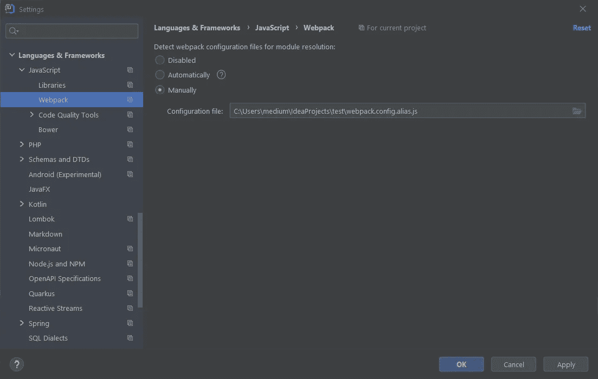

# 避免对 React 中绝对导入的重构的恐惧

> 原文：<https://javascript.plainenglish.io/avoid-the-fear-of-refactoring-with-absolute-imports-in-react-804bce61dc31?source=collection_archive---------1----------------------->

## 在 React 中使用绝对路径别名使导入易于重构


Photo by [Goran Ivos](https://unsplash.com/@goran_ivos?utm_source=unsplash&utm_medium=referral&utm_content=creditCopyText) on [Unsplash](https://unsplash.com/?utm_source=unsplash&utm_medium=referral&utm_content=creditCopyText)

当我在 [React](https://reactjs.org/) 开始开发时，我注意到重构是多么容易变成痛苦的经历。根据我的专业知识，**这可以打破你的大部分进口**。

如果你曾经害怕重构，那么这篇教程就是为你准备的。不要惊慌，因为有解决办法！

在本教程中，我将向您展示如何通过使用别名使您的`[import](https://reactjs.org/docs/code-splitting.html)` [语句](https://reactjs.org/docs/code-splitting.html)更容易重构，如下所示:

Before

After

正如您所看到的，建议的解决方案使您的进口看起来更干净，不是吗？多么大的副作用啊！

让我们看看如何在 [webpack](https://webpack.js.org/) 中导入带有绝对路径别名的模块、 [API 定义](https://codeburst.io/avoiding-code-duplication-by-adding-an-api-requests-definition-layer-in-javascript-6e5d7b409896)、实用程序、组件或资产，并做出反应。

[](https://codeburst.io/avoiding-code-duplication-by-adding-an-api-requests-definition-layer-in-javascript-6e5d7b409896) [## 通过在 JavaScript 中添加 API 层来避免代码重复

### 使用基于 Promise 的 HTTP 客户端构建 API 层

codeburst.io](https://codeburst.io/avoiding-code-duplication-by-adding-an-api-requests-definition-layer-in-javascript-6e5d7b409896) 

# 相对进口与绝对进口

默认情况下，*相对路径*是 React 中支持的导入文件的方式。它们被称为*相对*，因为它们使用相对于当前文件的路径。

对于小型项目，它们是一个很好的解决方案。另一方面，当涉及到大型项目时，处理*相对进口*可能会变成一场噩梦。事实上，在一个层次很深的目录结构中，您可能会得到如下所示的相对导入:

```
import UserCard from '../../../components/UserCard';
```

不仅这看起来不太好，而且相关进口还受到以下问题的影响:

*   它们使得你的代码库很难重构
*   它们无法扩展到您的项目规模
*   他们从你的代码库中创建一个 npm 模块

这就是你应该谨慎使用它们的原因。理想情况下，只有当您拥有可以被视为同一个更大模块的一部分的密切相关的文件时。在任何其他情况下， ***绝对进口*应该代表你首选的方法**。它们被称为*绝对*，因为它们允许你从绝对路径导入文件，与当前文件无关。多亏了他们，你可以把前面的例子变成这样:

```
import UserCard from '@components/UserCard';
```

更好，对吗？我们来看看如何达到这样的结果。

# 在 webpack 中定义绝对路径别名

首先，你需要将`[react-app-rewired](https://www.npmjs.com/package/react-app-rewired)`和`[react-app-rewire-alias](https://www.npmjs.com/package/react-app-rewire-alias)`添加到你的项目的依赖项中。您可以使用以下命令安装这两者:

```
npm install react-app-rewired react-app-rewire-alias --save
```

要使绝对导入生效，您必须更改您的 [webpack 配置](https://webpack.js.org/configuration/)。如果你用`[create-react-app](https://reactjs.org/docs/create-a-new-react-app.html),`创建了你的应用，你可能会被迫[退出你的项目](https://create-react-app.dev/docs/available-scripts/#npm-run-eject)——如果没有严格的要求，这应该避免。

这就是`react-app-rewired`发挥作用的地方！

请注意，如果你的项目已经使用了`react-app-rewired`，你可以跳过下面两个步骤。

有了它，您可以轻松地调整`create-react-app` webpack 配置。为了让一切正常工作，您需要遵循以下两个步骤:

1.  在根目录下创建一个有效的`config-overrides.js`文件
2.  在您的 *package.json* 文件的`scripts`部分中，将现有的引用从`react-scripts`更改为`react-app-rewired`

Before

After

您刚刚重新连接了 React 应用程序，现在可以声明您的第一个绝对路径别名了。将以下几行添加到您的 *config-overrides.js* 文件中:

首先，你需要从`react-app-rewire-alias`导入`alias`。然后，您可以通过传递带有键值对的对象来调用它。键代表您的别名，值代表相应的路径。

瞧啊！现在，您可以使用上面定义的三个别名来导入位于这些文件夹中的文件，如下所示:

此外，`react-app-rewired`还能让你实现其他不可思议的目标。例如，[为每个环境保留一个专用的构建文件夹](https://betterprogramming.pub/how-to-correctly-build-a-multi-environment-react-app-6ba4878e98ba)。

[](https://betterprogramming.pub/how-to-correctly-build-a-multi-environment-react-app-6ba4878e98ba) [## 如何正确构建多环境 React App

### 为每个环境保留一个专用的构建文件夹

better 编程. pub](https://betterprogramming.pub/how-to-correctly-build-a-multi-environment-react-app-6ba4878e98ba) 

# 好处:设置您的 IDE 来处理绝对路径

为了让你的 IDE 能够理解绝对路径，你需要做一些额外的操作。

## 智能理念

在根文件夹中创建一个`webpack.config.alias.js`文件，定义如下:

然后，*文件>设置… >语言&框架> JavaScript > Webpack* 。手动选择*选项并选择上面定义的文件。*



## Visual Studio 代码

创建一个`jsconfig.js`,并在其中添加以下几行:

# 结论

这里我们看了如何在 React 中使用绝对路径别名。它们是避免重构恐惧的好方法，因为与相对导入相比，它们不会导致中断导入。这就是为什么你应该总是使用它们，这可以很容易地实现，如本文所示。

感谢阅读！我希望这篇文章对你有所帮助。如果有任何问题、意见或建议，请随时联系我。

*更多内容请看*[*plain English . io*](http://plainenglish.io/)