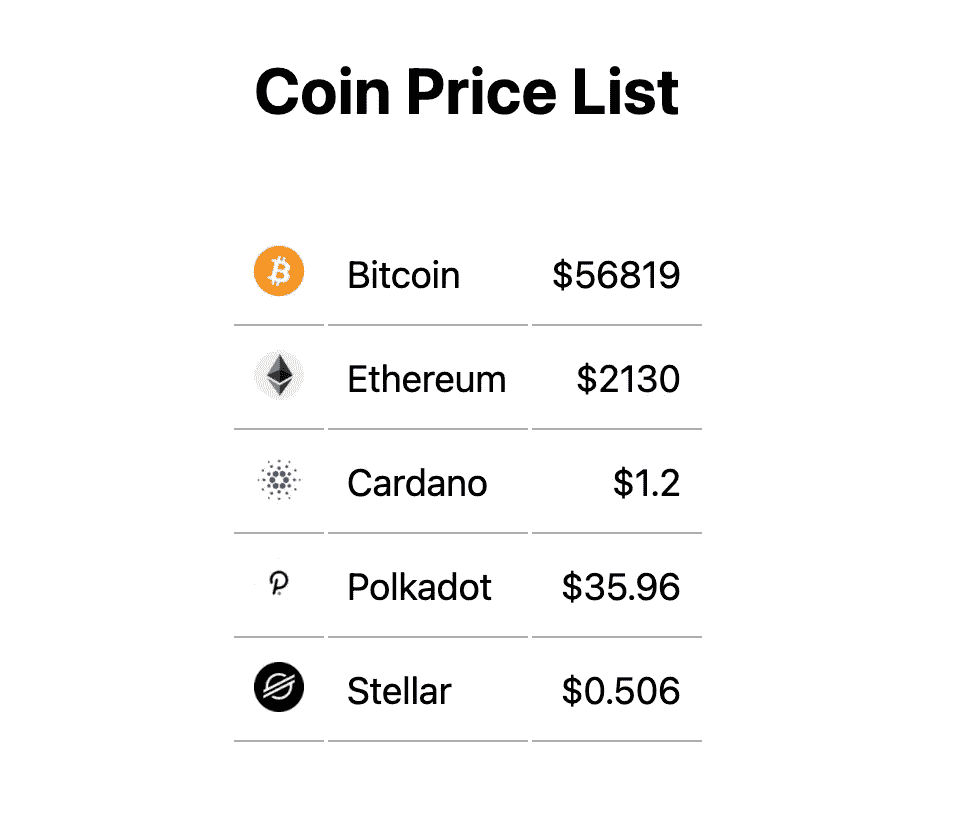

# Backendless Coin 价目表，包含 GraphQL API、无服务器 Redis 和 Next。射流研究…

> 原文：<https://javascript.plainenglish.io/backendless-coin-price-list-with-graphql-api-serverless-redis-and-next-js-528c8511a5cb?source=collection_archive---------23----------------------->

在本教程中，我们将使用 Upstash 的 GraphQL API 开发一个简单的硬币价格表。您可以调用应用程序`backendless`，因为我们将直接从客户端访问数据库(JavaScript)。参见[代码](https://github.com/upstash/examples/tree/master/coin-price-list)。



# 动机

我们想给出一个用例，在这个用例中，您可以使用 GraphQL API，而无需任何后端代码。用例是公开可用的只读数据，用于需要低延迟的 web 应用程序。数据被另一个后端应用程序频繁更新，您希望您的用户看到最后更新的数据。示例:排行榜、新闻列表、博客列表、产品列表、主页中的前 N 项。

# 1.项目设置

创建下一个应用:`npx create-next-app`。

安装 Apollo GraphQL 客户端:`npm i @apollo/client`

# 2.数据库设置

如果您没有数据库，请按照本[指南](https://docs.upstash.com/)创建一个数据库。通过 Redis CLI 连接您的数据库，并运行:

```
rpush coins '{ "name" : "Bitcoin", "price": 56819, "image": "https://s2.coinmarketcap.com/static/img/coins/64x64/1.png"}' '{ "name" : "Ethereum", "price": 2130, "image": "https://s2.coinmarketcap.com/static/img/coins/64x64/1027.png"}' '{ "name" : "Cardano", "price": 1.2, "image": "https://s2.coinmarketcap.com/static/img/coins/64x64/2010.png"}' '{ "name" : "Polkadot", "price": 35.96, "image": "https://s2.coinmarketcap.com/static/img/coins/64x64/6636.png"}' '{ "name" : "Stellar", "price": 0.506, "image": "https://s2.coinmarketcap.com/static/img/coins/64x64/512.png"}'
```

# 3.密码

在 Upstash 控制台中，复制 API 配置页面中的只读访问键(GraphQL Explorer > Configure API)。在`_app.js`中，创建 Apollo 客户端并替换您的访问密钥，如下所示:

***注意:*** *你需要使用只读访问密钥，因为这个密钥是可以公开访问的。*

编辑`index.js`如下:

# 4.奔跑

在本地运行您的应用:`npm run dev`

# 5.活着

转到 [http://localhost:3000/](http://localhost:3000/) 🎉

就是这样！你可以走了！

*原载于 https://docs.upstash.com*[](https://docs.upstash.com/tutorials/coin_price_list)**。**