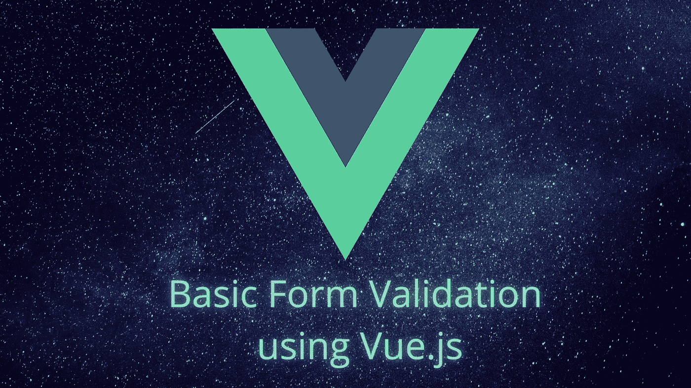
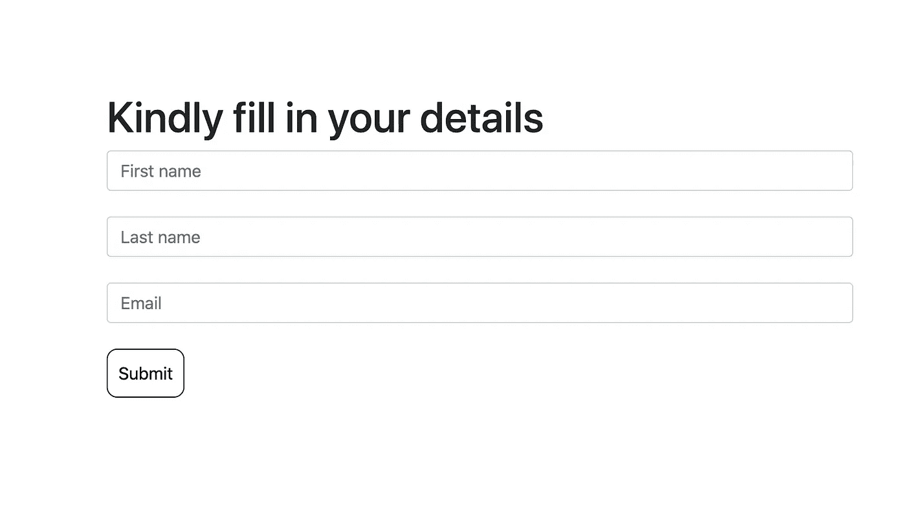
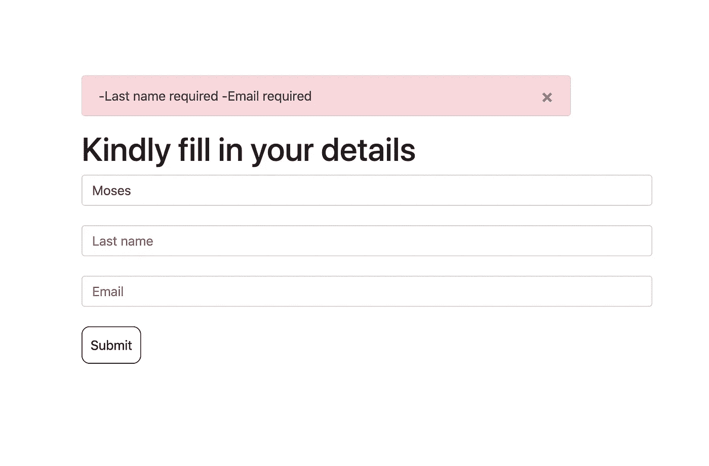
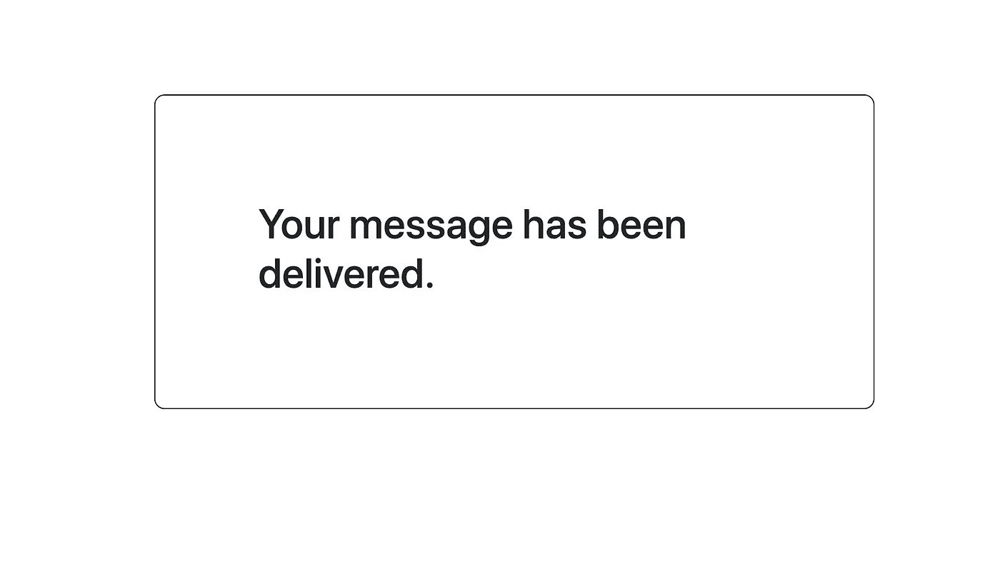

# 使用 Vue.js 的基本表单验证:简单指南

> 原文：<https://javascript.plainenglish.io/basic-form-validation-using-vuejs-ad9489628617?source=collection_archive---------2----------------------->



当开发需要用户填写表单的 web 应用程序时，在提交之前对输入的数据进行验证是非常重要的。这有助于确保以正确的格式接收所需的数据。

表单验证可以在前端和后端执行。虽然在大多数情况下，基本的表单验证，如“确保所有字段都作为输入输入”只能在前端完成。

前端验证的主要好处是给用户输入数据的即时反馈。

在本文中，我将解释如何使用 **Vue.js** 在前端执行基本的表单验证。

我将创建一个简单的网页形式的 3 个领域:“名”，“姓”和“电子邮件”。我将为我的输入字段使用 Bootstrap。



```
<template><div><div class="main"><h1>Kindly fill in your details</h1><b-form-input v-model="firstName" placeholder="First name" class="input">
</b-form-input><b-form-input v-model="lastName" placeholder="Last name" class="input">
</b-form-input><b-form-input v-model="email" placeholder="Email" class="input">
</b-form-input><button class="btn1" @click="submit()">Submit</button></div></div></template>
```

对于数据，“错误”数组是存储错误的地方。而“名字”、“姓氏”和“电子邮件”将从输入数据中接收。

```
<script>export default {name: "",data() { return { errors: [], firstName: '', lastName: '', email: '',}}}};</script>
```

# 验证步骤

## 对于基本表单验证，有 3 个重要步骤，即:

*   获取错误。
*   循环错误并显示它们。
*   成功逻辑。

## 1.获取错误

这是非常重要的一步。在“错误”数组中，您将希望在错误出现时存储它们。

这将在用户单击提交按钮时实现。因此，我将创建一个名为“submit”的方法来检查用户是否输入了一个值。如果特定字段中没有输入值，指定的错误消息将被推入 errors 数组。

```
methods: {submit(){// form validationthis.errors = [];if (!this.firstName) {this.errors.push('First name required');}if (!this.lastName) {this.errors.push('Last name required');}if (!this.email) {this.errors.push('Email required');}}
}
```

## 2.循环错误并显示它们

我使用了一个“引导警报”占位符，该占位符仅在出现错误时显示。如果可能的话，通过循环检查并显示数组中的每个错误。

```
<b-alert show dismissible variant="danger" v-if="errors.length > 0"> <span v-for="error in errors" :key="error"> {{error}}, </span></b-alert>
```



## 3.成功逻辑

所以最后，当所有的条件都满足时(所有的字段都填好了)，你希望发生什么？在大多数情况下，这是数据库逻辑发挥作用的地方。

但是为了本文的简单，我将只向用户显示一条成功消息，使用 V-if 属性来改变显示。

```
if (this.firstName && this.lastName && this.email ) {// hidding the form 
 this.showMain = false;// showing the success message
 this.showSuc = true}
```

*改变显示给用户的内容:*

```
<div class="main" v-if="showMain">// the form</div><div class="succcess" v-if="showSuc">//success message</div>
```



所以你有它！在前端执行表单验证不是什么大问题。希望这篇文章有所帮助，谢谢。

*更多内容尽在*[***plain English . io***](http://plainenglish.io/)