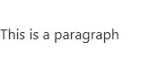
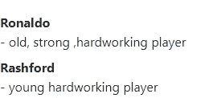

# 基本 HTML 和 HTML 5 简介

> 原文：<https://javascript.plainenglish.io/basic-html-and-html-5-8ab1246106ea?source=collection_archive---------9----------------------->


Photo by [Florian Olivo](https://unsplash.com/@florianolv?utm_source=medium&utm_medium=referral) on [Unsplash](https://unsplash.com?utm_source=medium&utm_medium=referral)

# 基本 HTML

HTML 是指超文本标记语言，是一种处理网页结构网络语言。HTML 有自己的元素作为自己的结构。

HTML 元素有一个开始标签和一个结束标签。

```
**<h1> content </h1>**
```

一个**开始标记**有两个括号，里面刻的是元素名。**开始标记**和**结束标记**的区别在于结束标记的开始括号后的*。*

*所有网页都有不同的**标题**和**副标题**。这可以通过简单地在你的网页上编写你的 **h1-h6** 元素来实现。 ***h1*** 最大 ***h6*** 最小。您可以按照您希望标题在网页上显示的方式来使用这些元素。*

**

*h1-h6*

*段落元素(<p>/p>)用来写你的段落。文本以较小的宽度显示，其显示方式与标题元素不同。*

**

*a paragraph*

*注释是一个 HTML 方面，用来记录你的网页，使其可读。它还用于移除元素，而不是实际删除它们。它是这样写的:*

***！- —要删除的元素— >***

**

*The elements will be removed and the page becomes blank*

**

*You can simply read your code with the comment*

# *HTML 5*

*HTML5 是 HTML 的更高级版本，它引入了更具描述性的 HTML 标签。这些包括**主页、页眉、页脚、导航、视频、文章、章节、**和其他。*

*更多的 ***HTML5*** 元素包括: **< img >** 元素，用来给你的网页添加图片。它图像有一个属性 ***src*** 用来指定图像位置。它还有一个 alt 属性，用来给图像命名。如果图像无法加载(丢失或服务器坏了)，alt 中的任何内容都会显示出来。因此，要在网页上放置图像，请使用以下语法:*

```
*****.*
```

****Img 元素没有结束标记。****

**

*syntax*

**

*output*

*图像的**宽度**和**高度**可以稍后设置。我们将在 **CSS** 部分看到这一点*

****锚元素(< a > )*** 用来链接你的网页中的外部页面和内部章节。anchor 元素具有 href，用于指定要链接的外部页面的链接。*

*如果希望链接一个内部部分，那么将一个散列(#)和部分 id 一起放入 href 中。它用在以下语法中:*

```
***<a href:”https:….”> click </a>***
```

*锚元素有一个结束标记。*

*在 **HTML 中有三种**类型的列表。这些是:*

*   *无序列表*
*   *有序列表*
*   *描述列表*

***一个无序列表**以 *< ul >* 标签开始。每个列表项都以 *<李>* 标签开始。ul 和 li 标签都有结束标签*

*默认情况下，列表项将用项目符号(黑色小圆圈)标记。这是语法:*

**

*input*

**

*output*

***有序列表**是用 **< ol >** 标签表示的。就像无序列表一样，每个列表都以 *<李>标签开始。他们也有结束标签。**

*默认情况下，列表项将标有数字。语法和输出如下:*

**

*Syntax*

**

*output*

***描述列表**是术语列表，每个术语都有描述。描述列表以 *< dl >* 标签开始定义描述列表， *< dt >* 标签定义术语(名称)， *< dd >* 标签描述每个术语。每一个都有一个结束标签。该语法如下:*

**

*Input*

**

*Output*

*元素的作用是:使用 HTML 创建一个表单。它有许多子元素，包括用于创建输入字段的 input *< input >标签，用于命名输入字段的 label<label></label>，用于基本选择的<select></select>等。**

*每个元素都有 **type=" "** ，它包含在开始标记中，用于指定它们将呈现的函数类型。*

*input 元素有许多类型名称，其中包括**type = " text "-对于文本，type="password"-对于密码输入，type = " email 对于电子邮件，type="radio"-对于单选按钮，type="checkboxes "对于复选框，type="submit"-对于提交按钮。***

*以上是常用的基本输入类型，[详见 **HTML**](https://www.w3schools.com/html/html_forms.asp) **表单。***

*这里有一个表单，供您学习表单元素及其子元素。*

**

*input*

*您可以使用 ***单选按钮*** *来回答您希望用户从多个选项中只给出一个答案的问题，而* ***复选框*** *用于回答您希望得到多个答案的问题。**

**

*ouput*

*[在此了解更多关于基本 HTML 和 HTML5 的信息](https://www.w3schools.com/html/)*

*感谢阅读。*

*请随时在以下社交媒体上联系我: [Twitter、](https://twitter.com/devtoheeb)、 [Instagram](https://www.instagram.com/muh_toyyib_0/) 或 [WhatsApp](https://wa.me/message/BUW6NXAJ2A3HA1) 。*

**更多内容请看*[*plain English . io*](http://plainenglish.io/)*。报名参加我们的* [*免费周报*](http://newsletter.plainenglish.io/) *。在我们的* [*社区*](https://discord.gg/GtDtUAvyhW) *获得独家的写作机会和建议。**