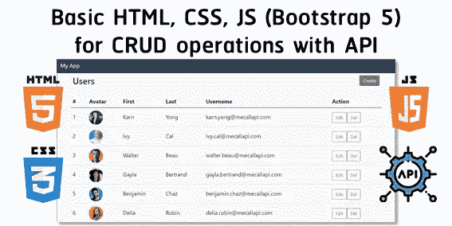
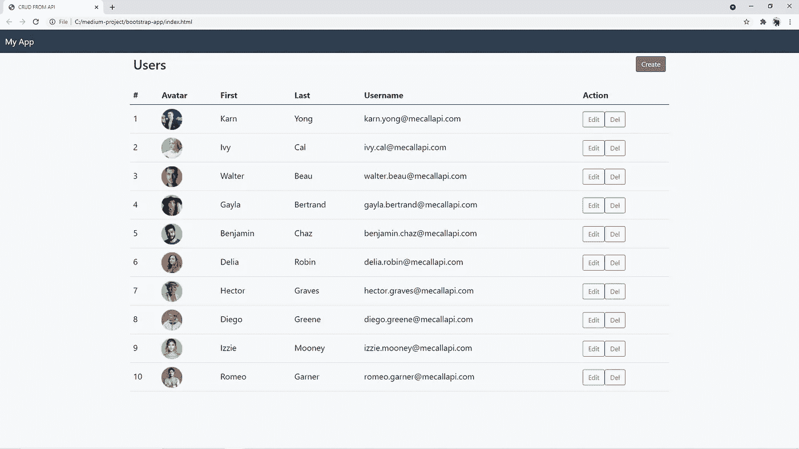
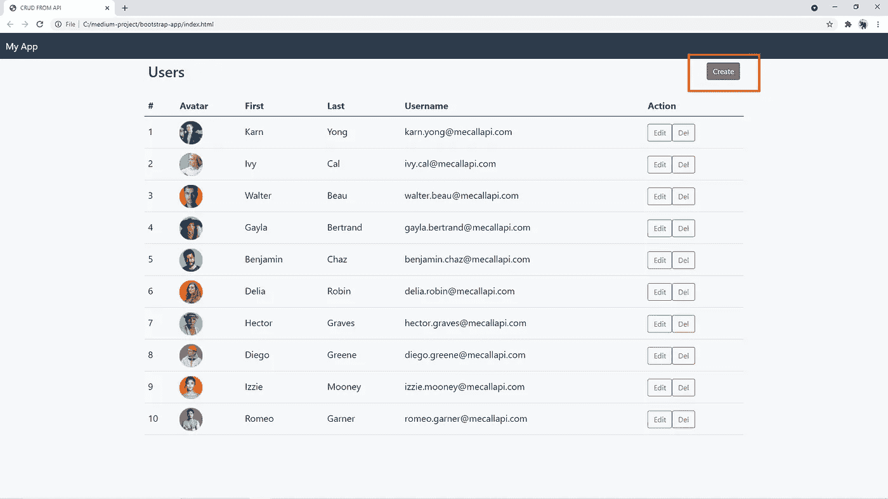
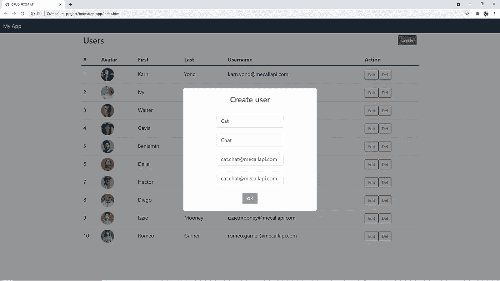
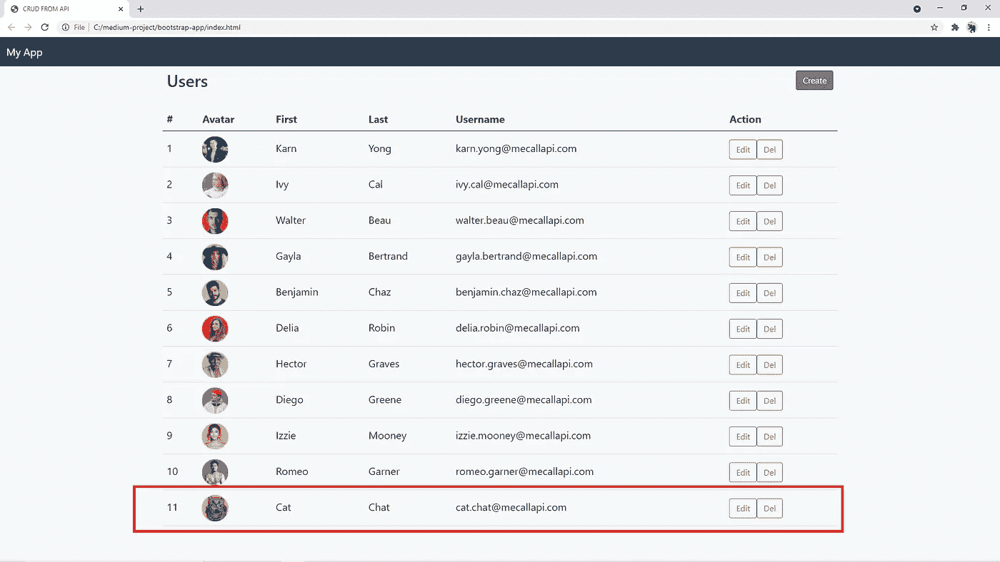
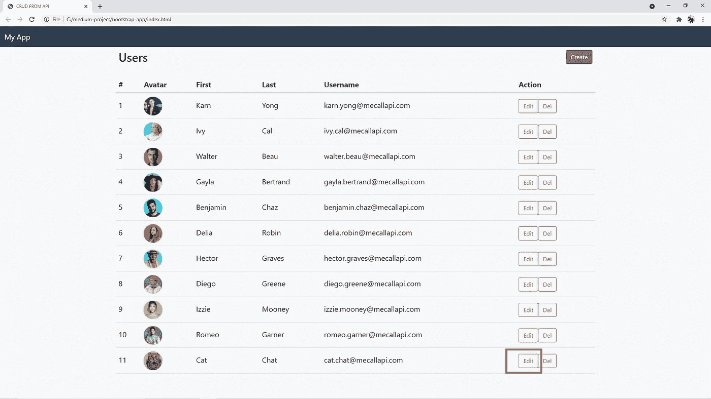
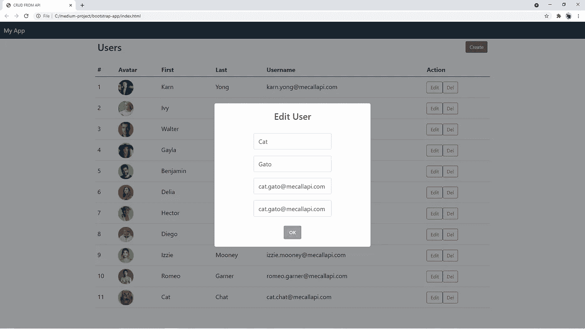
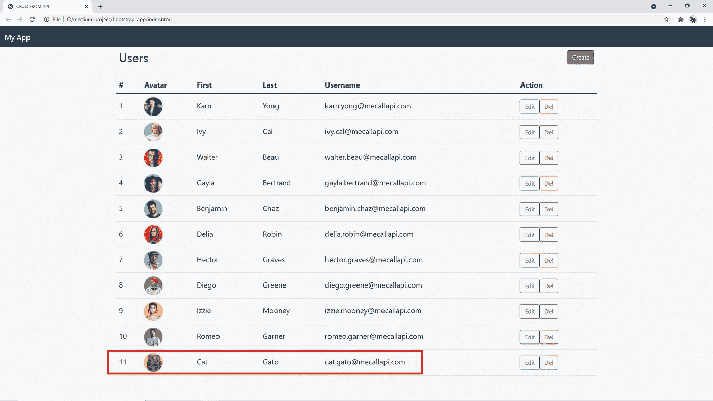
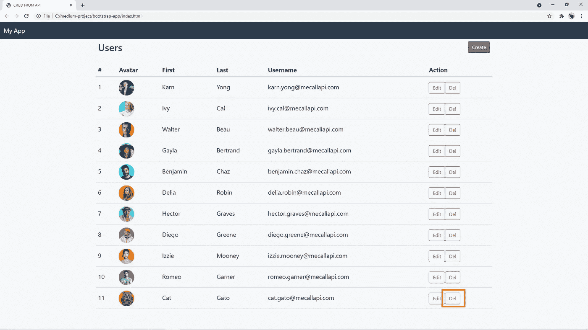
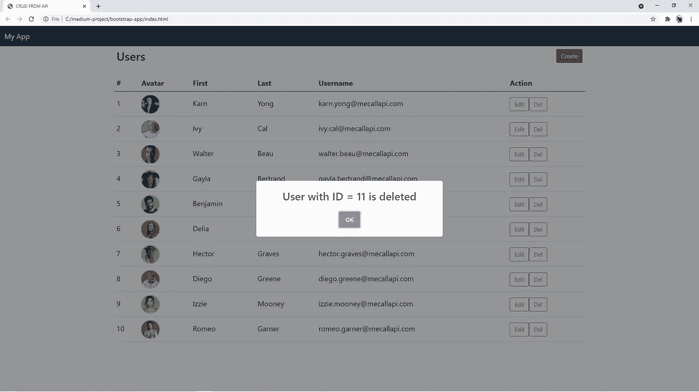

# 让我们用 HTML，CSS，JavaScript 和一个外部 API 建立一个 CRUD 网站

> 原文：<https://javascript.plainenglish.io/basic-html-css-javascript-bootstrap-5-using-external-api-for-crud-operations-1a7349ab95b2?source=collection_archive---------0----------------------->



在本文中，我们将为您提供一个创建 web 应用程序的教程，该应用程序仅使用基本的 **HTML** 、 **CSS** 和 **JavaScript** (基于 **Bootstrap 5** )来执行 **CRUD** 操作。嗯， **CRUD** 操作是操纵数据的四种基本操作，包括**C**reate/**C**construct、 **R** ead、 **U** pdate、 **D** elete。此外，我们的 **CRUD** 操作将通过使用来自[MeCallAPI.com](https://www.mecallapi.com/)的外部 **API** 来执行。如果您想尝试一个用于 CRUD 和身份验证操作的模拟 API，请在网站上随意查看。


[https://www.mecallapi.com/](https://www.mecallapi.com/)

你也可以在这里查看我们在这篇文章中想要实现的一个例子:[https://www.mecallapi.com/crud/](https://www.mecallapi.com/crud/)


[https://www.mecallapi.com/crud/](https://www.mecallapi.com/crud/)

# 软件安装

你只需要一个文本编辑器/IDE(而不是代码、记事本等)。)和一个网页浏览器(Chrome、Firefox、Edge 等。)来做这个教程！

# 我们来编码吧！(HTML 和 CSS)

盯着 HTML，它是设计用来在网络浏览器中显示的文档。有一百多种 HTML 元素可供你选择放在你的 HTML 文件中，让奇迹发生。

用以下链接创建**index.html**:

*   [**Bootstrap 5**](https://getbootstrap.com/docs/5.0/getting-started/introduction/) 框架让你的生活更轻松创建一个响应式 web(第 9 行和第 54 行)
*   [**sweet alert**](https://sweetalert2.github.io/)**用于使用 JavaScript 轻松创建漂亮的弹出窗口(第 53 行)**
*   **用于定义额外 CSS (级联样式表)的 **index.css** 来样式化你的**index.html**另外从引导程序(第 13 行)**
*   ****index.js** 用于 JavaScript 在**index.html**中调用 **API** 进行 **CRUD** 操作(第 52 行)**

**创建 **index.css** 来为你的**index.html**定义额外的 css (层叠样式表)除了来自 Bootstrap 提供的 CSS。**

# **读取操作(JavaScript)**

**创建文件 **index.js** 来调用一个 **API** 用于从 **R** ead 开始的 **CRUD** 操作。
API URL:[https://www.mecallapi.com/api/users](https://www.mecallapi.com/api/users)方法:GET**

**为了用 JavaScript 读取数据，我们将使用 AJAX(**A**synchronous**J**avaScript**A**nd**X**ML)技术让我们的网站异步更新。具体来说，我们将在后台使用 API 进行数据交换。因此，数据被检索，我们将有我们的网页更新，而不做刷新。**

**我们将使用 **XMLHttpRequest** 调用一个 API 来检索 JSON 中的数据，并在网页上显示/更新这些数据。为了更新网页上的数据，我们将操作 HTML **DOM** (文档对象模型)。在我们的代码中，我们将通过引用 HTML 数据表元素的 id 来更新 table 中的数据，即第 21 行中的( **mytable** )。**

**在网络浏览器上打开**index.html**，你会看到结果:**

****

**Data from the API showing**

# **创建操作(JavaScript)**

**API URL:[https://www.mecallapi.com/api/users/create](https://www.mecallapi.com/api/users/create)
方法:POST
样本体(JSON):**

```
{
    "fname": "Cat",
    "lname": "Chat",
    "username": "cat.chat@mecallapi.com",
    "email": "cat.chat@mecallapi.com",
    "avatar": "https://www.mecallapi.com/users/cat.png"
}
```

**在 **index.js** 中添加以下代码**

**刷新**index.html**并尝试执行创建操作:**

****

**Click Create**

****

**Input data**

****

**New data is added**

# **更新操作(JavaScript)**

**API URL:[https://www.mecallapi.com/api/users/update](https://www.mecallapi.com/api/users/update)
方法:放
样本体(JSON):**

```
{
    "id": 11,
    "fname": "Cat",
    "lname": "Gato",
    "username": "cat.gato@mecallapi.com",
    "email": "cat.gato@mecallapi.com",
    "avatar": "https://www.mecallapi.com/users/cat.png"
}
```

**在 **index.js** 中添加以下代码**

**刷新 index.html 的**，尝试执行更新操作:****

****

**Edit the newly added user**

****

**Input data**

****

**Data is updated**

# **删除操作(JavaScript)**

**API URL:[https://www.mecallapi.com/api/users/delete](https://www.mecallapi.com/api/users/delete)
方法:删除
样本体(JSON):**

```
{
    "id": 11
}
```

**在 **index.js** 中添加以下代码**

**刷新**index.html**并尝试执行删除操作:**

****

**Delete the newly added user**

****

**Popup is showing**

****

**Data is deleted**

## **结论**

**这是一个总结！希望这篇教程能帮助你理解使用 HTML、CSS 和 JavaScript 开发 web 应用程序的基础。有了这些基础，我坚信你能够更快地采用市场上流行的框架，比如 React、Angular、Vue。在某些情况下，您可能根本不需要使用这些框架。**

***朗西特大学数字创新技术学院博士 Karn Yongsiriwit 的文章***