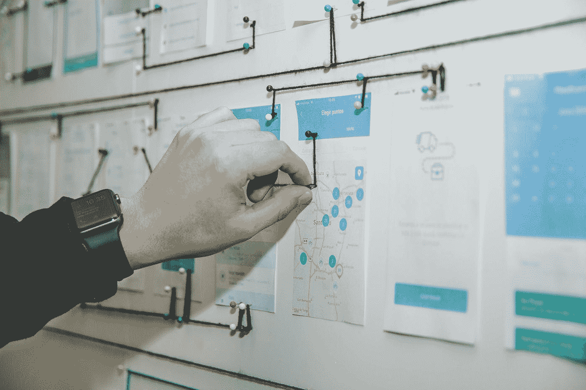

# UX /用户界面设计的基本原则和基础

> 原文：<https://javascript.plainenglish.io/basic-principles-and-fundamentals-of-ux-ui-design-4eb5ab0426d4?source=collection_archive---------10----------------------->

## 指导产品设计的原则。

Photo by [Alvaro Reyes](https://unsplash.com/@alvarordesign?utm_source=medium&utm_medium=referral) on [Unsplash](https://unsplash.com?utm_source=medium&utm_medium=referral)

UX 和 UI 设计是两个相互关联的概念:

*   UX —用户体验和
*   UI —用户界面。

当创建用户和界面交互的网站、应用程序和其他产品的设计时，理解每个方向背后的思想是很重要的。

## 21 世纪社会中的“界面”概念

界面不仅仅是一个数码产品。仪表板，飞机驾驶员控制台，浴室洗衣机的把手。

比如卷笔刀。

用户如何削铅笔决定了界面的特征。例如，是否会有带旋转机构的木屑容器的卷笔刀，或者用户是否会自己在卷笔刀中拧铅笔。这是关于 UX 的。而且卷笔刀颜色和外观特点都是 UI。看下面的区别。

## 用户界面和 UX 界面设计的区别

*   UX 的字面意思是“用户体验”——一个人从界面工作中得到什么印象，他是否达到了必要的目标，他是如何做到的。
*   UI——用户界面，即外观和设计。就网站而言，用户界面决定了文本的可读性，决定了人们是否能看到和点击按钮。

因此，UX /用户界面设计师设计各种用户界面。易用性和合适的外观在其中同等重要。

一个原始的例子是磨刀石(轮子)。即使在中世纪早期，这种机制至少有 3 种类型:

*   另一个人转动方向盘；
*   你可以自己转动把手，同时磨快它；
*   人们转动方向盘，踩下踏板，腾出双手。

这些都是不同类型的接口。

# UX /用户界面设计师的 5 个主要要求

成为一名优秀的界面设计师需要很多技巧和经验。例如，你需要能够在用户友好性和可用性方面专业地设计界面的架构。

## 基本技能:

*   了解设计工具——来自 Adobe Creative Cloud、Mockplus、Sketch、Axure、Figma 的软件；
*   了解网页设计、应用程序设计、开发的成熟算法；
*   营销洞察力；
*   了解行业的最新趋势；
*   分析技巧和思维方式——研究用户的行为因素。

一个 UX / UI 设计师有很多目标。通常是销售产品、使用服务或使用界面的服务的过程。它是基于使用资源的方便程度来决定用户是否决定购买某样东西。

# 交互设计原则

交互设计是创建吸引人的、用户友好的网络界面的过程。吸引人的网络界面包含深思熟虑的行为和动作模式。界面越方便，用户越满意。这就是“可用性”——方便易用。此外，在评估可用性是采取:美学，可访问性，安全性，产品研究。

交互设计基于 5 个基础:

*   话
*   画面
*   有空间的物体
*   时间
*   行为。

前 3 个是用户与界面的交互。时间和行为决定了互动的质量。因此，它们对于理解过程和错误非常重要。

第一个用户动作会在界面中触发许多反应，这些反应会在有限的时间内触发一系列进一步的用户动作。

例如，按下汉堡菜单按钮会在一瞬间打开相应的菜单项。此外，在用户的行为中，在期望界面反应或动作的进一步迭代时可能会有停顿，希望加速并快速获得期望的界面响应。因此，界面应该与用户“对话”，对每种情况做出最合理、最快速、最理想的反应。

# 界面响应时间意味着更多。

下面我写了 4 段关于时间的内容，因为没有人愿意认为界面对任何用户动作的响应时间是可用性工作中最重要的标准。最重要的。最重要的是，记住，杜绝脑袋。

网站页面上的视频、声音、动画等内容元素会随着时间的推移而变化。理解时间并不容易，因为时间的范围是无限的——从几分之一秒到几个小时。有人认为载入网页时，几分之一秒并不重要。然而，用户会有不同的想法。然而，就像谷歌关于网站的搜索一样:)，速度慢是网络项目的死亡。5G 已经在院子里了(2020 年 11 月)。没有人会等 3 秒钟来加载网站。

理解数字时间不同于人类时间是很重要的，人类时间指导着我们的生活。数字时间的每一秒都影响着用户在使用界面时的体验是积极的还是消极的。

当我们考虑人类心理学的某些方面时，这一点变得更加清楚。当信息脱离短期记忆，用户感到沮丧时，我们正在讨论注意力和记忆的极限。很简单，我厌倦了等待界面右边的标签打开。我相信你已经在其他服务中感受到了类似的情绪。

对于一个人来说，掌控正在发生的事情也很重要——没有人愿意受技术的支配。如果一个数码产品让一个人等待，就会对他形成一个无能或者傲慢的画面。通常，用户会在半秒钟内决定是否继续留在网站上。

# 创造想法的两种方法

30 多种技术已经在互联网上发表，用于“更好地”产生想法和找到合适的解决方案。结合其中一些或者选择合适的。这里有两个在全世界都得到证实和流行的例子:

## 1.d .杨氏方法:

*   沉浸——完全沉浸在研究主题中。
*   消化——我们研究关于该主题的可用信息。
*   搬运——我们放下工作，出去散步了两个小时。
*   头脑风暴——与员工或合作伙伴一起积极地研究一个想法。
*   冷静评估——让我们看看这个想法是否真的有助于解决问题。

## 2.方法 10 + 10:

首先，我们开发 10 个想法，选择顶部的一个并开发 10 个更多可能的改进(在头脑风暴阶段使用上一个中的方法，或单独使用)。

一个 UX /用户界面设计师必须在他的行业中拥有许多能力，熟练地拥有特殊的软件，并且理解网站和其他界面上用户行为的心理层面。要做到这一点，就要不断地研究这方面，保持关注。

*更多内容尽在*[*plain English . io*](http://plainenglish.io/)