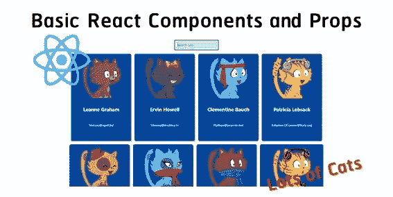
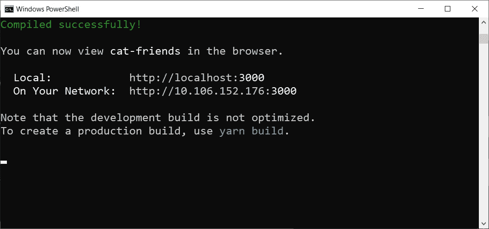
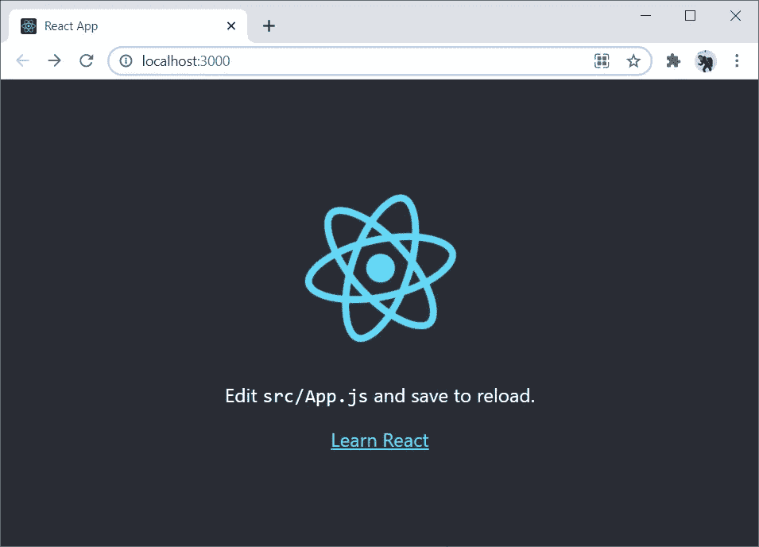
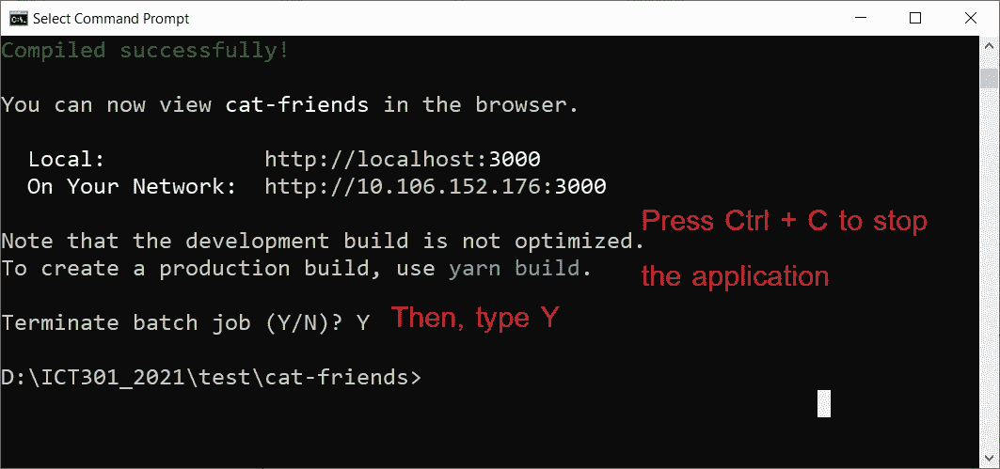
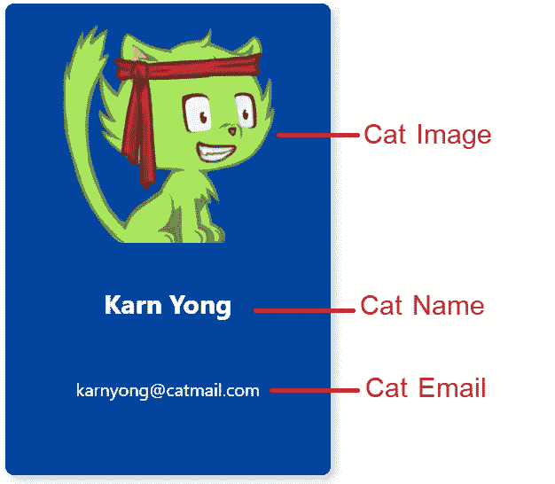
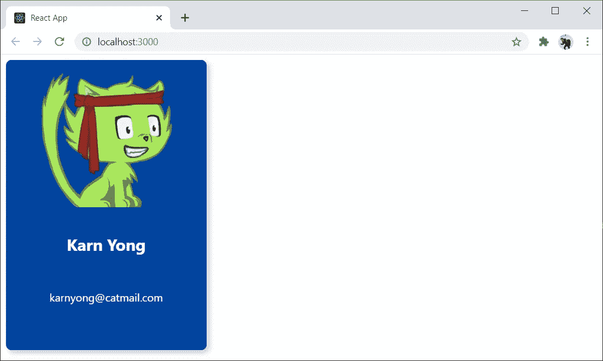
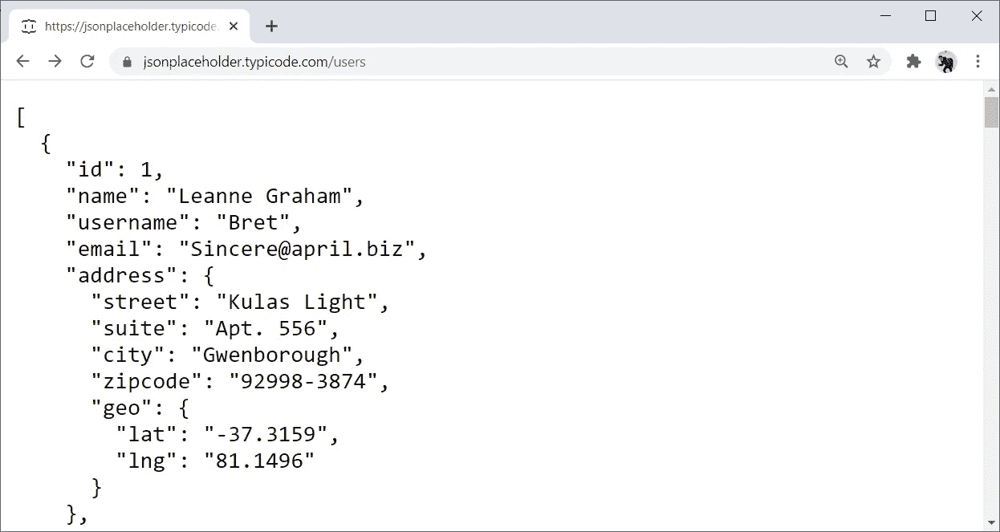
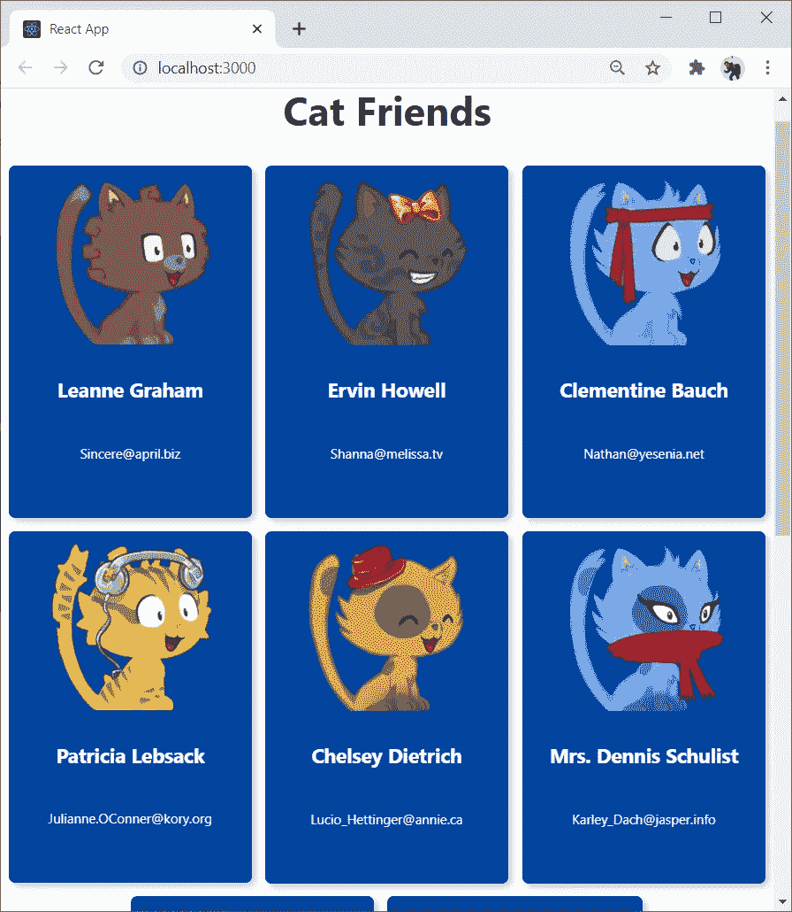
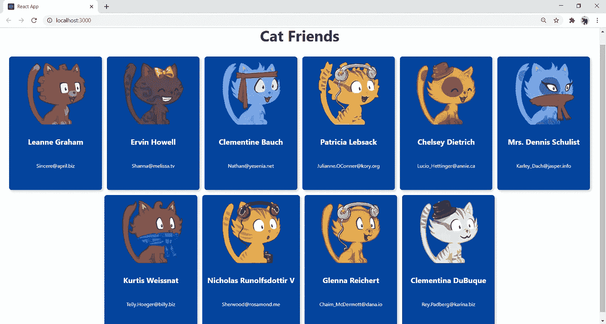
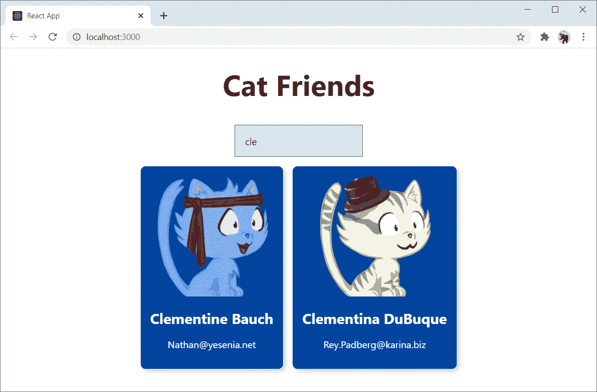

# 基本的 React 组件和道具使用 API 来显示大量的猫😻

> 原文：<https://javascript.plainenglish.io/basic-react-components-and-props-for-showing-lots-of-cats-d41bf67cc26?source=collection_archive---------16----------------------->

在本教程中，我们将了解使用 API 获取一些数据的 **React 组件**和**道具**的基本原理，最终显示一些 cat 数据。



完成本教程后，您可以进一步了解如何开发一个简单的 **REST API** 来存储 cat 数据:

*   [使用 Express.js + MongoDB 创建一个简单的 REST API](https://karnyong.medium.com/creating-a-simple-rest-api-using-express-js-mongodb-c7f53d145e4d)

# 软件安装

*   **node . js**https://nodejs.org
*   你最喜欢的 **IDE** ，我的是 **VS 代号**https://code.visualstudio.com/download

这就是你现在需要的。让我们开始创建一个新的 React 应用程序。

# 启动新的 React 应用程序

启动命令提示符/终端。然后，用 **npx** 命令创建你的新空白 **React** 应用。正如你在选项**之后看到的，create-react-app** 是你的项目名称，也就是 **cat-friends** 。文件夹 **cat-friends** 是用一些源代码创建的。

```
npx create-react-app cat-friends
```

带着 **cd** 进入你的项目文件夹**猫友**，然后带着**纱线启动**启动你的**反应**应用。

```
cd cat-friends
yarn start
```



一旦您的 **React** 应用程序启动，您可以在您的网络浏览器上看到如下所示。可以用 [localhost:3000](http://localhost:3000/) 访问



# 安装超光速粒子

为了让我们的**反应**应用更漂亮一点，我们将在我们的项目中使用**超光速粒子** css 工具包。要安装**超光速粒子**，用 **Ctrl + C** 停止**反应** app，然后按下 **Y** 。



使用**纱线添加**命令将**超光速粒子**添加到您的项目中:

```
yarn add tachyons
```

然后，再次启动你的 **React** app。

```
yarn start
```

# 猫卡

我们将创建一个 **React 组件**(无状态)用于显示猫的数据，包括猫的图像、名字和电子邮件，如下所示。



我们可以用[**【robohash.org】**](https://robohash.org/karnyong?set=set4)通过使用 URL[https://robohash.org/<<any text>>从文本中生成一个猫的图像？set=set4](https://robohash.org/karnyong?set=set4) ，用任意文本替换< < anytext > >。

比如说。[https://robohash.org/karnyong?set=set4](https://robohash.org/karnyong?set=set4)


创建 **src/Card.js** 以包含猫的图片、名字和电子邮件。

编辑 **src/index.js** 在索引页面添加**卡片组件**。

让我们在网络浏览器上检查一下。我们将看到，我们刚刚创建并使用了一个 **React 组件**来显示 cat 数据。



# 目录列表

我们将展示卡特彼勒**反应组件**的列表。首先，我们将使用一个使用 URL:[https://jsonplaceholder.typicode.com/users](https://jsonplaceholder.typicode.com/users)的实体模型数据。基本上，我们将请求这个 **API** 来获得 10 个用户的这个模型 **JSON** 数据(仅使用了 **id** 、**名称**和**电子邮件**)。



添加 **src/CardList.js** 。

*   我们在 **CardList 组件**类(stateful)的构造函数中将 **cats** 的数组定义为一个状态。(第 5–9 行)
*   我们使用 **componentDidMount** 从[https://jsonplaceholder.typicode.com/users](https://jsonplaceholder.typicode.com/users)获取数据，并存储在 **cats** 状态中。(第 12–16 行)
*   渲染多个猫**组件**，从**猫**状态(来自第 18 行)定义**键**、 **id** 、**名**和**电子邮件**。

编辑 **src/Card.js** 使用道具**{姓名，邮箱，id}** 。

编辑 **src/index.js** 以使用 **CardList** 组件。

结果是:



# 猫搜索

现在我们将创建一个**搜索框**组件。

添加 **src/SearchBox.js** 。

编辑 **src/CardList.js** 以包括:

*   **状态中的搜索字段**。
*   **onSearchChange** 处理**搜索框**组件中的变化。

*   添加 **searchfield** 变量，从状态中获取值(第 2 行)。
*   添加变量 **filteredCats** 来根据猫名过滤猫的列表(第 3–5 行)。
*   在 **CardList** 组件中添加一个**搜索框**组件(第 9 行)。
*   循环通过 **filteredCats** 来呈现多个 Cat 组件(来自第 11 行)

回到网络浏览器，现在你可以通过名字搜索猫。😸



就是这样。您也可以从 **GitHub** 下载完整源代码:

[](https://github.com/KarnYong/cat-friends-react) [## karn Yong/猫友-反应

### 这个项目是用 Create React App 引导的。在项目目录中，您可以运行:在…中运行应用程序

github.com](https://github.com/KarnYong/cat-friends-react) 

您可以进一步了解如何开发简单的 **REST API** 来存储卡特彼勒数据:

*   [使用 Express.js + MongoDB 创建一个简单的 REST API](https://karnyong.medium.com/creating-a-simple-rest-api-using-express-js-mongodb-c7f53d145e4d)

*文章作者 Karn Yongsiriwit 博士
兰西大学数字创新技术学院*

*参考:* [*https://reactjs.org/docs/components-and-props.html*](https://reactjs.org/docs/components-and-props.html)[*https://github.com/coderrsid/RoboFriends*](https://github.com/coderrsid/RoboFriends)