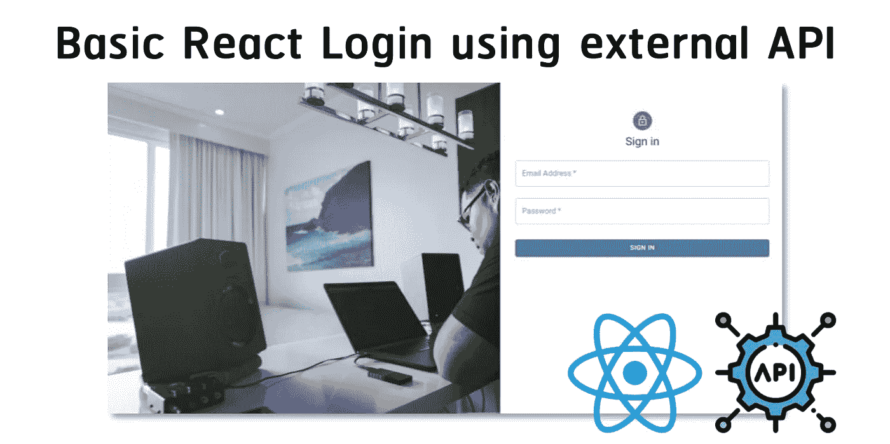
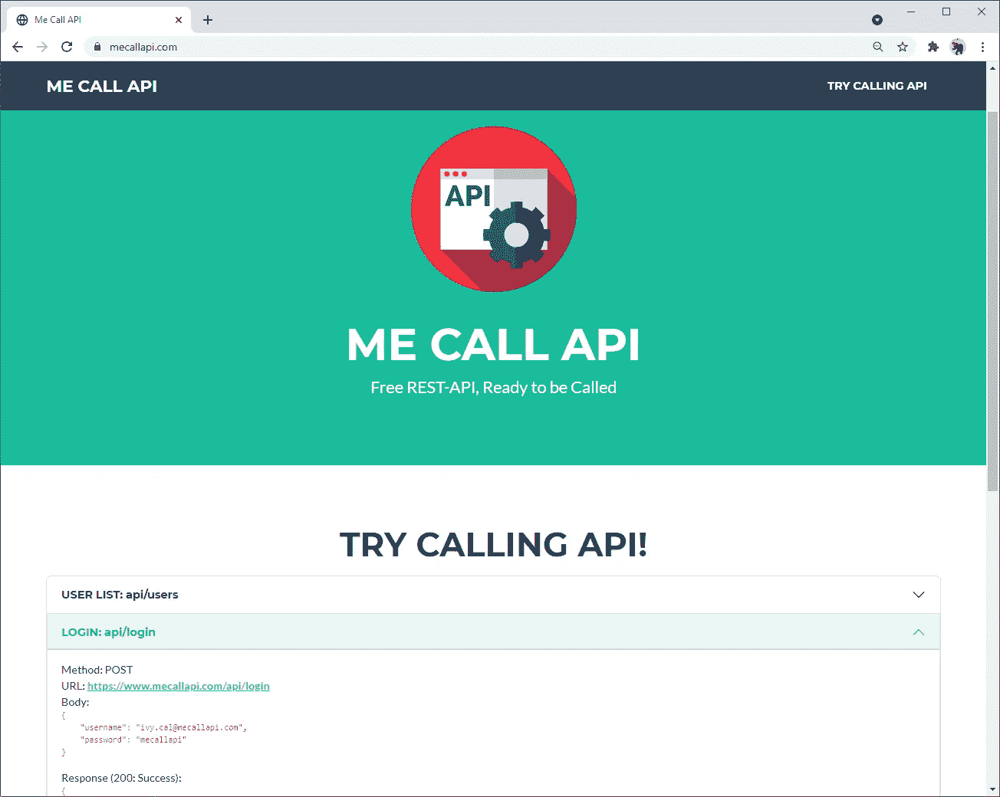
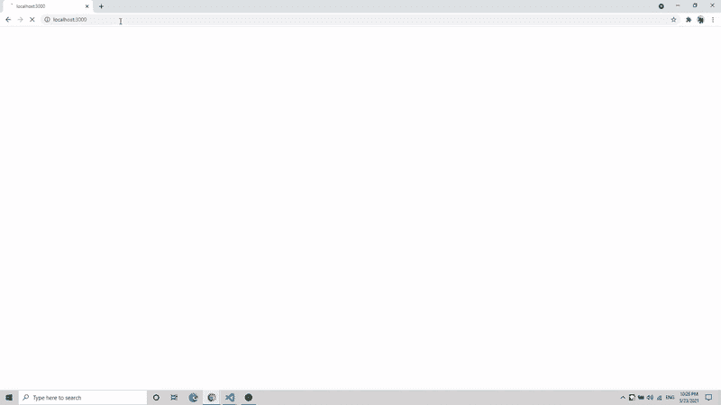

# 使用外部应用编程接口的基本反应登录

> 原文：<https://javascript.plainenglish.io/basic-react-login-using-external-api-e33322e480cd?source=collection_archive---------0----------------------->



这篇文章适合初学者。我们将创建登录和用户配置文件屏幕。此外，我们将纳入来自[MeCallAPI.com](https://www.mecallapi.com/)的 API。

# 应用程序接口

我们将使用来自[MeCallAPI.com](https://www.mecallapi.com/)的免费登录 API，具体如下:

*   方法:张贴
*   网址:[https://www.mecallapi.com/api/login](https://www.mecallapi.com/api/login)
*   车身(JSON):

*   回应:

更多填充了虚假数据的 API，如用户列表和与 JWT 的用户配置文件认证，可以在[MeCallAPI.com](https://www.mecallapi.com/)找到。



# 软件安装

*   **node . js**[https://nodejs.org](https://nodejs.org/)
*   **纱线**

```
npm install --global yarn
```

# 创建反应应用程序

使用**创建-反应-应用**创建初始反应应用。

```
npx create-react-app react-basic-login
```

进入文件夹。

```
cd react-basic-login
```

# 添加更多包

我们将在应用程序中添加以下软件包:

*   **材料界面**
*   **反应路由器 dom**
*   **甜蜜警报**

```
yarn add @material-ui/core @material-ui/icons react-router-dom sweetalert
```

# 创建登录和配置文件屏幕

我们将创建两个屏幕:

*   **Sigin.js** 为登录页面用**登录** **API**
*   **显示用户档案的 Profile.js** (必须登录后才能进入该界面)

创建 **Sigin.js** (从第 41 行是使用**登录 API 从**[MeCallAPI.com](https://www.mecallapi.com/))

创建 **Profile.js**

最后，编辑 **App.js** 以在**登录**和**配置文件**屏幕之间进行路由。如果调用**登录 API** 没有访问令牌，用户将只能访问**登录**界面。

# 测试

开始反应:

```
yarn start
```

使用**电子邮箱**和**密码测试:**

*   karn.yong@mecallapi.com/梅卡拉皮
*   ivy.cal@mecallapi.com/梅卡拉皮



*rang sit 大学数字创新技术学院 Karn Yongsiriwit 博士论文* 

## 进一步阅读

[](https://plainenglish.io/blog/how-to-compose-and-integrate-apis-together-as-if-you-were-using-npm-for-apis) [## 如何将 API 编写和集成在一起，就像使用 NPM 进行 API 一样

### 将两个 API 整合到一个应用程序中，该应用程序显示了历史上由首都举办的最大型音乐会。与…

plainenglish.io](https://plainenglish.io/blog/how-to-compose-and-integrate-apis-together-as-if-you-were-using-npm-for-apis) 

*更多内容请看*[***plain English . io***](https://plainenglish.io/)*。报名参加我们的* [***免费周报***](http://newsletter.plainenglish.io/) *。关注我们关于*[***Twitter***](https://twitter.com/inPlainEngHQ)[***LinkedIn***](https://www.linkedin.com/company/inplainenglish/)*[***YouTube***](https://www.youtube.com/channel/UCtipWUghju290NWcn8jhyAw)*[***不和***](https://discord.gg/GtDtUAvyhW) *。对增长黑客感兴趣？检查* [***电路***](https://circuit.ooo/) *。***