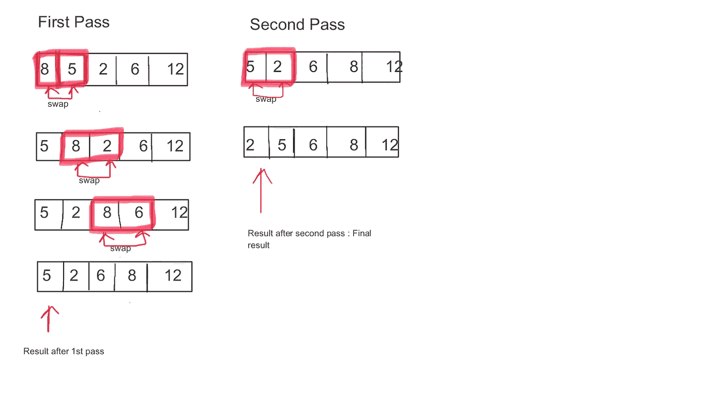
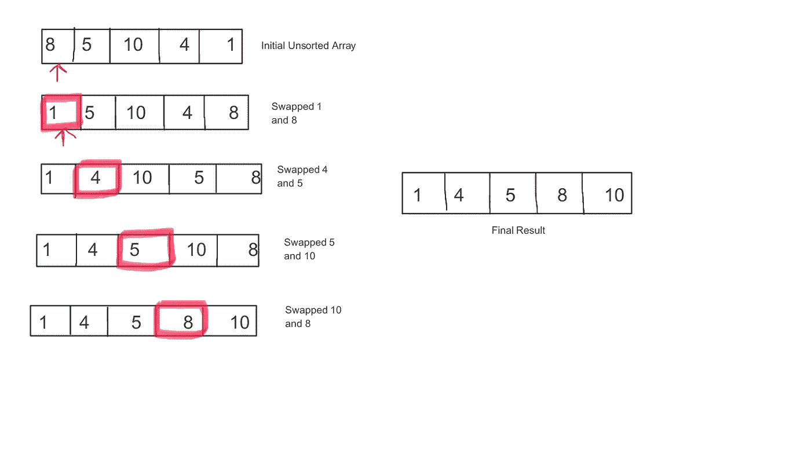
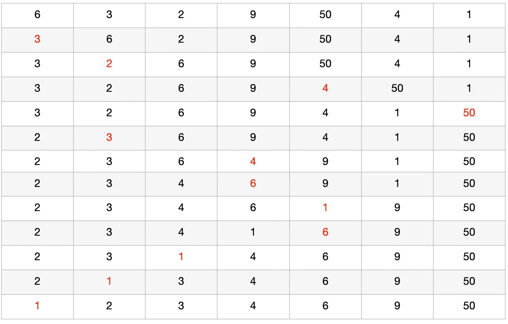
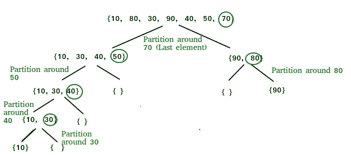
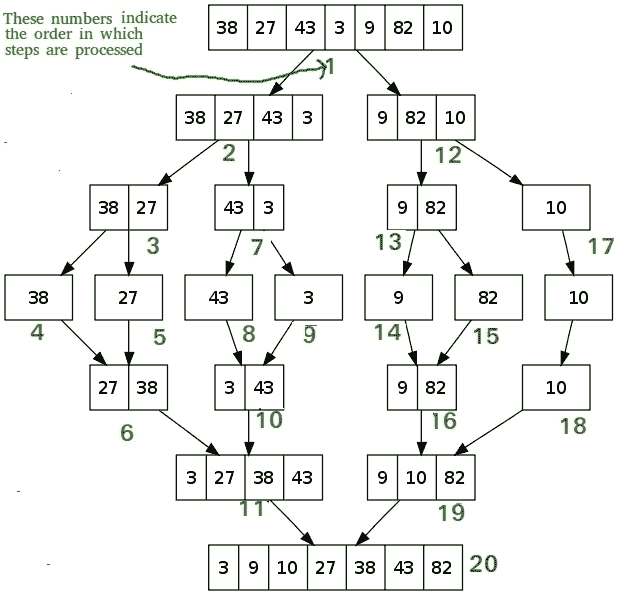

# 每一个基本的排序算法彻底解释

> 原文：<https://javascript.plainenglish.io/basic-sorting-algorithms-explained-d061833240e1?source=collection_archive---------9----------------------->


Photo by [Kelly Sikkema](https://unsplash.com/@kellysikkema?utm_source=medium&utm_medium=referral) on [Unsplash](https://unsplash.com?utm_source=medium&utm_medium=referral)

排序是计算机科学领域中最基本也是最常用的算法之一。它是按升序或降序排列数据的一系列步骤。此外，这也是你深入“算法世界”之前的一个网关算法。

这些算法在构建复杂系统的时候很有价值。全面的用例超出了本文档的范围(它可能是一个独立的博客，排序如何为系统增加价值，也许以后)。


我将介绍一些基本的排序算法，以及常用排序算法的实现和效率。

# **冒泡排序**

这个排序算法是基于比较的。在每次迭代中，我们比较相邻的元素。如果它们没有按顺序排列，那么它们就会被交换。

## **伪代码**

```
**procedure** bubbleSort(A : list **of** sortable items)
    n := length(A)
    **repeat**
        swapped := **false**
        **for** i := 1 **to** n-1 inclusive **do**
            /* **if** this pair **is** out **of** order */
            **if** A[i-1] > A[i] **then**
                /* swap them **and** remember something changed */
                swap(A[i-1], A[i])
                swapped := **true**
            **end** **if**
        **end** **for**
    **until** **not** swapped
**end** **procedure**
```

[*伪代码来源*](https://en.wikipedia.org/wiki/Bubble_sort)

## **实施**



> 在上面的例子中，我们希望数组按升序排列。在第一次迭代中:8>5，所以我们交换它。我们继续下一组，如此类推，直到我们到达最后一对。经过这一关后，我们会注意到最高的数字将在其合法的最终位置。
> 
> 我们对部分排序的数组重复上述操作。但是这次，我们只比较 n-1 个元素。最后，我们会看到第二高的数字将会在倒数第二个位置。下一次迭代是 n-2，以此类推。在上面的例子中，我们看到了第二遍完成的正确顺序。我们不会知道，代码会继续运行。我们遍历数组的次数是 n*(n-1)*(n-2)…2*1= n！

## 有趣的事实

最小的元素到达顶部就像一个气泡到达湖的顶部，从深处！！！！

## **最佳、最差和一般情况**

空间复杂度:O(1)

最坏情况时间复杂度:O(n)

平均案例时间复杂度:O(n)

最佳情况时间复杂度:O(n)

## **优缺点**

该算法易于理解和实现。由于其简单性，它是计算机科学中排序算法的基础。冒泡排序[是一种稳定的排序算法](https://www.baeldung.com/cs/stable-sorting-algorithms)，多边形填充算法使用了冒泡排序的概念。(哦！大词，你可以在提供的链接中读到它)

这种算法的一个缺点是，对于大型数据集来说，它变得非常慢。当链表的大小增加时，该算法的效率急剧下降，平均时间呈二次方增加。

# **2。选择排序**

该算法从未排序的列表中搜索最小的元素，并将该元素移动到新列表中。列表变小一个。重复简化列表中的第一步。继续迭代，直到所有元素都在新元素中。

## **伪代码:**

```
**selectionSort**(arr){
n = Arr.lengthfor ( i = 0 ; i < n ; i++){
//Finding the smallest element in the sub array
  let min = i;
   for(let j = i+1 ; j< n ;j++){
        if(arr[j] < arr[min]){
         min = j;
      }
   } if (min != i){
  //swapping the elements
  temp = arr[i];
  arr[i] = arr[min];
  arr[min] = temp;
   }
 }
 return arr;
}
```

## **实施:**



*在实现中，第一个元素将与数组中的其余元素进行比较。一旦找到，这个最小的元素将从未排序的列表中删除，并添加到一个新的列表中。
现在原始列表只有 n-1 个元素。我们在简化的列表上重复上述过程。再次从未排序列表中删除最小的元素，并作为第二个元素添加到排序列表中。像冒泡排序一样，选择排序也迭代 n*(n-1)*(n-2)…2*1。并且没有元素留在未排序的部分中。在这个算法中，我们选择最小的元素并移入一个新的列表。因此命名为选择排序。*

## **最佳、最差和一般情况**

空间复杂度:O(1)辅助

最坏情况时间复杂度:O(n)比较，O(n)交换

平均案例时间复杂度:O(n)比较，O(n)交换

最佳情况时间复杂度:O(n)比较，O(1)交换

## **冒泡排序和选择排序的区别**

与选择排序相比，冒泡排序算法效率较低。在选择排序中，我们每次都需要更少的比较。

但是不能识别该列表在第一次迭代中是否已经是排序的列表。这在冒泡排序算法中是可能的。

# **3。插入排序**

该算法一次对列表中的一个元素进行排序。它的工作原理类似于你对手中扑克牌的排序。它将列表分为已排序和未排序部分。从未排序的部分选取元素，并将其推送到列表的排序部分。

## [**伪代码**](https://en.wikipedia.org/wiki/Insertion_sort) **:**

```
i ← 1
**while** i < length(A)
    j ← i
    **while** j > 0 **and** A[j-1] > A[j]
        **swap** A[j] and A[j-1]
        j ← j - 1
    **end while**
    i ← i + 1
**end while**
```

## **实施:**



The elements highlighted in red color are the ones that are swapped(sorted)

> 以红色突出显示的元素是交换的元素(已排序)。

*排序从第二个项目开始，因为只有一个元素的列表被视为已排序。该索引处的元素称为键。* ***如果键小于索引 j 处的元素，则键向左移动一个位置。*** *该过程继续，直到索引 j 处的元素小于该键。*

# **最佳、最差和一般情况**

空间复杂度:O(n)总，O(1)辅助

最坏情况时间复杂度:O(n)比较和交换

平均案例时间复杂度:O(n)比较，O(1)交换

最佳情况时间复杂度:O(n)比较，O(1)交换

## **该算法的关键要点**

插入排序非常类似于选择排序算法。主要区别在于插入排序从关键字向后扫描，而选择排序向前扫描。也就是说，选择排序使第一个 *k* 元素成为列表中最小的未排序部分。而在插入排序中，第一个 *k* 元素只是列表中的元素。

## **优势**

该算法对于小数据集是有效的，并且比选择排序和冒泡排序更有效。该算法适用于排序或部分排序的数据集。它不改变具有相同键的元素的相对顺序，并且只需要恒定量 O(1)的额外存储空间。

# **4。快速排序**

该算法是一种递归排序算法，遵循分治法。我们从列表中选择一个元素，通常是最后一个元素。这个元素是枢纽元素。元素以这样一种方式重新排列，即比枢轴小的元素移动到左侧。并且高于向右侧的枢轴移动。

这个算法是一个[就地算法](https://en.wikipedia.org/wiki/In-place_algorithm)，这意味着所有的数字都在原始数组本身中进行**排序。**

> 递归是一个调用自身的函数。这个函数总是有一个阻止函数调用自身的条件。

## [**伪代码**](https://www.geeksforgeeks.org/quick-sort/)

```
/* low  --> Starting index,  high  --> Ending index */
quickSort(arr[], low, high)
{
    if (low < high)
    {
        /* pi is partitioning index, arr[pi] is now
           at right place */
        pi = partition(arr, low, high);

        quickSort(arr, low, pi - 1);  // Before pi
        quickSort(arr, pi + 1, high); // After pi
    }
}
```

## **实施**



[Quick Sort implementation source](https://www.geeksforgeeks.org/quick-sort/)

*首先，选择 pivot 元素，通过比较子数组是小于还是大于 pivot，将数组分成两个子数组。这个过程一直持续到数组中的所有元素都排序完毕。*

## **最佳、最差和一般情况**

空间复杂度:O(n)

最坏情况时间复杂度:O(n)

平均案例时间复杂度:O(n log n)

最佳情况时间复杂度:O(log n)简单分区

## **该算法的关键要点**

Quicksort 不是一个稳定的算法，因为它根据轴心的位置交换元素。由于该算法是适当的，所以当空间可用性存在限制时，它是适用的。

# **5。合并排序**

这个算法也是一种分治法。首先，数组被分成包含一个元素的更小的部分。较小的部分被重复合并，直到剩下一部分，形成一个排序的数组。

## [**伪代码**](https://en.wikipedia.org/wiki/Merge_sort)

```
**MergeSort(arr[], l,  r)**
If r > l
     **1\.** Find the middle point to divide the array into two halves:  
             middle m = l+ (r-l)/2
    **2\.** Call mergeSort for first half:   
             Call mergeSort(arr, l, m)
     **3.** Call mergeSort for second half:
             Call mergeSort(arr, m+1, r)
     **4\.** Merge the two halves sorted in step 2 and 3:
             Call merge(arr, l, m, r)
```

## **实施**



[Source](https://en.wikipedia.org/wiki/Merge_sort#Bottom-up_implementation)

*首先，将数组分为两部分。除法过程以同样的方式继续，直到只剩下一个元素数组。在分割之后，子阵列被合并，从单个元素开始，以便每个合并的子阵列被排序。它重复进行，直到出现一个排序后的数组。*

## **最佳、最差和一般情况**

最坏情况时间复杂度:O(n log n)

平均案例时间复杂度:θ(n log n)

最佳情况时间复杂度:ω(n log n)

## **合并排序的关键要点**

对于较大的数组大小或数据集，Mergesort 效率更高，速度更快；而对于较小的数组大小或数据集，Quicksort 效率更高，速度更快。它是稳定的，因为具有相等值的两个元素以与输入数组相同的顺序出现在排序输出中。

## **结论**

在本文中，我们介绍了排序算法和常见类型的排序算法。

有了正确的理解，开发人员就可以根据数据集的大小、空间和性能，找出有效使用哪种排序算法。

编码快乐！

*更多内容请看*[***plain English . io***](http://plainenglish.io/)