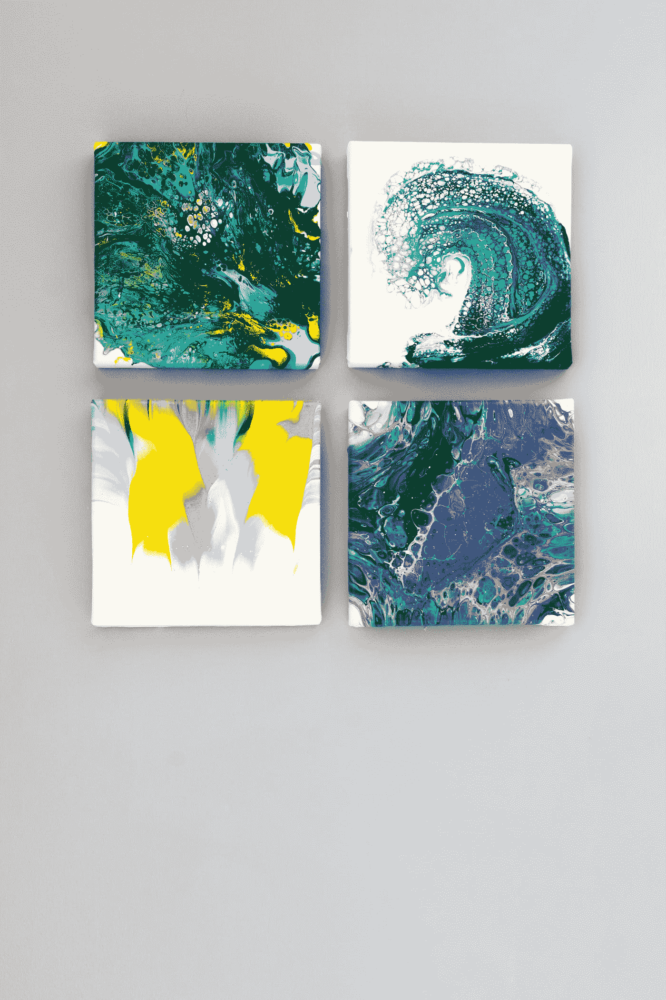
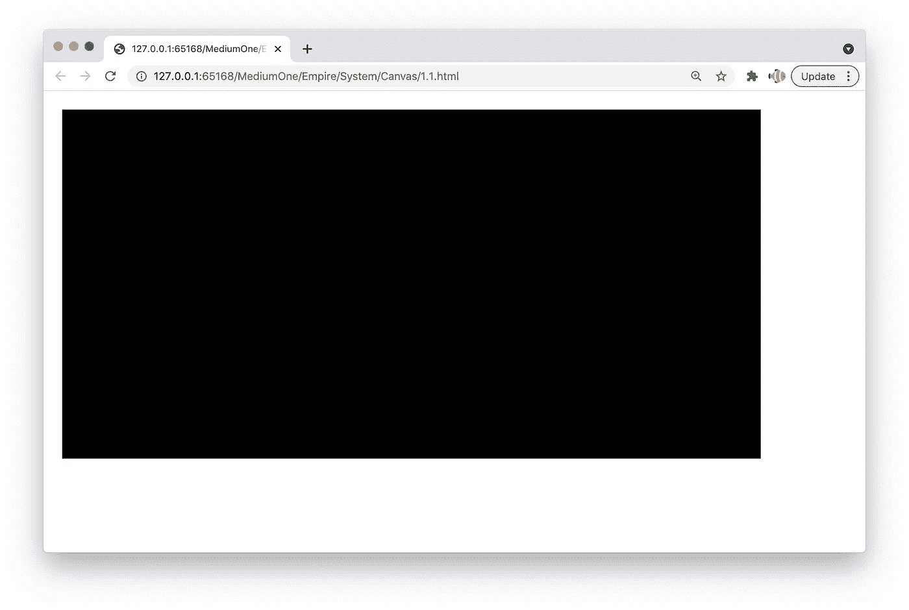
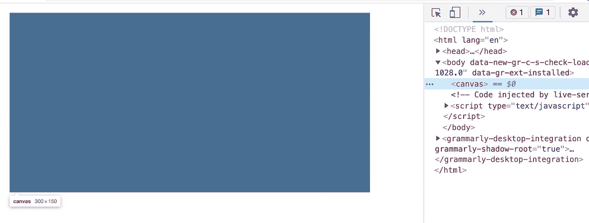
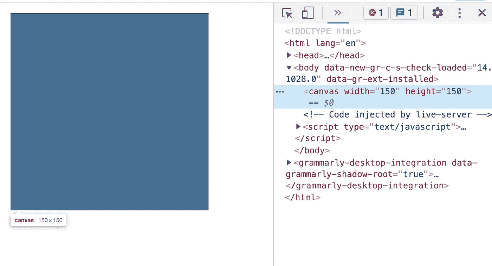
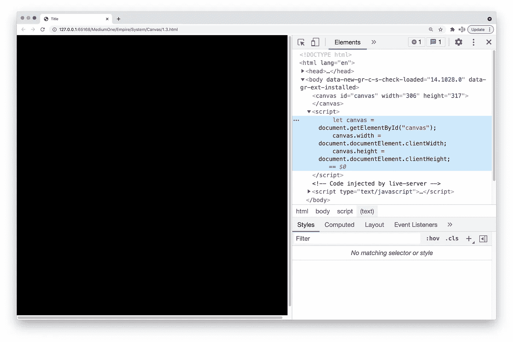
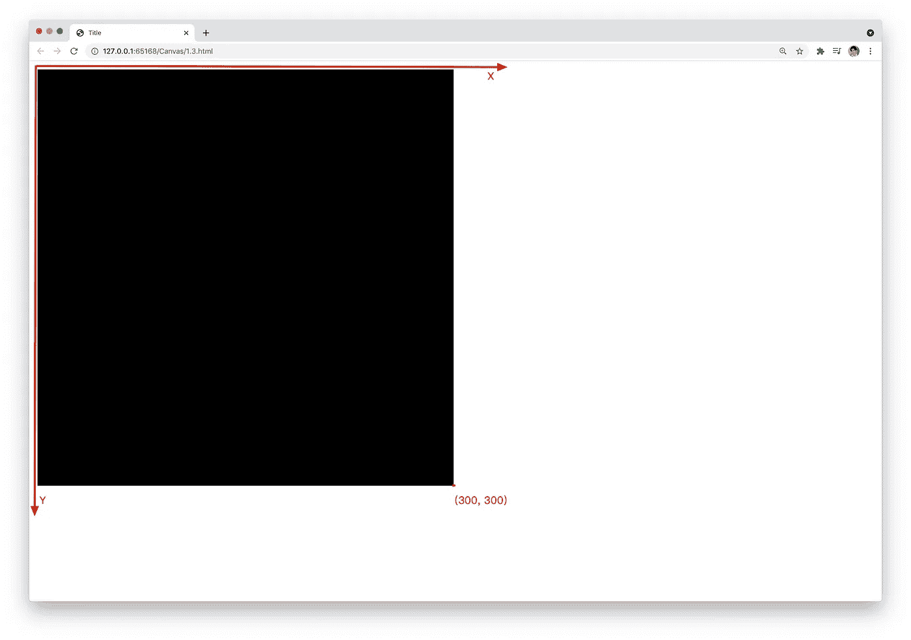
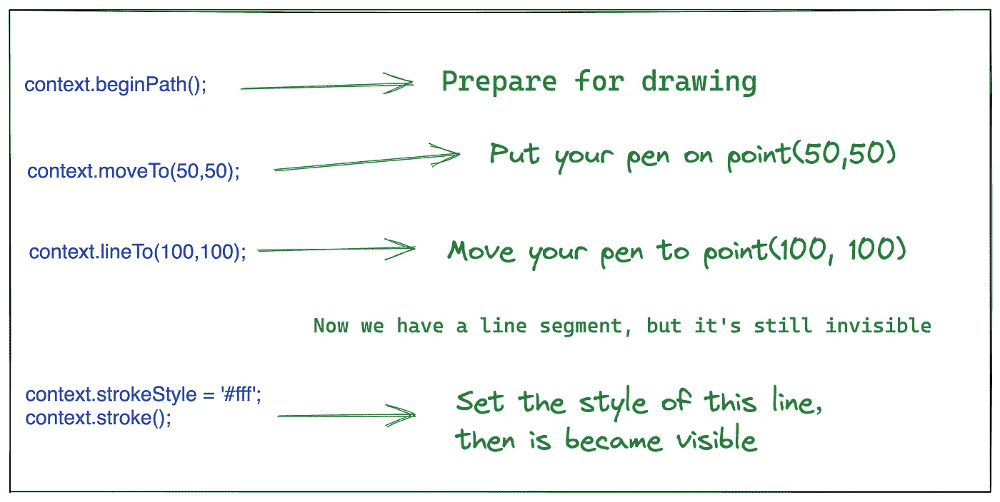
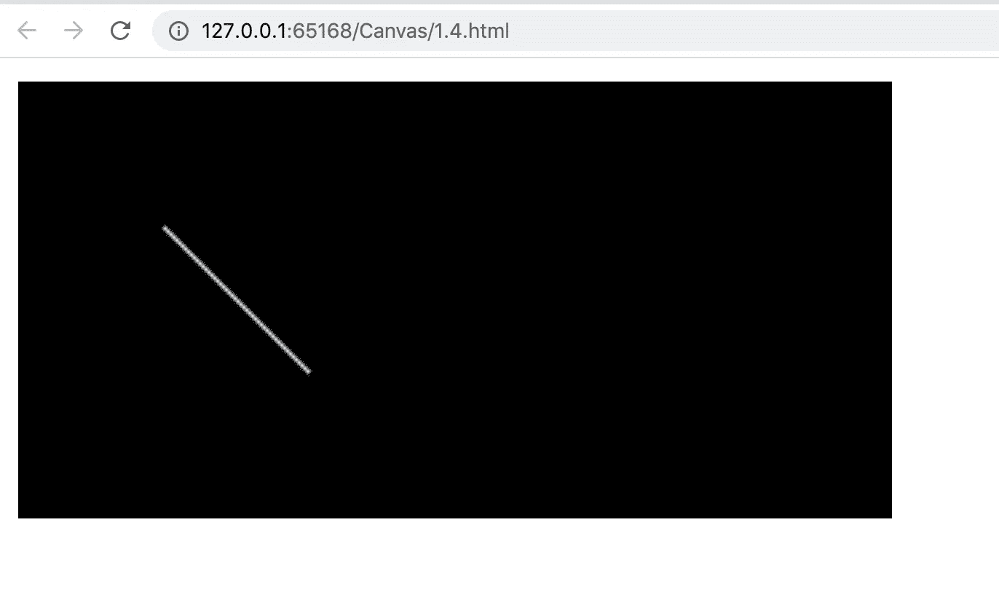

# 画布 API 的基本用法:指南

> 原文：<https://javascript.plainenglish.io/basic-usage-of-canvas-54e3afb8aa54?source=collection_archive---------15----------------------->



Photo by [Z S](https://unsplash.com/@kovacsz1?utm_source=medium&utm_medium=referral) on [Unsplash](https://unsplash.com?utm_source=medium&utm_medium=referral)

我们可以先想象一下:如果要在现实中画一个图像，需要什么工具？

首先，我们需要一块画布，然后我们需要一支笔。

在我们的 web 页面上，画布是 HTML 中的`Canvas`元素。

我们可以使用`Canvas`标签来创建一个画布:

```
<html>
    <body>
        <canvas></canvas>
    </body>
</html>
```

像常规元素一样，这个元素也是一个矩形容器。我们可以给它添加一些 CSS 样式:

```
<!DOCTYPE html>
<html lang="en"><head>
  <style>
    canvas {
      background-color: black;
    }
  </style>
</head><body>
  <canvas></canvas>
</body></html>
```

这是结果:



# 设置宽度和高度

我们知道任何画布都有大小。这里我们没有设置画布的大小，画布的默认宽度是 300 像素，高度是 150 像素。



我们可以直接在 HTML 标签中设置它的宽度和高度，或者通过 JavaScript 代码设置宽度:

在 HTML 标签中设置宽度和高度:

```
<canvas width="150" height="150"></canvas>
```



在 JavaScript 中:

```
let canvas = document.getElementById("canvas");
canvas.width = document.documentElement.clientWidth;
canvas.height = document.documentElement.clientHeight;
```



# 笛卡尔坐标系

现在我们开始理解坐标系的概念。当我们画图形时，我们需要知道每个点的位置。为了精确描述每个点的位置，在画布上引入了笛卡尔坐标系。

在画布中，左上角的点作为原点，水平方向为 x 轴，垂直方向为 y 轴。



如果上面画布的大小是`300 * 300`，那么右下角的点应该是`(300, 300)`。

这是一个非常重要的概念。当我们后来画的时候，我们本质上是在不同的点之间移动画笔。

# 划一界线

好的，在我们设置画布的大小和颜色之前。现在让我们画一些最简单的图形。

在现实中，如果我们需要画画，我们也需要一支笔。在 Canvas 中，我们可以通过这样的代码获得画笔。

```
let canvas = document.getElementById("canvas");let context = canvas.getContext("2d");
```

这个上下文对象可以看作是一支笔。

在这里，我们想象我们如何在现实中绘制线段:

*   首先，我们需要将笔放在画布上的某个坐标上
*   然后我们需要将笔移动到另一个坐标

JavaScript 中也是如此。下面是一段代码:

```
context.beginPath();context.moveTo(50,50);context.lineTo(100,100);context.strokeStyle = '#fff';context.stroke();
```

解释:



结果:



嗯，这是画布的基本用法。在下一篇文章中，我们将学习画三角形、矩形和圆形。

*更多内容尽在*[***plain English . io***](http://plainenglish.io/)