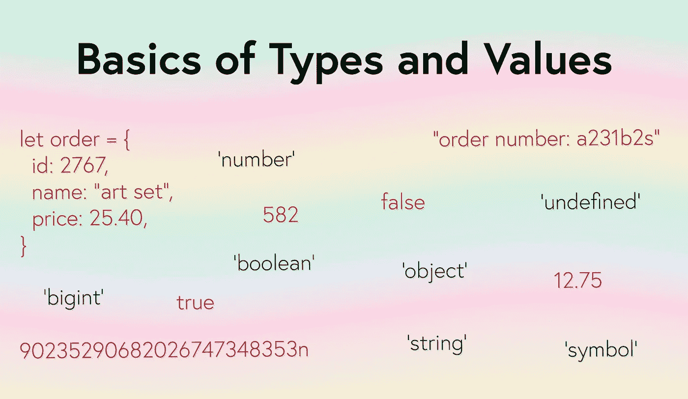

# JavaScript 数据类型和值的基础知识

> 原文：<https://javascript.plainenglish.io/basics-of-javasscript-types-and-values-df727599a3de?source=collection_archive---------12----------------------->

任何编程语言的基础都是数据。没有数据，创建一个程序是非常困难的，如果不是不可能的话。

互联网上的大多数交互都涉及某种类型的数据。可能是银行账户数据，或者是购物车中产品列表的数据，或者是社交媒体网络上的消息，或者是篮球季后赛的最新比分。数据是人们启动浏览器和探索互联网的原因。JavaScript 允许程序员控制程序中使用的数据的**值**和**类型**。



Basics of JavaScript Types and Values

JavasScript 允许程序员使用许多不同的值。这些值可以包括在线银行账户中的*美元总额*，电子商务网站上购物车电视中的产品名称列表*，社交媒体网站上帖子的*文本*，或者篮球比赛的*最终比分*。所有这些例子的共同特征是它们都是值——数字、文本、文本列表等。显示在网页上。*

当谈到值时，结合类型来说是有意义的。在 JavaScript 中，类型是数据可以采取的不同形式，JavaScript 引擎可以理解。根据 MDN，目前有[九种不同的类型](https://developer.mozilla.org/en-US/docs/Web/JavaScript/Data_structures)。其中包括:

# 类型

## 数据类型(原语)

*   **字符串** —用引号、双引号或反勾号括起来的内容(例如‘你好，鲍勃’，‘汽车租赁公司’，`green park`)
*   **数字** —包括整数和小数(例如 17, 2.63, -32.62, 5000.01)
*   **布尔型** —真或假(例如，真、假)
*   **未定义** —缺少值(例如，未定义)
*   **BigInt** —大于 2⁵-1 的数字(例如，BigInt(9007199254740991))
*   **符号** —匿名的、唯一的属性(例如，var sym = Symbol('sym '))

## 结构类型

*   **对象** —结构化数据的数据类型(如{姓名:'鲍勃'，年龄:34 })
*   **函数** —可以被其他代码调用的代码片段(如函数 say hello(){ return ' hello '；})

## 结构根(原始)

*   **null** —指向不存在的值(例如，var score = null)

# 赋值-原始类型

价值观本身没什么作用。为了充分利用值，应该将它们赋给变量。在 JavaScript 中，给变量赋值的过程非常容易和简单。

```
var title = 'Tale of Two Cities';
typeof title; // 'string'
```

上面的代码既声明了一个变量，又给它赋了一个值——一个字符串类型的数据。因为 JavaScript 是一种[动态](https://developer.mozilla.org/en-US/docs/Glossary/Dynamic_typing)类型的编程语言，所以变量`title`可以被重新分配为一种新的数据类型。

```
var title = true; // the variable title is reassigned with a new value
typeof title; // 'boolean'
```

原始数据类型可以通过以下方式创建:

## 字符串值

[字符串](https://developer.mozilla.org/en-US/docs/Glossary/String)可以用单引号、双引号或反斜线来赋值。使用反斜线通常与[模板文字](https://developer.mozilla.org/en-US/docs/Web/JavaScript/Reference/Template_literals)(也称为模板字符串)一起使用，这允许表达式嵌入到字符串中。

```
var myName = 'bob';
var myNickname = 'sparky';
var myFriend = `melvin`;// using template literals
var greeting = `hello, how are you ${myFriend}?`;
```

## 数值

[数字](https://developer.mozilla.org/en-US/docs/Glossary/Number)可以包括整数、小数和负数。JavaScript 中的大数字有一些限制，但一般来说，数字数据类型将满足大多数日常需求和情况。

```
var age = 34;
var price = 53.67;
var transactionTime = 326.2646223;
var submersionDepth = -236;
```

## 布尔值

[布尔值](https://developer.mozilla.org/en-US/docs/Glossary/Boolean)只能赋值为`true`或`false`，除此之外不能赋值。

```
var isMember = true;
var completedExam = false;
```

Booleans 在整个 JavaScript 中都有使用，在比较不同类型和值时特别有用。

## 不明确的

[未定义的](https://developer.mozilla.org/en-US/docs/Glossary/undefined)值既可以显式赋值，也可以默认赋值给尚未包含任何值的已声明变量。

```
var name = undefined;
var location; // undefined
```

## BigInt 值

[BigInt](https://developer.mozilla.org/en-US/docs/Glossary/BigInt) 是一种相当新的 JavaScript 数据类型(ES2020 版本中添加的)，用于超出原始类型数字支持范围的数字。数字数据类型可以可靠地处理-9007199254740991 和 9007199254740991 之间的数字，这些数字是数字对象`Number.MIN_SAFE_INTEGER`和`Number.MAX_SAFE_INTEGER`的静态属性。对于小于或大于这个值的数字，BigInt 原语是可用的。具有 BigInt 类型值的变量可以通过将字母`n`附加到整数上来创建。

```
var myLargeNumber = 9007199254740999n;
typeof myLargeNumber; // 'bigint'
```

## 符号值

[符号](https://developer.mozilla.org/en-US/docs/Glossary/Symbol)被添加到 ES2015 的 JavaScript 中，可以通过调用函数`Symbol`来创建。可以使用可选的描述字符串创建符号。创建的每个符号总是独一无二的。符号的一个常见用途是作为对象属性。

```
let location = Symbol('location');
typeof location; // 'symbol'let place = Symbol('location');
location === place; // false - symbols are unique, even with the same description stringconst company = {
  name: Symbol('Acme Co.'),
  location: Symbol('Los Angeles'),
};company.name; // Symbol(Acme Co.)
company.location.description; // 'Los Angeles'
```

# 赋值-结构类型

## 目标

[Objects](https://developer.mozilla.org/en-US/docs/Web/JavaScript/Reference/Global_Objects/Object) 是一种结构化数据类型，它可以处理 JavaScript 中各种不同的数据。JavaScript 中对象的突出特性是用于创建复杂数据结构的键控集合。可以通过使用`Object()`构造函数或使用对象字面语法来创建对象。

## 使用 Object()构造函数创建对象

对象构造函数是一种无需立即赋值就能初始化对象的方法。

```
let myItem = Object(); // creates an empty object {}myItem.name = 'hat';
myItem.size = 'large';
myItem.price = 21.47;myItem; // { name: 'hat', size: 'large', price: 21.47 }
```

## 使用对象文字语法创建对象

使用 object literal 语法是一种隐式创建对象的方法，无需显式使用 object()构造函数。

```
let newEmployee = {
  name: 'melvin',
  age: 34,
  isManager: true,
};newEmployee.name; // 'melvin'
```

## 功能

[函数](https://developer.mozilla.org/en-US/docs/Glossary/Function)是非数据结构类型，可以调用其他代码片段来执行。函数的数据类型是‘object ’,但是当对其调用`typeof`操作符时，将返回`function`。函数可以用几种不同的方式声明。

## 命名函数

一个命名函数声明一个函数并给它分配一个名字，这个名字可以用来在需要的时候调用这个函数。

```
function sayHello() {
  return 'hello!';
}sayHello(); // 'hello!'
```

## 函数表达式

函数也可以分配给变量，变量可以以不同的方式使用，包括直接调用函数，或者作为变量在其他函数中作为参数传递，如字符串或数字。

```
let greeting = function (name) {
  return `Welcome, ${name}. It's nice to meet you.`;
};greeting('bob'); // "Welcome, bob. It's nice to meet you."
```

## 匿名函数

没有声明名称，但必须以这种方式用作函数表达式。

```
// Will produce an error without a name or assignment to a variable
function() {
  return 'some good information';
}
```

## 箭头功能

[箭头函数](https://developer.mozilla.org/en-US/docs/Web/JavaScript/Reference/Functions/Arrow_functions)是一种特殊类型的函数调用，可以被称为命名函数或函数表达式，但其行为与其他函数略有不同。

```
let getProduct = (name) => {
  return `Finish purchase for ${name}.`;
};getProduct('pencil'); // 'Finish purchase for pencil.'
```

# 赋值-结构根原语

## 空

[Null](https://developer.mozilla.org/en-US/docs/Glossary/Null) 指向不存在或无效的值。Null 本身被描述为一个原语，尽管它在技术上是一种类型的`object`。它可以用来给变量赋值。当执行比较时，给变量一个将返回`false`的值是很有用的。

# 结论

类型和值是 JavaScript 的基石。如果不使用这种语言或者对不同类型如何工作以及如何给它们赋值没有很好的理解，很难想象用这种语言做任何有用的事情。

*更多内容尽在*[***plain English . io***](http://plainenglish.io/)