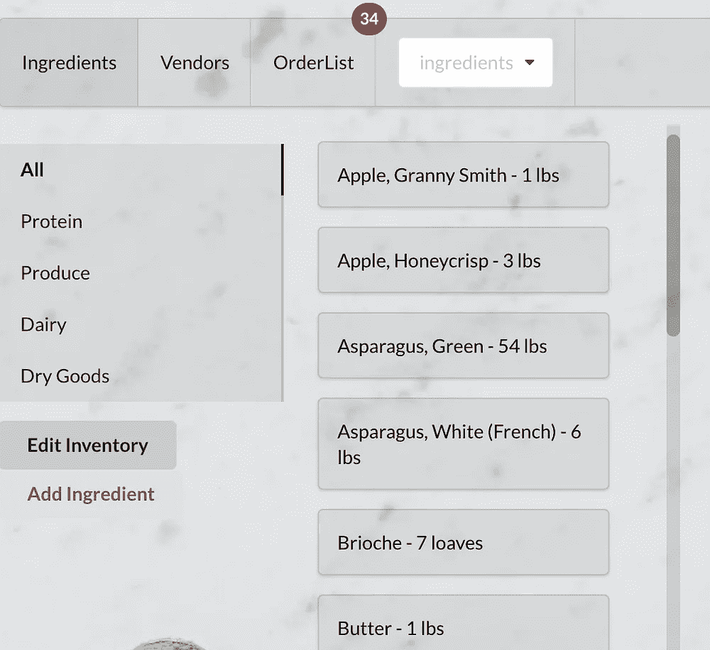
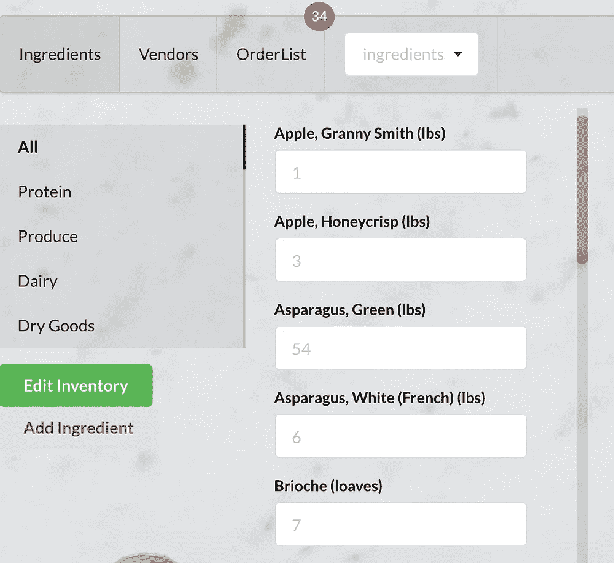
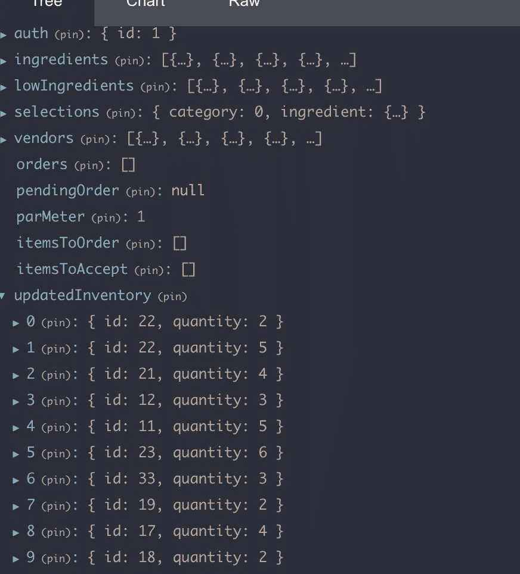

# 在 React / Redux 中批处理提取请求

> 原文：<https://javascript.plainenglish.io/batching-fetch-requests-in-react-redux-98212e3b34bb?source=collection_archive---------8----------------------->


Photo by [Nubelson Fernandes](https://unsplash.com/@nublson?utm_source=medium&utm_medium=referral) on [Unsplash](https://unsplash.com?utm_source=medium&utm_medium=referral)

在我的上一篇文章中，我讲述了我在熨斗学校 SE Bootcamp 的最后一个项目，这是一个旨在简化餐厅盘点的应用程序。我遇到的一个挑战涉及到实际更新配料的最佳方法。

我的第一个想法是在每种成分更新时发送单独的获取请求，但这在几个方面被证明是有缺陷的:首先，为正在进行的每一次更新发送*获取请求是一个费力的过程(对于一个希望简化库存过程的应用程序来说，这是违背直觉的)。第二，没有版本控制:每次更新都会在前端和后端数据库中立即进行，因此如果记录和更新了错误的值，那么还会发送另一个获取请求来用正确的数量更新数据库。*

我能想到的最好的解决方案是通过状态提供版本控制，并在单个获取请求中发送更新供后端处理。下面是我如何实现这个新系统的快速演练。

简单介绍一下背景:我有两个主要组件来处理组件和更新:IngredientsContainer 和 IngredientForm。IngredientsContainer 遍历所有配料(保存在商店中)，并在页面上显示配料和数量，而 IngredientForm 是一个切换组件，它将向每种配料添加一个表单字段以更新数量。



左边是配料的显示模式，而右边是“编辑库存”，允许用户调整数量。

因为我已经构建好了组件，所以真正需要改变的是存储组件并将其发送到服务器的方法。

1.  从后端开始…因为我们希望在一个获取请求中将所有更新发送到后端，所以这是我们必须循环访问要在数据库中更新的配料数组的地方。但是保持配料#更新方法集中于更新配料的细节(即名称、par、类别等)。)，我定义了一个自定义路由来专门处理这些批量更新:

```
#config/routes.rbpatch ‘/updateInventory’, to: ‘ingredients#updateInventory’
```

2.对于自定义路线，我定义了一个控制器方法来迭代数组并更新数据库中的每种配料:

```
#controllers/ingredients_controller.rbdef updateInventory
   updated_ingredients = {}
   params[:ingredients].each do |ingredient| 
      updated_ingredient = Ingredient.find(ingredient[:id]
      updated_quantity = ingredient[:quantity]
      if updated_ingredient.update(quantity: updated_quantity)
         updated_ingredients[[updated_ingredient.id](http://updated_ingredient.id/)] = updated_ingredient
      end
   end
   render json: updated_ingredients
end
```

3.现在，转到前端，我创建了一个 reducer 来初始化一个数组，用于 redux store 中更新的配料。虽然我最后添加了更多的案例以使其更加有用，但现在只需说明将更新的配料发送到商店的第一个案例:

```
//actions/updatedInventoryfunction updatedInventory (state=[], action) {
   switch(action.type){

   case ‘UPDATED_INGREDIENT_INVENTORY’:
      return […state, action.ingredient]
   }

   default:
      return state
}
export default updatedInventory
```

4.为了让缩减器工作，我添加了一个动作来处理这些更新:

```
//reducers/updatedInventoryexport const updatedInventory = ingredient => {
   return {
      type: ‘UPDATED_INGREDIENT_INVENTORY’,
      ingredient
   }
}
```

5.最后，为了将所有内容链接在一起，我通过添加本地状态来建立动态表单并导入操作，从而更新了处理更新的组件:

```
//components/IngredientFormimport { updatedInventory } from ‘../../actions/updatedInventory’constructor(props){
   super(props)
   this.state = {
     id: [props.ingredient.id](http://props.ingredient.id/),
     quantity: props.ingredient.quantity,
   }
}handleChange = event => {
   this.setState({
      quantity: event.target.value
   })
}handleBlur = event => {
   if(event.target.value != ''){
      const updatedIngredient = this.state
      this.props.updatedInventory(updatedIngredient)
   }
}
```



这里，本地状态从父组件 IngredientsContainer 继承了配料的 id 和数量。虽然对表单字段的任何更改都会触发 handleChange 并将“数量”设置为 state，但使用继承的数量进行初始化允许我们在表单字段中提供一个占位符，因此它可以作为一个参考点，我们可以看到金额是否需要调整。另一个需要指出的是 handleBlur 方法。每当鼠标单击表单域，然后在表单域之外单击时，就会引发这种情况，但是只有当表单域显示输入了值时，逻辑才会运行。正是在这个函数中，我们放置了 updatedInventory 操作，该操作发送回状态数据(成分 id 和新数量)。几个成分改变后，商店看起来像这样:

底部的 updatedInventory 显示所有已更改的成分，并包含它们的新数量。

所以现在一切都联系起来了。一旦任何成分值发生变化，一个“更新成分”按钮就会出现在页边空白处，当用户输入所有必要的数据时，就可以点击这个按钮。点击“更新配料”时，将触发 handleSubmit 功能，如下所示:

```
//components/IngredientForm
```
handleSubmit = () => {
   const updateIngredients = {
       ingredients: this.props.updatedInventory
   }
   const reqObj = {
      method: 'PATCH',
      headers: {'Content-Type': 'application/json'},
      body: {JSON.stringify(updateIngredients)}
   }   fetch(`http://localhost:3000/updateInventory`, reqObj)
}
```

在 handleSubmit 中，第一步操作是设置一个变量，该变量将通过 fetch 中的 reqObj 传输，因此 updateIngredients 被设置为 Redux 存储中的 updatedInventory 数组。然后我们定义 reqObj，最后是 fetch 请求。但是，请记住，我们将 fetch 请求定向到我们之前定义的自定义路由(步骤 1)！因此，现在我们将正在更新的配料数组发送到自定义路线，在这里，所有内容都将在后端迭代，然后在数据库中更新。

这就是全部了！通过创建自定义路由、该路由的控制器方法、缩减器和动作，我们已经通过减轻前端发送一百万个获取请求的责任并将迭代转移到后端来分离关注点，但是我们还通过 Redux 的存储引入了版本控制，确保将正确的数据传输到数据库。

我希望这有所帮助——感谢阅读！

*更多内容尽在*[*plain English . io*](http://plainenglish.io/)