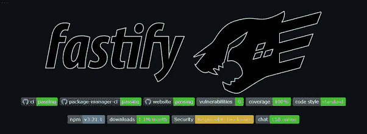

# 经过实战考验的 JavaScript 框架

> 原文：<https://javascript.plainenglish.io/battle-tested-javascript-frameworks-part-1-f9f011464f5c?source=collection_archive---------7----------------------->

JavaScript 就像软件工程的瑞士刀。它可以做你需要它做的事情，根据最小功率的[原理，它会去做。万一你想避免重新发明轮子，你应该使用一个框架来帮助你。有些人更适合这份工作，而有些人则不太适合。通过标题为“经过战斗考验的 JavaScript 框架”的系列文章，我们将向您展示哪些框架是可以依赖的，哪些对于特定的用例来说是不可靠的。](https://www.w3.org/2001/tag/doc/leastPower.html)

# 前端

# 反应

从技术上讲，React 是一个库，是三个框架中最受欢迎的。也被认为是最“灵活”的一种。过去，它只是关于应用程序的视图层。目前，随着计划中的[服务器组件](https://reactjs.org/blog/2020/12/21/data-fetching-with-react-server-components.html)的引入，它可能会成为一个轻量级的全栈框架。

## 反应积极

+最受欢迎

+各种用途的大量第三方扩展

+深受开发人员社区的喜爱

+业务逻辑易于在 React 本地应用中重用

## 反对意见

-可能有点重

-将 JavaScript、HTML 和 CSS 直接混合在一起

-不要太快

-第一方插件的有限列表

## 何时使用 React

各种规模公司的软件工程师都选择 React，因为它拥有广泛的社区支持和丰富的人才库。挑 React 不会错的。

## React GitHub 资源库

【https://reactjs.org/docs/getting-started.html 

# vue . j

在本节列出的三个框架中，Vue.js 是社区运行最多的一个。是[尤雨溪](https://twitter.com/youyuxi)的创作，主要决策者，其他库&框架的作者，比如 [Vite](https://vitejs.dev/) 或者 [Vitepress](https://github.com/vuejs/vitepress) 。在三个最流行的框架中，它的学习曲线最低，在中国获得了关注，之后在西方获得了欢迎。

你可以把它看作是反应和角度之间的一个选项。

## Vue.js Pros

+能做你需要它做的事情；它是三者中最灵活的

+扩展 Vue.js 功能的第一方框架生态系统

## 缺点

-在西方创业和企业环境中最不受欢迎

-对新的主要库版本的引入处理得不好

## 何时使用 Vue

Vue 经常和 PHP 后端一起使用。人才库比 React 或 Angular 开发人员要小；然而，找到精通 Vue.js 的开发人员仍然不会有太大的问题。如果你知道你不想在 web 应用程序和原生移动应用程序之间重用代码，就去找 Vue.js，因为尤雨溪框架的选项有点差和/或维护不好(Weex，Nativescript-Vue.js，Vue.js 原生)。

## Vue.js GitHub 存储库

[https://github.com/vuejs/vue](https://github.com/vuejs/vue)

# 有角的

本节最后一个前端框架。它最重，内置的功能最多。在谷歌的支持下，它在大公司中最受欢迎。用 TypeScript 编写的框架的每个方面都强调了它在最大的项目中的使用。

一个有趣的事实是，很多谷歌内部项目都使用 [AngularDart](https://github.com/angulardart/angular) ，这是用 [Dart](https://dart.dev/) 编写的框架的一个端口。

## 棱角分明的优点

+三者中最常发布的

+完全用打字稿写的

+非常固执己见

CLI 生成器

## 角度 Cons

-固执己见

-很重

-慢点

-开发人员并不普遍喜欢

## 何时使用角度

Angular 是三个主流框架中最重的，用例也最具体。只有当你知道你的前端会变得很大的时候，你才会使用它。

## Angular GitHub 知识库

[https://github.com/angular/angular](https://github.com/angular/angular)

# 混合物

# Next.js

Next.js，最受欢迎的 React 框架之一，它因使 React 开发变得毫不费力而广受欢迎。有许多内置功能，如[混合静态&服务器渲染](https://nextjs.org/docs/basic-features/pages#server-side-rendering)、静态 HTML 导出、 [API 路由](https://nextjs.org/docs/api-routes/introduction)(使您能够使用 Next.js 构建 API)，以及许多许多其他功能。

## Next.js Pros

+不需要配置

+快速上市

+搜索引擎优化比普通反应好得多

+对创业公司和企业都是一个很好的解决方案

## Next.js 缺点

-固执己见的路由-您被迫使用基于页面的路由

-很少第三方插件

## 何时使用 Next.js

Next.js 为开发 React 应用程序提供了一个自以为是的设置，由于其简单的混合渲染而被最大的用户使用。由于它的智能默认值，它经常被那些希望快速建立 MVP 的人使用。这展示了该框架成为所有 React 开发目的的明智选择的能力。

## Next.js GitHub 存储库

[https://github.com/vercel/next.js](https://github.com/vercel/next.js)

# Nuxt.js

Nuxt.js 到 Vue.js.js 就是 Next.js 要做的 React.js，它简化并加速了框架，为框架带来了一些非常受欢迎的功能，让您可以更专注于开发。

## Nuxt.js Pros

+不需要配置

+快速上市

+比普通 Vue.js.js 好得多的 SEO

+创业公司和企业的绝佳选择

+与 Vue.js.js 的创建者紧密协作

## Nuxt.js Cons

-固执己见的路由-您被迫使用基于页面的路由

-很少第三方插件

## 何时使用 Nuxt.js

Nuxt.js 是“直观的 Vue.js 框架。”它使用相同的基于页面的路由，并且和它的 React 对应物一样固执己见。因此，同样的用例也适用。如果你正在开发一个 Vue.js.js 应用程序，并且只想专注于此，你可能会喜欢智能默认设置和配置。

## Nuxt.js GitHub 存储库

https://github.com/nuxt/nuxt.js

# 后端

# NestJS

NestJS 是一个最适合 Angular 的框架，所有 Angular 开发人员都会感到熟悉。它不仅相似，而且完全是用 TypeScript 构建的。它在构建时也考虑到了大型应用程序，并拥有大量的第一方模块。

然而，该框架的作者确实准备了许多关于如何实现一些最重要特性的指南。他们应该成为创业工程师和新学习者采用的推动者。

## NestJS Pros

+非常固执己见

+设计可靠

+搭配棱角分明的

## NestJS Cons

-固执己见

-很少第三方插件

-在开发人员中不受欢迎

## 何时使用 NestJS

NestJS 最好与 Angular 搭配使用。因此，最好在更大口径的项目中使用它。在较小的项目中使用它通常是多余的。

## NestJS GitHub 存储库

【https://github.com/nestjs/nest 

# 表达

Express 可能是 Node.js 世界中最受欢迎的后端框架。它几乎总是每个 JavaScript 开发人员在他们的旅程中学习的第一个框架，并且通常足以快速启动和运行您的 MVP。

不幸的是，不建议在更大的项目中使用它，因为这个框架对于这个目的来说并不理想。首先，它目前不支持 async/await，而 async/await 是同时处理许多请求所必须的。更糟糕的是，库的最后一个版本(v.4.17.1)是…2019 年 5 月 26 日(！)，而 Express v5 从 2014 年就已经在 alpha 了(！).该库是您自己的内部库或 MVP 的良好起点。对于其他用途，列表中的其他选项对您来说是更好的选择。

## 表达赞成

+严重未电离

+可能是 Node.js 世界中最流行的后端框架

## 表达反对意见

-严重未电离

-可能已经死亡或依靠生命维持系统

-无异步/等待

## 何时使用

在开发你的爱好项目时使用，或者作为你内部图书馆的起点。

## GitHub 知识库

[https://github.com/expressjs/express](https://github.com/expressjs/express)

‍

# Fastify

顾名思义，这个库主要关注的是速度。它还声称在降低基础设施成本的同时关注开发者体验。它确实兑现了承诺，[是所有主要后端 Node.js 框架中最快的](https://www.fastify.io/benchmarks/)。

## Fastify Pros

+内置验证器

+快如闪电

+丰富的插件生态系统

+固执己见有出路

## 速食缺点

-没那么受欢迎

-没有多少公司使用它

## 何时使用 Fastify

当速度是您最关心的问题，并且您坚持只使用 JavaScript 时，这个库就是为您准备的。它是最快的主流 JavaScript 框架，拥有丰富的插件生态系统。如果您想使用 TypeScript，您仍然可以。

## Fastify GitHub 存储库

【https://github.com/fastify/fastify 

# 单元测试

# 茉莉

我们将从一个“简单的浏览器和 node . js JavaScript 测试框架”开始。它可以在 JavaScript 运行的任何地方运行，这使得它非常灵活。更重要的是，该库没有外部依赖性，这使得它的开销很低。

## 茉莉花茶

+无外部依赖性

+无论你在做什么，你都可以用 Jasmine 来测试

+内置断言库

## 茉莉骗局

-需要大量配置

-略微不直观的报道

-没有对重新运行失败测试的内置支持

## 什么时候用茉莉

因为这是列表中最普遍的位置，当有疑问时，使用茉莉。

## Jasmine GitHub 资源库

https://github.com/jasmine/jasmine‍

# 玩笑

Jest 是一个“专注于简单性”的库因此，它是零配置的，并在测试出错时提供有用的错误消息。

在脸书的支持下，它在 JavaScript 开发人员中非常受欢迎，并且可以与最受欢迎的库一起开箱即用。然而，与 Jasmine 相比，对库的支持并没有那么好。

## 笑话专家

+出色的文档

+简单

+视觉回归测试

+简易覆盖报告

## 玩笑骗局

-第一次学习可能很难习惯

-不支持像 Jasmine 一样多的库

## 何时使用笑话

如果你想轻松测试，那就去开玩笑吧。它曾经是用 *create-react-app* 创建的 React 应用的默认选项。

## Jest GitHub 知识库

https://github.com/facebook/jest

# 摩卡

Mocha 是一个库，通常被称为“Mocha/Chai ”,因为它最常与断言库 Chai 一起使用。另一个强调其简单性的库，在引入 Jest 后并不顺利。将两者相提并论可能有点不公平——毕竟 Mocha 是一个测试版，因此，它需要其他库才能工作。

最初的设计是为了支持 Node.js 测试，现在它的功能更加广泛，支持 Node.js 和浏览器代码。它还可以执行大量的测试，因为它可以执行集成和端到端测试。我们将它包含在这里，因为这是它最常见的用例。

## 摩卡专业版

+简单

+轻松支持发电机

+简单的异步测试

+您可以在多种断言库中进行选择

## 摩卡咖啡

-依赖第三方软件包(它本身并不是一个骗局，因为它不仅仅是为了测试而设计的)

-对新手来说很吓人

## 什么时候用摩卡

它没有前面提到的选项那么受欢迎，但也是最灵活的，因为它在技术上是*仅仅是一个测试运行程序，因此，你可以将它与你选择的断言库配对。*

## *Mocha GitHub 存储库*

*[https://github.com/mochajs/mocha](https://github.com/mochajs/mocha)*

# *端到端测试*

# *柏树*

**

*一个进化库，用于对浏览器中运行的任何东西进行进化测试。它简化了您执行端到端测试的方式——以前您必须使用许多不同的框架。有了 cypress，你所需要的只是基础框架——一切都捆绑在一起！*

## *赛普拉斯*

*+不使用硒*

*+使用 JavaScript 来定义测试*

*+易于使用*

*+快速配置*

## *赛普拉斯监狱*

*-不使用硒*

*-不支持 Safari 仅在 Chrome 中运行测试*

## *何时使用柏树*

*如有疑问，使用柏树。这是一个可靠的选择，有很多好处。对于您所有的端到端测试目的来说，这是一个安全的赌注。*

## *Cypress GitHub 存储库*

*[https://github.com/cypress-io/cypress](https://github.com/cypress-io/cypress)*

# *守夜人. js*

**

*另一个简单的框架。它利用 W3C WebDriver API 来执行所有预定义的命令。它有一个清晰的语法，感觉很直观，因此很容易掌握。有一个使用 Selenium 的选项，尽管默认情况下它使用标准的 WebDriver API。*

*该框架的一个巨大优势是它可以模仿 Firefox & Chrome。*

## *Nightwatch.js Pros*

*+可以使用不同的浏览器*

*+集成解决方案*

*+硒作为选择加入*

## *守夜人. js Cons*

*-不支持 Safari*

*-没那么受欢迎*

## *何时使用 Nightwatch.js*

*如果你用行为驱动的设计方式来设计你的应用程序，那么选择 Nightwatch。*

## *Nightwatch.js GitHub 存储库*

*【https://github.com/nightwatchjs/nightwatch】‍*

# *结论*

*这是一系列关于经过实战检验的框架的文章中的第一篇，展示了每个类别中最流行的框架；这只是未来的一小部分！*

*JavaScript 生态系统以拥有适合各种场合的包而闻名，这就是为什么我们将继续展示我们为所有不同目的选择的库和框架。然而，只有那些可以认真使用的，以及你可以放心下注的。*

**最初发表于*[T5【https://www.itmagination.com】](https://www.itmagination.com/blog/javascript-frameworks-part-1)*。**

**更多内容请看*[***plain English . io***](http://plainenglish.io/)*