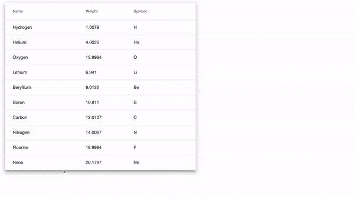

# 角度数据表中拖放行的漂亮样式

> 原文：<https://javascript.plainenglish.io/beautiful-styling-for-drag-and-drop-rows-in-the-angular-datatable-6870768c5a8f?source=collection_archive---------2----------------------->

角材料为它们的组成部分提供了丰富的例子。在我看来，这是对图书馆最强有力的支持之一。组件拥有最多的例子，但是在添加拖放功能上有点欠缺，尤其是在让它成为一种美好体验的时候。

这篇文章将介绍如何使用材料组件建立一个简单的数据表，拖放模块的结构，以及如何使其美观。

更喜欢学习代码？这是 GitHub 回购协议。


Angular Logo ([https://angular.io/presskit](https://angular.io/presskit))

## 基本数据表示例

角度材质数据表入门有很多精彩的教程([示例](https://material.angular.io/components/table/examples)、[演练](/implementing-angular-material-table-with-pagination-server-side-filtering-and-sorting-58e6a2ba4a48)、[拖放 api](https://material.angular.io/cdk/drag-drop/examples) )，这里只简单介绍一下初始设置。如果你已经熟悉基本的数据表，你可以跳到下一节。

一个漂亮的拖放表依赖于:

```
ng new draggable-data-table
npm install --save @angular/material
npm install --save @angular/cdk
npm install --save @angular/flex-layout
```

在我们的组件中，我们定义了一个简单的数据源，以及数据表中需要的列。

`app.component.ts`:

```
import { ***Component*** } from '@angular/core';

export interface PeriodicElement {
  name: string;
  weight: number;
  symbol: string;
}

const ELEMENT_DATA: PeriodicElement[] = [
  {name: 'Hydrogen', weight: 1.0079, symbol: 'H'},
  {name: 'Helium', weight: 4.0026, symbol: 'He'},
  {name: 'Lithium', weight: 6.941, symbol: 'Li'},
  {name: 'Beryllium', weight: 9.0122, symbol: 'Be'},
  {name: 'Boron', weight: 10.811, symbol: 'B'},
  {name: 'Carbon', weight: 12.0107, symbol: 'C'},
  {name: 'Nitrogen', weight: 14.0067, symbol: 'N'},
  {name: 'Oxygen', weight: 15.9994, symbol: 'O'},
  {name: 'Fluorine', weight: 18.9984, symbol: 'F'},
  {name: 'Neon', weight: 20.1797, symbol: 'Ne'},
];

@Component({
  selector: 'app-root',
  templateUrl: './app.component.html',
  styleUrls: ['./app.component.css']
})
export class AppComponent {
  displayedColumns: string[] = ['name', 'weight', 'symbol'];
  dataSource = ELEMENT_DATA;
}
```

材料数据表由绑定数组数据源的模板定义。它通过迭代数组的元素来生成表行和数据。`fxFlex`和`fxLayout`指令指定表格从左边距的 5%开始，占据窗口宽度的 50%。

`app.component.html`:

```
<div fxFlex fxLayout="row wrap">
  <div fxFlex="5"></div>
  <div fxFlex="50" class="mat-elevation-z8">
    <table mat-table
           #***dataTable*** fxFlex
           [dataSource]="dataSource">

      <!-- Name Column -->
      <ng-container matColumnDef="name">
        <th mat-header-cell **matHeaderCellDef*> Name </th>
        <td mat-cell **matCellDef*="let ***element***"> {{***element***.name}} 
        </td>
      </ng-container>

      <!-- Weight Column -->
      <ng-container matColumnDef="weight">
        <th mat-header-cell **matHeaderCellDef*> Weight </th>
        <td mat-cell **matCellDef*="let ***element***"> {{***element***.weight}} 
        </td>
      </ng-container>

      <!-- Symbol Column -->
      <ng-container matColumnDef="symbol">
        <th mat-header-cell **matHeaderCellDef*> Symbol </th>
        <td mat-cell **matCellDef*="let ***element***"> {{***element***.symbol}}
        </td>
      </ng-container>

      <tr mat-header-row **matHeaderRowDef*="displayedColumns"></tr>
      <tr mat-row
          **matRowDef*="let ***row***;
          columns: displayedColumns;"></tr>

    </table>
  </div>
  <div fxFlex="45"></div>
</div>
```

将导入添加到您的`app.module.ts`

```
imports: [
...
  DragDropModule,
  MatTableModule,
  FlexLayoutModule,
...]
```

## 添加拖放

要添加拖放功能，我们必须将表格定义为`cdkDropList`，将行定义为`cdkDrag`。`cdkDropList`是一个容器，当包装在`cdkDrag`元素周围时，它将拖动元素分组到一个可重新排序的列表中。还有许多其他方式来利用拖放模块，但是对于列表或表格之类的数据，它提供了我们良好的用户交互所需的大部分逻辑。

它没有提供的一点是更新数据源的逻辑。我们将监听`cdkDropList`上的 drop 事件，并在事件发出时自己更新数据:`(cdkDropListDropped)="dropTable($event)"`，其中`dropTable`在组件上定义。我们移动数组中的项目，然后触发表重新呈现行。

新表:

```
<table mat-table
       #***dataTable*** fxFlex
       [dataSource]="dataSource"
       cdkDropList
       (cdkDropListDropped)="dropTable(***$event***)">
```

表格行:

```
<tr mat-row
    **matRowDef*="let ***row***;
    columns: displayedColumns;"
    cdkDrag
></tr>
```

修订后的应用程序组件:

```
import { MatTable } from '@angular/material/table';
import { CdkDragDrop, moveItemInArray } from '@angular/cdk/drag-drop';...export class AppComponent {
  @ViewChild('dataTable') table: MatTable<PeriodicElement>;
  displayedColumns: string[] = ['name', 'weight', 'symbol'];
  dataSource = ELEMENT_DATA;

  dropTable(event: CdkDragDrop<PeriodicElement[]>): void {
    moveItemInArray(this.dataSource, event.previousIndex, event.currentIndex);
    this.table.renderRows();
  }
}
```

此时，该表具有拖放功能，但它非常难看。



Animated Table — Initial version that needs styling.

## 让拖放变得漂亮

为了让桌子看起来漂亮，我们首先需要设计`cdkDragPlaceholder`和`cdkDragPreview`的样式。当主动拖动时，预览是被拖动的 UI 组件。占位符是表中呈现的临时 UI 元素。


Preview vs. Placeholder in the Angular Drag and Drop CDK

预览样式有两个方面。预览本身必须进行样式化，但是，作为预览子元素的表格数据元素也必须进行样式化。目标是让样式表明用户点击的是 UI 元素。不幸的是，来自`mat-table`的造型在拖动预览中丢失了，所以我们必须通知它的关键部分。

对于预览，样式的关键是设置`display: table;`并使预览的高度与表格行的高度相同。表格数据元素利用`flex-grow`在行内适当调整大小。

```
.cdk-drag-preview {
  box-sizing: border-box;
  border-radius: 4px;
  box-shadow: 0 5px 5px -3px rgba(0, 0, 0, 0.2), 0 8px 10px 1px   
              rgba(0, 0, 0, 0.14), 0 3px 14px 2px 
              rgba(0, 0, 0, 0.12);

  height: 48px;
  background-color: white;
  display: table;
}

.cdk-drag-preview td {
  flex-grow: 2;
  font-size: 14px;
  padding: 4px;
  vertical-align: middle;
}
```

用作占位符的`div`被添加到表格 HTML 中。它的风格有点简单。

修改后的应用程序 HTML:

```
...
<tr mat-header-row **matHeaderRowDef*="displayedColumns"></tr>
  <tr mat-row
      **matRowDef*="let ***row***;
      columns: displayedColumns;"
      cdkDrag
  ></tr>

  <div **cdkDragPlaceholder*></div>

</table>
...
```

占位符的背景为灰色:

```
.cdk-drag-placeholder {
  background-color: grey;
}
```

造型的最后一点是由两个动画完成的。我喜欢拖动的行滑入位置的动画，以及行滑出占位符的动画。这些可以通过以下方式添加:

```
.cdk-drag-animating {
  transition: transform 250ms cubic-bezier(0, 0, 0.2, 1);
}

.cdk-drop-list-dragging .mat-row:not(.cdk-drag-placeholder) {
  transition: transform 250ms cubic-bezier(0, 0, 0.2, 1);
}
```

## 齐心协力

表格现在有了很棒的拖放样式。你可以看到它的样子:


Data table with all of our styling and animations

完整的例子，你可以从 [GitHub](https://github.com/matteson/drag-drop-data-table) 获取代码。