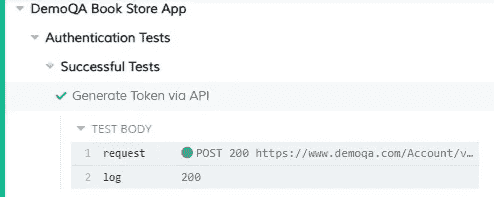
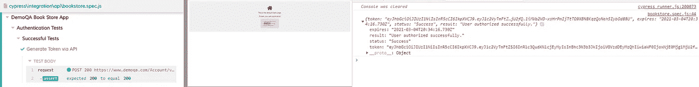

# 使用 Cypress 请求成为更好的测试人员

> 原文：<https://javascript.plainenglish.io/become-a-better-tester-using-cypress-requests-80d104dd59d9?source=collection_archive---------4----------------------->

## 如何使用 Cypress 请求库进行 API 调用和 API 测试？


Photo by [Pavan Trikutam](https://unsplash.com/@ptrikutam?utm_source=medium&utm_medium=referral) on [Unsplash](https://unsplash.com?utm_source=medium&utm_medium=referral)

您是否厌倦了在自动化框架之外维护一个用于 API 测试的 Postman 集合？

我工作的公司使用 Postman/Newman 进行 API 测试，使用 Cypress 进行端到端测试。我们将手动导出 Postman 集合，然后将导出内容登记到项目存储库中。整个过程相当脆弱和麻烦，因为我们有两个 API 文档的位置:

1.  邮递员赛跑者
2.  项目存储库

为什么不整合工具并使用 Cypress 作为我们的端到端和 API 测试运行程序呢？

本教程将演示如何使用 Cypress 的内置请求库进行 API 调用，因此它可以作为传统 API 测试框架的替代品。不用维护两个独立的工具(如果算上 Postman 的 Newman 工具，就是三个)，您可以简单地维护您的 Cypress 实现。

# 入门指南

对于任何新的 JavaScript 项目，我们必须使用 NPM 进行初始化。

```
npm init
```

一旦我们有了一个`package.json`文件，我们就可以开始加载 Cypress。

```
npm install --save-dev cypress
```

一旦安装了 Cypress，用 NPM 运行它，这样它就可以完成安装。

```
npx cypress open
```

当一个`cypress`目录被创建后，Cypress 就完成了安装。您还可以通过运行`npx cypress --version`来验证安装是否正确。

# 进行 API 调用

Cypress 使用内置的请求库使 API 请求变得简单。`request`方法采用以下参数的组合:

*   统一资源定位器
*   身体
*   方法
*   附加选项

这可以用下面的例子来说明:

An API request for a DemoQA access token.

上面的函数使用方法、URL 和主体对 DemoQA 授权令牌端点发出请求。请注意，我们没有对`response`执行任何操作。

默认情况下，`cy.request`将返回一个`response`对象，不管请求是否成功。响应对象可以包含以下元素:

*   身体
*   状态
*   头球
*   持续时间

为了对请求响应采取行动，我们必须包含一个回调函数来捕获响应，然后对对象做一些事情。

An API request with a log for response status.

我们现在已经实现了响应状态日志。这将在执行时显示在 Cypress 测试运行程序中。



A passing API request with logged response status.

# 编写测试

我们可以采用上面的请求方法，开始编写 API 测试。首先，我们将添加一个简单的检查，检查响应状态是否等于 200 OK。

Sample API test with an expected response.

我们现在向授权令牌端点发出请求，并捕获响应。然后在`expect`块中使用该响应来声明响应对象的状态为 200 OK。

断言反对响应状态是一个好的开始，但是，我们可以通过确保响应体返回我们所期望的来强化我们的测试。我们可以通过添加`console.log($response.body);`并在运行时检查开发工具控制台来检查响应体是什么样子的。



我们可以看到响应对象包含令牌、状态、结果和过期密钥。我们可以使用这些来做出额外的断言，从而强化我们的测试用例。

Our finished test after assertion hardening.

您还可以从响应对象中创建别名，例如`response.body.token`的别名，在其他 API 测试中用作授权头。这最好在 before 块中完成，因为别名在每次测试后都会被垃圾收集，以避免冲突。

API test using an alias for authorization header.

上面演示了如何使用身份验证命令作为别名。我们的`authenticate`命令返回一个响应令牌，该令牌作为别名保存在赛普拉斯的事件循环中。我们在测试中获取别名的值，然后提供别名作为授权头。这允许我们对像上面这样从 DemoQA 书店应用程序中获取书籍的受保护端点采取行动。

# 摘要

使用 Cypress 作为 API 测试运行程序既快速又高效。赛普拉斯不仅仅是一个端到端的解决方案，它还可以取代传统的 API 测试工具，比如邮差/Newman。这使得您的团队花在维护独立工具上的时间更少，花在最重要的事情上的时间更多:应用程序质量。

# 资源

1.  “请求。”*柏树文档*，2021 年 2 月 25 日，[docs.cypress.io/api/commands/request.html#Syntax](http://docs.cypress.io/api/commands/request.html#Syntax)。
2.  "变量和别名." *Cypress Documentation* ，2021 年 2 月 25 日，[docs . Cypress . io/guides/core-concepts/variables-and-alias . html # Return-Values](http://docs.cypress.io/guides/core-concepts/variables-and-aliases.html#Return-Values)。

**Jonathan Thompson** 是 Pendo.io 的高级质量工程师，专注于测试自动化。他目前居住在北卡罗来纳州的罗利，与他的妻子和一个名叫温斯顿的戈德多德尔(Goldendoodle)住在一起。您可以通过 [LinkedIn](https://www.linkedin.com/in/jonathanmnthompson/) 与他联系，也可以通过 [Twitter](https://twitter.com/jacks_elsewhere) 或 [Github](http://github.com/ThompsonJonM) 关注他。