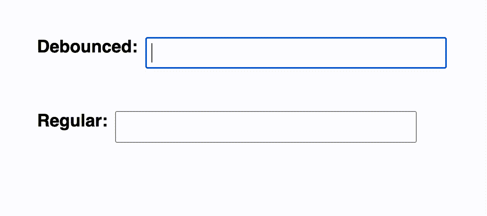

# 去抖动与节流初学者指南

> 原文：<https://javascript.plainenglish.io/beginners-guide-to-debouncing-vs-throttling-19d663f0ff43?source=collection_archive---------8----------------------->

网站性能在改善用户体验方面发挥着巨大的作用。这有时很容易做到，方法是限制函数调用的频率，只在发生重大变化时才调用它。

这就把我们带到了去抖和节流的话题上，选择最适合它们的一个是至关重要的，因为它们有不同的效果。

# 让我们先解决基本的问题

**节流**和**去抖**是限制事件处理速率的两种方式。

你可能会问什么是事件？

事件是系统中发生的动作。在前端开发系统将是浏览器和事件的例子将是调整窗口大小或点击按钮。

在 JavaScript 中，您可以使用事件监听器对事件做出反应。event *listener* 是一个函数，它监听 DOM 元素上的给定事件，并在事件发生时执行一个处理函数。要添加事件，您可以使用***addevent listener***函数*。*

# 去抖动

根据去抖动概念，事件无论被用户触发多少次，都将仅在用户不触发该事件的某个不活动时间之后执行。

在这种情况下，如果用户像永远一样连续点击一个按钮，函数将永远不会被调用，因此很容易出现饥饿。

这可以用于电子商务网站，在那里你可以搜索一个特定的项目，它会根据你的查询给出建议。在每次按下关键字时发送 API 调用并因此限制去抖动的速率是没有意义的。

假设您要搜索*罗技 G102* ，去抖持续时间设置为 300 毫秒。你进入搜索栏并开始编写你的查询，在编写完 Logitech 后，你停顿了 300 毫秒以上，这时将调用该函数根据查询向你提供建议，如果没有停顿，它根本不会启动。

让我们来看看真人表演。

你们可以尝试的一个很好的例子是[这里的](https://codepen.io/dcorb/pen/XXPjpd)。感谢 [Corbacho](https://codepen.io/dcorb) 提供了这款精彩的 codepen。

# 节流

根据节流概念，如果用户持续触发事件，则函数将在特定时间段后被严格调用。

在这种情况下，如果用户像永远一样连续点击一个按钮，该函数将在给定的时间内被调用一次，而不管事件被触发的频率如何。

一个很好的例子是一个射击游戏，玩家尽可能快地连续射击目标，如果使用节流，子弹在给定的时间内只发射一次，不管用户点击的速度有多快。

你们可以尝试的一个很好的例子是[这里](https://codepen.io/dcorb/pen/eJLMxa)。感谢[科尔巴乔](https://codepen.io/dcorb)为这个美妙的密码本。

# 节流与去抖

让我们举一个例子，一名员工想要加薪，并向经理提出要求。

一个例子是，他一直缠着他的经理要求加薪，而他的经理已经厌倦了每天听到同样的故事。所以他说，如果他工作一个月，他就会提高工资，并且在此期间不会提高工资，如果他在此期间之前提高工资，那么他将不得不重新开始。

这就是去抖的工作原理。

另一种情况是，他提出了加薪的问题，这时经理同意并给他加薪。但这次员工想要更多，因此开始不断要求更多。了解员工的行为后，他会在一段时间内忽略他，然后提高他的工资，但在给定的时间内从未提高过两次。

这就是节流的工作原理。

让我们看看它的实际效果。

感谢[本](http://demo.nimius.net/debounce_throttle/) [网站](http://demo.nimius.net/debounce_throttle/)为 GIF。

# 什么时候用什么？

这两个概念都有各自的优点和缺点，并在此基础上产生了它们的用例。

当最近事件发生的结果是重要的，而之前的事件不太重要时，可以使用去抖。

当提供给函数的输入无关紧要或每次都相同时，可以使用节流。一个小例子是网页上的无限滚动。这里我们只需要检查用户离页面底部有多远。如果它们很接近，我们请求更多的数据并将其附加到页面上。去抖不会工作，因为它只会在用户停止时触发，这不是我们想要的。

另一个例子是多人射击游戏，你的角色必须开枪杀死对手。可以对步枪的射击能力进行节流，使其每秒只能射击一次。现在，即使玩家在 5 秒钟内发出击打 10 次的命令，射出的子弹数也只有 5 发。

# 结论

去抖动和节流等技术让我们能够控制网站中事件的执行，帮助我们减少可能会影响网站性能的高计算任务的数量