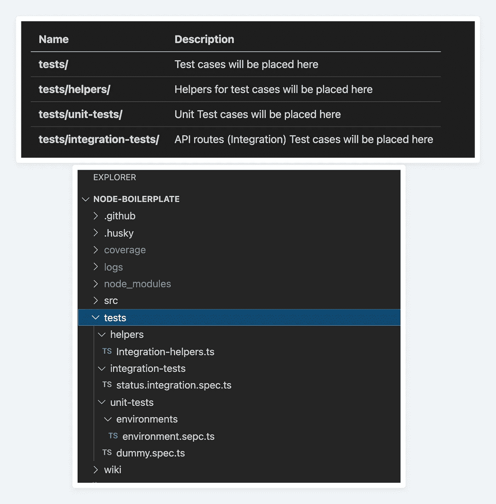
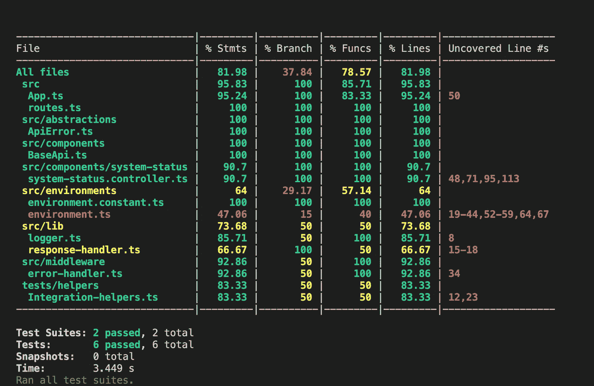
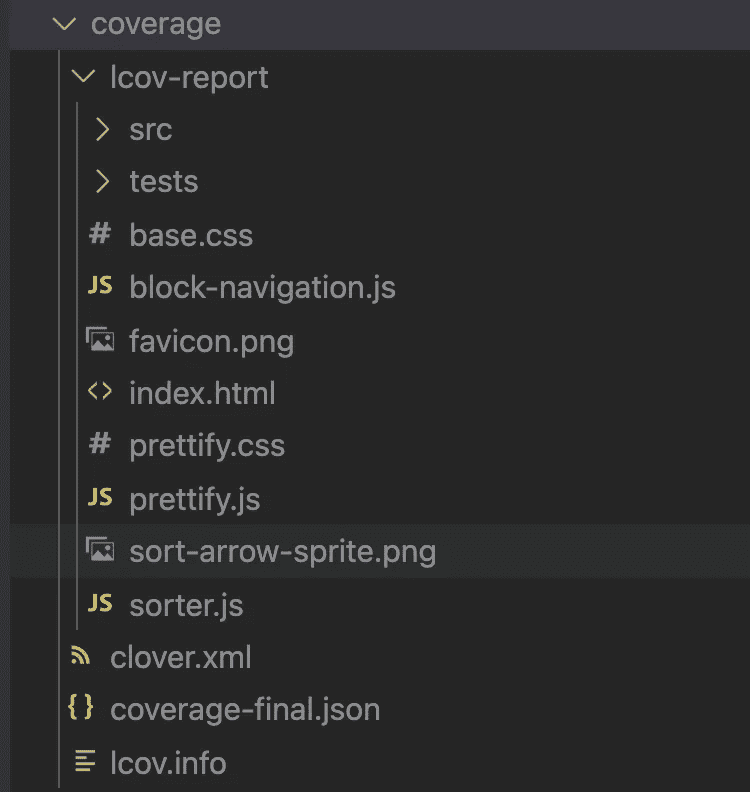
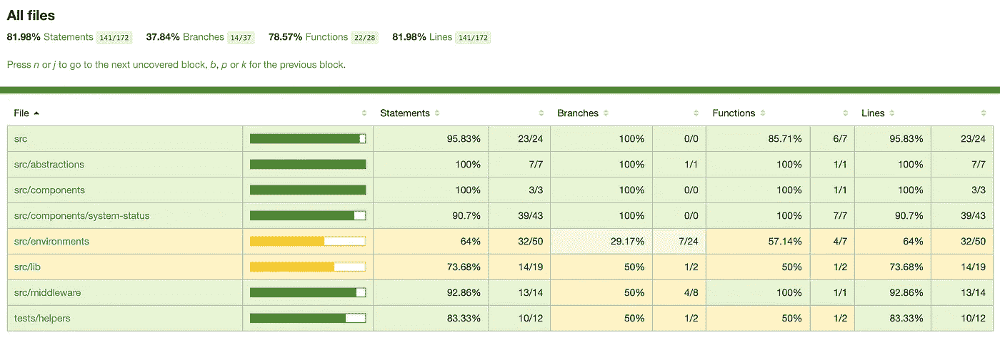

# 初学者用 TypeScript 和 Node.js 中的 Jest 进行测试

> 原文：<https://javascript.plainenglish.io/beginners-guide-to-testing-jest-with-node-typescript-1f46a1b87dad?source=collection_archive---------0----------------------->


Photo by [Kelvin Ang](https://unsplash.com/@kelvin1987?utm_source=medium&utm_medium=referral) on [Unsplash](https://unsplash.com?utm_source=medium&utm_medium=referral)

本文将帮助您在 **TypeScript** 和 **Node.js** 应用程序中设置 **Jest** 。

请查看文章[以 TypeScript 编写的 Node.js 应用程序框架(带有 ESLint、漂亮和哈士奇的设置说明)](https://blog.santoshshinde.com/skeleton-for-node-js-apps-written-in-typescript-444fa1695b30)

## 先决条件

*   npm
*   npx
*   Node.js
*   以打字打的文件

[](https://github.com/santoshshinde2012/node-boilerplate) [## git hub-santoshshinde 2012/Node-样板:用于微服务的节点类型样板…

### 微服务的节点类型脚本样板。用 TypeScript 编写的 Node.js 应用程序的框架(带有设置说明…

github.com](https://github.com/santoshshinde2012/node-boilerplate) 

## 基础理论([npx 与 npm 的区别？](https://stackoverflow.com/questions/50605219/difference-between-npx-and-npm))

*   NPM——管理软件包，但执行任何软件包都不容易。
*   NPX —用于执行节点包的工具。

# 所需的 npm 模块

*   `jest`
*   `@types/jest`
*   `ts-jest`
*   `supertest`

## [玩笑](https://github.com/facebook/jest)

Jest 是一个令人愉快的 JavaScript 测试框架，注重简单性。

```
npm install --save-dev jest
```

## [@ type/jest](https://github.com/DefinitelyTyped/DefinitelyTyped/tree/master/types/jest)

该软件包包含 Jest([https://jestjs.io/](https://jestjs.io/))的类型定义。

```
npm install --save-dev @types/jest
```

## [ts-jest](https://github.com/kulshekhar/ts-jest)

这是 jest ( `ts-jest`)的 TypeScript 预处理器，它允许 jest 动态传输 TypeScript 文件，并内置源代码映射支持。

一个带有源代码映射支持的 Jest 转换器，允许您使用 Jest 来测试用 TypeScript 编写的项目。

```
npm install --save-dev ts-jest
```

## [超级测试](https://github.com/visionmedia/supertest)

SuperTest 是一个 HTTP 断言库，它允许您测试您的 Node.js HTTP 服务器。它建立在超级代理库之上，超级代理库是 Node.js 的 HTTP 客户端。

```
npm install --save-dev supertest
```

# 配置笑话

## 第一步。基本配置

将以下`jest.config.js`文件添加到您的项目根目录中:

```
module.exports = {
  preset: 'ts-jest',
  testEnvironment: 'node',
};
```

## 第二步。使用带有 Jest 测试的 dotenv 设置全局环境变量

在`jest.config.js`文件中添加以下代码，以访问规格文件中的环境变量。

```
setupFiles: ['dotenv/config'],
```

添加上述文件后，jest 配置将如下所示

```
module.exports = {
  preset: 'ts-jest',
  testEnvironment: 'node',
  setupFiles: ['dotenv/config'],
};
```

现在你可以访问测试用例文件中的`.env`变量。

示例:`process.env.BASE_URL`

## 第三步。在 package.json 中添加操作脚本

在下面的文件中添加动作脚本`package.json`来运行测试用例。

```
"test": "jest --coverage",
"test:watch": "jest --watch"
```

# 文件夹结构

请分别在下面找到`tests`、`tests/helpers`、`tests/unit-tests`和`tests/integration-tests`的文件夹结构和每个文件夹的描述。



folder structure

# 应用程序运行实例助手

如果我们想要测试任何端点，那么我们需要在另一个终端中运行应用程序，并使用`supertest`模块来使用该 API。

为了避免这种情况，我们可以创建一个集成助手，它将动态运行应用程序来测试特定的组件。

创建`tests/helpers/Integration-helpers.ts`文件，并在其中添加以下代码。您可以使用这个文件来创建另一个在测试用例中可能需要您的助手。

```
import * as express from 'express';
import App from '../../src/App';
import Environment from '../../src/environments/environment';
import logger from '../../src/lib/logger';export default class IntegrationHelpers { public static appInstance: express.Application; public static async getApp(): Promise<express.Application> {
        if (this.appInstance) {
            return this.appInstance;
        }
        const env: Environment = new Environment(process.env.NODE_ENV);
        const app: App = new App(env);
        await app.init();
        this.appInstance = app.express; return this.appInstance;
    } public clearDatabase(): void {
        logger.info('clear the database');
    }}
```

# 单元测试

程序员在类中测试逻辑，以显示代码级别的正确性。它们应该很快，并且不依赖于您不打算测试的系统的其他部分。

在这里，我们可以测试我们在应用程序中使用的特定类、服务或控制器。

例如，我们为环境类创建了几个测试用例，我们在应用程序中使用它们来设置/配置环境变量。

```
import 'jest';
import Environment from '../../../src/environments/environment';
import { Environments } from '../../../src/environments/environment.constant';

describe('Environment', () => {
    let instance: Environment;

    beforeEach(() => {
        instance = new Environment('local');
    });

    it('should get the current environment', async () => {
        expect(instance).toBeInstanceOf(Environment);
        const environment = instance.currentEnvironment();
        expect(environment).toBeDefined();
        expect(environment).toBe(Environments.LOCAL);
    });

    it('should check if environement is production or not', async () => {
        const result = instance.isProduction();
        expect(result).toBe(false);
    });

    it('should check if environement is production or not', async () => {
        const result = instance.isProduction();
        expect(result).toBe(false);
    });

    it('should set the current environment', async () => {
        instance.setEnvironment('local');
        const environment = instance.currentEnvironment();
        expect(environment).toBeDefined();
        expect(environment).toBe(Environments.LOCAL);
    });
});
```

# 集成测试案例

模块不同部分之间的测试通信路径由测试部门或开发人员来完成，以表明所有模块能够正确地协同工作。

在这里，我们将测试我们创建的从客户端使用的端点或 API。

请在下面找到状态组件集成测试用例的源代码。

```
import 'jest';
import * as express from 'express';
import * as request from 'supertest';
import {
    StatusCodes,
} from 'http-status-codes';
import IntegrationHelpers from '../helpers/Integration-helpers';describe('status integration tests', () => {
    let app: express.Application; beforeAll(async() => {
        app = await IntegrationHelpers.getApp();
    }); it('can get server time', async () => {
        await request(app)
            .get('/api/status/time')
            .set('Accept', 'application/json')
            .expect((res: request.Response) => {
                // eslint-disable-next-line no-console
                console.log(res.text);
            })
            .expect(StatusCodes.OK);
    }); it('can get server system info', async () => {
        await request(app)
            .get('/api/status/system')
            .set('Accept', 'application/json')
            .expect(StatusCodes.OK);
    }); it('can get server system usage', async () => {
        await request(app)
            .get('/api/status/usage')
            .set('Accept', 'application/json')
            .expect(StatusCodes.OK);
    }); it('can get server system process info', async () => {
        await request(app)
            .get('/api/status/process')
            .set('Accept', 'application/json')
            .expect(StatusCodes.OK);
    }); it('should get the error', async () => {
        await request(app)
            .get('/api/status/error')
            .set('Accept', 'application/json')
            .expect(StatusCodes.BAD_REQUEST);
    });});
```

# 运行测试用例

要运行测试用例，请点击终端上的命令`npm run test`。



Terminal

您也可以在`coverage`文件夹中查看详细报告。



Output Folder

如果您在浏览器中打开 index.html，那么您将获得每个文件代码覆盖率的结果。



coverage

如果这个博客为你的学习增加了价值，请分享你的评论并鼓掌。

# 参考

[](/skeleton-for-node-js-apps-written-in-typescript-444fa1695b30) [## 用 TypeScript 编写的 Node.js 应用程序的框架

### 包含 ESLint、Prettier 和 Husky 的设置说明。

javascript.plainenglish.io](/skeleton-for-node-js-apps-written-in-typescript-444fa1695b30) [](https://github.com/santoshshinde2012/node-boilerplate) [## GitHub-Santosh shinde 2012/Node-Boilerplate:用于微服务的节点类型脚本样板…

### 微服务的节点类型脚本样板。用 TypeScript 编写的 Node.js 应用程序的框架(带有安装说明…

github.com](https://github.com/santoshshinde2012/node-boilerplate) [](https://www.linkedin.com/feed/update/urn:li:activity:6824643603940335616/) [## LinkedIn 上的 Santosh Shinde:# JavaScript # typescript # Node

### 有 Typescript 的 Node JS 选择哪个测试框架比较好？# JavaScript # typescript # Node # nodejs # mocha…

www.linkedin.com](https://www.linkedin.com/feed/update/urn:li:activity:6824643603940335616/) 

*更多内容看*[***plain English . io***](http://plainenglish.io)