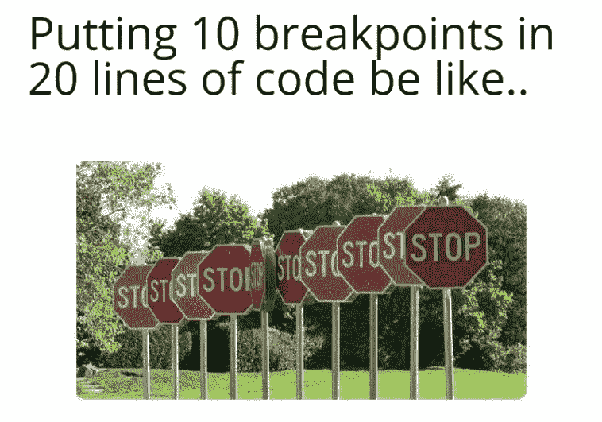
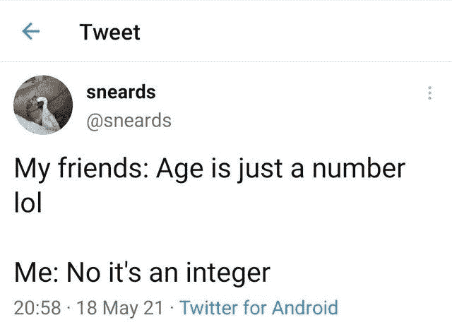
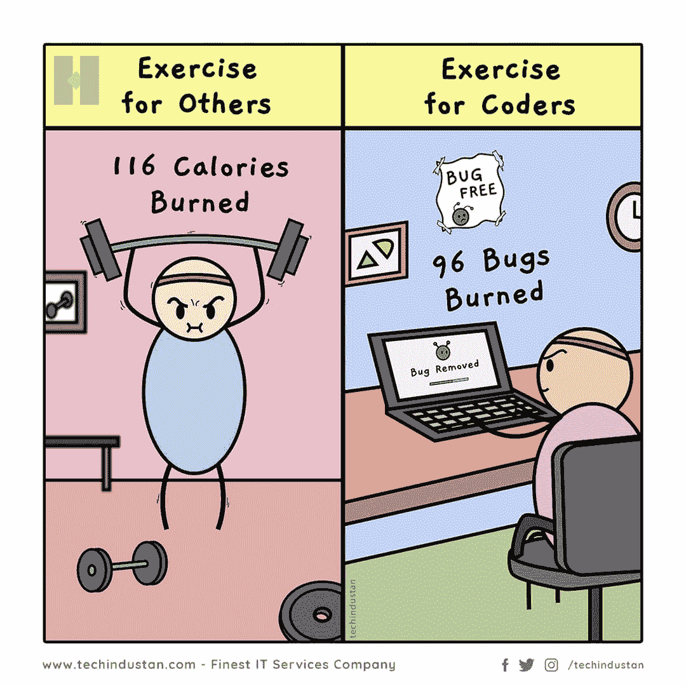
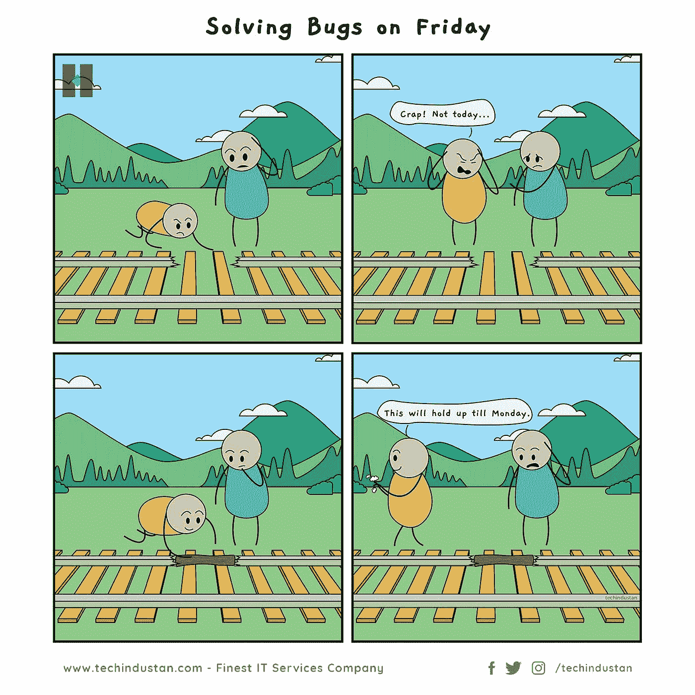

# 最佳 10 个编程笑话让你会心一笑

> 原文：<https://javascript.plainenglish.io/best-10-programming-jokes-to-bring-a-smile-to-your-face-b23ec4bd1f3f?source=collection_archive---------13----------------------->

## 最佳编程幽默汇编

Photo by [Nathan Dumlao](https://unsplash.com/@nate_dumlao?utm_source=medium&utm_medium=referral) on [Unsplash](https://unsplash.com?utm_source=medium&utm_medium=referral)

***笑话和快乐有什么联系吗？*** 如果你是我这种类型的人，那么你可能也爱在下班后查看手机。猜猜我在那里看到了什么？

我主要是在网上看到**的视频、抖音和笑话**。我不知道为什么，但这有助于我提神醒脑，减轻工作压力。

# 这就是为什么我相信 *laugher 是人类最好的刷新按钮。*

在这篇文章中，我收集了一些我喜欢的网络迷因。

# 当我开始调试时…哈哈

[https://programmerhumor.io/programming-memes/why-dont-you-just-step-over-2/](https://programmerhumor.io/programming-memes/why-dont-you-just-step-over-2/)

# 当开发人员错过时，意味着没有适当的单元测试，当 QA 错过时…

[https://www.facebook.com/yuva.krishna.memes](https://www.facebook.com/yuva.krishna.memes)

# 这种感觉…

[https://www.facebook.com/yuva.krishna.memes](https://www.facebook.com/yuva.krishna.memes)

# 好建议…

[https://www.facebook.com/yuva.krishna.memes](https://www.facebook.com/yuva.krishna.memes)

# 希望这个梦想成真…

[https://www.facebook.com/yuva.krishna.memes](https://www.facebook.com/yuva.krishna.memes)

# 这是谁写的？我们来玩一个指责游戏吧… LOL

[https://www.facebook.com/yuva.krishna.memes](https://www.facebook.com/yuva.krishna.memes)

# 让我们有一个强制性的 PJ…

[https://www.reddit.com/r/ProgrammerHumor/](https://www.reddit.com/r/ProgrammerHumor/)

# 为什么免费试用会询问信用卡详情？

[https://www.facebook.com/codewithK.K](https://www.facebook.com/codewithK.K)

# 程序员练习…

[https://www.facebook.com/techindustan](https://www.facebook.com/techindustan)

# 周五解决 bugs

[https://www.facebook.com/techindustan](https://www.facebook.com/techindustan)

# 奖励时间:

# 你喜欢幸运饼干吗？如果你收到这个，作为一个开发者你的反应是什么？

[https://www.facebook.com/yuva.krishna.memes](https://www.facebook.com/yuva.krishna.memes)

# 我也有同样的感觉…当我很少用纸和笔写字的时候…

[https://www.facebook.com/yuva.krishna.memes](https://www.facebook.com/yuva.krishna.memes)

# 我不在乎，我知道这是一种不好的态度，但让我享受这种感觉…

[https://www.facebook.com/yuva.krishna.memes](https://www.facebook.com/yuva.krishna.memes)

# 一切皆有可能..不管怎样，你都可以得到结果。

[https://www.facebook.com/yuva.krishna.memes](https://www.facebook.com/yuva.krishna.memes)

# 让我们来看看 Div 的虚拟世界…在我改变位置进行适当调整后，他们看起来是怎样的…

[https://www.facebook.com/yuva.krishna.memes](https://www.facebook.com/yuva.krishna.memes)

# 当我在代码中发现一个问题时，最常见的事情发生了…

[https://www.monkeyuser.com/](https://www.monkeyuser.com/)

# 下次我会试着写正确的代码…让我们今天就发出请求吧…

[https://www.monkeyuser.com/](https://www.monkeyuser.com/)

# 我的分支在做什么？

[https://www.facebook.com/ProgrammersCreateLife](https://www.facebook.com/ProgrammersCreateLife)

# 当我们每年收到太多的框架时..这很正常…

[https://www.facebook.com/programminggeeks.in](https://www.facebook.com/programminggeeks.in)

# 你喜欢什么？我正在学习一门新的语言…

[https://www.facebook.com/techindustan/](https://www.facebook.com/techindustan/)

# 为帮助我们脱帽致敬…

[https://www.facebook.com/programminggeeks.in](https://www.facebook.com/programminggeeks.in)

# 进一步阅读

 [## 有趣的比较:程序员与普通人

### 是什么让程序员与众不同？

javascript.plainenglish.io](/funny-comparisons-programmers-vs-normal-people-3aa7002f62f0)  [## 日常的编程笑话

### 最佳编程迷因汇编(第 4 部分)

javascript.plainenglish.io](/daily-dose-of-programming-jokes-6541eba98194)  [## 2021 年最佳编程幽默汇编

### 编程迷因可以减轻你的压力

blog.devgenius.io](https://blog.devgenius.io/best-programming-humor-compilations-2021-623473bfb0d)  [## 有趣的编程迷因会让你笑死

### 编笑话来点亮你的周五

blog.devgenius.io](https://blog.devgenius.io/funny-programming-memes-that-will-make-you-die-laughing-1ccd8e139040)  [## 编程迷因和幸福之间的联系

### 2021 年最佳编程迷因汇编

blog.devgenius.io](https://blog.devgenius.io/the-connection-between-programming-memes-and-happiness-d768ab85b83d)  [## 10 个能让你心情轻松的最佳编程笑话

### 你读过的关于编程迷因 2021 的最不可思议的文章

medium.com](https://medium.com/geekculture/10-best-programming-jokes-to-lighten-up-your-mood-8870dab2bff7)  [## 日常的编程笑话

### 最佳编程迷因汇编(第 1 部分)

javascript.plainenglish.io](/daily-dose-of-programming-jokes-cb9b74fcfa2e) 

*更多内容请看*[***plain English . io***](http://plainenglish.io/)