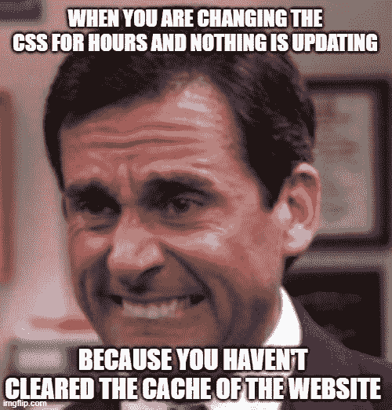
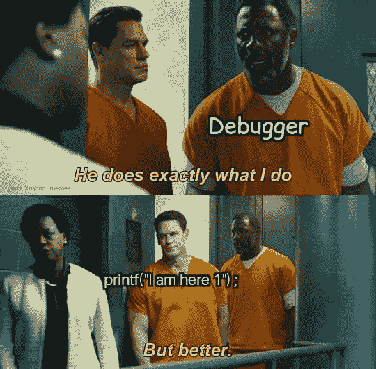
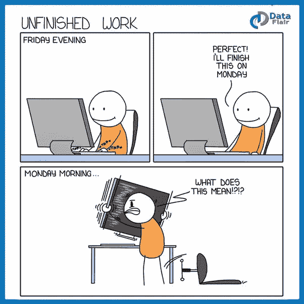

# 十大最佳编程迷因让你喜笑颜开

> 原文：<https://javascript.plainenglish.io/best-10-programming-memes-to-bring-a-smile-to-your-face-37926c8805e2?source=collection_archive---------1----------------------->

## 最佳编程幽默汇编(第二部分)

Photo by [Vicky Hladynets](https://unsplash.com/@vhladynets?utm_source=medium&utm_medium=referral) on [Unsplash](https://unsplash.com?utm_source=medium&utm_medium=referral)

***笑话和快乐有什么联系吗？*** 如果你是我这种类型的人，那么你可能也爱在下班后查看手机。猜猜我在那里看到了什么？

我主要是在网上看到**的视频、抖音和笑话**。我不知道为什么，但这有助于我提神醒脑，减轻工作压力。

# 当你是一名 UI 开发人员时的那种感觉…

[https://www.facebook.com/DZoneInc/photos/a.336758034711/10159569905119712/](https://www.facebook.com/DZoneInc/photos/a.336758034711/10159569905119712/)

**来源:**[https://www.facebook.com/DZoneInc](https://www.facebook.com/DZoneInc/photos/a.336758034711/10159569905119712/)

# 好主意…

[https://www.facebook.com/DZoneInc/photos/a.336758034711/10159571645609712/](https://www.facebook.com/DZoneInc/photos/a.336758034711/10159571645609712/)

**来源:**[https://www.facebook.com/DZoneInc](https://www.facebook.com/DZoneInc/photos/a.336758034711/10159571645609712/)

# 应用程序没有问题…可能是操作系统有问题…

[https://www.facebook.com/yuva.krishna.memes/photos/a.105527467815845/393835342318388/](https://www.facebook.com/yuva.krishna.memes/photos/a.105527467815845/393835342318388/)

**来源:**[https://www.facebook.com/yuva.krishna.memes/](https://www.facebook.com/yuva.krishna.memes/photos/a.105527467815845/393835342318388/)

# 当我选择一个不同的解释…并最终错了…

[https://www.facebook.com/yuva.krishna.memes/photos/a.105527467815845/392224995812756/](https://www.facebook.com/yuva.krishna.memes/photos/a.105527467815845/392224995812756/)

**来源:【https://www.facebook.com/yuva.krishna.memes/】T22**

# Printf 和 Console.log 永远是调试的首选…

[https://www.facebook.com/yuva.krishna.memes/photos/a.105527467815845/392218212480101/](https://www.facebook.com/yuva.krishna.memes/photos/a.105527467815845/392218212480101/)

**来源:**[https://www.facebook.com/yuva.krishna.memes/](https://www.facebook.com/yuva.krishna.memes/photos/a.105527467815845/393835342318388/)

# 哈哈…但这也是客户代表给的第一个建议…

[https://www.facebook.com/photo/?fbid=2200511293425288&set=gm.6577293868963008](https://www.facebook.com/photo/?fbid=2200511293425288&set=gm.6577293868963008)

**来源:**[https://www.facebook.com/groups/it.humor.and.memes](https://www.facebook.com/groups/it.humor.and.memes)

# 广告…他们创建一个弹出窗口——“看起来你正在使用广告块”

[https://www.facebook.com/socialhax/photos/a.814008878654578/4263937503661681/](https://www.facebook.com/socialhax/photos/a.814008878654578/4263937503661681/)

**来源:**[https://www.facebook.com/groups/it.humor.and.memes](https://www.facebook.com/groups/it.humor.and.memes)

# 经常发生…当我的光标玩捉迷藏的时候…

[https://www.facebook.com/codevweb95/photos/a.109799858049136/122073340155121/](https://www.facebook.com/codevweb95/photos/a.109799858049136/122073340155121/)

**来源:**[https://www.facebook.com/groups/programmer.wey/](https://www.facebook.com/groups/programmer.wey/)

# 你的代码…你的问题…即使你们在同一个团队…

[https://www.facebook.com/codevweb95/photos/a.109799858049136/121960703499718/](https://www.facebook.com/codevweb95/photos/a.109799858049136/121960703499718/)

**来源:**【https://www.facebook.com/codevweb95/】T42

# 经常发生..当我忘记周五我在做什么的时候…

[https://www.facebook.com/codevweb95/photos/a.109799858049136/122580386771083/](https://www.facebook.com/codevweb95/photos/a.109799858049136/122580386771083/)

**来源:**【https://www.facebook.com/codevweb95/】T2

# 有时你被一些工作困住，需要参加一个会议…

[https://www.monkeyuser.com/2019/meeting/?sc=true&dir=random](https://www.monkeyuser.com/2019/meeting/?sc=true&dir=random)

【https://www.monkeyuser.com/】来源:

# 当 QA 发现一个不同的场景失败了，bug 被重新打开…

[https://www.monkeyuser.com/2018/reopened/?sc=true&dir=random](https://www.monkeyuser.com/2018/reopened/?sc=true&dir=random)

**来源:**[https://www.monkeyuser.com/](https://www.monkeyuser.com/)

# 奖金时间

# 我不需要你…让我放下你，伙计…

[https://www.reddit.com/r/ProgrammerHumor/comments/oo16aa/im_sorry_dear_data/](https://www.reddit.com/r/ProgrammerHumor/comments/oo16aa/im_sorry_dear_data/)

# 不要教我写了什么…哈哈

[https://www.reddit.com/r/ProgrammerHumor/comments/oo4ttu/perplexed_obama/](https://www.reddit.com/r/ProgrammerHumor/comments/oo4ttu/perplexed_obama/)

# 需要经历几个阶段？

[https://www.monkeyuser.com/2017/code-review-stages/?sc=true&dir=random](https://www.monkeyuser.com/2017/code-review-stages/?sc=true&dir=random)

# 希望我的周期到达那里…但是如何？

[https://www.monkeyuser.com/2017/testing-vs-prod-env/?sc=true&dir=random](https://www.monkeyuser.com/2017/testing-vs-prod-env/?sc=true&dir=random)

# 我靠编程挣钱…

[https://www.facebook.com/photo/?fbid=349251050087280&set=gm.1262598024177843](https://www.facebook.com/photo/?fbid=349251050087280&set=gm.1262598024177843)

# 一切皆有可能…

[https://www.facebook.com/techwithcodex/photos/a.137007467972178/331986501807606/](https://www.facebook.com/techwithcodex/photos/a.137007467972178/331986501807606/)

# 不要和我有眼神接触...我是最棒的…哈哈

[https://twitter.com/MayaShavin/status/1414659230833971205/photo/1](https://twitter.com/MayaShavin/status/1414659230833971205/photo/1)

# 没有布尔怎么有主见？

[https://twitter.com/realColinMac/status/1375360353442295811/photo/1](https://twitter.com/realColinMac/status/1375360353442295811/photo/1)

# 同辈压力？他会让我们的周末变得很糟糕…

[https://imgur.com/t/funny/Mk5F6E1](https://imgur.com/t/funny/Mk5F6E1)

# 进一步阅读

 [## 有趣的比较:程序员与普通人

### 是什么让程序员与众不同？

javascript.plainenglish.io](/funny-comparisons-programmers-vs-normal-people-3aa7002f62f0)  [## 日常的编程笑话

### 最佳编程迷因汇编(第 4 部分)

javascript.plainenglish.io](/daily-dose-of-programming-jokes-6541eba98194)  [## 2021 年最佳编程幽默汇编

### 编程迷因可以减轻你的压力

blog.devgenius.io](https://blog.devgenius.io/best-programming-humor-compilations-2021-623473bfb0d)  [## 有趣的编程迷因会让你笑死

### 编笑话来点亮你的周五

blog.devgenius.io](https://blog.devgenius.io/funny-programming-memes-that-will-make-you-die-laughing-1ccd8e139040)  [## 编程迷因和幸福之间的联系

### 2021 年最佳编程迷因汇编

blog.devgenius.io](https://blog.devgenius.io/the-connection-between-programming-memes-and-happiness-d768ab85b83d)  [## 10 个能让你心情轻松的最佳编程笑话

### 你读过的关于编程迷因 2021 的最不可思议的文章

medium.com](https://medium.com/geekculture/10-best-programming-jokes-to-lighten-up-your-mood-8870dab2bff7)  [## 日常的编程笑话

### 最佳编程迷因汇编(第 1 部分)

javascript.plainenglish.io](/daily-dose-of-programming-jokes-cb9b74fcfa2e) 

*更多内容请看*[***plain English . io***](http://plainenglish.io/)