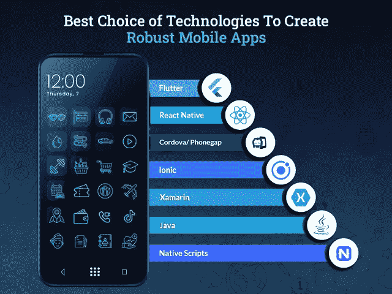
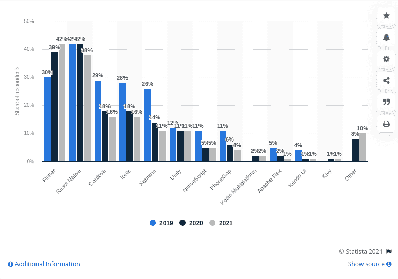
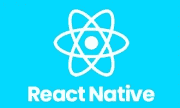
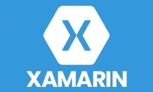
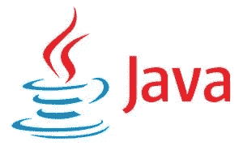

# 创建强大移动应用的最佳技术选择

> 原文：<https://javascript.plainenglish.io/best-choice-of-technologies-to-create-robust-mobile-apps-25b4f7b9864a?source=collection_archive---------1----------------------->

## 为 Android 和 iOS 开发移动应用的顶级技术

毫无疑问，移动应用程序开发行业正在不断发展，并将在未来几年继续增长。移动应用需求激增背后的最大原因是过多的技术进步和客户行为的改变，这对移动应用开发行业产生了直接影响。

根据调查报告，2020 年全球大约有 330 亿新应用被下载，用户每月在移动应用上花费大约 1800 亿小时。

2020 年对移动应用开发行业产生了持久的影响，并迫使全球企业如果真的想在这个竞争激烈的技术驱动型市场中生存下去，就必须立即开始这趟过山车之旅。

随着客户行为的转变以及他们一天中有一半时间花在移动应用上，许多企业已经意识到，推出移动应用已成为吸引用户注意力的唯一潜在方式。

毫无疑问，移动应用的使用每年都在快速增长。也就是说，开发一个移动应用程序已经成为当务之急。如果你认为通过移动应用获得商业成功就像想出十亿美元的移动应用一样容易，那么你可能错了。

为了抓住用户的注意力，让他们使用你的应用程序，你需要确保你的应用程序是流行的，并且有一个用户友好的界面。此外，要确保你的应用足够有竞争力，能够在这个竞争激烈的市场中立足。

老实说，要取得成功，你应该对在不久的将来会有需求的技术有一个完美的了解，并帮助你创建一个健壮的应用程序。此外，凭借对技术的深入了解，移动应用程序开发人员可以轻松开发出独特的应用程序，从而扩大创收范围。

事实上，无论你的应用程序想法有多复杂，它是唯一支持你的应用程序在多种设备上流畅、完美运行的技术。此外，你需要寻找一个知名的移动应用程序开发公司，可以证明你的应用程序开发想法。因此，我们没有照单全收，而是在这里附上了 Statista 的[调查报告，解释了预计将在 2022 年保持趋势并广泛用于移动应用开发解决方案的最新技术。](https://www.statista.com/statistics/869224/worldwide-software-developer-working-hours/)

[Image Source](https://www.statista.com/statistics/869224/worldwide-software-developer-working-hours/)

让我们深入挖掘并详细了解每项技术，以了解如何在 2022 年使用这些技术创建一个健壮的移动应用程序。

由于移动应用程序开发技术有多种变体，因此做出选择正确技术和应用程序开发公司的适当决策将极具挑战性。错误的应用程序架构不仅会导致失败，还会增加应用程序的整体开发成本、持久的错误恢复和超出期限。因此，我们在不同的章节中提到了 2022 年适合不同 app 开发需求的技术。

# **用于跨平台、本地和混合应用开发需求的顶级技术**

无论你是打算构建一个旨在同时支持 iOS 和 Android 平台的应用，还是一个原生平台特定的应用，那么你都可以从这些领先的应用开发技术或框架中做出选择。

## **1。flutter——谷歌支持的跨平台应用开发工具**

Flutter 是谷歌于 2017 年推出的软件开发工具包(SDK)，提供一站式解决方案，以漂亮的 UI 构建跨平台应用。尽管是一个年轻的框架，但它通过提供广泛的完全定制的小部件选择，允许您创建一个具有出色界面的本机应用程序，从而迅速获得了领先地位。此外，Flutter 的分层架构确保了组件的更快渲染，并整体提升了性能。*除此之外，以下是一些让 Flutter 在众多特性中脱颖而出的特性:*

*   *丰富的运动 API*
*   *灵活且富于表现力的用户界面*
*   *出色的本地表现*
*   *强大的 widget 支持*
*   *高性能应用*

## **2。react Native——一个开源的跨平台框架**

脸书已经率先推出 React Native，作为基于 Javascript 编程语言的跨平台开源框架。通过雇佣一个移动应用开发者，你可以使用一个代码库创建一个特定于平台的应用版本。JS 库的进一步发展为开发者提供了额外的支持。尽管如此，以下是 React Native 的显著特点:

*   *低代码确保更快的应用开发*
*   *提供兼容的第三方插件*
*   *同时支持 iOS 和 Android*
*   *简单的错误检测*
*   *简单的界面和出色的用户体验*

## **3。Cordova/Phonegap——构建更快混合应用的开源框架**

Cordova 或 Phone Gap 是运行基于 HTML 和 JS 的应用程序的第三大领先框架，并且兼容 GPS、扬声器、位置、加速度计等硬件功能。由于这个框架由相当强大的服务器端支持，用 Cordova 开发的应用程序运行得更快。此外，它还配备了一个插件系统，省略了浏览器的限制，可以访问所有移动设备的功能。*科尔多瓦的一些独特之处是:*

*   *通过命令行界面简化应用程序开发流程*
*   *科尔多瓦核心部件*
*   *科尔多瓦提供 API*
*   *执照是科尔多瓦*

## **4。Ionic-构建交互式混合应用的理想平台**

Ionic 是一个开源框架，具有独特的功能和服务，可以使用 CSS 和 HTML5 等 web 技术创建渐进式 web 应用程序、Android 和 iOS 应用程序。Ionic 是创建交互式应用的理想工具，因为它提供了一整套针对移动设备优化的组件和工具库。它的跨平台能力允许开发者在有限的时间内创建任何种类的应用程序。*以下是一些使 Ionic 在列表中脱颖而出的现成特性:*

*   *为不同移动设备和平台预先设计的 UI 组件*
*   *基于无缝开发体验的一次编写、随处运行的代码*
*   *开发人员友好的工具为开发过程增加了优势*
*   *超过 500 万开发者的强大社区*
*   *更快的应用程序开发流程*

## **5。xa marin——用于跨平台应用开发的开源工具包**

Xamarin 是基于的顶级跨平台应用程序开发框架之一。NET，由微软提供支持。有许多技术来了又走，但 Xamarin 仍然通过提供一个强大的后端和 API 组件生态系统来保持其在 charters 中的地位。你所需要的就是雇佣一个 [**应用程序开发公司**](https://www.appsdevpro.com/hire-developers/hire-mobile-app-developers.html) 。net 平台，由各种库、工具和编程语言支持。使用 Xamarin 框架，您可以创建支持 Android、tvOS、watchOS、iOS、macOS 和 windows 的原生应用。*Xamarin 的一些特性要求很高:*

*   *拥有约 60，000 名贡献者的强大社区的支持*
*   *多功能后端基础设施*
*   *提供各种 app 诊断工具*
*   *应用程序加载器使其工作更快*
*   *各种代码签名*
*   *Android SDK 管理器*
*   *使用单一代码库加快开发速度*

## **6。Java——构建原生 Android 应用的面向对象编程语言**

Java 是最常用的编程语言之一，它将继续激励开发人员创建高性能的应用程序。它是一种面向对象的编程语言，提供了一个开源库，使整个应用程序开发过程更快。使用 Java 创建原生 Android 应用程序的最大好处是开发者可以利用最好的社区支持和文档。*除此之外，这里有一些你需要知道的 Java 特性。*

*   *易学易懂*
*   *快速编码*
*   *资源容易获得*
*   *Android 应用开发的官方语言*

## **7。原生脚本——原生 iOS 应用开发的开源框架**

如果您希望创建一个原生 iOS 移动应用程序，那么原生脚本将是开源移动应用程序开发框架的完美选择，因为它支持 Angular、Typescript、Javascript、CSS 和 Vue.js。原生脚本是一个首选框架，因此值得雇佣一个移动应用程序开发人员，因为它可以帮助您减少系统上应用程序加载的代码和时间。*下面是一些本地脚本的独特特性:*

*   *跨平台应用*
*   *关键业务支持*
*   *没有网络视图的本地用户界面*
*   *强大的后端支持*

这些是为数不多的最受欢迎的趋势技术，用于为不同平台构建移动应用程序开发，并在未来继续占据主导地位。但当谈到开发移动应用程序时，大多数企业都关心这个问题:在 2021-22 年创建一个移动应用程序需要多少成本？

## **为不同平台创建一个手机 App 需要多少成本？**

如果你对标准的应用程序开发成本虎视眈眈，那么你可能会让自己陷入困境，因为创建一个移动应用程序的价格取决于各种因素。

那么影响最大的移动 app 开发成本是什么呢？

根据各种研究报告，创建一个简单的移动应用程序，单个平台的平均价格在 15，000 美元到 20，000 美元之间，而高级移动应用程序的开发价格在 25，000 美元到 35，000 美元之间，甚至超过 50，000 美元。

现在你们中的许多人想知道为什么在这样的估计之间有巨大的差距？原因很简单，影响成本的因素有很多，比如特性和功能、应用程序的复杂性、平台、UI/UX 设计、应用程序开发团队等等。由于每个业务需求都是不同的，各种应用程序商店需要不同的开发方法，所以应用程序开发没有标准成本。

尽管确定应用程序开发评估最简单和最可靠的方法是安排一次与专家的会面，并讨论项目的细节。

# **结论**

不可否认的事实是，移动应用程序开发行业正在迅速发展，并出现了用于健壮应用程序开发的最新技术和工具。然而，从众多技术中选择最适合您业务需求的技术是一项具有挑战性的任务。因此，雇佣一家[移动应用程序开发公司](https://www.appsdevpro.com/hire-developers/hire-mobile-app-developers.html)总是值得的，该公司利用其经验来充分利用这些技术，并帮助您创建健壮的解决方案。通过正确选择技术，他们可以帮助您为您的企业或初创公司开发功能丰富、稳定且可扩展的移动应用。

如果你已经有了一个移动想法，你需要转换成一个强大的解决方案，但不确定你应该选择哪种技术来开发应用程序，那么你可以联系我们或在下面提出疑问。

====================================

*更多内容看* [***说白了就是***](http://plainenglish.io/) *。报名参加我们的* [***免费周报在这里***](http://newsletter.plainenglish.io/) *。*