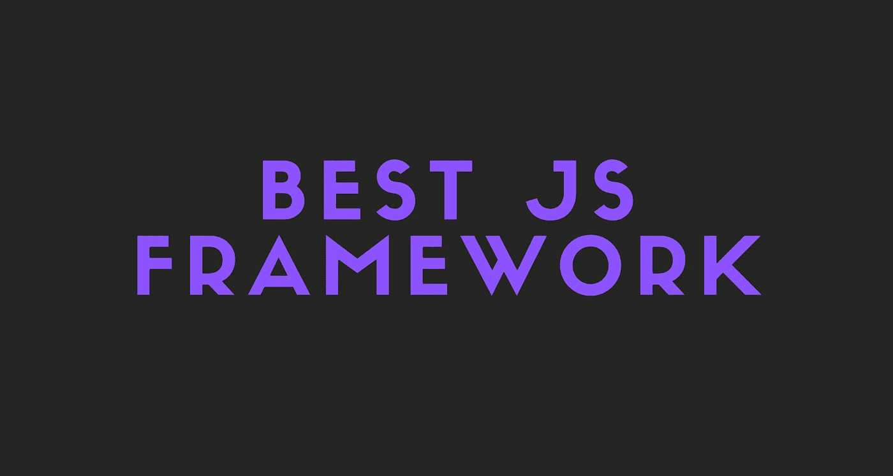
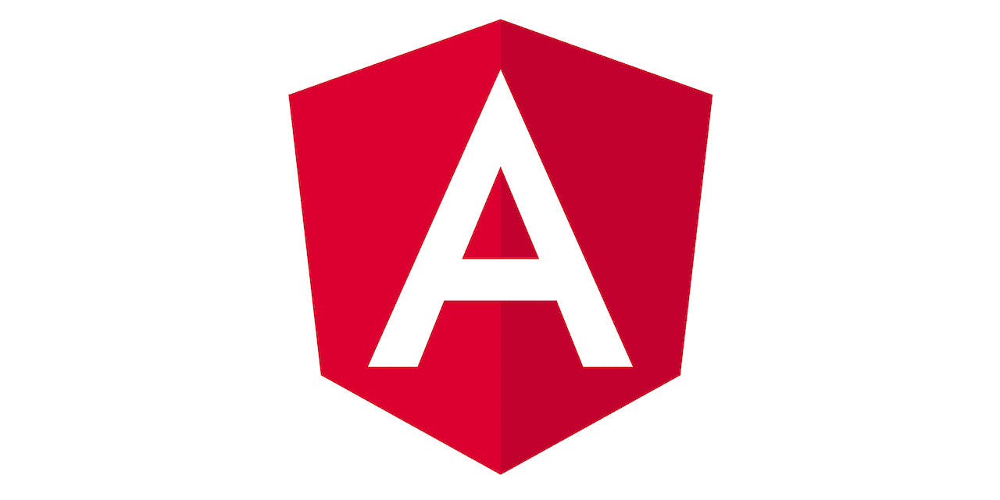

# 2021 年最佳前端 JavaScript 框架对比

> 原文：<https://javascript.plainenglish.io/best-frontend-javascript-framework-96ecef9791fa?source=collection_archive---------4----------------------->

## 哪个 JavaScript 框架最适合你？

在这个故事中，我们将回顾 React、Angular 和 Vue，它们是最流行的前端 JavaScript 框架。

我还将列出每个框架的所有优点、缺点和重要特性，这样您可以更容易地决定您想要学习或使用哪个 JavaScript 框架。

开始吧！

# 反应

React 是一个用于构建用户界面的 JavaScript 库。

React 非常小，并且没有提供很多开箱即用的特性，因为它只是一个库。但是，React 仍然是最流行的 JavaScript 框架。

## 社区

React 非常受欢迎，因为它只是 JavaScript。这意味着它的学习曲线非常小，你可以立即开始构建东西。

正因为如此，人们通常更喜欢 React 而不是 Angular 和 Vue 这样的框架。

这也意味着 React community 比其他框架大很多，所以你可以更快更容易地获得帮助。

## JSX

React 使用 JSX，基本上可以让你在 JavaScript 文件中编写 HTML。如果文件变得很大，那真的很糟糕，但是开发人员出于某种原因喜欢它。

## 虚拟 DOM

React 也使用虚拟 DOM。虚拟 DOM 比较组件以前的状态，并只更新真实 DOM 中发生变化的项目，而不是像传统 web 应用程序那样再次更新所有组件。

## 单向数据绑定

React 的单向数据绑定保持了一切的模块化和快速性。单向数据流意味着当开发人员设计 React 应用程序时，他们通常会将子组件嵌套在父组件中。通过这种方式，开发人员知道错误发生的位置和时间，从而更好地控制整个 web 应用程序。

## 生态系统

这是 React 最精彩的部分。看，React 有不同的 **React 框架**像 Next.js，Blitz.js 和 Gatsby。它甚至可以与 React Native 一起使用，以构建移动应用程序！

这是 React 最重要的部分之一。

在这个故事中，我不打算解释每个 React 框架是做什么的。但是，我写了一个关于 Blitz.js 的故事，如果你想了解更多，我建议你去看看。

 [## Blitz.js 是更好的下一个

### Blitz.js 简介。

javascript.plainenglish.io](/blitz-js-the-better-next-js-def5bb69d80d) 

## 何时使用 React

*   你想要一个快速简单的发展
*   你想控制一切
*   您希望能够更容易、更快速地获得帮助

# 有角的

Angular 是一个用 TypeScript 编写的开源 JavaScript 框架。

Angular 是 Google 做的，是一个完整的框架。这意味着它有许多开箱即用的特性。

## 社区

Angular 不如 React 流行，主要是因为它的学习曲线更大，更像是一个有经验的开发者框架。但它仍然很大，我相信你会立即得到你的问题的答案。

## 体系结构

Angular 是一个成熟的模型-视图-控制器(MVC)框架。它为如何构建应用程序提供了清晰的指导，并在提供真正的 DOM 的同时提供了双向数据流。

在 Angular 中，每个组件、模块和服务都有自己的工作。逻辑与视图是分离的。这有助于保持应用程序结构的有序和整洁。虽然这个架构对于初学者来说可能有点太难，但是在习惯之后，它非常简单而且有用。

## 数字正射影像图

Angular 使用常规 DOM。假设在同一个 HTML 页面上进行了十次更新。Angular 将更新 HTML 标签的整个树结构，而不是更新已经更新的标签。

## 双向数据绑定

Angular 使用双向绑定。模型状态反映了在相应的 UI 元素中所做的任何更改。相反，UI 状态反映了模型状态的任何变化。这个特性使框架能够通过控制器将 DOM 连接到模型数据。

## 生态系统

Angular 的生态系统没有 React 的丰富。但这并不是因为它不好或不受欢迎，不是。这是因为 Angular 提供了很多现成的东西，你只是不需要 Angular 框架来做事情。

当然，你可以使用 Angular 和 Ionic 或 NativeScript 来构建混合移动应用。

## 何时使用角度

*   你想要一个整洁有序的架构
*   比起灵活性，你更喜欢稳定性
*   您正在构建一个非常复杂的应用程序，并且想要使用 MVC

# 某视频剪辑软件

[Vue](https://vuejs.org/) 是一个开源的前端库**T5，由前谷歌员工尤雨溪开发。**

Vue 用于创建 web 应用程序，像 React 一样，它不是一个完整的 MVC 框架，也不是开箱即用的。

Vue 实际上是 Angular 和 React 之间的框架。它不像 Angular 那样严格，但与 React 相比，它更像是一个完整的框架。

## 社区

Vue 的社区类似于 Angular。它比 React 小，但仍然足够大，可以立即获得帮助。Vue 的学习曲线没有 Angular 那么大，但还是比 React 的学习曲线大。

## 体系结构

同样，就像 React 一样，Vue.js 核心库被设计为具有针对性和灵活性。它只是一个视图层库，不强制任何应用程序级架构。

即使 Vue 不强制任何架构，它仍然没有 React 灵活。这当然取决于用例的好坏。

Vue 也有一个类似于 JSX 的特殊文件类型。但是它没有将逻辑和视图混合在一起，它只是将它们保存在同一个文件中，用像`<template>`和`<script>`这样的标签分开。

## 虚拟 DOM

就像 React 一样，Vue 使用虚拟 DOM。

虚拟 DOM 比较组件以前的状态，并只更新真实 DOM 中发生变化的项目，而不是像传统 web 应用程序那样再次更新所有组件。

## 反应式双向数据绑定

Vue 同时支持单向绑定和双向绑定，称为**反应式双向数据绑定**。它会根据输入类型自动选择正确的方式来更新元素。

## 生态系统

Vue 的生态系统介于 Angular 和 React 之间。有 Nuxt.js 和 Quasar Framework 这样的 Vue 框架，但是 Vue 没有 React Native 这样自己的移动框架。不过，你仍然可以使用 Vue 和 Quasar Framework、NativeScript 或 Ionic 构建混合移动应用。

## 何时使用 Vue

*   你想在反应和角度之间使用一个框架
*   你喜欢灵活性，但仍然想要一些稳定性
*   您不想要一个严格的架构，但是仍然希望逻辑与视图分离

# 最后的想法

我个人更喜欢 Angular 和 Vue 而不是 React，但当然最好是使用最好的工具来完成工作。

希望这个故事对你有帮助。我很想听听你决定使用或学习什么框架！

## 仅此而已。感谢您阅读这个故事！

如果你喜欢这个故事，一定要让我们在评论中知道，并随时问我你想问的任何问题。

在 Twitter 上关注我:

 [## re _ ally 边缘

twitter.com](https://twitter.com/Re_allyedge) 

在 Patreon 上支持我:

 [## 阿里木阿尔斯兰卡亚是创造编程故事和教程。帕特里翁

### 今天就成为阿里木阿尔斯兰卡亚的赞助人:在世界上最大的…

www.patreon.com](https://www.patreon.com/allyedge) 

*更多内容尽在*[***plain English . io***](http://plainenglish.io)