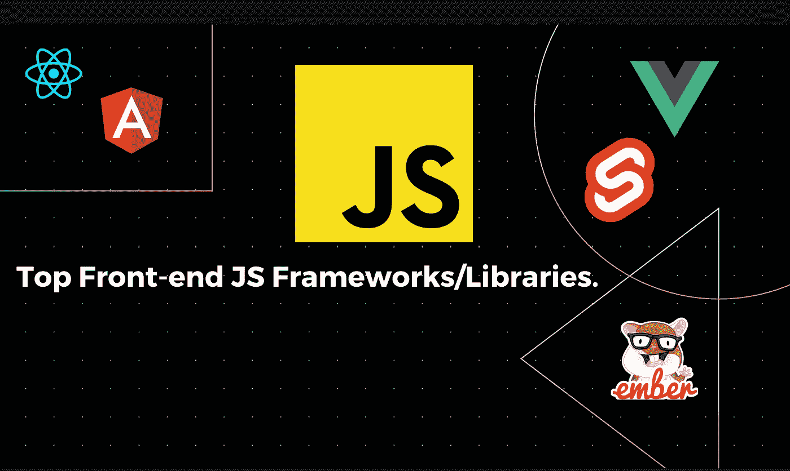
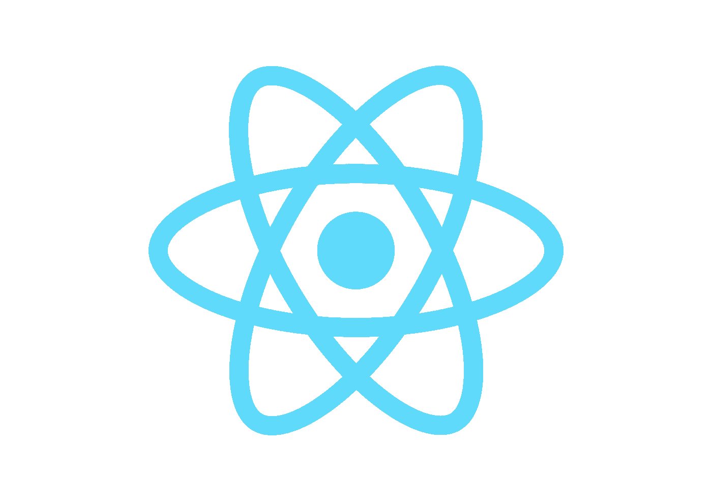
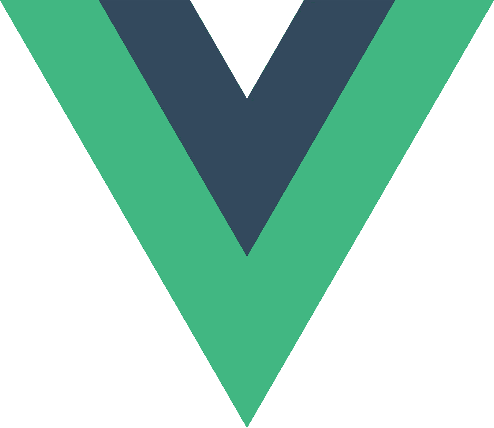
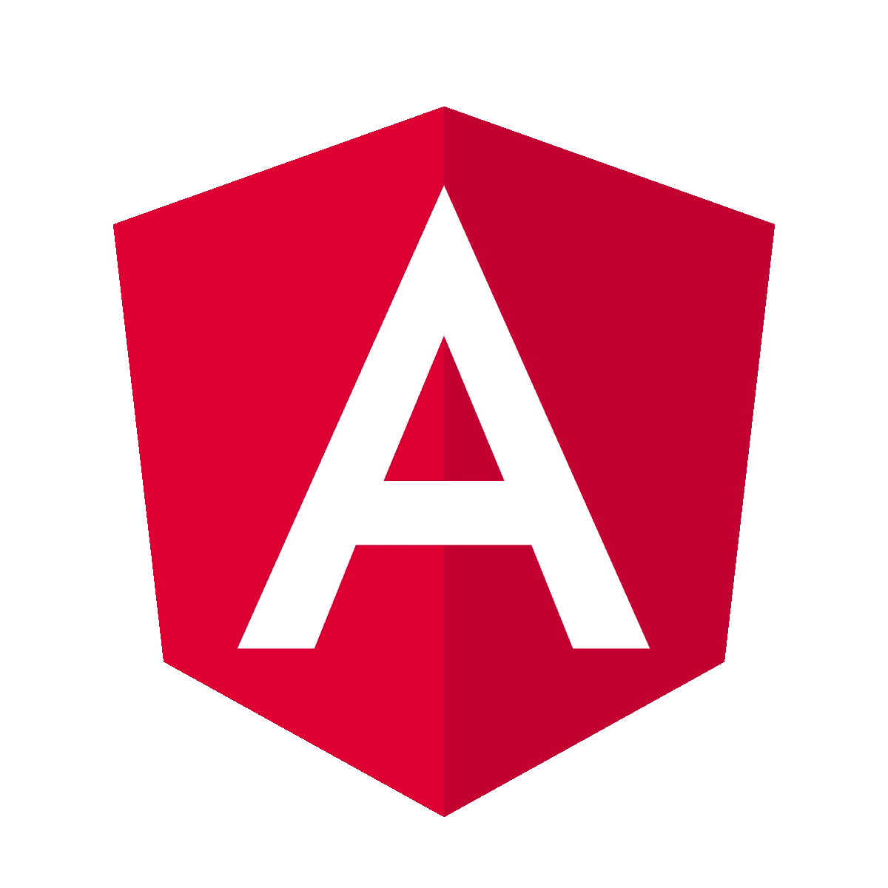

# 2021 年最值得学习的 JavaScript 前端框架

> 原文：<https://javascript.plainenglish.io/best-javascript-front-end-frameworks-to-learn-in-2021-8dc5dbf51a20?source=collection_archive---------10----------------------->

## 2021 年最好学的 JavaScript 前端框架和库。

JavaScript 是最好的编程语言之一，被广泛用于 web 开发。

一点历史琐事:它是由网景公司的 Brendan Eich 在 **10 天内创建的！差不多 10 天。它后来被修改，很快成为一种非常流行的编程语言。JavaScript 开发者有很大的市场价值。为了进一步简化我们的工作，已经开发了许多框架。**

现在，这里是你在 2021 年可以使用的最好的 JavaScript 框架:

## **1。反应**

从技术上讲，这不是一个框架，这个 JavaScript 前端库是我个人最喜欢的。React 是由脸书作为一个开源项目开发的。它通过内置 DOM、SSR(在 Next.js 帮助下的服务器端渲染)、快速路由等酷功能轻松减少了开发人员的工作。React 作为最好的 JS 库是首选的，因为它能立即做出反应。假设我们改变了文件中的一些内容，它会立即在浏览器中做出相应的改变——这就是它被命名为 React 的原因。

它有文件组合:JavaScript 和 HTML，所以所有的 HTML 标签和标记可以写在一个 JavaScript 文件中！它也有更新像 useState 这样的变量的简单方法。它有两个组件:基于类的组件和功能组件。为什么首先使用 React？

*   简单易学
*   有很多资源可供学习。
*   被 Instagram、网飞、亚马逊、优步等公司使用。
*   高薪(你可以找到六位数的工作)
*   基于组件的体系结构
*   大量的自由职业机会
*   它可以与 CSS 框架一起使用，如 Tailwind CSS 和 Bootstrap。
*   它可以与许多有趣的堆栈结合，如 MERN (MongoDB、Express、React 和 Node)和 Next.js(它是 React 的一个框架，帮助我们进行 SSR 或服务器端渲染)。
*   使用 React Native 构建移动应用。

学习 React 有成百上千的理由。如果你应该学习反应，你还在边缘吗？看看这个: [**学习 React**](https://www.youtube.com/watch?v=kd-hK5Zmv6E) 的 5 个理由。

每个 web 开发者都应该尝试 React，因为相信我，一旦你做出了改变，你就再也不想离开它了。

**学习 React 的一些免费资源:** [**桑尼僧伽**](https://www.youtube.com/user/ssangha32) **的 YT 频道**， [**FreeCodeCamp 的 React.js 课程**](https://www.youtube.com/watch?v=4UZrsTqkcW4) ， [**Traversy Media 的 React 课程**](https://www.youtube.com/watch?v=w7ejDZ8SWv8) ， [**Web Dev 简体版的 React.js 课程**](https://www.youtube.com/watch?v=1wZoGFF_oi4&list=PLZlA0Gpn_vH_NT5zPVp18nGe_W9LqBDQK) 。

React Logo

## **2。Vue.js**

Vue.js 是另一个用于构建单页面应用和前端应用的框架。Vue.js 是尤雨溪创建的。他在谷歌工作，使用 Angular。Vue.js 背后的历史是，Evan 希望从 Angular 创建他喜欢的部分，并将其转化为轻量级应用程序。Vue 的第一次源代码提交是在 2013 年 7 月。Vue.js 有一种叫做 HTML 指令的东西，它为 HTML 应用程序提供功能。为什么一开始要用 Vue.js？

*   简单易学
*   可以与 MongoDB 和 Express 结合使用
*   快速轻便
*   使用 Nuxt.js 的 SSR
*   帮助我们构建动态应用
*   非常受欢迎
*   高薪
*   应用转场的不同方式

学习 Vue.js 的理由太多了，这里有几个免费资源可以学习一下: [**Traversy Media Vue.js 课程**](https://www.youtube.com/watch?v=qZXt1Aom3Cs) ， [**Fireship Vue.js 讲解**](https://www.youtube.com/watch?v=nhBVL41-_Cw) ， [**Net Ninja Vue.js 课程**](https://www.youtube.com/watch?v=YrxBCBibVo0) **。**

Vue.js Logo

## **3。角度**

Angular 是另一个令人惊叹的 JavaScript 框架，由我们在 Google 的朋友构建。它可以说是有史以来最先进的 JavaScript 框架。原作者是米斯科·赫维里和亚当·阿布朗斯。转折点到了 Angular，他们从 Angular.js 转到 Angular。人们对这种改变并不满意，因为你不能仅仅更新到新的改变，你必须重写你的整个代码。这是一个许多人都无法接受的变化。他们不知道新的框架更好，甚至更强大。这就是为什么你需要使用角度:

*   第三受欢迎的 web 开发框架。
*   非常强大的 CLI(命令行界面)。
*   ng add 命令将 Angular 应用程序转换为 PWA(渐进式 Web 应用程序)。
*   惊人的速度和性能。
*   MVC(模型视图控制器)架构实现。在这种情况下，控制器接收对应用程序的所有请求，并操作模型来准备视图所需的任何数据。
*   高应用质量

这里有几个免费资源可以学习角形: [**角形教程**](https://www.youtube.com/watch?v=k5E2AVpwsko) 、 [**Traversy Media 角形教程**](https://www.youtube.com/watch?v=3dHNOWTI7H8) 、 [**FreeCodeCamp 角形教程**](https://www.youtube.com/watch?v=2OHbjep_WjQ) 、[**100 秒内火船角形**](https://www.youtube.com/watch?v=Ata9cSC2WpM) **。**

Angular Logo

## **4。苗条**

现在这听起来可能很奇怪，但是 Svelte 既不是一个库也不是一个框架——它是一个编译器。那么是什么让这个框架在我们的列表中获得一席之地呢？苗条是人们的最爱之一。人们已经决定建立网站。根据一份统计报告，已经有近 3000 个网站使用了这种方法。它是由理查德·哈里斯作为一个开源项目开发的。它越来越受欢迎，因为它是轻量级的，开发者不必写太多代码来制作他们的网站。它编译代码，这很容易，你喜欢编写代码，你实际上需要在浏览器上运行。以下是你需要使用苗条身材的原因:

*   方便用户的
*   需要编写的代码更少
*   没有虚拟 DOM
*   基于组件的体系结构
*   轻量级选手

下面是几个学习苗条的免费资源:[**Fireship 100 秒苗条**](https://www.youtube.com/watch?v=rv3Yq-B8qp4)[**Traversy Media 苗条速成班**](https://www.youtube.com/watch?v=uK2RnIzrQ0M)[**FreeCodeCamp 苗条课程**](https://www.youtube.com/watch?v=ujbE0mzX-CU) **。**

Svelte Logo

## **5。余烬**

它是一个用于构建 web 应用程序的开源 JavaScript 框架。它允许开发者创建可扩展的单页应用。这是一个完整的包，意味着它拥有构建丰富 ui 所需的所有东西。这个框架被用于许多流行的网站，如 Chipotle、Apple Music、Groupon、LinkedIn、Twitch 等等。这个框架是由 Yehuda Katz 开发的。以下是您应该学习和使用 Ember 的原因:

*   非常强大的 CLI(命令行界面)。
*   巨型生态系统。
*   一个好的数据管理系统。
*   更多的就业机会，因为它是在大公司使用。

下面是几个学习 Ember 的免费资源: [**陈肖纯 Ember 课程**](https://www.youtube.com/watch?v=eQUvN9Ujs1s&list=PLk51HrKSBQ88wDXgPF-QLMfPFlLwcjTlo) ， [**Traversy Media Ember 课程**](https://www.youtube.com/watch?v=eQUvN9Ujs1s&list=PLk51HrKSBQ88wDXgPF-QLMfPFlLwcjTlo) ， [**凯尔罗宾逊少年 Ember 基础**。](https://www.youtube.com/watch?v=53OpEYA4zPQ)

Ember Logo

在我看来，这些是最好的前端框架/库。非常感谢你阅读这篇文章！

*更多内容请看*[***plain English . io***](http://plainenglish.io/)