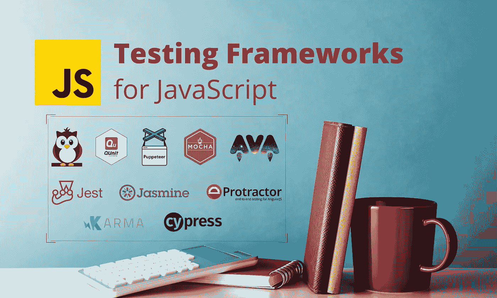
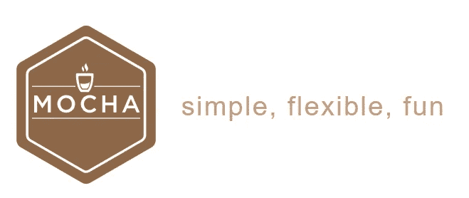
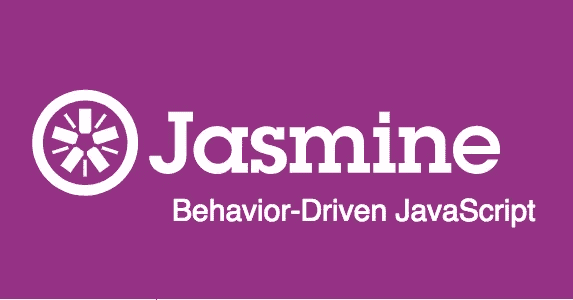
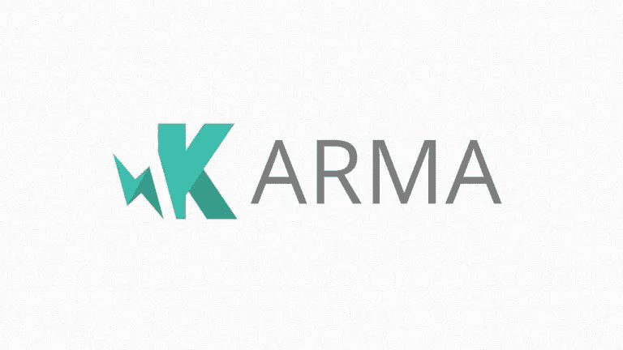
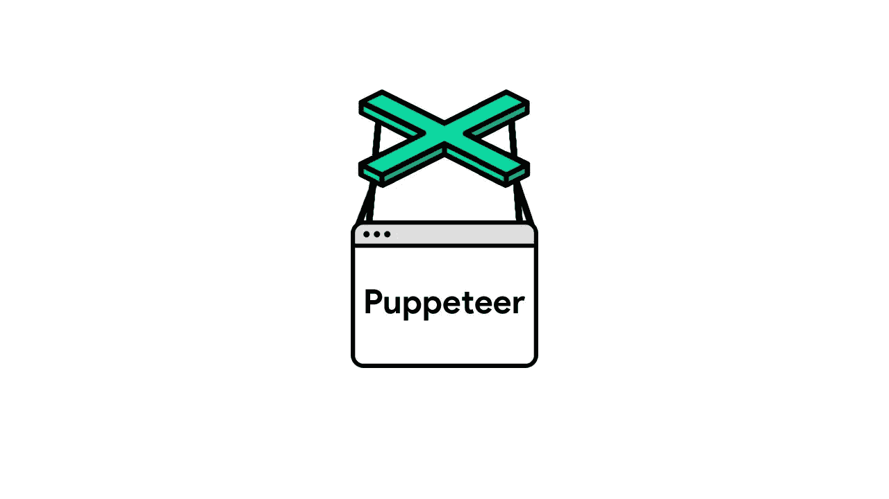
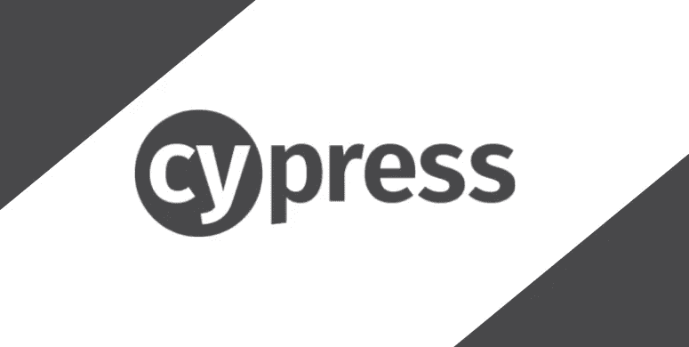
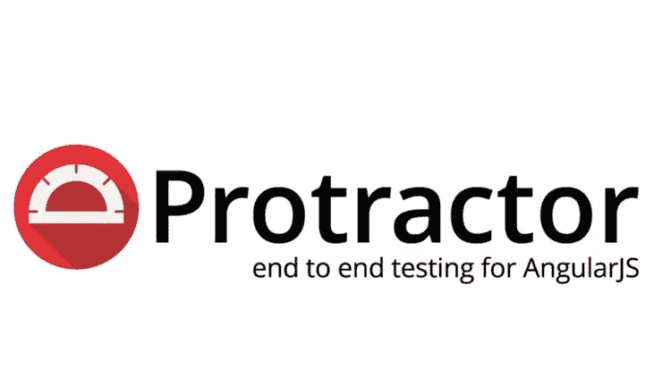
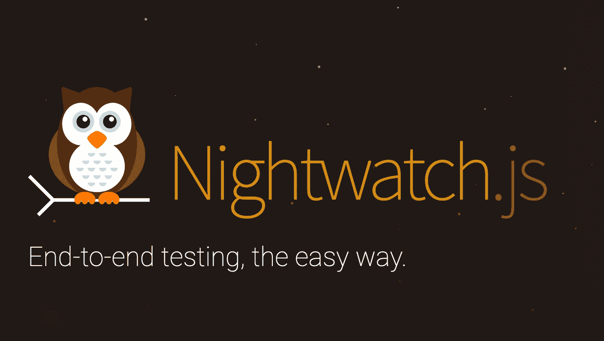
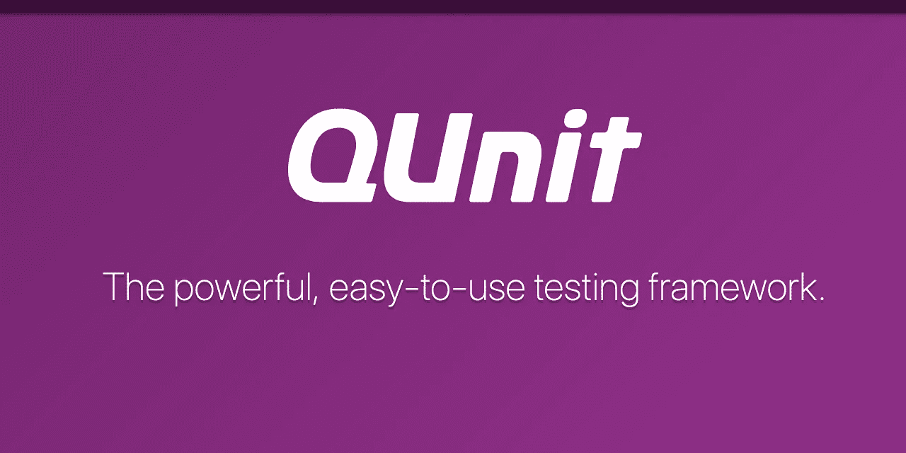

# 2021 年最佳 JavaScript 测试框架

> 原文：<https://javascript.plainenglish.io/best-javascript-testing-frameworks-for-2021-a0cca908516e?source=collection_archive---------6----------------------->

## **最流行的 JavaScript 测试框架是什么？**



在当今世界，测试已经成为软件开发的一个重要方面。可以使用各种工具来简化测试工作。

> 然而，选择一个并不容易，因为有许多具有不同特性的框架和工具。

因此，在本文中，我将讨论 2021 年每个开发人员都应该知道的 10 个 javascript 测试框架。

# 1.玩笑


> JEST 拥有超过 1200 万的每周 NPM 下载量和 36K GitHub 明星

JavaScript 测试框架。JEST 测试框架提供了一个零配置的测试环境。对于基于 React 的应用程序，JEST 是一个强烈推荐的框架。

它有一个简单易用的用户界面。此外，这个框架还有一些独特的功能，比如快照测试和内置的代码覆盖工具。JEST 在互联网上也有很多可用的资源。

## 装置

```
npm install --save-dev jest
```

## 特征

*   兼容基于 Babel 的项目，如 NodeJS、React、Angular、VueJS 等。
*   标准语法的文档支持。
*   实时快照可用于管理大型项目的测试。
*   非常快和高性能。

# 2.莫卡杰斯



> MochaJs 拥有超过 500 万的每周 NPM 下载量和 21K GitHub 星级

自 2011 年以来，MochaJS 一直是最受欢迎的 JavaScript 测试框架之一。它运行在 Node.js 上，支持前端和后端的异步测试。在过去的几年里，Mocha 已经被证明是一个具有坚实文档支持的成熟框架。

## 装置

```
npm i mocha
```

## 特征

*   提供了前端和后端测试的兼容性。
*   在 NodeJS 调试器的帮助下，错误跟踪变得更加容易。
*   支持所有浏览器，包括无头 Chrome 库。
*   开发人员会发现用这个框架构造测试用例非常容易。
*   报告准确性

# 3.茉莉



> 茉莉有超过 2M 周刊 NPM 下载量和 346 GitHub 星

Jasmine 是一个开源的 JavaScript 测试框架，于 2010 年首次发布。它有能力测试任何 JavaScript 应用程序。这个概念(BDD)支持行为驱动开发。Jasmine 可以用来创建模拟网站用户行为的测试用例。Jasmine 非常有利于前端测试。它包括在各种不同分辨率的设备上测试用户界面的可见性和响应性。为了模仿真实的用户行为，还可以使用定义的延迟和等待时间来自动化用户行为。

## 装置

```
npm install --save-dev jasmine
```

## 特征

*   为了更容易测试，它有一个简短、干净和直接的语法。
*   不需要文档对象模型(DOM)
*   前端和后端测试都支持。
*   编码很简单，因为语法与自然语言的语法相当。

# 4.因果报应



> Karma 拥有超过 2M 周刊 NPM 下载量和 12K GitHub 明星。

另一个著名的开源生产测试环境是 Karma。它使 QA 能够在各种情况下测试应用程序。感谢 Karma，应用程序脚本现在可以在真正的浏览器和设备上运行，如手机和平板电脑。此外，Karma 努力为开发人员提供一个不需要他们设置多个设置的测试环境。

## 装置

```
npm i karma
```

## 特征

*   与流行的 CI/CD 系统集成，如 Jenkins、Travis 和 Semaphore。
*   在真实设备和浏览器上进行测试是可行的。
*   支持像 PhantomJS 这样的无头环境。
*   直接从终端或 IDE 进行远程测试是可能的。

# 5.操纵木偶的人



> 木偶师有超过 2M 周刊 NPM 下载和 73K GitHub 星

木偶师是一个由节点库木偶师提供的高级 API。在 DevTools 协议上，这个 API 用于控制 Chrome 或 Chromium。木偶戏最大的缺点之一就是只能用铬和铬。然而，木偶师可以用于浏览器特定的任务，比如页面结构检查、屏幕截图等等。

## 装置

```
npm i puppeteer-test
```

## 特征

*   可以快速创建网页的截屏和 pdf。
*   UI 测试、表单提交和键盘输入都可以轻松实现自动化。
*   支持 Chrome 扩展测试。

# 6.柏树



> Cypress 拥有超过 2M 周刊 NPM 下载量和 33K GitHub stars。

Cypress 是一个基于 JavaScript 的端到端测试框架，构建在 Mocha 之上，Mocha 是一个功能丰富的 JavaScript 测试框架，运行在浏览器上和浏览器中，简化了异步测试。它还使用浏览器和 BDD/TDD 断言库与任何 JavaScript 测试框架进行交互。此外，Cypress 足够智能，能够识别在保存一个测试文件之后，测试人员将重新运行它。因此，不需要定义隐式和显式等待。

## 装置

```
npm install cypress --save-dev
```

## 特征

*   它等待测试命令自动运行，然后在继续运行下一组指令之前做出断言。
*   它在测试用例的整个执行过程中截取屏幕截图来帮助调试。
*   由于架构设计不同于其他测试框架，它为客户提供了更快和更准确的测试执行。
*   它包括用于交互式测试执行的测试运行器和日志，使得调试测试执行变得容易。

# 7.量角器



> 量角器拥有超过 130 万的每周 NPM 下载量和 8800 万的 GitHub stars

量角器是一个基于 NodeJS 的自动化开源测试平台。它为基于 AngularJS 的 web 应用提供集成的端到端测试。它适用于有角度和无角度的应用程序。另一方面，量角器广泛用于 AngularJS 测试，因为它可以测试复杂的 HTML 元素。它使用了多种技术，包括 NodeJS、Selenium Webdriver、Jasmine、Mocha、Cucumber 等等。

## 装置

```
npm install -g protractor
```

## 特征

*   编写测试用例的简单语法。
*   它包括新的定位器策略和自动化 AngularJS 应用程序测试的实用程序。
*   量角器结合 Selenium 提供了一个自动化的测试架构。

# 8.自动话频警报器(automatic voice alarm)ˌ视听教具(audiovisual aids)


> AVA 拥有超过 22.9 万的每周 NPM 下载量和 19 万 GitHub stars

AVA 是一个轻量级框架，它充分利用了 JavaScript 的异步特性。它可以更快地同时和异步执行测试。AVA 主要用于在节点上进行测试。基于 js 的程序。它提供了彻底的错误输出、新的语言功能和进程隔离，允许您更快地编写测试。

## 装置

```
npm install ava --save-dev
```

## 特征

*   JavaScript 测试的语法更简单。
*   比大多数其他测试框架都要快。
*   并发和异步运行测试。
*   清除任何发现的可能故障的堆栈跟踪。

# 9.守夜人. js



> Nightwatch.js 拥有超过 182，000 的每周 NPM 下载量和 11，000 颗 GitHub 星星

Nightwatch.js 是一个免费的网站和 web app 自动化测试框架。它是用 Node.js 编写的，使用 W3C 的 WebDriver API。Nightwatch 是一个针对浏览器应用、基于网络的应用和网站的端到端测试(E2E)解决方案，它承诺用 Javascript 更容易地构建自动化测试。这是最流行的测试自动化框架之一，它通过 restful HTTP API 与 WebDriver 服务器通信。

## 装置

```
$ npm install nightwatch --save-dev
```

## 特征

*   语法很容易理解。
*   内置了命令行测试运行程序
*   在单独的子进程中，控制独立的 Selenium 服务器。
*   Nightwatch 自动管理 WebDriver 服务。
*   一个命令和断言框架，允许直接向应用程序添加新的命令和断言。

# 10.库奈特



> QUnit 拥有超过 164K 的每周 NPM 下载量和 4K GitHub stars

对于前端开发，QUnit 是一个强大的 JavaScript 测试框架。开发人员将 QUnit 用于 jQuery、jQuery Mobile 和 jQuery UI 库。QUnit 最棒的一点是，它可以用任何语言编写，可以在任何网站上运行。你必须将文件上传到你的网站，并使用 QUnit 插件来运行测试。

## 装置

```
npm install --save-dev qunit
```

## 特征

*   使用随时可部署的 web 界面查看测试用例输出。
*   用它可以创建可重用的测试脚本。
*   由于在它上面构建了几个插件，它允许更快的测试用例开发。

## 结论

单元测试对于高质量的编码至关重要。它确保在集成或生产过程中添加到代码中的任何更新或新功能都不会破坏应用程序。

我希望这篇文章能帮助你决定哪种框架适合于 JavaScript 应用程序的单元测试。并且不要忘记在使用这些框架后分享你的想法。

感谢您的阅读！

*更多内容看*[***plain English . io***](http://plainenglish.io/)