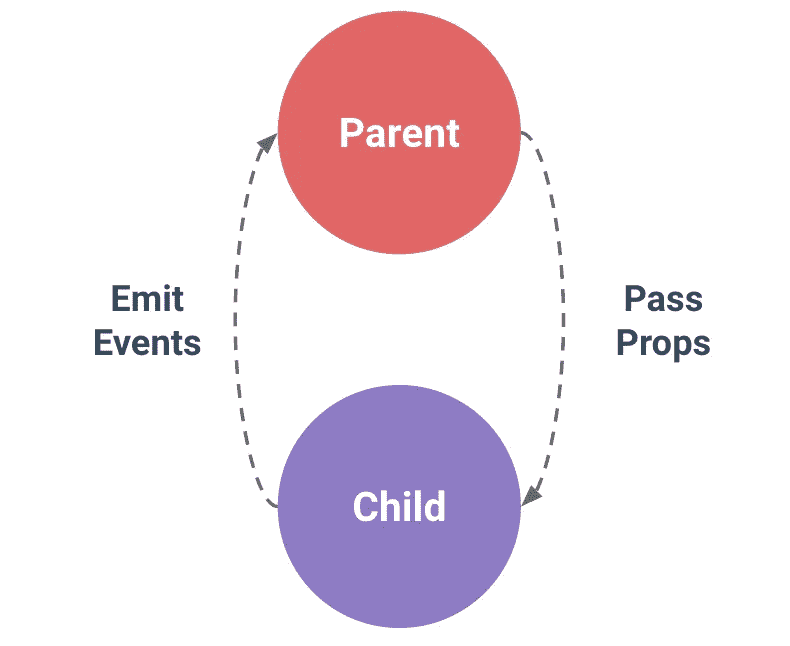

# React 中传递道具的最佳实践

> 原文：<https://javascript.plainenglish.io/best-practices-passing-props-in-react-9f6706bc05a?source=collection_archive---------0----------------------->



Source: [https://vuejs.org/](https://vuejs.org/)

# 介绍

React 的组件编码风格最棒的一点是父元素和子元素之间定义的清晰关系。您经常会遇到这样一种情况，即父组件负责根据用户的某些操作来呈现具有不同特征或显示属性的子组件。在这种情况下，您可以传递给子组件不同的“道具”,然后在子组件内部以某种方式显示数据。

这很有用，因为它让您可以完全独立地考虑每个组件。这被称为“关注点分离”。该组件将定义或者已经向其传递了将数据呈现到屏幕所需的所有信息。

# 小道具

Props 是 properties 的缩写，它们是通常由父组件传递给子组件的参数(如果使用 Redux，情况并非总是如此)。

将道具传递给子组件的正确方式如下:

```
function App() {
  return (
    <div>
      <Welcome name="Sara" />
      <Welcome name="Cahal" />
      <Welcome name="Edite" />
    </div>
  );
}
```

在这个例子中，App 是父节点，Welcome 是子节点。属性“name”被传递到每个欢迎组件中。

现在，在 Welcome 中，您将可以通过传入每个组件的 prop 对象来访问名称 prop。无论是否传入道具，这个道具对象总是存在的。

## 类组件中的道具

```
class Welcome extends React.Component {
  render() {
    return <h1>Hello, {**this.props.name**}</h1>;
  }
}
```

在类组件中，使用语法“this.props”访问属性。

在上面的示例中，向 Welcome 传递了名称 prop，因此您可以通过访问 this.props .上的 name 属性并将其放在花括号内，以编程方式显示该信息。

## 功能组件中的道具

```
function Welcome(**props**) {
  return <h1>Hello, {**props.name**}</h1>;
}
```

在功能组件中，逻辑非常相似，只是语法略有变化。您需要将一个名为 props 的参数传递到组件的函数定义中，然后就可以在不使用这个选择器的情况下访问组件的属性。直接调用' props.propertyname '就可以了。

## 动态传递道具

回到我们从应用程序传递到欢迎程序的例子，第一种方法是每次手动输入欢迎和名称，这对于拥有超过 100 个欢迎名称的大型应用程序来说不是非常干净的代码。相反，您希望映射一个包含所有名称的数组，并将一个表示名称的变量作为属性传递给每个 Welcome 组件。这是这样做的:

```
names = ['Sara', 'Cahal', 'Edite']function App() {
  return (
    <div>
      names.map(name => <Welcome name ={name}/>
    </div>
  );
}
```

这是更简洁的代码，您可以将动态名称属性放在花括号中传递给 Welcome 组件。

# 破坏道具

假设您有一个庞大的用户 API，其中不仅仅附加了一个名称属性。每个用户都有与之相关的姓名、用户名、年龄、性别和出生日期。而不是像这样逐个传递这些道具:

```
function App() {
  return (
    <div>
      <Welcome
        name="Sara"
        username ="sara12"
        age=23
        gender=female
        dob="7/12/1997"
      />
    </div>
  );
}
```

相反，您可以将 props 作为对象传递，并使用 ES6 提供的新语法来析构它们。

```
function App() {
  return (
    <div>
      <Welcome userObj = {userObj} />
    </div>
  );
}
```

有两种方法可以做到这一点。

## 组件内部的析构

这通常在类组件中完成，但如果您愿意，也可以在功能组件中完成。

```
class Welcome extends React.Component {
  **{name, username, age, gender, dob}= this.props** render() {
    return (
      <h1>Hello, {name}</h1>;
      <div>
        Age: {age}
        Gender: {gender}
        Date of Birth: {dob}
      </div>
  }
}
```

这段代码所做的是有效的，比如对于花括号中的每个变量，在 this.props 上查找一个具有相应名称的属性，并将其值赋给变量。它与这样做是一样的，但要干净得多:

```
class Welcome extends React.Component {
 **let name = this.props.name
  let username = this.props.username
  let age = this.props.age
  let gender = this.props.gender
  let dob = this.props.dob** render() {
    return (
      <h1>Hello, {name}</h1>;
      <div>
        Age: {age}
        Gender: {gender}
        Date of Birth: {dob}
      </div>
  }
}
```

## 组件函数定义内部的析构

这是您在功能组件中经常看到的方式。实际上，您可以通过传递一个包含变量名的对象，在通常传入 props 参数的地方直接析构它。

```
function Welcome(**{name, username, age, gender, dob}**) {render() {
    return (
      <h1>Hello, {name}</h1>;
      <div>
        Age: {age}
        Gender: {gender}
        Date of Birth: {dob}
      </div>
  }
}
```

现在你可以在 JSX 代码中直接访问这些变量，甚至不需要额外的代码行来析构对象。在函数定义里就可以做对！

*更多内容尽在*[*plain English . io*](http://plainenglish.io/)