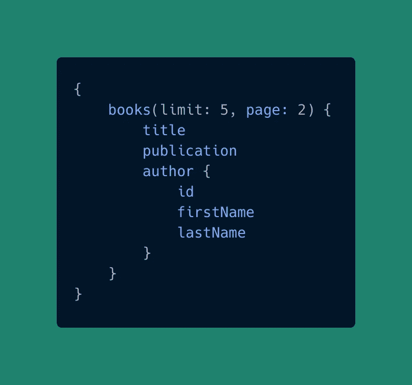
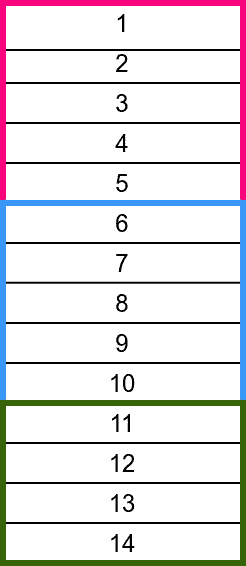
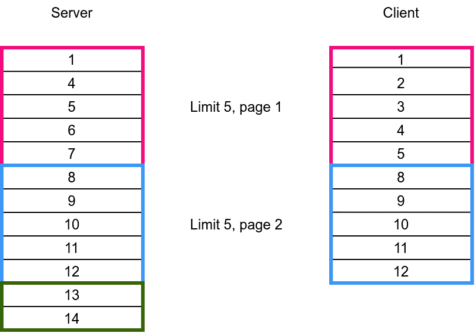
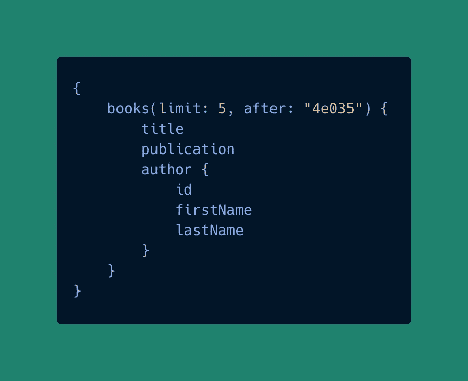
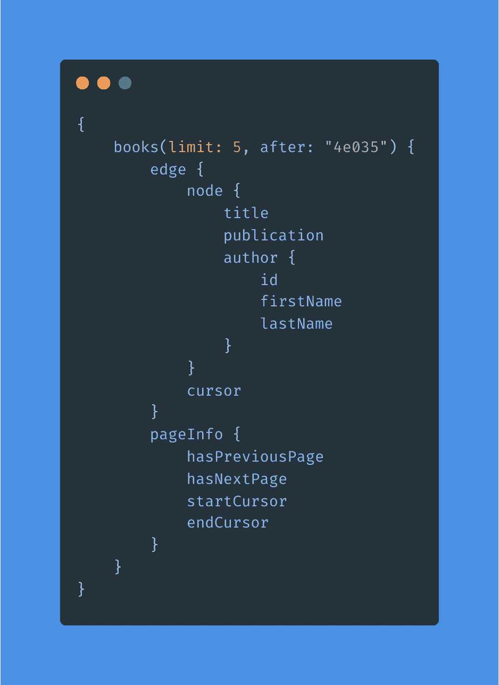

# 使用 GraphQL 分页的最佳实践

> 原文：<https://javascript.plainenglish.io/best-practices-to-work-with-graphql-pagination-8f0d1f9937c2?source=collection_archive---------10----------------------->

## 再也不用为使用 GraphQL 分页而烦恼了

Photo by [Roman Trifonov](https://unsplash.com/@roman34nov?utm_source=unsplash&utm_medium=referral&utm_content=creditCopyText) on [Unsplash](https://unsplash.com/s/photos/pages?utm_source=unsplash&utm_medium=referral&utm_content=creditCopyText)

使用 GraphQL 时，最有趣的部分之一是分页。在 GraphQL 中使用分页与在 REST APIs 中使用分页有很大不同。在本文中，我将解释为什么我们不应该在 GraphQL 中使用传统的分页。我们还将讨论在 GraphQL 中使用分页的正确方法。

# 为什么我们应该使用分页

嗯，这是一个很基本的问题。我们需要分页来防止前端数据溢出，从而限制网页滞后。

分页使我们能够显示特定数量的数据，从而允许 web 应用程序的平滑流动。如果您正在构建一个包含大量数据的 web 应用程序，并且需要显示这些数据的列表，那么您很可能需要分页。

# 传统分页存在的问题及解决方法

当在 REST API 上使用分页时，我们用页码和数量来表示我们想要发送多少。作为回应，我们发送带有总页码、当前页码和所有其他必要内容的数据。

例如，我们希望显示一个图书列表，其中包括书名、出版物、作者 id、作者名字和作者姓氏。为了显示带有分页的查询，您可能会考虑以以下形式执行查询:

但是！很糟糕。

让我们先讨论为什么这不是一个好的方法，然后再讨论**一个更好的方法**。

## 1.页码

GraphQL 中的传统分页有几个问题。第一个也是最重要的问题是:使用页码。为了说明这个问题，让我们看看下面的图像:

List of Items

假设我们有一个对象列表。每种颜色代表不同的页码。红色表示第一页，蓝色表示第二页，绿色表示第三页。

假设，由于某种原因，在获取第一页后，第 2 和第 3 项被移除。然后，在请求第二页时，您会得到 8 到 12 个项目，而不是 6 到 10 个。

Query after removing item 2 and 3

这是一个大问题。因为现在第 6 和第 7 项在客户身上不见了。对于某些应用而言，这可能会成为一个严重的问题。例如，如果您正在创建一个银行应用程序并显示所有交易的列表，某些交易可能会丢失。它会让用户心脏病发作。

所以，这里的解决方案是使用光标而不是页码。我们将在某些特定数据之前或之后获取数据，而不是根据页码获取数据。

让我们把光标放在一些数据上，并告诉服务器在该光标之后获取数据。我们将光标定义为基于`base64`的编码字符串。

因此，在修改了上面的查询之后，我们得到了下面的查询:

## 2.元数据呢

根据应用程序的不同，您可能希望显示是否有上一页或下一页。您可能还想在页面的列表中包含我们可能需要的其他属性。

对于这个问题，我们可以将我们的响应改为基于节点边的设计。之后，我们的查询将如下所示:

这里，我们将显示一个边的列表，每个边由一个节点和一个光标组成。光标将代表该节点。这里，我们也有`pageInfo`来显示是否有上一页和下一页。我们也有`startCursor`和`endCursor`来更好地方便页面切换。

总的来说，这种方法被证明是在 GraphQL 中使用分页的最佳实践。

# 结论

我们现在完全理解了 GraphQL 分页是如何工作的，以及最佳实践是什么。我希望我们现在能够在所有 Node.js 项目中使用这些知识。

祝您愉快！

*更多内容尽在*[*plain English . io*](http://plainenglish.io/)