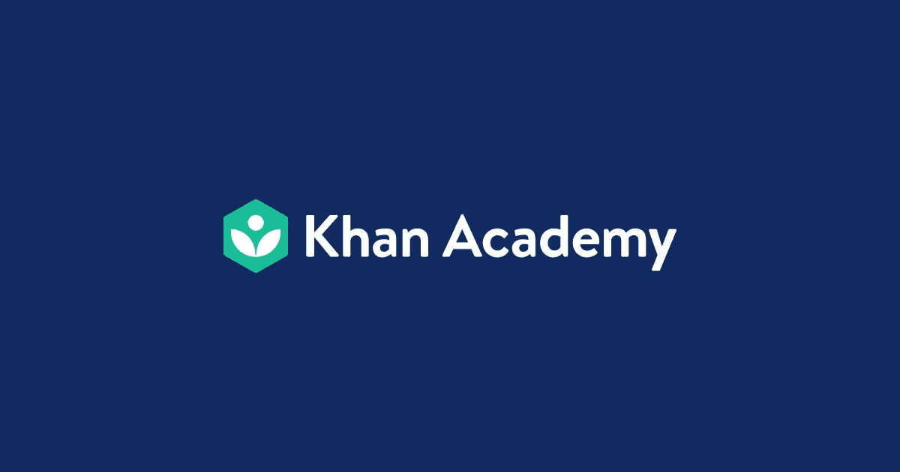
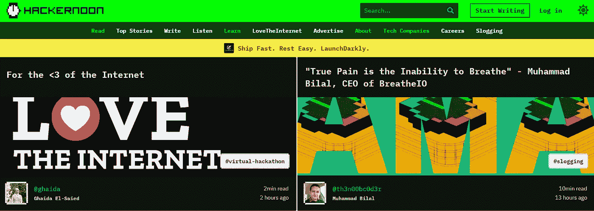

# 2021 年学习和掌握编程技能的最佳编程博客

> 原文：<https://javascript.plainenglish.io/best-programming-blogs-to-learn-master-your-coding-skills-in-2021-2437756bd7c2?source=collection_archive---------11----------------------->

## 2021 年顶级编程博客

Photo by [Braden Collum](https://unsplash.com/@bradencollum?utm_source=medium&utm_medium=referral) on [Unsplash](https://unsplash.com?utm_source=medium&utm_medium=referral)

我们生活在程序的世界里，从智能手机上的打盹闹钟到在社交媒体上与朋友交谈后帮助我们入睡的应用程序。随着这个领域的蓬勃发展，成吨的资源正变得对我们可用，我们开始这场竞赛只是时间问题。

对于有经验的程序员来说，与世界保持同步总是更好的，因为语言和框架正在发生很多变化。

> 持续学习是任何领域成功的最低要求。布莱恩·崔西

这里有一些编程博客，可以帮助你启动你的编程生涯，并让你了解 2021 年的最新趋势。

(这个列表在我五年的发展旅程中帮助了我，没有特定的顺序，所有的都有自己的优点。)

# [FreeCodeCamp](https://www.freecodecamp.org/)

freeCodeCamp 是一个非营利组织，由一个**互动学习网络平台、一个在线社区论坛、聊天室、在线出版物、**和**当地组织**组成，旨在让任何人都可以访问学习网络开发。

**涵盖的主题:**

*   超文本标记语言
*   半铸钢ˌ钢性铸铁(Cast Semi-Steel)
*   Java Script 语言
*   数据库
*   节点等

**功能:**

*   可以用来获得开发人员工作的编程证书

# [可汗学院](https://www.khanacademy.org/)

Khan Academy 是一家美国非营利教育组织，由 Sal Khan 于 2006 年创建，目标是创建一套帮助教育学生的在线工具。该组织以视频的形式制作**简短的课程。它的网站还包括为教育工作者准备的补充练习和材料。**

**涵盖的主题:**

*   超文本标记语言
*   Java Script 语言
*   高级 JS
*   半铸钢ˌ钢性铸铁(Cast Semi-Steel)
*   SQL 数据库等等

**功能:**

*   最大的程序员群体，当他们在某个地方遇到困难的时候，他们随时准备帮助别人。

# [站点点](https://www.sitepoint.com/)

SitePoint 是一家总部位于墨尔本的网站，是面向网络开发人员的书籍、课程、文章的出版商。

**涵盖的主题:**

*   超文本标记语言
*   半铸钢ˌ钢性铸铁(Cast Semi-Steel)
*   Java Script 语言
*   服务器端编程语言（Professional Hypertext Preprocessor 的缩写）
*   红宝石
*   UX
*   搜索引擎优化

**功能:**

*   许多编程博客涵盖了专家所涉及的所有主题。

# [Hackr.io](https://hackr.io/blog)

**Hackr** 。 **io** 让学习编码变得更加容易和有趣。在这里，我们可以找到你想学的语言的最佳在线编程课程/教程。所有的教程都是由编程社区提交并投票的，所以你会得到最好的推荐。

**涵盖话题:**

*   HTML5
*   半铸钢ˌ钢性铸铁(Cast Semi-Steel)
*   Java Script 语言
*   数据结构和算法
*   计算机编程语言
*   C++
*   服务器端编程语言（Professional Hypertext Preprocessor 的缩写）
*   姜戈和更多

**功能:**

*   各种编程语言的最佳在线课程和教程。

# 简单英语的 JavaScript

[JavaScript in Plain English](http://medium.com/javascript-in-plain-english) 是一个致力于编程的[媒体](https://medium.com/)出版物。他们每天发布多篇文章，这些文章来自多个作者，涉及不同的前端技术。

***披露*** *:我是一名普通的 JavaScript 作家，但在我开始写作之前，我是一名读者。*

**涵盖的主题:**

*   Java Script 语言
*   反应
*   有角的
*   HTML、CSS 等等

**功能:**

*   不同作者的所有技术的最新内容

# [开发](https://dev.to/)

DEV 是一个软件开发人员的社区，他们聚在一起互相帮助。软件业依赖于协作和网络学习。我们为此提供了一个场所。

**涵盖的主题:**

*   Java Script 语言
*   反应
*   有角的
*   计算机编程语言
*   HTML、CSS 等等

**功能:**

*   网站代码是开源的
*   专家们分享了大量的内容

# [黑客正午](https://hackernoon.com/)

[Hacker Noon](https://hackernoon.com/) 是为技术人员阅读、编写和发布而构建的。他们是一个开放的国际社区，有 15000 多名投稿作者，为 300 多万好奇而有洞察力的每月读者发布故事和专业知识。

**涵盖的主题:**

*   Java Script 语言
*   反应
*   有角的
*   编程；编排
*   HTML、CSS 等等

**功能:**

*   在编程的同时学习其他领域的技术

# [教程点](https://www.tutorialspoint.com/index.htm)

Tutorials Point 起源于这样一种想法，即存在这样一类读者，他们对在线内容反应更好，更喜欢在自己舒适的客厅里按照自己的节奏学习新技能。

**涵盖的主题:**

*   Web 开发技术
*   数据科学
*   机器学习
*   DevOps
*   软技能等等

**功能:**

*   找到所有主题的更大平台

# 大卫·沃尔什

**涵盖话题:**

*   半铸钢ˌ钢性铸铁(Cast Semi-Steel)
*   创建交互式、快速动态网页应用的网页开发技术
*   服务器端编程语言（Professional Hypertext Preprocessor 的缩写）
*   wordpress 软件
*   HTML5
*   Node.js 等等

**功能:**

*   教程中的真实例子和案例研究

# [CSS 招数](https://css-tricks.com/)

关于 **CSS，HTML，JavaScript** 的日常文章，以及所有与网页设计和开发相关的东西。

**涵盖的主题:**

*   半铸钢ˌ钢性铸铁(Cast Semi-Steel)
*   Java Script 语言
*   前端
*   后端和更多

**功能:**

*   工作板支持
*   访问社区寻求支持

# [HTML 狗](http://www.htmldog.com/)

自 2003 年以来，HTML Dog 一直在发布健康的代码。这个想法是，而且一直是，将客户端技术(HTML 及其关系)有点复杂的官方规范以一种可读性更强、更容易理解的方式呈现出来。

**涵盖的主题:**

*   超文本标记语言
*   CSS 和
*   Java Script 语言

**功能:**

*   面向新 web 开发人员的简单界面

# [代码学院](https://www.codecademy.com/)

Codecademy 是一个美国在线互动平台，提供 12 种不同编程语言的免费编码课程，包括 Python、Java、Go、JavaScript、Ruby、SQL、C++、C#、Swift 和 Sass，以及标记语言 HTML 和 CSS。

**涵盖的主题:**

*   HTML 和 CSS
*   计算机编程语言
*   Java Script 语言
*   Java 语言(一种计算机语言，尤用于创建网站)
*   结构化查询语言
*   Bash/Shell 和 Ruby

**功能:**

*   编码社区

# [疯狂的程序员](https://www.thecrazyprogrammer.com/)

一个流行的**编程**和开发博客。在这里你可以学习 C，C++，Java，Python，Android 开发，PHP，SQL，JavaScript，。网等。

**涵盖的主题:**

*   C，C++
*   Java 语言(一种计算机语言，尤用于创建网站)
*   。网
*   Python，PHP
*   结构化查询语言
*   Android 和许多其他产品

# [雷·温德里奇](https://www.raywenderlich.com/)

Ray Wenderlich 是学习编码的最佳编程博客之一，拥有最大的 Swift 和 iOS 视频教程集合，被全球成千上万的编程爱好者阅读。

**涵盖的主题:**

*   迅捷的语言
*   一致
*   ios
*   机器人
*   OS X

# [更好的编程](https://medium.com/better-programming)

它是 Medium 上的顶级出版物之一，在这里您可以找到大量与编程相关的内容。

**涵盖的主题:**

*   Java Script 语言
*   计算机编程语言
*   反应
*   Java 等等

**功能:**

*   不同作者的所有技术的最新内容

# [PHP 的正确方式](http://www.phptherightway.com/)

*The Right Way* 是一个关于 PHP 流行编码标准的易读、快速的参考，链接到网上的权威教程，以及贡献者认为目前的最佳实践。

**涵盖话题:**

*   标准接口
*   特征
*   构造器、解构器和单件
*   克隆对象
*   抽象类
*   迭代器等等！

# [Codrops](https://tympanus.net/codrops/)

Codrops 是一个 web 设计和开发博客，发布关于最新 web 趋势、技术和新可能性的文章和教程。

**涵盖的主题:**

*   半铸钢ˌ钢性铸铁(Cast Semi-Steel)
*   网页设计和开发
*   UI 交互
*   JavaScript 等等

# [学习 CPP](http://www.learncpp.com/)

LearnCpp.com 是一个免费网站，致力于教你如何用 C++编程。不管你以前有没有编程经验，这个网站上的教程将带你完成编写、编译和调试 C++程序的所有步骤，都有大量的例子。

**涵盖的主题:**

*   CPP 基础
*   变量
*   经营者
*   数组、字符串、指针、引用
*   控制流程等

# [真正的蟒蛇](https://realpython.com/)

**Python** 面向所有技能水平开发者的教程， **Python** 书籍和课程， **Python** 新闻、代码示例、文章等等。

**涵盖的主题:**

*   Python 基础
*   Python API
*   Python 最佳实践
*   Phyton 数据库教程等等。

# 视频教程博客

# 琳达

Lynda.com 是一个领先的在线学习平台，帮助任何人学习商业、软件、技术和创造性技能，以实现个人和职业目标。通过个人、企业、学术和政府订阅，会员可以访问由公认的行业专家讲授的引人入胜的高质量课程的 Lynda.com 视频库。

**涵盖的主题:**

*   超文本标记语言
*   半铸钢ˌ钢性铸铁(Cast Semi-Steel)
*   Java 语言(一种计算机语言，尤用于创建网站)
*   Java Script 语言
*   有角的
*   Node.js 和 React.js 等等

# [Udemy](https://www.udemy.com/courses/development/)

Udemy 是一个在线学习和教学市场，拥有超过 13 万门课程和 3500 万名学生。

**涵盖的主题:**

*   C++课程和教程
*   PHP 视频教程
*   Python 课程
*   Java 和 Javascript 教程
*   WordPress 教程
*   HTML 教程

# 结论

"一个好的计划，现在被粗暴地执行，胜过明天一个完美的计划."—乔治·巴顿

所以，让我们开始阅读，跳入编程的海洋。

**参考文献:**

【https://blog.bit.ai/programming-blogs-and-websites/ 

[https://bloggerspassion.com/best-programming-blogs/](https://bloggerspassion.com/best-programming-blogs/)

[https://imtips.co/best-programming-blogs.html](https://imtips.co/best-programming-blogs.html)

*更多内容看* [***说白了。*** *报名参加我们的*](http://plainenglish.io/) [***免费每周简讯这里***](http://newsletter.plainenglish.io/) ***。***