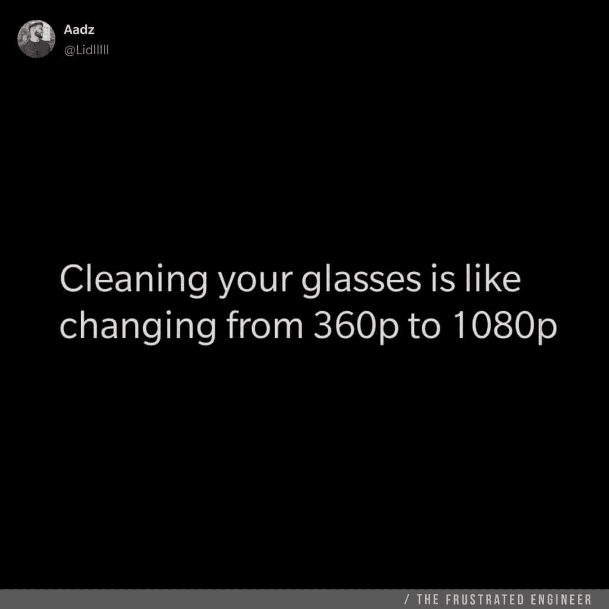

# 只有程序员才能理解的最佳编程笑话

> 原文：<https://javascript.plainenglish.io/best-programming-jokes-that-only-programmers-can-understand-33e53e2ab27b?source=collection_archive---------8----------------------->

## 请微笑！

## 最佳编程幽默汇编

Photo by [Mateus Campos Felipe](https://unsplash.com/@matcfelipe?utm_source=medium&utm_medium=referral) on [Unsplash](https://unsplash.com?utm_source=medium&utm_medium=referral)

***笑话和快乐有什么联系吗？*** 如果你是我这种类型的人，那么你可能也爱在下班后查看手机。猜猜我在那里看到了什么？

我主要是在网上看到**的视频、抖音和笑话**。我不知道为什么，但这有助于我提神醒脑，减轻工作压力。

# 这就是为什么我相信笑是人类最好的刷新按钮。

在这篇文章中，我收集了一些我喜欢的网络迷因。

[https://www.reddit.com/r/AskReddit/comments/1kvhmz/whats_the_best_programming_joke_that_you_know/](https://www.reddit.com/r/AskReddit/comments/1kvhmz/whats_the_best_programming_joke_that_you_know/)

[https://www.reddit.com/r/AskReddit/comments/1kvhmz/whats_the_best_programming_joke_that_you_know/](https://www.reddit.com/r/AskReddit/comments/1kvhmz/whats_the_best_programming_joke_that_you_know/)

[https://www.reddit.com/r/AskReddit/comments/1kvhmz/whats_the_best_programming_joke_that_you_know/](https://www.reddit.com/r/AskReddit/comments/1kvhmz/whats_the_best_programming_joke_that_you_know/)

[https://www.reddit.com/r/AskReddit/comments/1kvhmz/whats_the_best_programming_joke_that_you_know/](https://www.reddit.com/r/AskReddit/comments/1kvhmz/whats_the_best_programming_joke_that_you_know/)

[https://www.reddit.com/r/AskReddit/comments/1kvhmz/whats_the_best_programming_joke_that_you_know/](https://www.reddit.com/r/AskReddit/comments/1kvhmz/whats_the_best_programming_joke_that_you_know/)

[https://www.reddit.com/r/ProgrammerHumor/comments/6d6yas/programming_jokes_compilation/](https://www.reddit.com/r/ProgrammerHumor/comments/6d6yas/programming_jokes_compilation/)

[https://devdojo.com/devdojo/10-awesome-programming-jokes](https://devdojo.com/devdojo/10-awesome-programming-jokes)

[https://devdojo.com/devdojo/10-awesome-programming-jokes](https://devdojo.com/devdojo/10-awesome-programming-jokes)

[https://devdojo.com/devdojo/10-awesome-programming-jokes](https://devdojo.com/devdojo/10-awesome-programming-jokes)

[https://www.dcsl.com/20-one-liners-only-software-developers-understand/](https://www.dcsl.com/20-one-liners-only-software-developers-understand/)

[https://www.dcsl.com/20-one-liners-only-software-developers-understand/](https://www.dcsl.com/20-one-liners-only-software-developers-understand/)

# 一些编程迷因集合

# 浏览量每天都在增加，是的，人们好奇的看着，怎么会有人这么做呢？英雄联盟

[https://www.facebook.com/ProgrammersCreateLife/](https://www.facebook.com/ProgrammersCreateLife/)

# 打算买床垫？像问答一样思考…这将有助于:D

[https://www.monkeyuser.com/](https://www.monkeyuser.com/)

# 这种情况经常发生…风扇会启动，声音会出现…

[https://www.quora.com/What-are-some-of-the-best-programmer-jokes-and-memes-out-there](https://www.quora.com/What-are-some-of-the-best-programmer-jokes-and-memes-out-there)

# 你的愿望是什么？无 Bug 代码？抱歉 404:未找到

[https://www.facebook.com/techindustan/](https://www.facebook.com/techindustan/)

# 那种只有你的人能理解你的感觉…

[https://www.facebook.com/programminggeeks.in](https://www.facebook.com/programminggeeks.in)

# 当你有很多东西在桶里的时候，没有时间工作…

Source:[https://www.monkeyuser.com/](https://www.monkeyuser.com/)

# 当每个人都建议添加一些功能来美化网站时..结局会是这样的…

[https://www.monkeyuser.com/](https://www.monkeyuser.com/)

# 只有戴眼镜的人才能感受到这一点…

[https://www.facebook.com/JokesTechnical](https://www.facebook.com/JokesTechnical)

# 对不起，这种事不会再发生了..欢迎好友…

[https://www.facebook.com/DZoneInc/photos/10158894902394712](https://www.facebook.com/DZoneInc/photos/10158894902394712)

# 当初级开发给出评估时…项目经理也有同样的感觉…

[https://www.facebook.com/javascriptJS/photos/1559356324201966](https://www.facebook.com/javascriptJS/photos/1559356324201966)

# 当我开始为我的代码编写文档时..我感觉完全一样…

[https://www.facebook.com/programmemer](https://www.facebook.com/programmemer)

# 当我看到一些软件的免费试用版时，当我点击它时…他们问的第一件事就是信用卡…

[https://www.facebook.com/ProgrammersCreateLife](https://www.facebook.com/ProgrammersCreateLife)

# 我应该推吗？让我想想…嗯…嗯..耶！开始吧… OMG…我做了什么？

[https://www.monkeyuser.com/](https://www.monkeyuser.com/)

# 当我的单口相声被取消时我的感觉…你感觉到了吗？

[https://www.quora.com/What-are-some-of-the-best-programmer-jokes-and-memes-out-there](https://www.quora.com/What-are-some-of-the-best-programmer-jokes-and-memes-out-there)

# 这是给单身的我的..当我期待拥抱和得到错误…哈哈

[https://www.facebook.com/techindustan/](https://www.facebook.com/techindustan/)

# 这棵树应该结出所有的果实…因为它是满堆的…

[https://www.facebook.com/programminggeeks.in](https://www.facebook.com/programminggeeks.in)

# 您想修复 BUG 吗？开始重构…注意:这个并不像看起来那样有效:)

[https://www.monkeyuser.com/](https://www.monkeyuser.com/)

# 当我的老师让我创建一个 VB 项目…让我们通过输入你的身高来创建一个身高计算器…

[https://www.facebook.com/JokesTechnical](https://www.facebook.com/JokesTechnical)

# 它发生在我错过函数调用的时候…

[https://www.facebook.com/javascriptJS/photos/a.1387402908063976/2193489080788684/](https://www.facebook.com/javascriptJS/photos/a.1387402908063976/2193489080788684/)

# 每个人都有不同的时间线。这和我小时候有关…哈哈，不是第一个我是第二个…

[https://www.facebook.com/javascriptJS/photos/1573164949487770](https://www.facebook.com/javascriptJS/photos/1573164949487770)

# 有一个普遍的规则..无论您计划的是什么，看起来都不会和实际实现一样…

[https://www.facebook.com/photo/?fbid=10224400678155314&set=g.1803773613206624](https://www.facebook.com/photo/?fbid=10224400678155314&set=g.1803773613206624)

# 你喜欢这些汇编吗？如果是的话，我有更多的文章给你…

# LOL…之前有严格的开发模式..这是我的代码的内部状态..当一个新变量加入未使用的变量时…

[https://www.facebook.com/photo?fbid=899897387465482&set=gm.2799768736940435](https://www.facebook.com/photo?fbid=899897387465482&set=gm.2799768736940435)

# 作为一名初级开发人员，我学到的第一件事是..不要碰工作正常的东西..它可以增加重新测试的努力，并可以打破其他东西…

[https://www.facebook.com/javascriptJS/photos/1861659490638313](https://www.facebook.com/javascriptJS/photos/1861659490638313)

# 进一步阅读

 [## 日常的编程笑话

### 最佳编程迷因汇编(第 4 部分)

javascript.plainenglish.io](/daily-dose-of-programming-jokes-6541eba98194)  [## 2021 年最佳编程幽默汇编

### 编程迷因可以减轻你的压力

blog.devgenius.io](https://blog.devgenius.io/best-programming-humor-compilations-2021-623473bfb0d)  [## 有趣的编程迷因会让你笑死

### 编笑话来点亮你的周五

blog.devgenius.io](https://blog.devgenius.io/funny-programming-memes-that-will-make-you-die-laughing-1ccd8e139040)  [## 编程迷因和幸福之间的联系

### 2021 年最佳编程迷因汇编

blog.devgenius.io](https://blog.devgenius.io/the-connection-between-programming-memes-and-happiness-d768ab85b83d)  [## 10 个能让你心情轻松的最佳编程笑话

### 你读过的关于编程迷因 2021 的最不可思议的文章

medium.com](https://medium.com/geekculture/10-best-programming-jokes-to-lighten-up-your-mood-8870dab2bff7)  [## 日常的编程笑话

### 最佳编程迷因汇编(第 1 部分)

javascript.plainenglish.io](/daily-dose-of-programming-jokes-cb9b74fcfa2e) 

*更多内容看*[***plain English . io***](http://plainenglish.io/)