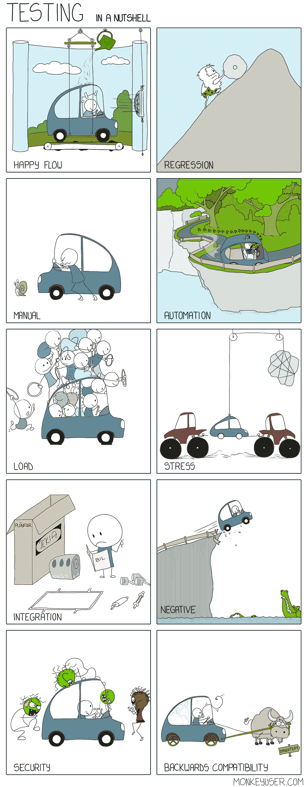
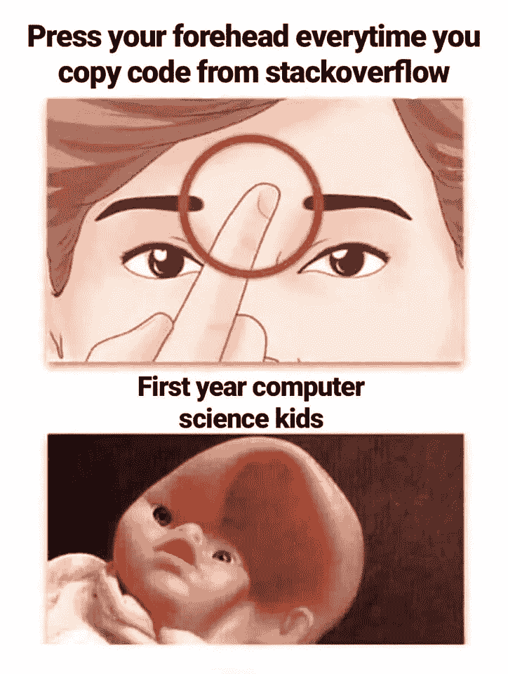
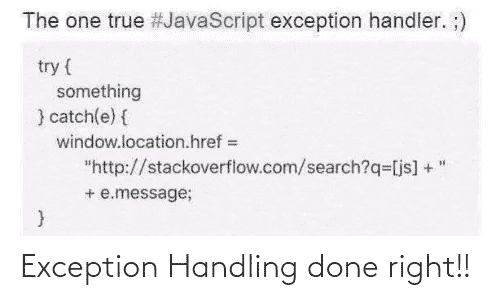

# 让你开心的最佳编程笑话

> 原文：<https://javascript.plainenglish.io/best-programming-jokes-to-make-your-day-4f31afb844a9?source=collection_archive---------2----------------------->

## 与编程相关的最佳模因汇编。

Picture Credit: [https://www.facebook.com/jokesvala/](https://www.facebook.com/jokesvala/photos/a.2339158462775928/6938343999523995/)

***模因和快乐有什么联系吗？*** 如果你是我这种类型的人，那么你可能也爱在下班后查看手机。猜猜我在那里看到了什么？

我主要是在互联网上看到**视频、抖音和模因**。我不知道为什么，但这有助于我提神醒脑，减轻工作压力。这就是为什么我相信 *laugher 是人类最好的刷新按钮。*

在这篇文章中，我收集了一些我喜欢的网络迷因。

# 简单解释一下…

Picture Credit: [https://www.facebook.com/TheInsaneApp/photos/a.111462577009971/432699698219589/](https://www.facebook.com/TheInsaneApp/photos/a.111462577009971/432699698219589/)

# 你知道如何连接桌子吗？

Picture Credit: [https://www.facebook.com/TheInsaneApp/](https://www.facebook.com/TheInsaneApp/photos/a.111462577009971/432699698219589/)

# 一个解决方案并不总是有效…

Picture Credit:[https://www.monkeyuser.com/](https://www.monkeyuser.com/)

# 你喜欢哪个门？

Picture Credit:[https://www.monkeyuser.com/](https://www.monkeyuser.com/)

# 解释测试类型的最佳方式…

Picture Credit:[https://www.monkeyuser.com/](https://www.monkeyuser.com/)

# 哈哈…经常发生…

Picture Credit:[https://programmerhumor.io/programming-memes/i-have-an-exciting-entry-level-opportunity-for-you-3/](https://programmerhumor.io/programming-memes/i-have-an-exciting-entry-level-opportunity-for-you-3/)

# 谁做这些事？英雄联盟

Picture Credit:[https://programmerhumor.io/](https://programmerhumor.io/programming-memes/i-have-an-exciting-entry-level-opportunity-for-you-3/)

# 命名惯例…啊哈…我感觉到了…

Picture Credit:[https://www.reddit.com/r/ProgrammerHumor/comments/qveyrh/i_already_took_time_on_that/](https://www.reddit.com/r/ProgrammerHumor/comments/qveyrh/i_already_took_time_on_that/)

# 当我必须演示一个损坏的功能时…

Picture Credit:[https://www.reddit.com/r/ProgrammerHumor/](https://www.reddit.com/r/ProgrammerHumor/comments/qveyrh/i_already_took_time_on_that/)

# 我能控制自己吗？

Picture Credit:[https://workchronicles.com/i-am-the-master-of-my-fate/](https://workchronicles.com/i-am-the-master-of-my-fate/)

# 同样的问题，不同的答案…

Picture Credit:[https://workchronicles.com/](https://workchronicles.com/i-am-the-master-of-my-fate/)

# 当你从事敏捷工作时…这种事情经常发生…

Picture Credit: [https://www.monkeyuser.com/2018/release-day/?sc=true&dir=random](https://www.monkeyuser.com/2018/release-day/?sc=true&dir=random)

# 给你一些额外的乐趣…

# 是的，你们帮了很大的忙……(只是有趣的时刻，每个人都有自己特定的角色)

# 请请帮帮我…哈哈…

# 新发明…

# 唯一的焦点应该是代码…如果它不起作用，那么让我们检查语句…

# 简单……不过，让我们问问……

# 又一个可怜的 PJ…

# 这并不总是真的…哈哈

# 新标题…

# 不能这样…我要我的额头…

# 您想在 StackOverflow 上更改什么？

# 完美的异常处理…

*更多内容请看*[***plain English . io***](http://plainenglish.io/)