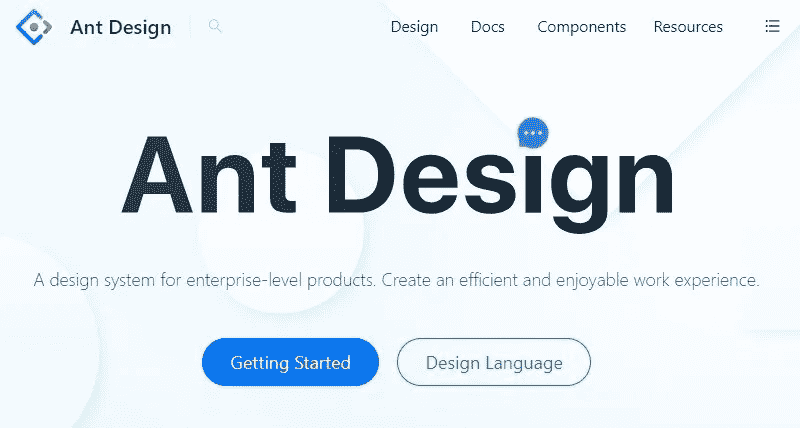

# 2021 年最佳 React 组件库

> 原文：<https://javascript.plainenglish.io/best-react-component-libraries-for-2021-a3ee85b8d05d?source=collection_archive---------7----------------------->

## 你应该知道的顶级 React 组件库

React 是一个 JavaScript 库，允许你为 web 和移动应用程序创建漂亮的用户界面。其庞大的生态系统是其成功的重要原因。

因此，在本文中，我将讨论 2021 年每个开发人员都应该知道的 10 个 React 组件库。

# 1.蚂蚁设计反应

Ant Design 是一个 React UI 库，具有各种易于使用的组件，用于创建漂亮的用户界面。它使用 Less.js 来设计组件的样式，并为许多语言提供国际化。Ant 设计框架允许您定制您的设计。Ant 设计元素包括按钮、图标、面包屑、网格、下拉菜单和分页。它还有一个适合移动应用开发的版本。

> 它每周有超过 37.5 万的 NPM 下载量和 6.6 万的 GitHub stars。

## 特征

*   对于 web 应用程序，已经创建了一个企业级 UI。
*   开箱即用的一套高质量 React 组件。
*   代码是用 TypeScript 编写的，并使用可预测的静态类型。
*   一整套设计和开发资源。
*   国际化支持数百种语言。
*   主题的每个功能都可以根据你的喜好进行定制。

# 2.材料用户界面

材料设计是谷歌创造的设计语言，于 2014 年发布。它有一个简单，轻便，用户友好的布局和设计，使创建有吸引力的应用程序变得轻而易举。材质设计建立在 Google Now 的“卡片”之上，融入了更多基于网格的布局、响应动画和过渡、填充以及灯光和阴影等深度效果。

> Material UI 每周 NPM 下载量超过 210 万，GitHub 星级超过 70.3K。

## 特征

*   主题值可以直接从组件属性中访问。
*   鼓励用户界面的一致性。
*   轻松响应地写作。
*   可以使用任何主题对象。
*   利用最广泛使用的 CSS-in-JS 解决方案。
*   压缩到小于 4 KB。
*   足够快以避免成为执行过程中的瓶颈。

# 3.反应虚拟化

React-virtualized 是一个维护良好且可靠的库。它有一个广泛的社区，因为它是开源的，所以目前有许多模块和扩展可以用来最大化显示的元素数量。它还有许多您可能没有想到的特性和定制选项。

> 它每周有超过 74.3 万的 NPM 下载量和 22.3 万的 GitHub 星级。

## 特征

*   高效显示大量数据。
*   渲染一个巨大的数据集。
*   用一组组件实现虚拟呈现。

# 4.Chakra UI

> React 应用程序的简单、模块化和可访问的 UI 组件

Segun Adebayo 创建了 Chakra UI，这是 React 的一个现代组件库。Chakra UI 是一个组件库，它以一种简单、模块化和可访问的方式提供了创建 React 应用程序所需的所有构件。Chakra UI 包括几个布局组件，如 Box 和 Stack，使使用属性装饰组件变得简单。它可以帮助您开始创建小的、可重用的组件来解决现实世界中的用户界面设计问题。

> 它每周有超过 121K 的 NPM 下载量和 19.9K 的 GitHub stars。

## 特征

*   Chakra UI 包括几个布局组件，如 Box 和 Stack，使使用属性装饰组件变得简单。
*   为了实现无限的可组合性，Chakra UI 组件构建在 React UI 原语之上。
*   它的大部分组件支持查克拉 UI 的黑暗模式。
*   WAI-ARIA 指导方针是由脉轮 UI 组件遵循的，它有必要的属性。

# 5.反应引导

> 用 React 构建的引导组件

Bootstrap 是一个众所周知的 HTML、CSS 和 JavaScript 库，它包括用于移动和 web 应用程序的 UI 元素。

虽然 Bootstrap 最广为人知的是一个 JS 框架，但 React Bootstrap 是 React 的一个全面改造，包括组件，但没有 bootstrap.js 或 jQuery 依赖项，本质上是用 React 组件代替 JavaScript 样式的组件。

此外，通过将 Bootstrap 的特性引入 React 的虚拟 DOM，React Bootstrap 将状态更新到虚拟 DOM，为开发提供了更坚实的解决方案。

> React Bootstrap 拥有超过 827K 的每周 NPM 下载量和 19.8K 的 GitHub stars。

## 特征

*   导入所需的代码/组件很简单。
*   通过压缩引导，您可以节省时间并避免错误。
*   通过压缩引导程序，它减少了键入时间和冲突。
*   使用起来很简单。
*   它封装在元素中。

# 6.蓝图用户界面

在 UI 开发方面，Blueprint UI React 组件框架紧随所有新的数据密集型桌面和在线应用的脚步。

这是一个基于 React 的用户界面工具包，用于在桌面应用程序中创建复杂的数据密集型界面。此外，它试图为所有组件提供现成的可用性标准，并提供对明暗主题模式的访问。

> BluePrint UI 拥有超过 134K 的每周 NPM 下载量和 18K GitHub stars。

## 特征

*   漂亮的 UI 组件。
*   非常有用的组件，可以节省很多时间。

# 7.语义 UI 反应

> 语义是一个基于自然语言有用原则的 UI 组件框架。

语义 UI React 是语义 UI 的官方 React 集成。语义 UI 是一个基于 jQuery 的库，它增强了管道的功能。语义 UI React 中的所有新功能都在 React 代码中进行了重写。

为了直接定义组件，您将使用 JSX 代码并将其绑定到 React 组件代码。此外，它还包括大量预构建的组件，这些组件旨在理解和编写语义友好的代码。

> 它每周有超过 232K 的 NPM 下载量和 12.4K 的 GitHub stars。

## 特征

*   博客页面上可以有封面图片。
*   草稿会在写作时自动保存。
*   速记道具。
*   子组件。

# 8.Evergreen UI

> Evergreen React UI 框架(按细分市场)

Evergreen 是一个 React UI 框架，用于创建大规模在线应用程序。开发者在 Segment 创建了它。

Evergreen 对其设计选择的广泛解释是其最大的特点之一。此外，它还提供了一组用于创建关键 web 应用程序功能的组件。Evergreen 的设计轻巧、简单、直接。它允许你快速开始创建优雅的用户界面。

> Evergreen UI 拥有超过 8.8K 的每周 NPM 下载量和 11K GitHub stars。

## 特征

*   有了 ui-box，就有了一个强大的组件 API。
*   因为 CSS-in-JS 而易于采用。
*   服务器端渲染简单，水合自动。
*   带有 React storybook 的专用 UI 开发环境。

# 9.索环

> 一个基于 React 的框架，在一个整洁的包中提供可访问性、模块化、响应性和主题

Grommet 是一个基于 React 的框架，结合了可访问性、模块化、响应性和主题。Grommet 通过一个易于使用的组件库，帮助为 web 构建响应迅速且可访问的移动优先项目。

Grommet 是一个组件包，它使创建响应迅速且可访问的移动优先网站变得简单。关于 Grommet 的最好的事情之一是它是多么容易被合并到现有的项目或开始新的项目。对于小屏幕手机或宽屏幕显示器，索环将帮助您快速设计布局。

> 它每周有超过 22.3K 的 NPM 下载量和 7.4K 的 GitHub stars。

## 特征

*   创建一个工具包作为一揽子交易。
*   将门户开放政策发挥到极致。
*   重组可以帮助影响一个已建立的组织。

# 10.雷巴斯

> 用样式化系统构建的 React 原始 UI 组件。

Rebass 是一个小型的 UI 组件库，它能够基于样式化的系统库生成一个非常强大的支持主题的 UI 元素集合。

Rebass 只包含八个核心组件，它们都是专门为响应式 web 设计而创建的，并且包含在一个小文件中。如果你不想只依赖组件库，想在开发的时候扩展一个现有的，Rebass 是必须的。因此，它变得越来越受欢迎。

> 它每周有超过 66.5K 的 NPM 下载量和 7.4K 的 GitHub stars。

## 特征

*   具有盒和柔性组件的柔性盒布局。
*   高设计和开发的内在灵活性。
*   使用基于数组的语法，快速、移动优先的响应风格是可能的。
*   风格化的系统属性提供了一流的开发人员人体工程学。

# 结论

React 组件就像用于应用程序开发的可重用乐高积木。流行的库和 UI 框架可以帮助您通过一组为您的应用程序预先制作的组件来加速开发。

我希望我的建议能帮助你为你的项目选择最好的组件库。在使用这些库之后，不要忘记分享您的想法。

感谢您的阅读！

*更多内容看*[***plain English . io***](http://plainenglish.io/)