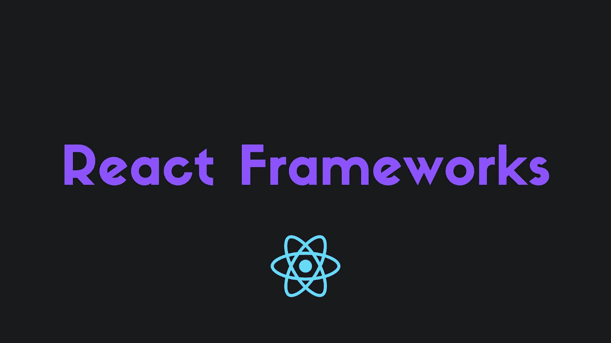

# 最流行的 React 框架——哪一个是最好的？

> 原文：<https://javascript.plainenglish.io/best-react-frameworks-which-one-is-the-best-25d1e781deac?source=collection_archive---------8----------------------->

## 了解最流行的 React 框架，以及哪一个是最好的。

## 开始之前

如果你想支持我，请随时使用我的推荐链接成为一个中等会员。谢谢！

 [## 加入我的介绍链接媒体-阿里木阿尔斯兰卡亚

### 作为一个媒体会员，你的会员费的一部分会给你阅读的作家，你可以完全接触到每一个故事…

alimarslank.medium.com](https://alimarslank.medium.com/membership) 

在这个故事中，您将了解最流行的 React 框架是什么，以及哪一个是最好的。

我也会给你我自己的推荐，让你有一个更诚实的回顾。

开始吧！

# 创建 React 应用

你是否曾经想创建一个非常简单的 React 应用程序，并在它的基础上构建一些东西？

好吧，这就是 Create React App 所做的，真的。

您将得到一个非常基本的 React 项目，您可以按照您想要的任何方式进行配置。在最新版本中，它还得到了更好的 Tailwind CSS 支持，这总是很有帮助的。

## 我自己的看法

Create React App 是创建一个非常简单的 React 应用程序或制作一个示例应用程序的最佳框架，不过，我不会用它来创建一个非常复杂的项目。

## 网站(全球资讯网的主机站)

 [## 创建 React 应用

### 通过运行一个命令设置一个现代化的 web 应用程序。

创建-反应-应用程序.开发](https://create-react-app.dev/) 

# Next.js

我的最爱 Next.js 来了。

> Next.js 为您提供了最佳的开发人员体验，包括生产所需的所有功能:混合静态和服务器渲染、类型脚本支持、智能绑定、路径预取等等。不需要配置。

对，就是这样。你可以保持 React 的简单性，但是有更多的特性，比如 SSR、TypeScript、预取等等。我是说，这多棒啊！

不仅是我，Next.js 是最受欢迎的 React 框架之一，广泛用于任何复杂的 React 应用程序。

## 我自己的看法

正如我所说，我喜欢 Next.js。当其他框架强迫你使用一些你不想要的奇怪结构时，Next.js 有一个非常简单的强迫风格，并增加了许多新功能。

现在有了像中间件和 URL 导入这样的东西，以及一个更快的 rust 编译器，这真是太棒了。

## 网站(全球资讯网的主机站)

 [## Vercel 的 next . js-React 框架

### 生产级反应可扩展的应用。世界领先的公司使用 Vercel 的 Next.js 来构建静态和…

nextjs.org](https://nextjs.org/) 

# 盖茨比（姓）

盖茨比是一个特殊的人。

你编码和开发你的应用程序，Gatsby 把它转换成一个目录，里面有一个 HTML 文件和你的静态资产。这个文件夹被上传到你最喜欢的主机提供商，瞧。

但不，它不仅仅是一个静态代码提供者！Gatsby 有很多不同的功能，比如 SSR、数据预取、图像优化等等，就像 Next.js 一样！

但不同的是，它使用 GraphQL 作为其数据层，并且通常比 Next.js 更严格。

你也有许多插件、启动器和主题，让你几乎不费吹灰之力就能构建应用。我是说，这多棒啊！

## 我自己的看法

我喜欢盖茨比，但不是我最喜欢的。尽管比起其他 React 框架，我更喜欢 Next.js，但我可以向您保证 Gatsby 是一个非常棒的框架。它还具有令人难以置信的性能，并且易于开发。

## 网站(全球资讯网的主机站)

 [## 最快的静态站点生成 Web 框架

### 1 快速从想法到生产从想法到生产用更少的时间启动，主题和超过 2500 个插件…

www.gatsbyjs.com](https://www.gatsbyjs.com/) 

# Blitz.js

Blitz.js 实际上是 Ruby on Rails 的 React 和 JavaScript 版本。

您可以使用“零 API”数据层抽象来构建 API 和前端应用程序，这让您无需创建 REST 或 GraphQL APIs 即可构建全栈网站。

如果你喜欢这个想法，我绝对推荐你去看看 Blitz.js。我将很快撰写如何使用 Blitz.js 构建全栈 web 应用程序的文章，敬请关注！

## 我自己的看法

如果你想构建一个全栈的 web app，但又不想有一个单独的 API，或者你根本不知道如何构建单独的 API，Blitz.js 是一个惊人的选择。这是我第三喜欢的框架，仅次于 Next.js 和 Gatsby。

## 网站(全球资讯网的主机站)

 [## blitz . js-full stack React 框架

### “零 API”数据层允许您将服务器代码直接导入组件，而不必手动添加 API…

blitzjs.com](https://blitzjs.com/) 

## 我自己的 Blitz.js 故事

我只写了一篇关于 Blitz.js 的深度评论，如果你想了解更多关于 Blitz.js 的内容，可以随意查看！

 [## Blitz.js 是更好的下一个

### Blitz.js 简介。

javascript.plainenglish.io](/blitz-js-the-better-next-js-def5bb69d80d) 

# 哪个框架最好？

没有明显的赢家。它们都有各自的优缺点，应该根据不同的用例来使用。

所以，最好的 React 框架是不存在的。有好有坏，但都各有利弊。

# 为什么没有包括所有的 React 框架？

首先，包括他们所有人几乎是不可能的。他们太多了。

老实说，较小的框架非常容易学习，并且不需要任何具体的指南，除非这个框架非常有趣或者非常重要。

但是不要担心，如果你有任何框架回顾或教程请求，请随意添加评论，我会试着写一个关于它的故事！

# 最后的想法

就是这样！您现在对 React 框架以及何时使用它们有了更多的了解。

希望这个故事对你有帮助。我很想听听您对 React 和具体 React 框架的体验！

# 仅此而已。感谢您阅读这个故事！

如果你喜欢这个故事，一定要为它鼓掌！你想问我什么都可以。

在 Twitter 上关注我:

 [## re _ ally 边缘

twitter.com](https://twitter.com/Re_allyedge) 

在 Patreon 上支持我:

 [## 阿里木阿尔斯兰卡亚是创造编程故事和教程。帕特里翁

### 今天就成为阿里木阿尔斯兰卡亚的赞助人:在世界上最大的…

www.patreon.com](https://www.patreon.com/allyedge) 

*更多内容看* [***说白了. io***](http://plainenglish.io/) ***。*** *报名参加我们的* [***免费每周简讯点击这里***](http://newsletter.plainenglish.io/) ***。***