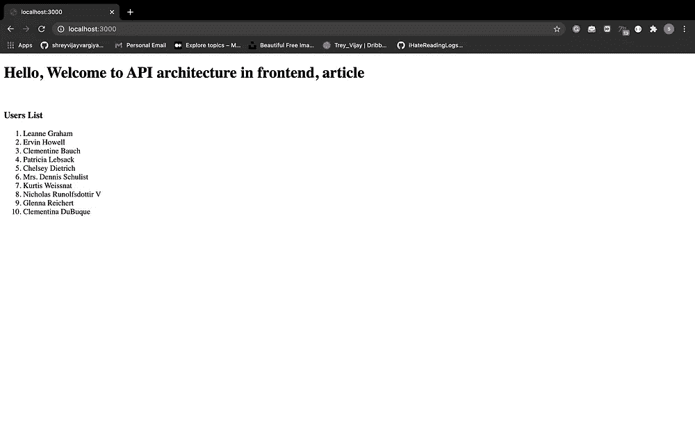

# 减少创建可伸缩 API 架构的最佳实践

> 原文：<https://javascript.plainenglish.io/best-scalable-api-architecture-in-frontend-dc6bdd13bbaf?source=collection_archive---------6----------------------->

## 停止在 Redux 操作中提取数据。


[Scalable architecture design](http://ihatereading.in/creativity)

# **当前形势**

我们经常对获取数据和如何连接前端应用程序和后端感到困惑，我们总是以阅读大量文章而告终。当从 API 获取数据时，我们更喜欢用 Redux 动作来获取数据，然后调度 Redux 动作来更新存储。这个逻辑并不完全错误，但它有以下后果:

1.  获取数据更新/重新呈现整个应用程序，而不管数据是否与特定组件相关。
2.  对用户反馈活动的控制越少，你就只能从 API 给用户更好的响应。例如显示加载程序、错误等。
3.  Redux 中的动作变得更加复杂，难以阅读。

# **备选方案**

redux 背后的主要逻辑是，我们将有一个存储，其中将存储组件之间共享的所有公共值，以及有助于调度任何数据以使用 reducers 更新存储的操作。我们的主要议程应该是让它像定义一样简单。

求解步骤

1.  分别添加所有 API 获取方法。
2.  为更新商店创建单独的操作。
3.  为每个动作命名，以便更好地理解。
4.  调用组件内部的获取方法，并在 API 响应后通过 action 更新 Redux 存储。

在这种方法中，我们可以让用户更好地了解 API 的响应，最重要的是用户体验，例如，加载程序、错误、互联网连接或服务器正在维护中。这种问题在应用程序中经常出现，如果不能向用户提供更好的透明度，将会导致糟糕的用户体验。

## 执行

我们将使用我们之前创建的一个存储库来解释架构。这里是 repository = >[https://github . com/shreyvijayvargiya/iHateReadingLogs/tree/main/TechLogs/NextJSArchitecture](https://github.com/shreyvijayvargiya/iHateReadingLogs/tree/main/TechLogs/NextJSArchitecture)

我们已经解释了我们将遵循的架构，到达本文进行详细理解= >[https://medium . com/nerd-for-tech/building-solid-next-js-architecture-a8c 6702 DC 67d](https://medium.com/nerd-for-tech/building-solid-next-js-architecture-a8c6702dc67d)。我们已经为所有 Redux 动作、存储和 reducers 创建了一个名为“**Redux”**的文件夹。此外，我们还有另一个名为 packages 的文件夹，其中有一个文件夹 **api** 文件夹。


API folded inside packages

现在，在 api 文件夹中，我们将根据您的需要创建子文件夹或文件。根据 API 的名称创建命名的文件，例如，如果您正在为仪表板获取"**用户"**数据，然后创建文件夹"**用户**"和文件名"**仪表板**或"**用户数据**"，尝试理解命名约定对于其他开发人员和您来说都不应该太难理解，所以请忽略名称的长度等等来命名它们。

我们将在“**仪表板”中创建一个 api 方法“**fetchUsersApi”**。**接下来**，**我们将使用 axios 发出 api 请求，或者在其中提取数据**。**我们将使用简单示例从 JSONplaceholder 获取 API([链接获取 api)](https://jsonplaceholder.typicode.com/users) 。


fetchUsers Method inside dashboard.js

现在，我们的独立 API 方法已经完成，根据您的需要，您可以返回这个" **fetchUsersApi "中的任何内容，**例如，您可以返回响应对象本身，或者像 **response.data** 等数据。

现在，最后一步是在组件内部调用这个 API 方法，所以出于开发目的，我在 index.js 文件内部调用了这个 API 方法。


Index.js

我们从 api 获取用户，然后更新状态并显示列表，此外，我们还添加了一个加载文本，以便在 API 获取数据时提供适当的用户体验和反馈。



Loading in the left image and users list in the right image.

下一步也是最后一步是，我们如何将数据从 API 更新到 Redux store，然后将数据从 store 显示到组件。

# **在 Redux 中存储来自 API 的数据**

我们将像现在一样获取数据，只增加一项，而不是直接在" **fetchUsers"** method **，**中更新状态。我们将在这里调度我们的 Redux 操作，它将相应地更新商店。在商店更新后，我们将从商店中获取用户数据，然后在应用程序组件中更新我们的用户状态。


Read the commented part.

注释部分解释了从 API 获取数据并在 reducer 状态下设置响应数据的方法，然后获取 reducer 状态并更新组件 useState 挂钩以直接显示来自 store 的数据。

# **结论**

在我看来，这一原则相当可靠，因为我们通过仅获取仪表板页面的用户数据来消除更新/重新呈现整个应用程序的延迟，这创建了可重用的 api 方法，因为我们可以在任何需要的地方重用" **fetchUsersApi"** 。

```
[https://github.com/shreyvijayvargiya/iHateReadingLogs/tree/main/TechLogs/ApiArchitecture](https://github.com/shreyvijayvargiya/iHateReadingLogs/tree/main/TechLogs/ApiArchitecture)
```

感谢阅读，下次再见，祝大家愉快。


[Our Website](http://ihatereading.in)

## 让我们一起建造伟大的东西

我们可以帮助你把你的想法变成现实。给我们发电子邮件或访问网站进行联系。