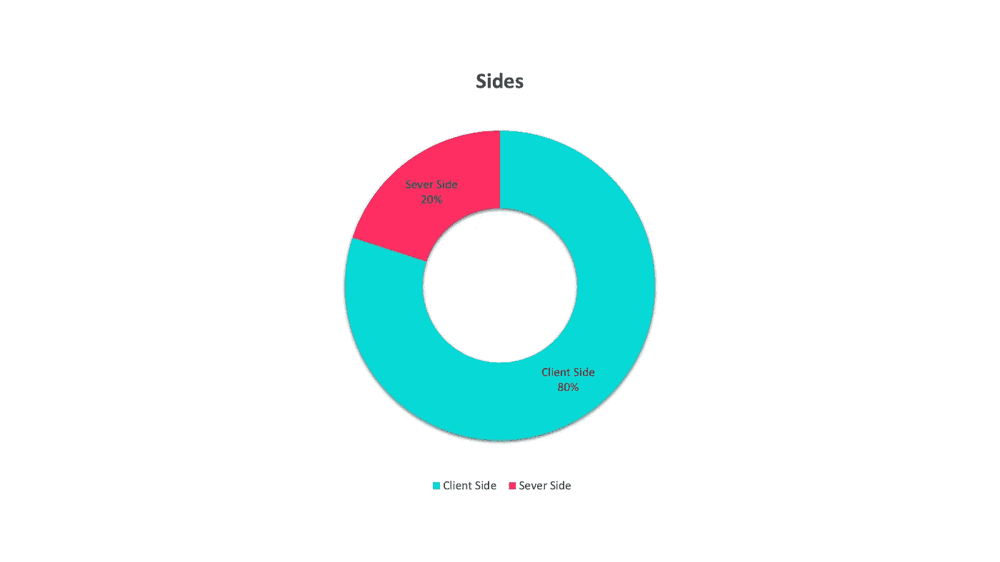
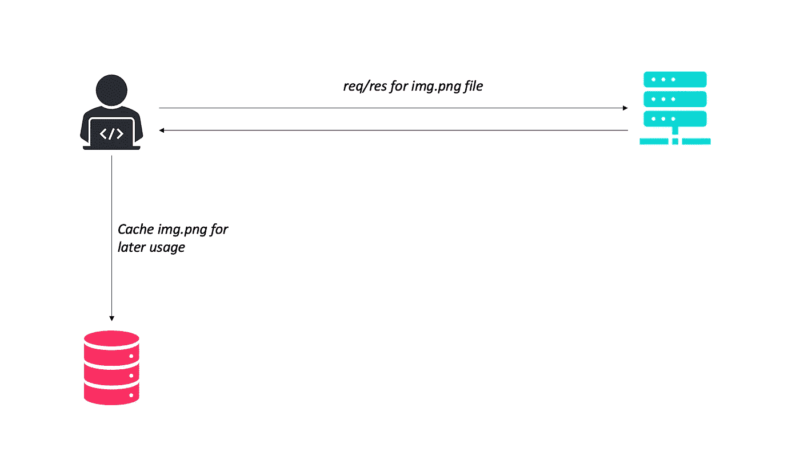

# 客户端优化的最佳技术

> 原文：<https://javascript.plainenglish.io/best-techniques-for-client-side-optimization-the-high-performance-series-a44aeb9f7dae?source=collection_archive---------3----------------------->

## 高性能系列

## web 编程中的顶级技术。

来自 SpeedCurve 的 Steve Souders 研究了 Alexa 排名前十的网站，并[报告了](https://www.stevesouders.com/blog/2012/02/10/the-performance-golden-rule/)、 *80%-90%的最终用户响应时间都花在了前端。从那里开始。”*

这是很好的建议！因此，今天，我们将探讨各种客户端优化技术，以提高性能。



# 限制 HTTP 请求的数量

减少 HTTP 请求是优化网站最重要的技巧。

## 将所有 JavaScript 资源合并成一个

要访问每个页面组件，如 HTML 文档、图像、CSS 等，浏览器需要为每个文件向服务器发送一个请求，这降低了完全加载页面所需的总时间。

为了解决这个问题，我们可以将较小的文件(如 CSS 文件)捆绑在一起，形成一个文件，从而减少 HTTP 请求的数量。

## 使用 CSS 精灵

由于网站将图像存储在单独的文件中，当浏览器加载网页时，它必须为每个图像发出 HTTP 请求，这降低了完全加载页面所需的总时间。

为了解决这个问题，我们可以使用 CSS sprites，这是一种将几个图像合并成一个图像的技术，称为 sprite sheet。

# 缩小资源(如 HTML、CSS 和 JavaScript)

这种技术删除了所有不必要的或重复的数据，如空白、注释以及紧缩变量名称，以便最大限度地减少代码占用的空间，从而提高性能，而不影响浏览器处理资源的方式。

要实现这一技术，我们可以使用 HTML Minify、Packer 等工具。

# 文件压缩

我们可以减少网络上传输的数据量，这不仅可以加快下载速度，还可以减少渲染时间，从而提高性能。

为了减少数据量，我们可以使用文件压缩技术。所有现代浏览器都支持 Gzip。

# 贮藏

我们可以通过在浏览器应用程序中提供缓存副本来减少服务器负载和不必要的带宽使用，而不是每次有人加载站点时都下载它。



> 缓存 web 内容有助于通过减少后端资源的负载和网络拥塞来提高网站的响应能力。

有多种方法可用于缓存验证，如下所示。

*   **最后修改**。服务器告诉浏览器它正在发送的文件的版本。

```
Last-Modified: Sat, 01 May 2021 07:28:00 GMT
```

img.png 档案创建于 2021 年 10 月 21 日。

*   **ETag** 。这是给予每个文件的唯一标识符。这就像一个散列，每个文件都有一个唯一的散列，如果你改变文件，散列也会改变。

```
ETag: "33a64df551425fcc55e4d42a148795d9f25f89d4"
ETag: W/"0815"
```

*   **到期**。这种技术告诉客户端 img.png 什么时候到期，让客户端一直使用到那个日期。

```
Expires: Sat, 01 May 2021 07:28:00 GMT
```

*   最大年龄。在 max-age 头中，我们可以写“此文件从今天起 1 周后到期”。

# 形象指南

有一些很好的图像处理指南。

*   通过使用各种图像压缩实用程序，在不大幅降低图像质量的情况下减小图像的大小是很好的做法。
*   永远不要使用 HTML 图像元素的宽度和高度属性来设置图像的尺寸。
*   您应该用独立于分辨率的光栅图形替换矢量图形。
*   首选 PNG 格式。

# 将 JavaScript 放在 HTML 页面的底部

浏览器停止呈现页面，直到执行完每个 JavaScript 块。对于小的 JavaScript 块，这不是一个大问题。但是，对于大型库，页面加载时间可能会大大增加。

要解决这个问题，请将 javascript 放在 HTML 页面的底部，或者延迟一段时间后在后台加载脚本。

# 将样式表放在顶部

我们还应该将样式表移动到 HTML 文档的顶部，以便更快地呈现。

# DNS 查找

由于 DNS 查找增加了响应时间并带来了延迟，我们应该在用户点击链接之前解析域名。

# 使用 CDN 缓存所有静态数据

CDN 缓存 web 应用的所有静态数据，如 JavaScript、CSS 和图像，并在本地将其交付给用户。

使用 CDN 技术，所有静态内容都在本地传送，只有动态数据必须直接来自服务器。这大大缩短了整体响应时间。

很简单，对吧？

[*更多内容看 plainenglish.io*](http://plainenglish.io/)