# 像英雄一样测试和记录 API 的最佳工具

> 原文：<https://javascript.plainenglish.io/best-tools-to-test-and-document-your-api-like-a-hero-2dd5886dc09d?source=collection_archive---------11----------------------->

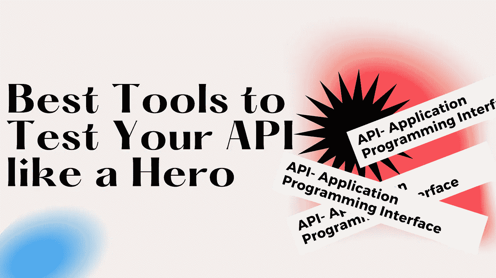

构建您的 API 很有趣，对吗？测试一下怎么样？

在本文中，我将分享如何测试 API 的资源。开发 API 端点之后，测试它们可能是一件大事。但是我会和你分享一些神奇的工具来有效地测试你的 API。

# 目录

*   API 简介
*   测试工具
*   API 文档
*   资源

# API 简介

# 什么是 API？

API(应用程序编程接口)作为一个中间件，能够在软件产品之间传输数据。它可以用来定义请求、应该使用的数据格式、构建软件产品时要遵守的约定、处理业务逻辑等。

# 测试工具

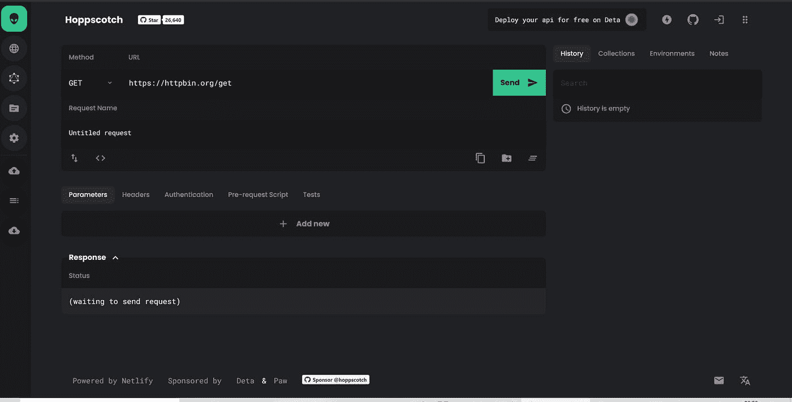

一个免费、快速、漂亮的 API 请求生成器，具有在线测试环境，支持多平台和多设备，等等。

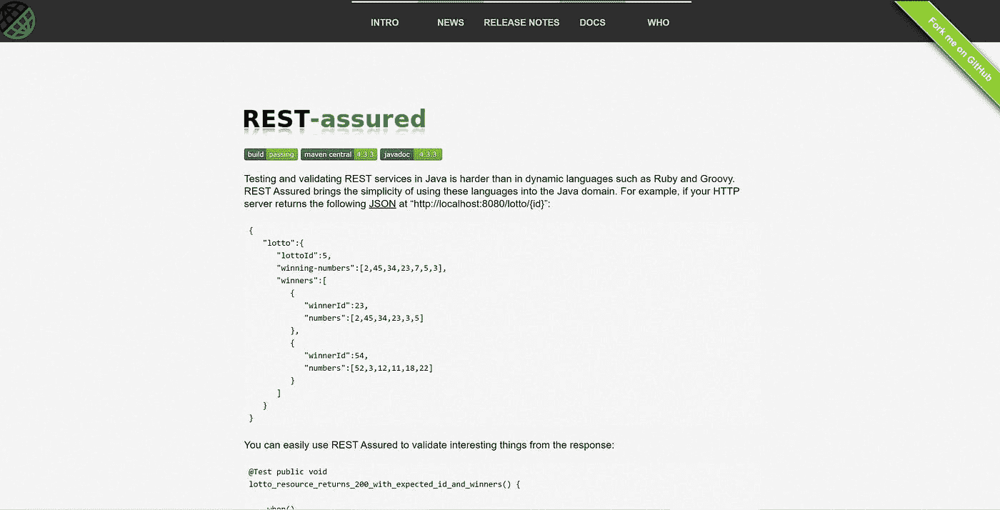

这个工具简化了在 Java 中测试 API 端点，它测试和验证响应。

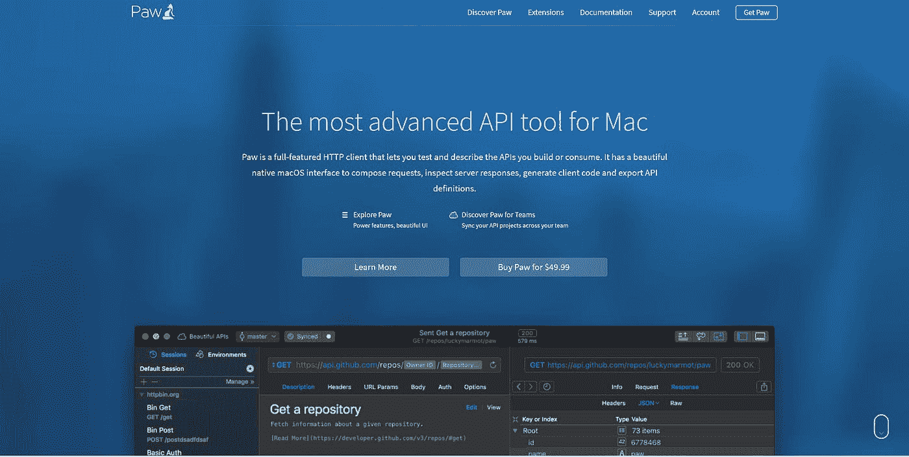

Paw 是一个全功能的 HTTP 客户端，允许您测试和描述您构建或使用的 API。它有一个漂亮的本机 macOS 界面来编写请求、检查服务器响应、生成客户端代码和导出 API 定义。

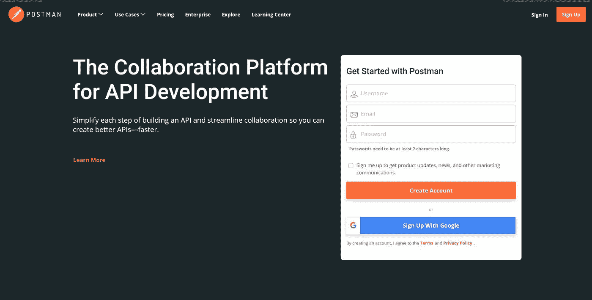

Postman 是一个 API 开发的协作平台。这个工具最棒的地方在于它简化了构建 API 的每一步，而且它还使得构建更快的 API 的协作变得无缝。

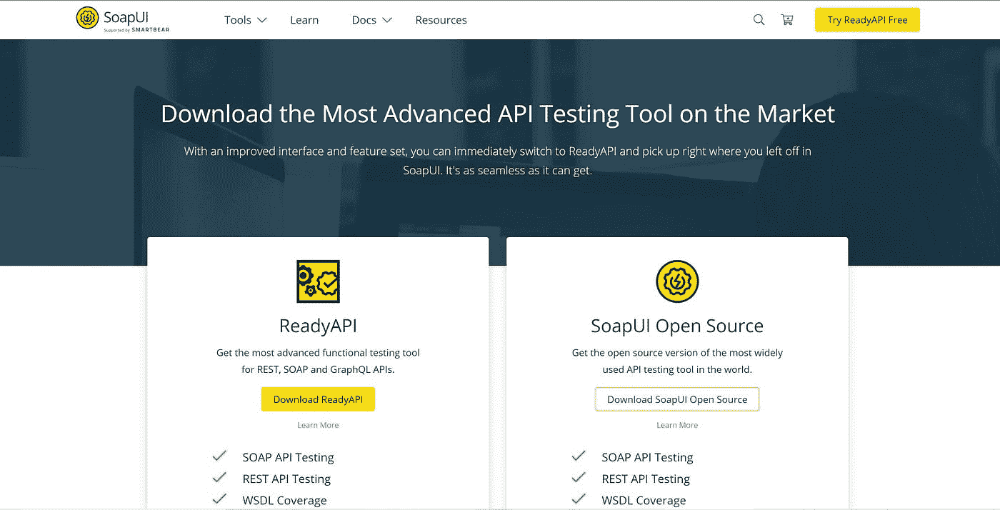

这也是一个测试工具，可以帮助无缝测试 API 端点。

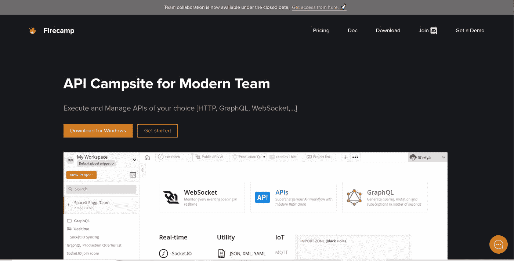

这是一个界面友好的工具，可以用来测试任何堆栈。在软件工程中，使用哪种技术栈并不重要，从 REST API、WebSockets、GraphQL 等等。

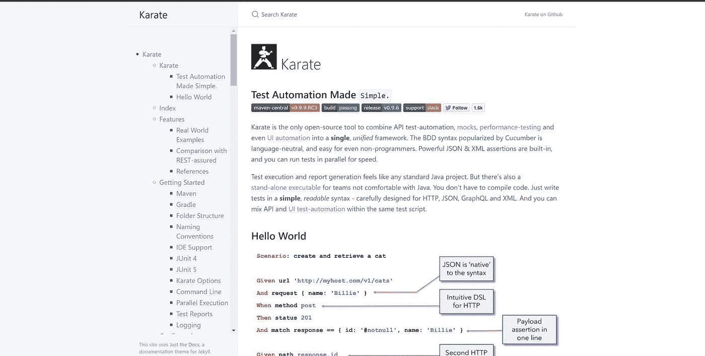

空手道是一个开源工具，用于 API 测试自动化、性能测试、UI 自动化等操作。

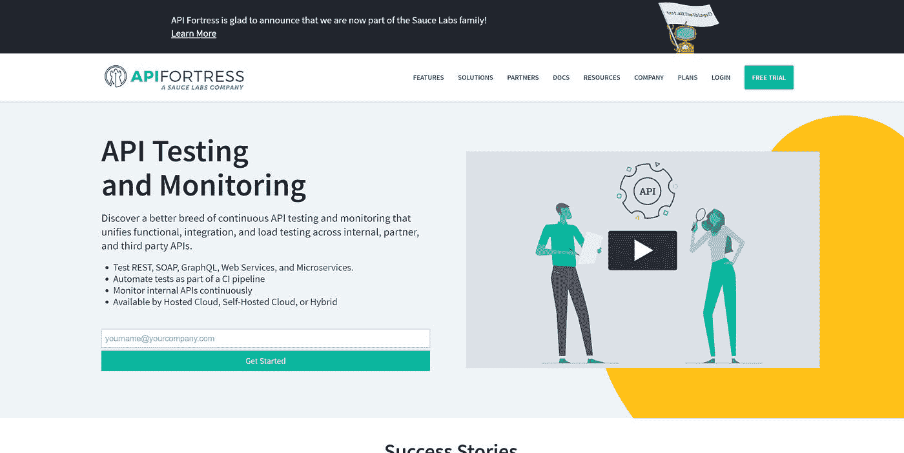

对于测试 REST、SOAP、GraphQL、Web 服务和微服务、作为 CI 管道的一部分进行自动化测试、持续监控内部 API 等，这是一个非常好的工具。

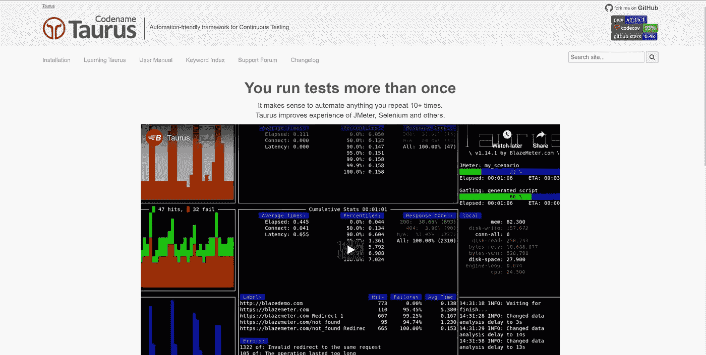

这是一个通过自动化整个过程来提高生产率的连续测试工具。

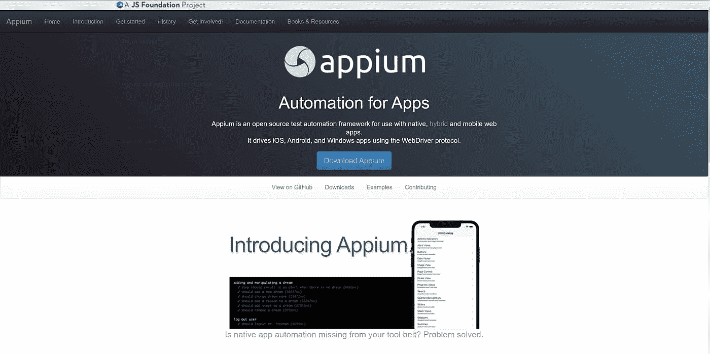

这是一个开源的测试自动化框架，用于本地、混合和移动 web 应用程序。

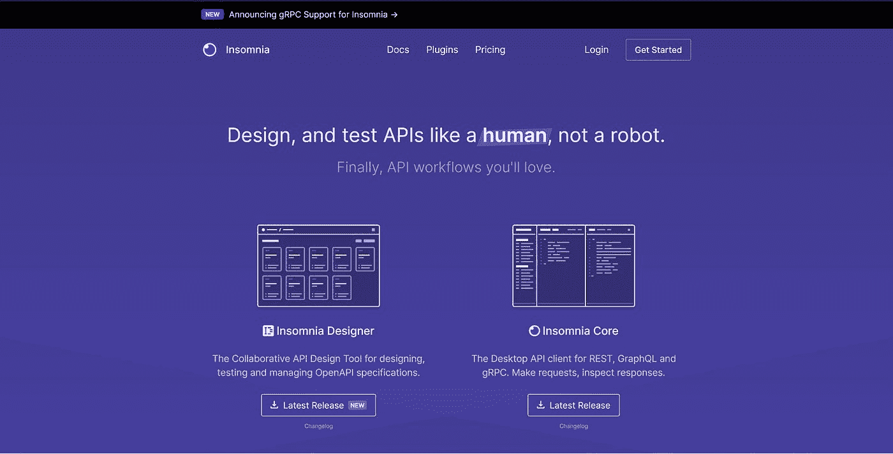

这个工具帮助您更容易、更快地测试 API 端点，而没有任何限制。

# API 文档

在开发和测试 API 之后，API 文档是最重要的事情之一。它简化了理解每个端点做什么或者它们的请求样本和响应的过程。假设您为用户身份验证构建了几个端点。您不可用，但是您团队中的一个前端开发人员想要使用它，并且没有关于每个 API 做什么或示例请求和响应的指南或说明。这是一个可以真正减缓开发过程的缺陷。

下面是一些可以用于 API 文档的工具

# 资源

[测试工具](https://skillgigs.com/the-10-best-api-testing-tools-on-the-market/)

我希望这个资源对你有用。

你可以在推特上联系我

*最初发表于*[T5【https://blog.idrisolubisi.com】](https://blog.idrisolubisi.com/best-tools-to-test-and-document-your-api-like-a-hero)*。*

*更多内容请看*[***plain English . io***](http://plainenglish.io/)