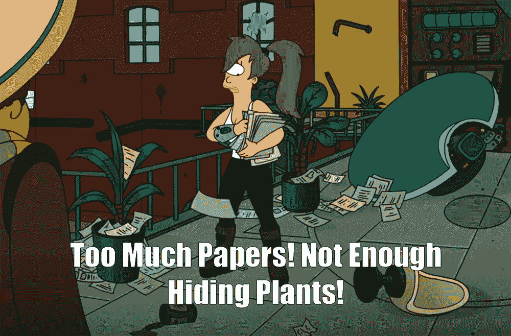
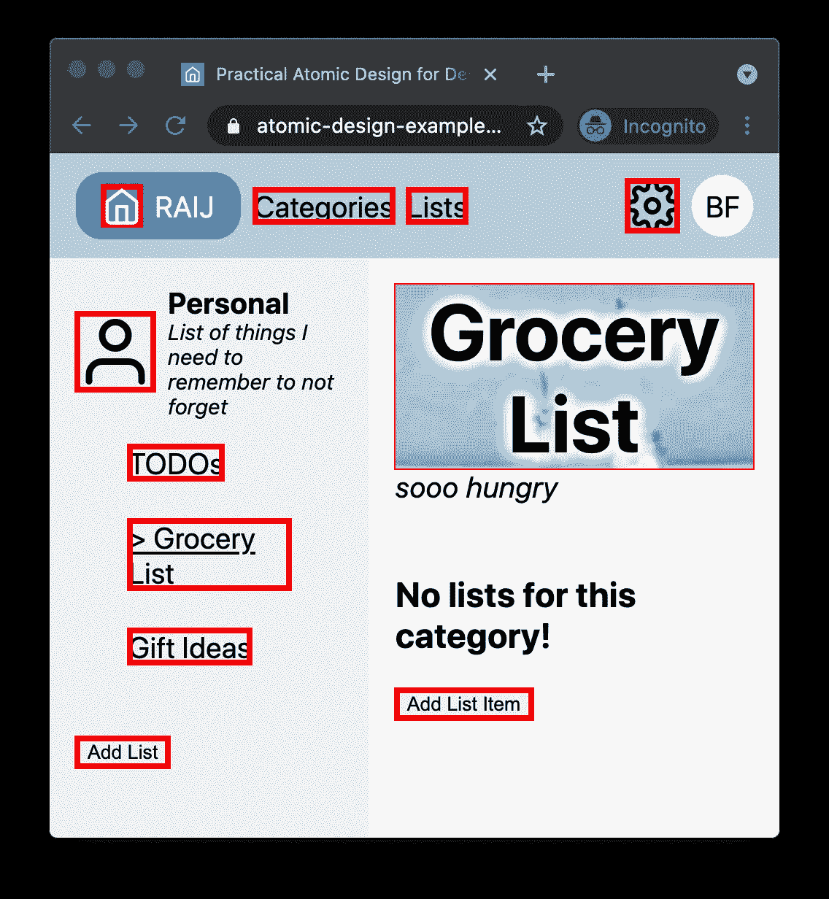
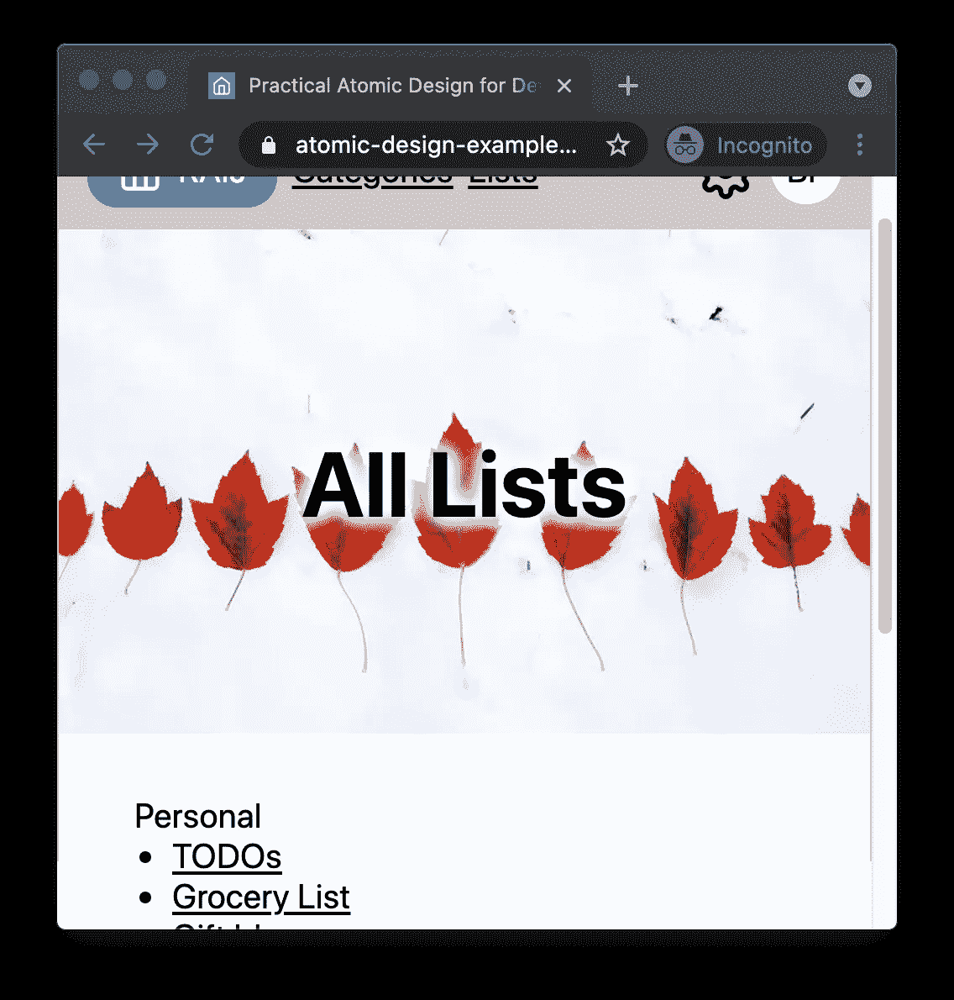
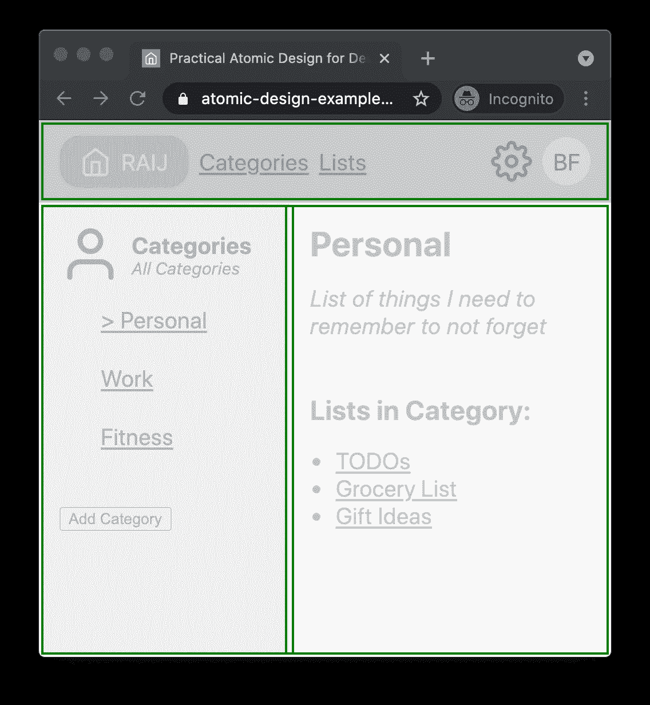
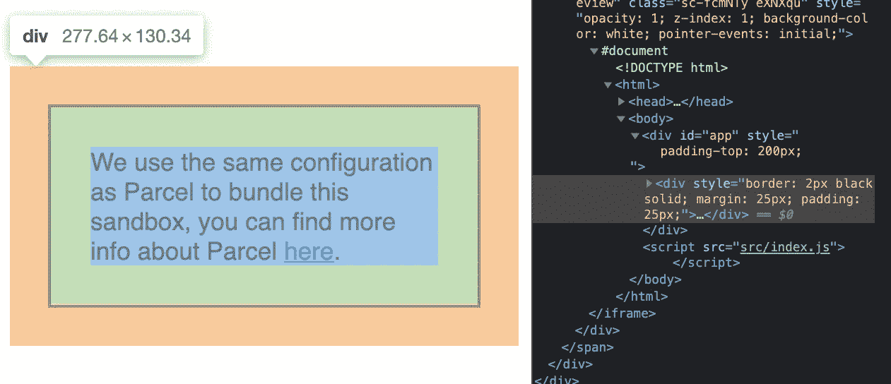

# 面向开发人员的原子设计:更好的组件组合和组织

> 原文：<https://javascript.plainenglish.io/better-app-organization-with-atomic-design-for-developers-ce1eb4e82f11?source=collection_archive---------11----------------------->

## 围绕原子设计方法开发基于组件的网站和应用的实用指南。


组织你的应用程序(或者应用程序/站点，我会互换使用)看起来很容易。一个文件夹用于组件，一个用于资产，另一个用于实用方法。甚至可能是一个单独的页面文件夹！不要被愚弄，它几乎从来没有那么容易。



> “没事了。这个地方只需要一个小时的官僚化。”
> 
> 赫尔墨斯·康拉德

赫尔墨斯·康拉德会同意，你的应用需要的是一个良好的、一小时的官僚化。规章制度万岁！我通常不支持官僚主义，但随着你的应用开始增长，你应该有一种方法来组织事情，提供更细粒度的组织和分离，更重要的是，基于明确的规则和指导方针，而不是猜测或直觉。

# 我的目标

我将提供一些背景知识，但是有很多关于原子设计的内容，来自设计者和开发者。我的主要目标有三点:

1.  列举我和我的团队在决定如何对组件进行分类时发现的规则。
2.  提供显示五个类别中每个类别的实现的代码。
3.  展示这些组件在“真实”站点环境中的使用。

**请注意:**你可以不同意我提出的任何/所有规则。您可能会发现它们并没有涵盖所有边缘情况。我很乐意[听到任何想法和意见](https://twitter.com/benjaminwfox)。我希望你带着一个想法离开，如何以一种适合你的方式实现这个方法。

# 内容

1.  [背景故事](#478c)
2.  [原子设计](#6d58)
3.  [为什么这篇文章](#d8ba)
4.  [为什么不是这篇文章](#fabe)
5.  [样本代码](#c5a4)
6.  [原子](#6711)原子
    - [原子](#9000)的例子
    - [原子](#08c1)的规则
7.  [分子](#abab)
    - [分子的例子](#8aeb)-
    -[一个朦胧的分子](#53d1)-[分子的规则](#f4a3)
8.  [生物](#ae3a)生物
    - [生物](#f201)生物
    - [生物](#507b)规则
9.  [模板](#5fcb)
    - [模板示例](#cb84)
    - [模板变体](#2e8d)
    - [分层模板](#5842)-[模板规则](#80c2)
10.  [页](#ed28)页
    - [页](#cb3a)页
    - [页](#0a91)页
    - [关于路线的说明](#ebff)
11.  [结论](#fbea)
    - [一个规则可以统治一切](#a5ad)

# 背景

几年前，我一直在寻找一种更好的方法来组织 web 应用程序中的组件。当时与我一起工作的设计师采用了一种遵循原子设计原则的设计系统，这似乎可以很好地转化为前端开发空间，因为最终我们的工作是实现设计团队创建的组件。

拥有一种用于对组件进行分类的通用语言似乎是显而易见的，尽管出于各种与原子设计无关的原因，我们的设计师和工程师之间并没有出现这种情况。

它确实在工程团队内部工作得很好，尽管如此，好消息是，你不需要从设计师那里得到认可和采纳就可以开始使用这些原则进行开发！

# 原子设计

原子设计是一种创造设计系统的方法，由布拉德·弗罗斯特创造。你可以[阅读他的完整帖子](https://bradfrost.com/blog/post/atomic-web-design)全面了解。

出于本文的目的，了解原子设计将设计系统(以及组成应用程序的组件)分成五个层次很重要。

它从最小的组件级别(原子)开始，并组合这些组件以创建更大的组件(分子)，这些组件本身又组合成更大的组件(有机体)，然后显示在构成应用程序(页面)的逻辑组(模板)中。

`**Atoms -> Molecules -> Organisms -> Templates -> Pages**`

在本文中，我将讨论如何将原子设计原则应用于前端开发。我将使用 React 作为具体的例子，但是这些定义和原则应该适用于任何基于组件或组合的 UI 应用程序。

# 为什么这篇文章

在决定使用原子设计原则作为组件组织和层次结构的基础后，我和我的团队面临的最大挑战是弄清楚什么组件放在哪个桶里。我还发现了一些其他的文章，里面有一些零碎的细节，但是我从来没有发现任何一篇文章既给出了如何描述每一个层次的说明性例子，又给出了实现和使用的例子。

当您构建可重用组件时，需要考虑很多因素，包括组件如何构造、它需要什么数据、数据在哪里、是否需要状态等等。因为在开始构建组件之前，您已经(希望)做出了大部分或所有这些决定，所以您可以将它们作为一组试探法，将您的组件存储在最有意义的地方。

> **启发式** —一种【用于决策的】实用方法，不保证是最优的、完美的或合理的，但足以达到一个直接的、短期的目标。
> 
> ——[维基百科](https://en.wikipedia.org/wiki/Heuristic)

我说启发式是有意的，因为你肯定会在任何方法中发现边缘情况或灰色区域。目标是确保这些很少，所以留给你的是一个提供最大**可重用性、灵活性和可组合性**的组织系统。

> 原子设计不是一个线性的过程，而是一个心智模型，帮助我们把用户界面同时看作是一个内聚的整体和部分的集合。
> 
> 布拉德·弗罗斯特

# 为什么不是这篇文章

根据我的经验，这种方法最适合(或预期)大型、频繁更新和/或频繁扩展的应用程序。

有一个计划良好的设计和信息层次结构会有所帮助，但这并不是绝对必要的。即使是相对简单的模型或线框，你也可以开始了解 UI 的哪些部分是相互依赖的。

如果我正在开发范围、复杂性或预期寿命相对有限的库或应用程序，我不会使用这种方法。

# 示例代码

在整篇文章中，我将分享和引用我以一个相对简单的列表/待办事项应用程序的形式开发的代码。没有互动功能。它旨在可视化地&结构化地展示组件如何使用原子设计来构建彼此。在这个网站上，你可以看一看[/设置页面](https://atomic-design-example.benjaminwfox.com/settings)来切换不同级别组件的轮廓。

*   网址:[https://atomic-design-example.benjaminwfox.com/](https://atomic-design-example.benjaminwfox.com/)
*   知识库:[https://github.com/BenjaminWFox/example-app-atomic-design](https://github.com/BenjaminWFox/example-app-atomic-design)

# 原子

原子是最基本的组件，尽可能的通用。

# 原子的例子

图标、按钮、链接和标签都是原子的好例子。它们自己并不做很多事情，网站上的许多其他组件通常都依赖于以这样或那样的方式使用它们。它们几乎可以在整个站点的任何地方使用，因此具有很大的灵活性。让我们来看一个非常基本的例子，`Button`:

```
export default function Button({label, onClick}) {
  return <button role="button" onClick={onClick}>{label}</button>
}
```

这是最基本的。这里甚至不需要任何风格。虽然对大多数网站来说可能不是这样，但是样式不会增加太多的复杂性，也不会改变`Button`的“原子性”。另一个例子，一个`BlockLink`:

```
import Link from 'next/link'export default function BlockLink({href, children}) {
  return <div className="underline"><Link href={href}>{children}</Link></div>
}
```

不管出于什么原因，我构建的演示站点经常需要块显示链接！在这种情况下，导入一个框架原语就可以了。它比原子还小。如果你愿意，你可以称它为神经管，这是一个听起来很酷的造词😎 ⚛️.`Link`只是对`a`标签的抽象，具有特定于框架的功能。从样式或标记的角度来看，它不做任何事情。



*Visual example of Atoms:* `*BlockLink*`*,* `*Button*`*, and* `*Icon*` *components.*

# 原子规则

*   不应构成其他组件/仅使用[本地元素](https://developer.mozilla.org/en-US/docs/Web/HTML/Element)或类似于本地元素的框架特定组件
*   可以有自己的标记和样式
*   可以保持自己的内部状态
*   不应该与特定的 UI 或逻辑区域紧密耦合
*   不应直接访问应用程序(或更高级别的)状态
*   不应该有任何与 ui/布局无关的副作用
*   不应实现任何特定于应用程序的业务逻辑

# 分子

**分子**组成原子来创建更复杂的组件，将自己的标记和样式添加到混合物中。除此之外，我对分子使用的规则实际上与原子的规则相同。

# 分子的例子

由原子组成的分子，在使用上更具体一些，但是(这当然也取决于设计)它们在整个站点的区域中也应该是可重复使用的。下面是一个 atom `ImageWithOverlay`的例子，它将一些文本叠加到图像上。除了定位文本之外，它没有太多具体的样式。

下面是一个分子`BannerImage`，它组成`ImageWithOverlay`来创建一个专门设计的横幅，添加在内容的开始，与其父元素的顶部&侧边对齐。

```
// /atoms/image-with-overlay.js
import styles from './image-with-overlay.module.css'
import Image from 'next/image'export default function ImageWithOverlay({ title, subtitle, src, layout = 'fill' }) {
  return (
    <>
      <div className={styles.caption}>
        {title ? <h1>{title}</h1> : null}
        {subtitle ? <p>{subtitle}</p> : null}
      </div>
      <Image
        src={src}
        layout={layout}
        objectFit="cover"
        objectPosition="center center"
      />
    </>
  )
}// /molecules/banner-image.js
import Image from 'next/image'
import styles from './banner-image.module.css'
import ImageWithOverlay from '../atoms/image-with-overlay'export default function BannerImage({ src, title, subtitle, height }) {
  return (
    <div
      style={{height}}
      className={[styles.banner, 'flush-width', 'flush-top'].join(' ')}>
      <ImageWithOverlay title={title} subtitle={subtitle} src={src}/>
    </div>
  )
}
```

将此处的`BannerImage`(拉伸至顶部&侧边空白)与之前截图中的`ImageWithOverlay`进行比较:



# 模糊的分子

乍一看，示例项目中有几个组件并不完全符合分子定义。`SidebarLinkList`、`HeaderLinkList`、`HeaderIconList`都属于这一类。它们都差不多，并且在单个`div`中呈现了一组孩子:

```
import styles from './header-link-list.module.css'export default function HeaderLinkList({children}) {
  return <div className={styles.headerLinkList}>{children}</div>
}
```

我将这些标记为分子的原因是，虽然它们没有显式地组成任何原子，但它们都隐式地依赖于作为`children`传递的特定原子。在这里的`HeaderLinkList`的例子中，所有的子组件都应该是`BlockLink`组件。如果示例应用程序更健壮，我可能会创建一个定制的`PropType`条目，以便在任何`children`不是`BlockLink`时抛出一个错误。

# 分子规则

*   由一个或多个原子组成的成分
*   可以有自己的标记和样式
*   可以保持自己的内部状态
*   不应该与特定的 UI 或逻辑区域紧密耦合
*   不应直接访问应用程序(或更高级别的)状态
*   不应该有任何与 ui/布局无关的副作用
*   不应实现任何特定于应用程序的业务逻辑

# 有机体

有机体是应用程序的业务逻辑开始出现的地方。它们可能对应于应用程序的特定功能或部分。它们也可能是通用的，但是与应用程序逻辑紧密耦合。数据提取和对应用程序状态的读/写应该主要发生在这里(或者在页面级别)。

# 生物体的例子

示例应用程序中更基本的有机体之一是`SidebarNavigation`。在两个分子和一个原子的情况下，它并没有变得非常复杂，但是它已经足够专门化了——被设计成生活在边栏中并进一步组成一个分子——它不再是一个分子本身。

> 构建有机体可能是重新评估你的其他组件的好时机。他们真的属于你给他们分类的地方吗？如果它们被归类在正确的地方，你给它们起了合适的名字吗？

当我写这篇文章时，我注意到在`SidebarNavigation`组件中，我将`IconHeading`命名为`SidebarTitle`，将`VerticalListLayout`命名为`SidebarLinkList`😱

那是次优的！

为什么？这两个组件没有任何与侧栏明确相关的东西！

碰巧侧栏是他们唯一被实现的地方。虽然我觉得我把它们变成分子是正确的(即使这对于`VerticalListLayout`来说可能是有争议的)，但是...试探法)，如果它们是*实际上*只能在侧栏的上下文中使用，那么将它们添加为有机体可能更合适。

在重新命名这两个组件以确保它们更一般化之后，我的`SidebarNavigation`组件看起来像:

```
import SidebarLinkList from '../molecules/sidebar-link-list'
import BlockLink from '../atoms/block-link'
import SidebarTitle from '../molecules/sidebar-title'export default function SidebarNavigation({ title, subtitle, sidenav, selected, children }) {
  return (<>
    <IconHeading title={title} subtitle={subtitle} />
    <VerticalListLayout>
      {sidenav.map(entry => {
        const label = selected === entry.name ? `> ${entry.name}` : entry.namereturn <BlockLink key={entry.href} href={entry.href}>{label}</BlockLink>
      })}
    </VerticalListLayout>
    {children}
  </>)
}
```

`SidebarNavigation`组件用于其他更具体的组件，如`ListSidebar`。在这个例子中，它没有做很多事情，但是它最终将需要业务逻辑来处理像按钮这样的事情。

```
import SidebarNavigation from '../../components/organisms/sidebar-navigation'
import Button from '../atoms/button'export default function ListSidebar({category, name, description, sidenav}) {
  const handleClick = () => {
    alert('Add List Functionality not implemented!')
  }return (
    <SidebarNavigation selected={category} title={name} subtitle={description} sidenav={sidenav}>
      <Button onClick={handleClick} label="Add List" />
    </SidebarNavigation>
  )
}
```

# 生物法则

*   由多个原子和/或分子和/或其他有机体组成的复杂组件
*   可以有自己的标记和样式
*   可以获取应用程序特定的数据
*   可以实现特定于应用程序的业务逻辑
*   可以连接到应用程序(或更高级别的)状态
*   可以与应用程序的特定区域(用户界面和/或逻辑)紧密结合
*   可以按照逻辑分类(功能、页面等)组织到子文件夹中

# 模板

模板是确保应用程序页面一致的一种方式。他们负责创建布局，并使人们很容易知道内容或功能的特定领域需要去哪里。有许多方法可以创建模板。我将展示的方式非常明确，我喜欢它，因为它有助于强制应用逻辑(在页面和有机体中)和应用布局(在模板中)的高级分离。

# 模板示例

在《反应》中，这不是我经常看到的模式，尽管我至少在几篇文章中讨论过。这可能是因为人们更经常谈论较低级(原子/分子/有机体)或较高级(页面)的组件🤷‍♂️

```
import styles from '../../styles/Home.module.css'export default function TemplateSidebarContent({ header, sidebar, content }) {
  return (
    <>
      <header className={styles.header}>
        {header}
      </header>
      <section className={styles.content}>
        <aside className={styles.sidebar}>
          {sidebar}
        </aside>
        <main className={styles.main}>
          {content}
        </main>
      </section>
    </>
  )
}
```

这个组件真的做得不太对吗？！css 导入完成了大部分繁重的工作，但即便如此也没什么大不了的——主要是设置`flex`属性、宽度和高度。直到这个组件被组合成页面，美好时光才开始滚动🥳，因为每一个道具(`header` / `sidebar` / `content`)都将是一个独立的组件，我们可以指望它完全按照预期的那样出现在屏幕上。🤓



*A template, highlighting the Header, Sidebar, and Content*

# 模板变化

开始向模板添加额外的道具来支持“变化”可能很有诱惑力，比如边框、背景颜色或其他小的风格差异。这是我做过的事吗？👀是的。这是你应该做的事情吗？不。如果你这样做了，这是世界末日吗？也不是。

只要考虑到使用模板组件需要考虑的越多，它就变得越没用。美妙之处在于它的简单性，不用担心网站如何在页面上布局的高层次细节。

# 分层模板

值得注意的是，模板没有*有*只在页面级别实现。假设您正在使用一个模板来布局站点的最高层元素(标题、侧栏、内容区域),正如您将在下一节中看到的，您可能会发现您*也*希望模板在内容区域中布局内容！

> 在不同的内容中重复使用一致的布局时，模板是一个很好的选择。

# 模板规则

*   有助于多个有机体布局的组件
*   可以有自己的标记和样式。
*   能够根据需要接受和传递道具。
*   不应访问应用程序(或更高级别)状态
*   不应该有任何与 ui/布局无关的副作用
*   不应实现任何特定于应用程序的业务逻辑

# 页

页面是拼图的最后一块，每一页都将实现一个特定的模板。页面和路由是截然分开的，虽然我在本文中没有涉及路由，但至少应该说，以同样的方式，每个页面实现一个模板，每个路由应该实现一个页面。

因为我在 Next.js 中使用 React，它具有基于页面的路由，所以我在我的项目结构中做了一个具体的描述。所有原子设计页面活在`/src/components/pages`下，所有路由活在`/src/pages`下。除去特殊的`_app.js`，组件页面和路由页面的比例是 1:1。

# 页面示例

```
import TemplateSidebarContent from '../templates/template-sidebar-content'
import UserHeader from '../../components/organisms/user-header'
import CategoryDetails from '../../components/organisms/category-details'
import CategorySidebar from '../../components/organisms/category-sidebar'export default function Category({name, description, category, categories, sidenav}) {
  return <TemplateSidebarContent
    header={<UserHeader />}
    sidebar={<CategorySidebar category={category} name={name} description={description} sidenav={sidenav} />}
    content={<CategoryDetails category={category} />}
  />
}
```

对于每个页面，我将选择模板和组件来填充模板。这些可能是相当普遍的用法，比如在所有页面上使用的`UserHeader`。它们也可以像`CategoryDetails`组件一样具体使用。如模板部分所述，如果需要的话，`CategoryDetails`组件*可以*实现另一个模板！见鬼，如果内容足够复杂，其他组件也可以实现另一个模板！

# 页面规则

*   实现特定模板的组件
*   可以获取特定于应用程序的数据
*   可以实现特定于应用程序的业务逻辑
*   可以连接到应用程序(或更高级别的)状态
*   不应该有自己的标记和样式

# 路线笔记

根据您的特定框架，您可能会发现路由比页面做更多的繁重工作。在 Next.js 中可能会出现这种情况，因为在这个路径中你必须使用特殊的`getStaticProps`和`getServerSideProps`。

这不是问题，但我会选择一个，页面**或**路线，把这个逻辑。无论你**不**选择哪一个，都应该是一个更基本的实现。

在示例应用程序中，我将数据获取和其他逻辑放入了 Route 中，以简化页面实现。

# 结论

希望这已经给了你一些用原子设计开发的具体例子，以及一种新的思考应用程序结构化的方法。

我想重申布拉德·弗罗斯特的话，这主要是“一个心智模型，帮助我们将用户界面同时视为一个内聚的整体和部分的集合。”当您继续开发基于组件的应用程序时，请始终考虑如何构建尽可能通用、灵活和可重用的组件。

# 一个人统治所有人

为此，我还有一条规则，或许值得一提，但多年来它让我头疼不已，值得在此提及。如果你忘记了其他的一切，记住这个！

***通过父组件分配边距给组件，而不是组件本身。***

为什么不呢？考虑到您创建的每个组件都应该是一个自包含的单元，在它自己的范围内可预测地运行。边距通过在元素本身的之外创建空间*来打破这种模式，并且由于边距折叠会导致不可预测性或可变行为[。](https://developer.mozilla.org/en-US/docs/Web/CSS/CSS_Box_Model/Mastering_margin_collapsing)*



考虑上面的`div`以及边距、填充和边框。元素的*边界*实质上是组件应该结束的地方。如果将*边距*应用于`div`组件本身，那么在其他上下文中重用该组件可能会产生意想不到的布局和显示后果。

如果 div 需要边距，更好的方法是在父组件中专门指定它。

> 边距在元素周围创建了额外的空间**。相比之下，填充会在元素**内创建额外的空间**。**
> 
> - [MDN 网络文档](https://developer.mozilla.org/en-US/docs/Web/CSS/margin)，重点已添加

示例应用程序中的一个例子是`VerticalListLayout`组件。它呈现了一个旨在成为`BlockLink`的子集合。

```
export default function VerticalListLayout({children}) {
  return <div className={[styles.verticalListLayout, 'molecule'].join(' ')}>{children}</div>
}
```

这也意味着每个`BlockLink`在父组件中都有一定的布局，包括特定的边距。如果我在真空中创建了这个组件，我可能会对每个`BlockLink`应用边距，因为这是它出现在列表中的方式，但是这会导致在其他上下文中重用`BlockLink`的问题。为了防止这种情况，边距从`VerticalListLayout`本身分配，应用于任何第一级子节点。

```
.verticalListLayout > * {
  margin: 0 var(--spacing-md) var(--spacing-lg);
}
```

# **有问题吗？评论？**

有关这些规则的快速参考版本，请查看如何在 React 中组织组件。

希望你发现这信息丰富，甚至有帮助！在推特上让我知道: [@BenjaminWFox](https://twitter.com/BenjaminWFox) 。

*原载于*[*https://benjaminwfox.com*](https://benjaminwfox.com/blog/tech/atomic-design-for-developers)*。*

*更多内容请看*[*plain English . io*](http://plainenglish.io/)