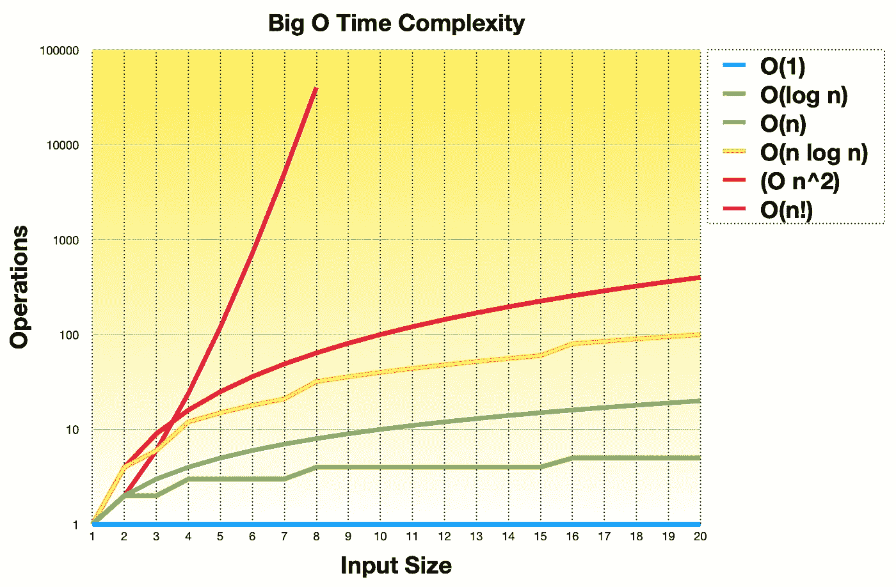

# 大 O 批注解释道

> 原文：<https://javascript.plainenglish.io/big-o-notation-explained-1f6a99328c82?source=collection_archive---------4----------------------->

## 大 O 符号解释，没有任何复杂的数学，使用简单的例子！



Big O Time Complexity, Image: [Arek Jaworski](https://medium.com/u/e98d079ebca8?source=post_page-----1f6a99328c82--------------------------------)

# 介绍

在计算机科学中，大 O 符号用于描述当输入大小增长时算法如何执行。输入越大，我们的算法需要执行的计算(操作)就越多。

我们可以测量时间(一个*算法*需要多少时间)或空间(一个*算法*需要多少内存)。

在本文中，我们将关注时间复杂性。

在我们真正开始之前，我们必须理解一个关键概念。大 O 用于测量算法和**的*复杂度，而不是***实际的总执行时间。我们不需要检查和计算每一行代码！我们看到的是使算法运行得更慢或更快的*关键操作*，例如循环或递归调用。

**例子:**很明显，打印出一个字符比打印出一整页文字需要的时间要少(尤其是在真正的打印机上，而不是在屏幕上)。然而，在这两种情况下，算法的*复杂度是相同的。这听起来可能有点违背我们刚才所说的-更大的输入(即更长的文本)-需要更多的打印操作。然而，如果我们把它转换成代码:*

```
function print(text) {
    console.log(text);
}print('a');
print('abcdefghijklmnopqrstuvwxyz');
```

在这两种情况下，我们使用了相同的伪`print` " *算法*，并且我们调用了一次`console.log`，这意味着`print`函数的*复杂度*没有改变。在这两种情况下，算法的*复杂度是相同的。然而，*程序*的实际*执行时间*可能会有所不同。*

在下一部分中，我们将看看不同的示例算法，并检查它们相应的时间复杂度。我们将从最快的算法开始，逐渐转向较慢的算法。

# O(1) —常数

理想算法和最快算法需要相同的时间来返回结果。

一个非常简单的例子是从数组中返回元素。不管这是第一个、最后一个还是任何随机元素，所需的时间(操作次数)总是相同的。它是常数，因此我们使用`O(1)`来描述这种情况:

```
const array = ['a', 'b', 'c', 'd', 'e', 'f'];const first  = array[0];   // one operation, x time needed
const last   = array[5];   // one operation, x time needed
const random = array[1];   // one operation, x time needed
```

我们可能会注意到，速度较快的计算机比速度较慢(或较旧)的计算机执行速度更快。重要的是，相同的计算机，运行相同的软件，会给出相同的、恒定的时间结果。

请注意**我们没有对硬件进行基准测试，但是我们对算法进行了基准测试**。

另一个简单的例子是将字符串打印到控制台输出:

```
function print() {
    console.log('Hello World');
}print(); // console.log function called once, y time needed
print(); // console.log function called once, y time needed
```

# O (log n) —对数

接下来是`O(log n)`，这意味着当输入呈指数增长时(`10`、`100`、`1000`、`10000`，所需时间呈线性增长(1 秒、2 秒、3 秒、4 秒)，等等。

二分搜索法(或任何分治算法)是复杂性的一个很好的例子。我们接受输入，把它切成两半，然后重复，直到找到我们想要的值。

示例:猜数字

```
Guess the number between 1 and N (let's use N = 100):
Answer: 50;
Higher!Answer: 75
Higher!Answer: 88
Lower!Answer: 82
Lower!Answer: 79
Higher!Answer: 80
Higher!Answer: 81
Correct!
```

我们可以看到，在*最坏情况*的场景中，如果我们不幸运，将需要多达 7 次迭代才能猜对数字。

我们可以用下面的方式用`print`和`for loop`来模拟:

```
function print(n) {
    for(let i = n; i >= 1; i = i / 2) {
        console.log('Hello World');
    }
}print(1);   // console.log called once for n = 1
print(10);  // console.log called 4 times for n = 10
print(100); // console.log called 7 times for n = 100
```

# O(n) —线性

这个比之前的稍微慢一点(如果你还没有注意到的话——我们从最快到最慢)。然而，它是最直接的，因为它是线性的，这意味着更多的输入=更多的操作=更多的时间。

如果我们跳回我们的`print`函数，那么我们可以把它重构为:

```
function print(n) {
    for (let i = 0; i < n; i++) {
        console.log('Hello World');
    }
}
```

我们可以看到，对于`n = 1`，我们调用了`console.log`一次。对于`n = 10`，我们调用了`console.log` 10 次，以此类推。完成所有功能循环所需的时间(操作次数)呈线性增长。

因此，如果我们创建一个名为`doublePrint`的函数

```
function doublePrint(n) {
    for (let i = 0; i < n; i++) {
        console.log('Hello World');
        console.log('Hello World Again');
    }
}
```

我们可以看到`console.log`调用的数量翻倍，这意味着`print`比`doublePrint`快，但是两种情况下的复杂度都是线性的。

对于`print`是`O(n)`，对于`doublePrint`是`O(2n)`，并且……因为我们不需要计算每一个操作，我们甚至可以简化`doublePrint`使其成为`O(n)`:

```
function doublePrint(n) {
    for (let i = 0; i < n; i++) {
       console.log('Hello World', 'Hello World Again');
    }
}
```

值得注意的是，我们不测量实际打印时间！如果我们使用普通的打印机，那么整篇文章就不会神奇地打印在纸上。显然，打印出更多的字符和行需要更多的时间。

我们测量和比较的是算法的实际*复杂度，在这种情况下`print`和`doublePrint`都同样复杂。*

# O(n log n) —线性和对数

我们已经讨论了对数`O(log n)`和线性`O(n)`复杂性，这一个将是两者的结合。因此，比以前的要慢。我们将重构`print`，使其变得更加复杂，并将`O(log n)`包装在`O(n)`中，如下所示:

```
function print(n) {
    for (let i = 0; i < n; i++) {
        for (let j = n; j >= 1; j = j / 2) {
            console.log('Hello World');
        }
    }
}
```

我们可以立即看到，这是更复杂的代码(伪算法)，需要更多的时间来完成，因为现在实际上有两个循环。

我们可以对此进行基准测试，并查看输出:

```
+-----+-------------+
|   n | console.log |
+-----+-------------+
|   1 |           1 |
|   2 |           4 |
|   5 |          15 |
|  10 |          40 |
|  20 |         100 |
|  50 |         300 |
| 100 |         700 |
| 200 |        1600 |
| 500 |        4500 |
+-----+-------------+
```

# O (n ) — N 的平方

在这个阶段，我们应该很容易预测如何得到`O(n²)`的复杂度——这将需要两个循环:

```
function print(n) {
    for (let i = 0; i < n; i++) {
        for (let j = 0; j < n; j++) {
            console.log('Hello World');
        }
    }
}
```

# O (n！)—阶乘

最后，让我们看看阶乘复杂度有多慢。阶乘是数列相乘的最终结果。我们可以用下面的公式来定义阶乘:

```
n! = n x (n - 1) x (n - 2) x ... x 1
```

示例:

```
1! = 1
2! = 2 x 1 = 2
3! = 3 x 2 x 1 = 6
4! = 4 x 3 x 2 x 1 = 24
5! = 5 x 4 x 3 x 2 x 1 = 120
```

正如我们所看到的，我们需要多个 for 循环来计算最终结果。为了实现这一点，我们将使用递归并重构代码:

```
function print(n) {
    for (let i = 0; i < n; i++) {
        print(n - 1);
        if (n === 1) console.log('Hello World');
    }
}
```

`print`函数将`n`作为输入参数，然后以`n — 1`作为输入参数递归调用自身。一旦`n === 1`那么我们就做`console.log`

这样我们就可以模拟阶乘复杂度了！

# 比较

最后，让我们并排比较一下每个复杂度。列中的数字表示使用给定的`n`数字作为输入，每个算法调用`console.log`的次数:

```
+-----+------+----------+------+------------+---------+---------+
|   n | O(1) | O(log n) | O(n) | O(n log n) |   O(n²) |   O(n!) |
+-----+------+----------+------+------------+---------+---------+
|   1 |    1 |        1 |    1 |          1 |       1 |       1 |
|   2 |    1 |        2 |    2 |          4 |       4 |       2 | 
|   5 |    1 |        3 |    5 |         15 |      25 |     120 |
|  10 |    1 |        4 |   10 |         40 |     100 | 3628800 |   
|  20 |    1 |        5 |   20 |        100 |     400 | ....... |
|  50 |    1 |        6 |   50 |        300 |    2500 | ....... |
| 100 |    1 |        7 |  100 |        700 |  100000 | ....... |
| 200 |    1 |        8 |  200 |       1600 |  400000 | ....... |
| 500 |    1 |        9 |  500 |       4500 | 2500000 | ....... |
+-----+------+----------+------+------------+---------+---------+
```

请注意，从 20 的阶乘开始，也就是从`20!`开始，很难用没有科学符号的数字来表示，因为`20!`等于`2432902008176640000`。因此，所有这些巨大的数字都被点代替了。

这些比较结果用于生成本文顶部的图表图像。

# 摘要

*   大 O 符号用于衡量和比较算法的*复杂度。*
*   大 O 符号不计算总执行时间。
*   我们不需要检查每一行代码。
*   大 O 符号用于基准测试*算法*和**而不是硬件**。

*更多内容请看*[***plain English . io***](http://plainenglish.io/)